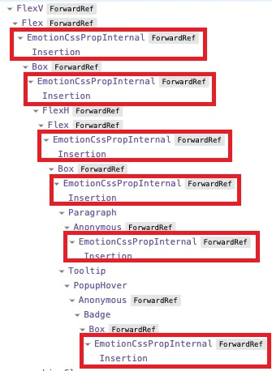

# 🐳 Emotion

Javascript로 CSS스타일을 작성하도록 설계된 라이브러리.

## 🌏 @emotion/react

```shel
npm install --save @emotion/react
```

```jsx
import { css } from '@emotion/css'

const color = 'white'

render(
 <div
   className={css`
     padding: 32px;
     background-color: hotpink;
     font-size: 24px;
     border-radius: 4px;
     &:hover {
       color: ${color};
     }
   `}
 >
   Hover to change color.
 </div>
)
```

* style속성과 유사하지만, 벤더프리픽스와 미디어쿼리를 지원함.
* css속성은 theme와 함께 호출되는 인수를 허용해ㅓㅅ 개발자가 공통 및 사용자 정의 가능한 값에 쉽게 접근 가능.

<br/><br/>

## 🌏 @emotion/styled 패키지

리액트를 사용하면 `@emotion/react`, 아니면 `@emotion/css`

```shell
npm i @emoiton/styled @emotion/react
```

<br/>

### 👉 CSS props

요소의 스타일링하는 주요 방법은 `css props`

`css props`를 사용하는 방법은 Object Style과 String Style 2가지가 있다.

#### 🔸 Object Styles

[공식문서 - emotion_object-styles](https://emotion.sh/docs/object-styles)

```jsx
return(){
  <div
    css={{
      backgroundColor: 'hotpink',
      '&:hover': {
        color: 'lightgreen'
      }
    }}
  >
    This has a hotpink background.
  </div>
}
```

#### 🔸 String Styles

```jsx
import { css } from '@emotion/react'

const color = 'darkgreen'

render(
  <div
    css={css`
      background-color: hotpink;
      &:hover {
        color: ${color};
      }
    `}
  >
    This has a hotpink background.
  </div>
)
```

```jsx
import styled from '@emotion/styled'

const Button = styled.button`
  padding: 32px;
  background-color: hotpink;
  font-size: 24px;
  border-radius: 4px;
  color: black;
  font-weight: bold;
  &:hover {
    color: white;
  }
`

render(<Button>This my button component.</Button>)
```

<br/>

### 👉 withComponent

다른 컴포넌트로 다시 스타일을 사용하고 싶을 때 `withComponent`사용.

```jsx
import styled from '@emotion/styled'

const Section = styled.section`
  background: #333;
  color: #fff;
`

// this component has the same styles as Section but it renders an aside
const Aside = Section.withComponent('aside')

render(
  <div>
    <Section>This is a section</Section>
    <Aside>This is an aside</Aside>
  </div>
)
```

<br/><br/>

## 🌏 스타일 우선순위

className속성의 이모션 스타일을 포함하는 className이 css속성 스타일을 재정의한다.

이모션 외의 소스에서 가져온 클래스 이름은 무시되고 계산된 이모션 클래스 이름에 추가됨.

부모로 부터 전달된 className porp을 통해 css prop에 정의된 스타일을 가진 구성요소를 커스텀할 수 있다.

### 👉 Example

```jsx
const P = props => (
  <p
    css={{
      margin: 0,
      fontSize: 12,
      lineHeight: '1.5',
      fontFamily: 'sans-serif',
      color: 'black'
    }}
    {...props} // <- props contains the `className` prop
  />
)

const ArticleText = props => (
  <P
    css={{
      fontSize: 14,
      fontFamily: 'Georgia, serif',
      color: 'darkgray'
    }}
    {...props} // <- props contains the `className` prop
  />
)

const SmallArticleText = props => (
  <ArticleText
    css={{
      fontSize: 10
    }}
    {...props} // <- props contains the `className` prop
  />
)
```

ArticleText요소가 p를 재정의함으로 써 중복된 css가 덮어씌워진다.

❗ style은 insertRule을 통해 연결되고 삽입된다.

`P` 요소

```css
.css-1 {
  margin: 0;
  font-size: 12px;
  line-height: 1.5;
  font-family: sans-serif;
  color: black;
}
```

`ArticleText`요소

```css
.css-2 {
  font-size: 14px;
  font-family: Georgia, serif;
  color: darkgray;
}
```

`SmallArticleText`요소

```css
.css-3 {
  font-size: 10px;
}
```

**Result**

```css
.css-result {
+ margin: 0;
- font-size: 12px;
+ line-height: 1.5;
- font-family: 'sans-serif';
- color: black;
- font-size: 14px;
+ font-family: Georgia, serif;
+ color: darkgray;
+ font-size: 10px;
}
```

CSS사양의 표시 순서 규칙에 따라 나중에 정의 된 속성 값(녹색)이 이전 값(빨간 색)을 재정의 하게 된다.

<br/><br/>

## 🌏 Composition

Emotion에서 강력하고 유용한 패턴 중 하나.

CSS에서 반환된 값을 다른 스타일블록에 보간하여 스타일을 함께 구성할 수 있다.

```jsx
import { css } from '@emotion/react'

const base = css`
  color: hotpink;
`

render(
  <div
    css={css`
      ${base};
      background-color: #eee;
    `}
  >
    This is hotpink.
  </div>
)
```

일반적으로 css 는 여러 클래스를 사용하여 스타일을 함께 구성할 수 있지만, **정의된 순서에 따라 나중에 정의된 것이 우선**된다.

그런데 Emotion 을 사용하면 스타일을 만들고 결합할 수 있다.
이모션의 Compositon 을 사용하면 **스타일이 사용 순서대로 병합**되므로 스타일이 생성된 순서를 생각할 필요가 없다.

```jsx
import { css } from '@emotion/react'

const danger = css`
  color: red;
`

const base = css`
  background-color: darkgreen;
  color: turquoise;
`

render(
  <div>
    <div css={base}>This will be turquoise</div>
    <div css={[danger, base]}>
      This will be also be turquoise since the base styles overwrite the danger
      styles.
    </div>
    <div css={[base, danger]}>This will be red</div>
  </div>
)
```

<br/>

### 👉  중첩 선택자

```jsx
import { css } from '@emotion/react'

const paragraph = css`
  color: turquoise;

  a {
    border-bottom: 1px solid currentColor;
    cursor: pointer;
  }
`
render(
  <p css={paragraph}>
    Some text. <a>A link with a bottom border.</a>
  </p>
)
```

`&`연산자를 이용해 다른요소에 중첩된 현재 클래스를 선택할 수 있다.

```jsx
import { css } from '@emotion/react'

const paragraph = css`
  color: turquoise;

  header & {
    color: green;
  }
`
render(
  <div>
    <header>
      <p css={paragraph}>This is green since it's inside a header</p>
    </header>
    <p css={paragraph}>This is turquoise since it's not inside a header.</p>
  </div>
)
```

<br/>

### 👉  미디어 쿼리

Emotion에서 미디어 쿼리를 사용하는 것은 일반 CSS에서 미디어 쿼리를 사용하는 것과 동일하다.

단, 블록 내부에 선택기를 지정할 필요가 없으며, CSS를 직접 CSS블록에 넣을 수 있다.

#### 🔸 미디어 쿼리 재사용

사용할 때 마다 다시 작성하는 대신 해상도를 상수로 설정해 변수를 참조하여 실수를 방지하고 반복을 줄일 수 있다.

```jsx
import { css } from '@emotion/react'

const breakpoints = [576, 768, 992, 1200]

const mq = breakpoints.map(bp => `@media (min-width: ${bp}px)`)

render(
  <div>
    <div
      css={{
        color: 'green',
        [mq[0]]: {
          color: 'gray'
        },
        [mq[1]]: {
          color: 'hotpink'
        },
        [mq[2]]: {
          color: 'yellow'
        },
        [mq[3]]: {
          color: 'red'
        },
      }}
    >
      Some text!
    </div>
  </div>
)
```

#### 🔸 facepoint

facepaint라이브러리를 이용해 객체 styles에서 좀더 간편하게 사용할 수 있다.

❗ `facepoint`는 object style에서만 동작함.

```shell
npm i --save facepaint
```

```jsx
import facepaint from 'facepaint'

const breakpoints = [576, 768, 992, 1200]

const mq = facepaint(breakpoints.map(bp => `@media (min-width: ${bp}px)`))

render(
  <div
    css={mq({
      color: ['green', 'gray', 'hotpink', 'red']
    })}
  >
    Some text.
  </div>
)
```

<br/><br/>

## 🌏 Global Styles

`Global`컴포넌트를 이용하여 Global Style을 지정할 수 있다.

```jsx
import { Global, css } from '@emotion/react'

render(
  <div>
    <Global
      styles={css`
        .some-class {
          color: hotpink !important;
        }
      `}
    />
    <Global
      styles={{
        '.some-class': {
          fontSize: 50,
          textAlign: 'center',
          color: 'red !important',
        }
      }}
    />
    <div className="some-class">This is hotpink now!</div>
  </div>
)
```

<br/><br/>

## 🌏 Best Practice - Recoomandations

Emotion을 사용할 때 권장사항들을 알아보자.<br/>❗ 요구 사항이 아닌, 권장사항입니다.

### 👉 Typescript와 Object Style사용

CSS 문자열(String Style)을 사용할 때는 `Intellisense`나 `타입 검사`를 받을 수 없다. (e.g. `(css 'color: blue')`)

예를 들어, **TypeScript와 Object Style을 사용**하여 `일부 정적 타입 검사`를 수행할 수 있다.

```ts
const myCss = css({
  color: 'blue',
  grid: 1 // Error: Type 'number' is not assignable to type 'Grid | Grid[] | undefined'
})
```

> Intellisense란?
>
> 코드의 자동완성 또는 파라미터의 정보, 함수의 정보 등을 보여주는 기능.

<br/>

### 👉Style을 컴포넌트와 함께 배치

일반 CSS에서 컴포넌트의 스타일이 별도의 파일에 정의됨.

이때 어떤 컴포넌트가 주어진 CSS를 사용하는지 파악하기 어렵고 컴포넌트를 수정한 후 관련 CSS를 업데이트하는 것을 쉽게 잊을 수 있어 유지 관리가 어려워진다.

Emotion의 이점 중 하나는 스타일을 컴포넌트 요소와 함꼐 배치할 수 있다는 것.

<br/>

### 👉 Style 공유방법

크게 2가지 접근방식이 있다.

#### 🔸 CSS 객체 내보내기

가장 간단한 방법으로 공유 파일에서 CSS를 내보내고, 여러 위치에서 해당 CSS를 가져오는 방법.

```js
xport const errorCss = css({
	color: 'red',
  	fontWeight : 'bold'
})

//Use arrays to compose styles
export const largeErrorCss = css([errorCss, {fontSize: '1.5rem'}])
```

```jsx
import {errorCss} from '...'

return <p css={errorCss}> Failed to fizzle the frozzle.</p>
```

**장점**

* 이 방법은 컴포넌트 간에만 CSS를 공유하고 싶을 때 좋다. 

**단점**

* 이 방법의 잠재적인 단점은 공유 스타일이 이를 사용하는 컴포넌트와 함께 배치되지 않는다.

<br/>

#### 🔸 컴포넌트 재사용을 통한 Style 공유

이전 방법보다 조금 더 복잡하지만, 훨씬 강력함.

```jsx
export function ErrorMessage({className, children}) {
	return (
    	<p css={{color:'red', fontWeight: 'bold'}} className={className}>{children}</p> 
    )
}


export function LargeErrorMessage({className, children}) {
	return (
    	<ErrorMessage css={{fontSize: '1.5rem'}} className={className}>{children}</ErrorMessage>
    )
}
```

❗ fontSize는 className의 prop을 통해 ErrorMessage구성요소로 전달되기 때문에 className prop을 받아야 동작함.

**장점**

* `ErrorMessage`컴포넌트 재사용을 통해 로직과 스타일 모두 공유할 수 있다.
* 제한된 리팩토링으로 컴포넌트에 추가 속성과 기능을 쉽게 추가할 수 있다.
* 스타일은 항상 컴포넌트와 함께 배치된다.

<br/>

### 👉 동적 스타일에 style prop을 사용

`css prop`또는 `styled`는 정적 스타일에 사용해야하고, `style prop(인라인 스타일)`은 진정한 동적 스타일에 사용 해야 한다.

css변수를 쓰지 않을 경우 각각 다른 아바타 이미지를 주기 위해 아래처럼 css작성 해야 한다. <br/>100개의 아바타라면? => 엄청 많아질 것이다.

```css
.css-1udhswa {
  border-radius: 50%;
  width: 40px;
  height: 40px;
  background-style: url(https://i.pravatar.cc/150?u=0);
}

.css-1cpwmbr {
  border-radius: 50%;
  width: 40px;
  height: 40px;
  background-style: url(https://i.pravatar.cc/150?u=1);
}

.css-am987o {
  border-radius: 50%;
  width: 40px;
  height: 40px;
  background-style: url(https://i.pravatar.cc/150?u=2);
}
```

<br/>

스타일이 자주 업데이트 된다면, `style prop`도 사용해야 한다.

요소를 드래그하면 x와 y가 빠르게 변경되므로 이 속성은 `style prop`을 통과해야 한다.

```js
{
  transform: `translate(${x}px, ${y}px)`
}
```

<br/>

### 👉 Advanced: `style`이 포함된 CSS 변수 

CSS변수는 style prop과 함께 사용하면 속성의 실제 값을 `지연`하면서 css를 한 곳에서 유지할 수 있다.

```css
.avatar {
  border-radius: 50%;
  width: 40px;
  height: 40px;
  background-image: var(--background-image);
}
```

CSS변수의 값을 설정하는 요소를 렌더링

```jsx
function Avatar({ imageUrl }) {
  return <div className="avatar" style={{ '--background-image': imageUrl }} />
}
```

<br/>

### 👉 React를 사용하는 경우 `@emotion/css`보다 `@emotion/react` 또는 `emotion/styled` 사용

React를 사용할 때 더 나은 개발자 경험을 제공한다.

<br/>

### 👉 css prop 또는 @emotion/styled를 사용하되, 둘다 사용하지는 말 것

둘다 사용할 수는 있지만, 하나의 접근 방식을 선택하고 codebase 전체에서 일관되게 사용하는 것이 좋다.<br/>(Emotion 관리자들 사이에선 css prop이 더 인기 있다.)

<br/>

### 👉 컴포넌트 외부에서 style정의하는 것을 고려

```css
import { css } from '@emotion/react'

const cardCss = {
  self: css({
    backgroundColor: 'white',
    border: '1px solid #eee',
    borderRadius: '0.5rem',
    padding: '1rem'
  }),

  title: css({
    fontSize: '1.25rem'
  })
}

export function Card({ title, children }) {
  return (
    <div css={cardCss.self}>
      <h5 css={cardCss.title}>{title}</h5>
      {children}
    </div>
  )
}
```

**이점**

* 스타일은 렌더링할 때마다 직렬화되는 것이 아니라 1번만 직렬화 된다
* 실수로 css prop을 통해 동적 스타일을 전달하는 일이 발생하지 않는다
* css파일의 다른 부분으로 분리하면 JSX가 더 읽기 쉽다는 주장이 있다.

<br/>

### 👉 색상 및 기타 스타일 상수들을 JS변수로 정의

```js
export const colors = {
  primary: '#0d6efd',
  success: '#198754',
  danger: '#dc3545'
}
```

❗ animation같은 경우도 js변수로 정의하여 사용이 가능.

<br/><br/>

## 🌏 Labels

Emotino은 임의의 className을 변형하는데 이를 커스터마이징 할 수 있다.

`label`이란 속성을 추가하여 클래스 이름 끝에 지정한 값을 추가하여 읽기 쉽게 할 수 있다.

@emotion/babel-plugin 는 변수 이름 및 기타 정보를 기반으로 이런 라벨을 자동으로 추가하기 때문에 수동으로 지정할 필요는 없다.

<br/><br/>

## 🌏 장단점

### 👉 장점

* **지역 스코프 스타일** <br/>작성해두고 오랜시간 뒤에 다시 수정해야 할때 어디에 무엇이 있었는지 다시 파악해야 하고, 클래스명의 충돌은 없는지 확인해야한다. 지역스코프로 작성해두어 이런 문제를 해결
* **코로케이션**<br/>기존 css에서는 보통 `src/styles`에 넣게되는데, 앱이 커지면서 각 컴포넌트에서 어떤 스타일을 사용하는지 빠르게 구분하기 어렵다.<br/>더 나은 방법으로는 **단일 컴포넌트에 관련된 모든 것을 같은 위치에 두는 것**
* **자바스크립트 변수를 style에서 사용 가능**<br/>

### 👉 단점

* **CSS-in-JS는 런타임 오버헤드를 더한다.**<br/>컴포넌트가 렌더링 될 때 `CSS-in-JS`는 document에 삽입할 수 있는 CSS로 스타일을 `직렬화`해야한다.<br/>이런 부분이 CPU를 차지한다는 것이 분명하지만, 앱의 성능에 눈에 띄는 영향을 주는지는 확인해야한다.<br/>(소개글에서는 emotion에서 sass로 변경하여 테스트한 결과 평균 `54.3ms` -> `27.7ms`로 48% 감소하였다고 작성됨)
* **CSS-in-JS는 번들 크기를 늘린다.**<br/>사이트를 방문하는 각 사용자는 CSS-in-JS 라이브러리용 자바스크립트를 다운로드 해야한다.<br/>용량이 크지는 않지만, 추가는 되기 때문에 번들 크기를 늘린다.
* **CSS-in-JS는 React Devtools를 어지럽힌다.**<br/>각 요소에 대해 Emotion은 `<EmotionCssproInternal>` 및 `<Insertion>`컴포넌트를 렌더링한다.<br/>

❗ 그 외 못난점으로 `CSS 규칙을 자주 삽입하면 브라우저에서 더 많은 추가 작업을 수행해야 한다`는 것과 `SSR 또는 컴포넌트라이브러리를 사용할 때 잘못될 수 있는 부분이 많다`는 점이 소개되고 있습니다. (참고링크 확인)<br/>`CSS규칙이 자주 삽입된다`는 뜻은 코드 내에서 동적으로 CSS를 생성하고, 이를 페이지에 삽입하는 방식을 의미하며, **컴포넌트가 렌더링될 때 마다 해당 컴포넌트의 스타일을 위한 CSS규칙이 동적으로 생성되어 HTMl의 style에 삽입된다**는 뜻

<br/><br/>

## 📘 참고

* [공식문서 - Emotion](https://emotion.sh/docs/introduction)
* [Medium - 우리가 CSS-in-JS와 헤어지는 이유](https://junghan92.medium.com/번역-우리가-css-in-js와-헤어지는-이유-a2e726d6ace6)
* [Git Emotion Issue - Emotion의 여러 인스턴스가 한 번에 로드됩니다 ](https://github.com/emotion-js/emotion/issues/2639)
* [Git Emotion Issue - 컴포넌트 라이브러리는 스타일이 삽입되는 순서를 완전히 제어할 수 없는 경우가 많습니다](https://github.com/emotion-js/emotion/issues/2803)
* [Git Emotion Issue - SSR지원이 React 17과 18버전에서 다르게 동작됩니다](https://github.com/emotion-js/emotion/issues/2725)