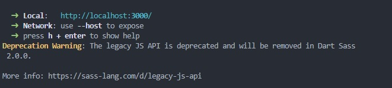
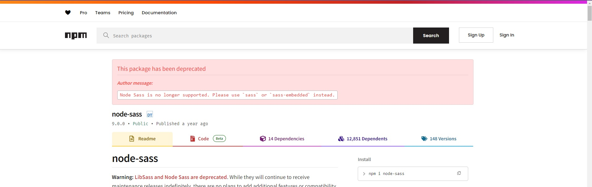
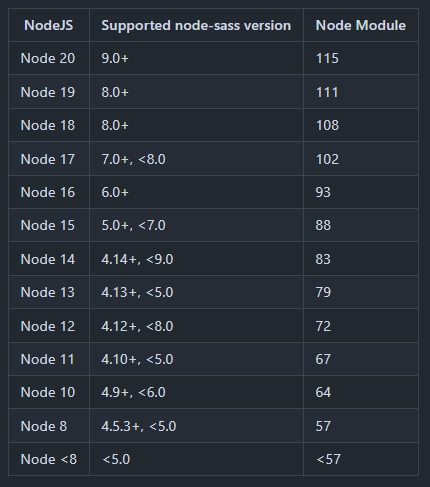

# 🐳 Dart-sass 적용

## 🌏 개요

### 👉 기존 환경 설정

`sass`와 `node-sass`만 설치하여, 별도의 추가 설정없이 사용 중.

```json
{
  ...
  "node-sass": "^9.0.0",
  "sass": "^1.77.1",
}
```

```js
// vite.config.js
import react from "@vitejs/plugin-react";
import { defineConfig } from "vite";

export default defineConfig({
  plugins: [
    react()
  ],
  server: {
    port: 3000, // 기본 포트 번호 설정
    strictPort: false, // 포트 충돌 시 다음 포트로 이동
    open: true, // 서버 시작 시 브라우저 자동으로 열기
  },
  resolve: {
    alias: {
      "@": "/src",
    },
  },
});
```

<br/>

### 👉 경고 메세지 발생



프로젝트 실행시 다음과 같은 Warning Message가 터미널에 출력 되었다.

해당 메세지를 지우기위해 검색하던 중 node-sass가 없어 졌다는 내용을 발견.



>  **Warning:** [Node Sass has reached end of life](https://sass-lang.com/blog/node-sass-is-end-of-life). It will receive no more releases, even for security fixes. Projects that still use it should move onto [Dart Sass](https://sass-lang.com/dart-sass).

npm을 이동해본 결과, `node-sass` pacakge가 deprecate되었고, git에서도 종료되었으니 dart sass로 바꾸라는 메세지를 알려주고 있다.

<br/><br/>

## 🌏 node-sass?

`node-sass`는 Node환경에서 Sass전처리기를 실행하여, Sass코드를 css코드로 변환해주는 컴파일러.

Node버전에 의존적



2024년 7월 24일 `Node Sass is end-of-life` 관련 글이 작성됨.

<br/><br/>

## 🌏 loader

webpack을 사용할 때에는 sass를 사용하기 위해서 node-sass나 sass-loader와 같은 로더들이 필요했고, 마찬가지로 `node-sass`를 삭제한 다음 `sass-loader`를 설치해 vite-config에 전처리기에 전달할 옵션을 편집하여, 경고 메세지를 삭제했다.

<br/>

### 👉 추가내용 

그러나 Vite는 기본적으로 Sass(SCSS)파일을 자동으로 처리 해준다. 

따라서, Sass를 설치하는 것으로 Sass를 사용할 수 있고, CSS전처리기에 전달할 옵션은 `vite-config`에서 설정이 가능하다.

```shell
# .scss and .sass
npm add -D sass-embedded # or sass
```

<br/><br/>

## 🌏 Option

Vite에서 scss에 적용할 옵션들

```ts
// scss전역사용
  css: {
    preprocessorOptions: {
      scss: {
        api: "modern-compiler", // or "modern", "legacy"
        includePaths: ["src/assets/scss"],
        additionalData: `@use "@/assets/scss/theme";`,
      },
    },
  },
```

* `api: "modern-compiler"` :  위에서 소개한 경고 메세지를 지우기 위해 api 속성에 `modern-compiler`값을 설정하여, 최신 Dart Sass컴파일러를 사용해 SCSS를 처리하도록 수정.
* `includePaths`: SCSS파일을 찾을 때 포함할 디렉터리 경로 지정. <br/>`@import`나 `@use`문을 사용할 때 해당 경로가 기본적으로 포함됨.
* `additionalData` : 모든 SCSS파일에 자동으로 추가할 내용. <br/>theme의 변수를 전역적으로 사용할 수 있도록 하여, 각 파일에서 중복적으로 `@use`를 사용하지 않아도 되게 함.

<br/><br/>

## 📘 참고

* [Sass 공식문서 - Node Sass is end-of-life](https://sass-lang.com/blog/node-sass-is-end-of-life/)
* [Vite 공식문서 - css.preprocessorOptions](https://vite.dev/config/shared-options.html#css-preprocessoroptions)