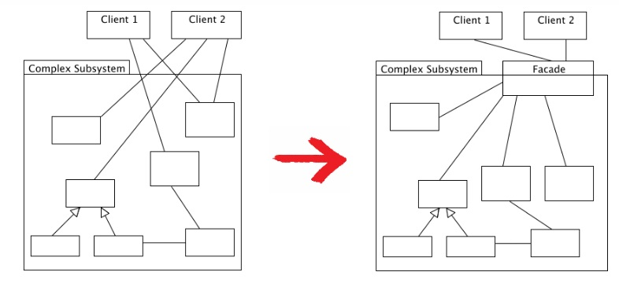

# 🐳 Facade Pattern

**퍼사드(Facade)패턴**은 소프트웨어 디자인 패턴 중하나로, 복잡한 시스템이나 서브시스템의 인터페이스에 대한 간략한 인터페이스를 제공하여, 시스템의 복잡성을 감소시키는 패턴.

퍼사드 패턴은 전략 패턴이나 팩토리 패턴과 같은 여타 다른 디자인 패턴과는 다르게 클래스 구조가 정형화 되지 않은 패턴이다. 반드시 클래스 위치는 어떻고 어떤 형식으로 위임을 해야되고 이런것이 없다.

그냥 퍼사드 클래스를 만들어 적절히 기능 집약화만 해주면 그게 디자인 패턴이 되는 것이다.



## 🌏 장단점

### 👉 장점

- 복잡한 시스템 간소화
- 코드 가독성 향상
  - 퍼사드 패턴을 통해 시스템이 단순화 되고, 유지 보수성이 향상되며, 시스템의 확장성과 유연성이 높아짐
- 느슨한 결합
  - 시스템의 다른 부분과 결합도가 낮아짐. → 특정 부분을 변경하더라도 전체 시스템에 미치는 영향이 적어진다

### 👉 단점

- 퍼사드가 앱의 모든 클래스에 결합된 God객체가 될 수 있다.
- 퍼사드 클래스 자체가 서브시스템에 대한 의존성을 가지게 되어 완전히 의존성을 피할수는 없다.
- 어찌되었건 추가적인 코드가 늘어나기 때문에 유지보수 측면에서 공수가 더 들어간다.

## 🌏 Example Code

- Sub Class - 서비스

  ```csharp
  using System;
  
  // 서브시스템 클래스들
  class Light
  {
      public void On()
      {
          Console.WriteLine("Light is on");
      }
  
      public void Off()
      {
          Console.WriteLine("Light is off");
      }
  }
  
  class Thermostat
  {
      public void SetTemperature(int temp)
      {
          Console.WriteLine($"Temperature set to {temp} degrees");
      }
  }
  
  class SecuritySystem
  {
      public void Arm()
      {
          Console.WriteLine("Security system armed");
      }
  
      public void Disarm()
      {
          Console.WriteLine("Security system disarmed");
      }
  }
  ```

- Facade Class

  ```csharp
  // 퍼사드 클래스
  class SmartHomeFacade
  {
      private Light _light;
      private Thermostat _thermostat;
      private SecuritySystem _security;
  
      public SmartHomeFacade()
      {
          _light = new Light();
          _thermostat = new Thermostat();
          _security = new SecuritySystem();
      }
  
      public void LeaveHome()
      {
          _light.Off();
          _thermostat.SetTemperature(18);
          _security.Arm();
          Console.WriteLine("You have left home.");
      }
  
      public void ArriveHome()
      {
          _light.On();
          _thermostat.SetTemperature(22);
          _security.Disarm();
          Console.WriteLine("Welcome home!");
      }
  }
  ```

- Main Class - 컨트롤러

  ```csharp
  // 클라이언트 코드
  class Program
  {
      static void Main(string[] args)
      {
          SmartHomeFacade smartHome = new SmartHomeFacade();
          
          smartHome.LeaveHome();   // 집을 떠날 때
          Console.WriteLine();
          smartHome.ArriveHome();  // 집에 도착할 때
      }
  }
  ```