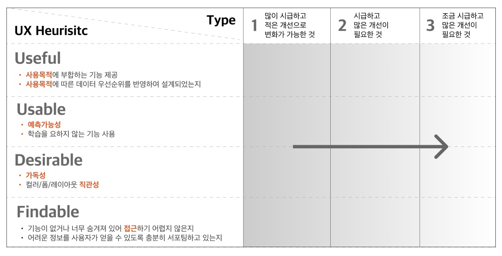
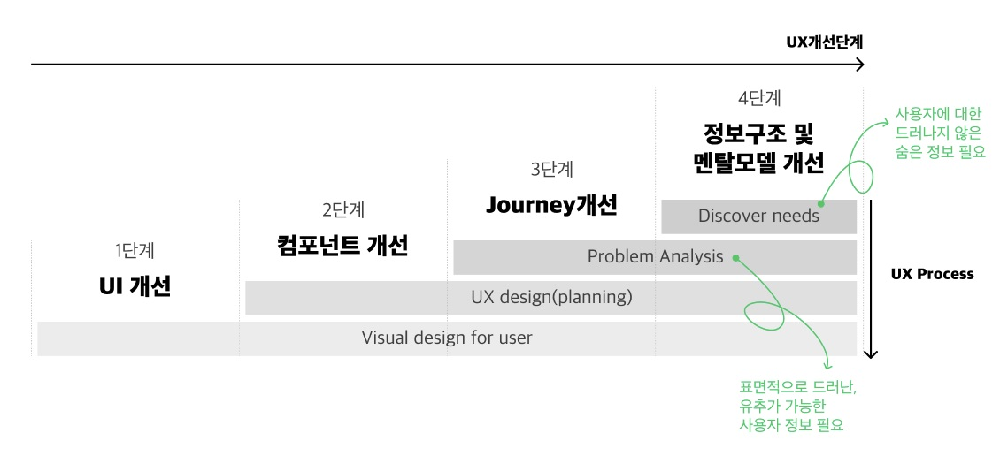

# 🐳 UX 원칙에 따른 NELO 4.0 개발기

D2블로그의 UX 원칙에 따른 NELO 4.0 개발기을 정리한 것입니다 :)  사용된 이미지는 아래 주소 블로그글의 이미지를 사용하였습니다.

❗ 해당 글은 NELO4.0을 개발하면서, 어떻게 계획을 세우고, 어떠한 원칙으로 3.0버전을 4.0버전으로 개선해 나갔는지 경험을 공유하는 글로, 어떻게 바뀌었는지 결과에 대한 부분은 블로그에서 확인하기!

📘 [D2 Blog - UX원칙에 따른 NELO 4.0 개발기](https://d2.naver.com/helloworld/2461452)

> **NELO**
>
> 네이버에서 개발한 로그 수집 시스템.  다양한 서비스에서 운영하는 서버와 사용자 모바일 기기에서 발생하는 로그를 수집하기 위한 SDK를 제공하고, 수집한 로그를 분석하기 위한 다양한 기능을 웹 UI를 통해 제공
>
> 로그를 조회할 수 있는 **검색**, 비정상 종료 기록을 살펴볼 수 있는 **크래시**, 특정 상황에서 메시지를 받을 수 있는 **알람** 등으로 구성. 알람 기능을 사용하면 사용자가 지정한 특정 패턴과 일치하는 로그 유입이 감지될 때 사용자에게 알려줄 수 있습니다. 이를 통해 장애 상황이나 이상 탐지 등 다양한 시나리오에 기민하게 대응할 수 있음.

## 🌏 시작 - 일단 개발부터

개발과 UX설계를 동시에 같이 시작해야한다는 난관이 있었다.

때문에 `기획 -> 설계 -> 개발`의 일반적인 흐름을 따를 수 없었고, 어떤 부분은 설계보다 개발을 한 후 수정 설계를 진행하기도 했습니다. UX리서치도 당연히 엄두를 내기 어려웠습니다.

어떻게 개선해 나갔을까?

  

## 🌏 3단계 UX 사전 진단 프로세스

`UX리서치(사용자 조사) -> 분석 -> 설계 -> 검증`이란 일반적인 UX프로세스를 따르지 못하더라도, 논리적인 설계와 사용자에게 공감을 얻을 수 있는 타당한 UX개선을 위해서는 새로운 업무 프로세스가 필요하여 다음과 같은 **3단계 진단 프로세스**로 UX리서치와 분석 단계를 대체함.

**3단계 진단 프로세스**

1. 휴리스틱 평가
2. 이슈별 UX개선 수준 진단
3. UX 히스토리 취합

이 프로세스의 목적은 단순히 현재의 사용성을 빠르게 진단하는 것에 그치지 않았고, 궁극적인 목표는 UX이슈의 그룹화 및 일정 수립이었습니다.

`1단계`에서 UX이슈를 그룹화한 뒤 우선순위를 설정 -> `2단계`에서 개선의 ㅈ어도에 따라 리소스를 분배하고 일정을 수립 -> `3단계`에서 개선의 타당성을 검증하여 진단의 속도를 높이는 것.

 

### 👉 1. 휴리스틱 평가 - 무엇이 우선적으로 살펴야 하는 사용성 이슈일까?

> **휴리스틱**
>
> 휴리스틱은 전문가 평가 방법론으로, 사용자를 섭외하고 조사할 **충분한 리소스가 확보되지 못한 경우 UX 전문가가 제품 전반의 사용성을 평가하는 기술** (NELO에서는 평가 과정에서 놓치는 부분 없이 결과를 분류하기 위한 가이드로 이론을 참고.)

`피터 모빌의 벌집(honeycomb) 모델`을 플랫폼 도구에 맞게 목적 **부합성(useful)**, **예측 가능성(usable)**, **가독성(desirable)**, **기능 접근성(findable)**의 4가지 기준으로 재해석했습니다. 그리고 이 4가지 기준으로 진단한 UX 이슈를 시급도와 개선 효과에 따라 다음과 같이 분류했습니다.

- Type 1: 많이 시급하고, 적은 개선으로 변화가 가능한 것
- Type 2: 시급하고, 많은 개선이 필요한 것
- Type 3: 조금 시급하고, 많은 개선이 필요한 것
- 이를 Type1 -> 2 -> 3 순서로 진행하는 것으로 우선 순위를 정함.

 

### 👉 2. 이슈별 UX 개선 수준 진단 - "어디까지 개선하는 것이 가능할까?"

4단계로 로드맵을 짜고 각 이슈별로 어느 단계까지 진행하는 것이 타당한지 결정해 일정을 조율해 나감.

1. UI 개선
2. 컴포넌트 개선
3. 사용자 여정(journey) 개선
4. 정보 구조 개선

 

### 👉 3. UX 히스토리 취합 - "어떻게 개선되는 것을 원할까?"

내부 담당자를 인터뷰해 경험적으로 집약, 도출된 인사이트를 학습하고, 취합된 VOC를 바탕으로 사용자 리서치 과정을 대체함. 또한, 가장먼저 UX/UI 표준 가이드를 정의해 와이어프레임단계 없이 UI설계를 진행.

> VOC (Voice of the Customer)
>
> 고객의 의견이나 피드백을 의미.

  

## 🌏 4가지 사용성 원칙

앞의 3단계 프로세스로 UX이슈를 그룹화하고, 우선순위를 설정한 뒤 리소스를 분배하고 일정을 수립하고, 개선의 타당성을 검증하는 과정에서 **UX개선의 중심을 잡아줄 대원칙**이 필요했습니다.

이 원칙을 `UX의 기본기`에서 찾기로 했고, `UX 기초 체력 향상`을 큰 줄기로 설정.

1. **강약의 원칙** - 정보의 강-중-약에 따른 구조화로 가독성을 높인다.
2. **군집의 원칙** - 유사 정보, 유관 컴포넌트는 그룹화 하여, 직관성을 높인다.
3. **통일성의 원칙** - 제품 전반의 사용자 경험을 통일해 예측 가능성을 높인다
4. **단순화의 원칙** - 정보와 사용자 여정의 단순화로 seamless한 경험을 제공한다.

 

### 👉 1. 강약의 원칙 - 정보의 강-중-약에 따른 구조화로 가독성을 높인다.

#### 🔸 문제점

NELO는 대시보드 성격을 가져 한 화면 안에 여러 종류의 정보가 응축되있고, 많은 텍스트가 한 화면에 노출되어 있는 특징이 있지만, 시각적으로 정돈되어 있지 않았다.

#### 🔸 해결

❗ 빨-노-초와 같은 **직관적 컬러 상징을 사용**해 데이터 이해도를 높이고, 데이터에 사용된 색과 충돌하지 않는 primary컬러를 사용해 중요 정보에 대한 집중도를 높였다.

 

### 👉 2. 군집의 원칙 - 유사 정보, 유관 컴포넌트는 그룹화 하여, 직관성을 높인다.

#### 🔸 문제점

기존에 필터는 좌측 하단, 영향을 받는 정보는 우측 상단에 배치되어 있는 등 유관한 정보임에도 서로 흩어져 직관적으로 원하는 정보를 찾기 어려운 점이 있었다.

#### 🔸 해결

유사한 정보와 컴포넌트는 그룹화하여 배치하고, 그룹화된 군집 간의 위계(hierarchy)는 `좌->우`, `상->하`로 배치하는 것만으로 사용자가 기능의 흐름을 유추할 수 있도록 함.

 

### 👉 3. 통일성의 원칙 - 제품 전반의 사용자 경험을 통일해 예측 가능성을 높인다

#### 🔸 문제점

취소/확인 버튼의 위치가 한 군데에서라도 틀리면 휴먼 에러가 발생하는 것은 당연하다. 이러한 문제가 발생하지 않도록 해야한다.

#### 🔸 해결

작게는 버튼, 크게는 화면 간의 동선과 사용자 여정까지 통일화된 기준을 따르도록 하였습니다. 이에 따른 UX/UI 표준 가이드를 마련해 사용자로 하여금 학습하지 않은 화면에서도 쉽게 예측하며 사용할 수 있도록 하는데 집중.

 

### 👉 4. 단순화의 원칙 - 정보와 사용자 여정의 단순화로 seamless한 경험을 제공한다.

#### 🔸 문제점

기존 NELO사용자 여정 지도를 그려보면, 반복되는 부분이 상당 수 발견할 수 있었습니다. **클릭 반복 뿐만 아니라, 동선의 반복, 시선의 이동의 반복이 일어나 사용성 저하가 초래**되고 있었습니다.

#### 🔸 해결

꼭 필요한 정보만 강조하고 다른 정보는 숨기는 단순화를 통해 정보 전달력을 높이고, 사용자 여정에 맞춘 UX설계를 통해 반복행위를 최소화.

> seamless한 경험
>
> 사용자가 어떤 제품, 서비스, 또는 시스템을 이용할 때 마찰이나 중단 없이 자연스럽고 연속적으로 경험할 수 있는 것을 의미.
>
> 사용자가 필요로 하는 기능이나 정보를 쉽게 찾고 사용할 수 있도록 하며, 과정 중에 불편함이나 혼란을 최소화하는 것을 목표로 함.