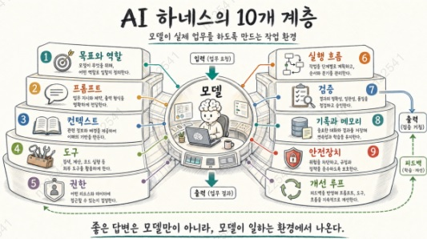

# 04. 머리말 

**🔖작업자가 일을 잘하려면 지시문만 아니라 자료, 도구, 권한, 검사 기준, 기록 체계가 필요하다.**

**🔖그 전체 환경을 설계하는 일이 하네스 엔지니어링이다.**

**🔖프롬프는 하네스의 일부일 뿐이며, 실제 성능은 모델 바깥 구조에서 크게 달라진다.**

 

**이 장을 읽고 나면 알게 되는 3가지**

* AI활용의 중심이 프롬프트에서 하네스 설계로 이동한 이유를 이해한다.
* 모델, 도구, 문서, 권한, 테스트가 함께 있어야 실제 업무가 된다는 점을 이해한다.
* 단순한 기술 설명서가 아닌 "AI가 일하는 환경"을 설계하는 안내서임을 알게 된다.

**👉 이제 중요한 것은 "모델에게 무엇을 시킬 수 있는가" 가 아니라 "모델이 일하는 환경을 어떻게 설계할 것인가"다.**

### 하네스(harness)

* 실패를 다음 실행에 어떻게 반영할 것인가
* 여러 시간 또는 여러 날에 걸친 작업을 어떻게 이어 갈 것인가

이 **전체 구조**를 여기서는 **하네스(harness)**라고 부른다.  그리고 그 **구조를 설계하고 개선하는 일**을 **하네스 엔지니어링(harness engineering)**이라 부른다.

