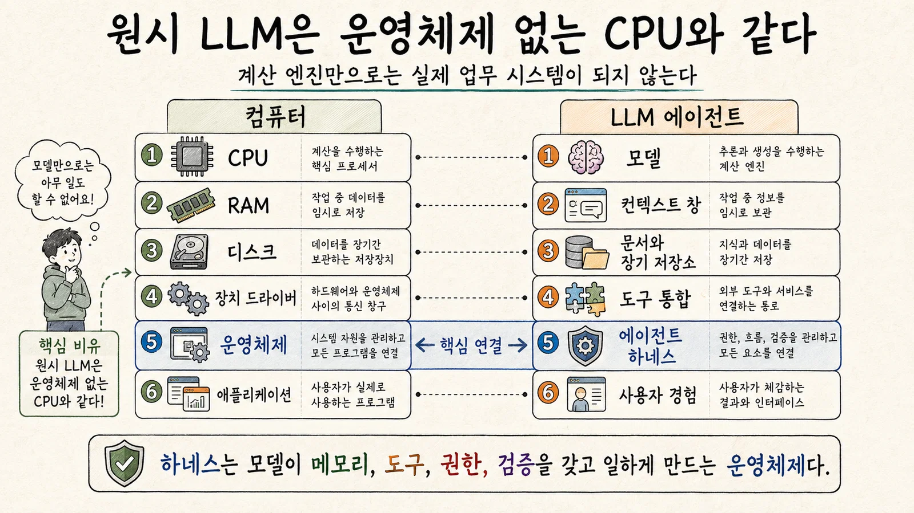
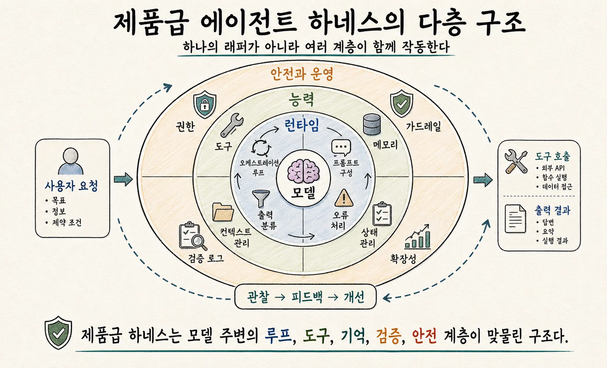
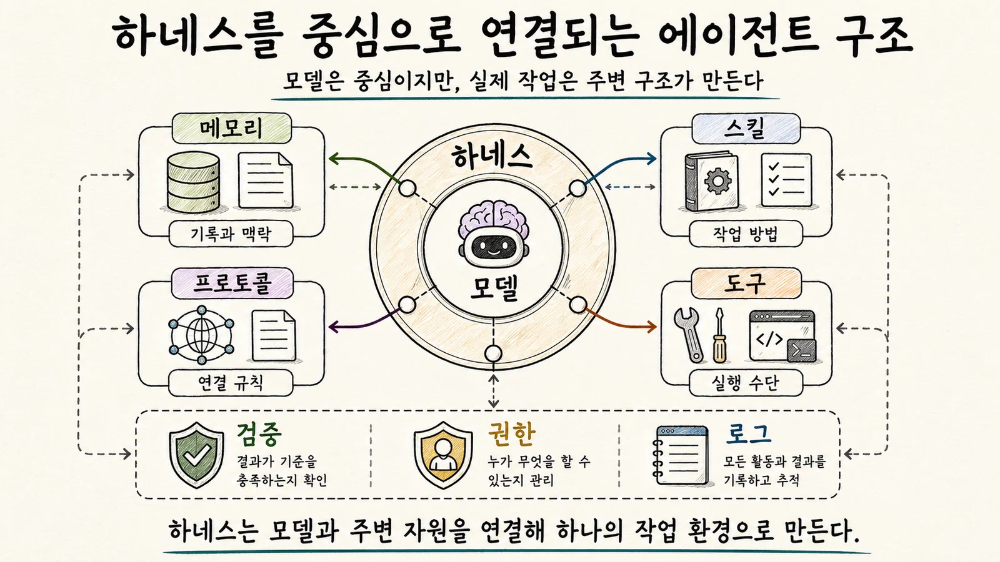

#  08. 제1장. 하네스의 탄생: 배선, 테스트, AI에이전트

* **🔖하네스(Harness)는 흩어진 모델·도구·문서·권한·기억을 연결해 AI가 안정적으로 일하게 만드는 실행 구조다.**
* **🔖AI 에이전트의 성능은 모델 자체보다, 이를 감싸는 하네스의 품질에 크게 좌우된다.**
* **🔖 `원시 LLM은 운영체제 없는 CPU와 같다.` → 하네스는 메모리·도구·검증·권한을 관리하는 AI의 운영체제(OS) 역할을 한다.**
* **🔖 좋은 하네스는 모델을 더 똑똑하게 만드는 것이 아니라,  모델이 혼자 떠안지 않아도 되는 기억·절차·규칙을 바깥에 구조화해 안정적으로 연결하는 운영체제(OS)다.**

 

## 🎯 이 장을 읽고 나면 알게되는 3가지

* 하네스라는 말이 배선, 테스트, AI에이전트에서 어떻게 이어지는지 이해한다.
* AI하네스가 모델 자체가 아니라 모델을 감싸는 실행 환경이란 점을 알게 된다.
* `원시 LLM은 운영체제 없는 CPU와 같다`는 핵심 비유를 통해 하네스의 필요성을 직관적으로 이해한다.

 
## 1.1 하네스라는 단어의 물리적 의미

**제멋대로 흩어지지 않게 묶고, 필요한 방향으로 힘과 신호가 흐르게 만드는 구조.**

자동차와 마찬가지로 모델, 문서, 도구, 권한, 평가, 로그가 제각각 흩어져 있으면 AI는 일을 하다가 길을 잃는다. → 하네스는 이 요소들을 묶는다. → 모델이 어디를 읽고, 무엇을 실행하고, 어떤 조건에서 멈추고, 무엇을 사람에게 물어봐야 하는지를 정한다.

**👉 하네스는 AI가 제대로 힘을 발휘하게 해주는 연결 구조다.**

  

## 1.3 소프트웨어 test harness의 역사

SW분야에는 오래전 부터 test harness라는 말이 있었다. 테스트 대상 프로그램을 반복해서 실행하고 관찰할 수 있게 해주는 주변 장치다.

실제를 그대로 쓰기는 위험하거나 비싸거나 느리기 때문에, 통제 가능한 환경을 만든다.

예를들어 실제 결제를 하기 전에 sandbox결제 환경에서 테스트한다.

  

## 1.4 테스트 자동화와 하네스

테스트 자동화는 `사람이 매번 눈으로 확인하지 않아도 컴퓨터가 반복 검사를 하게 만드는 일`이다.

테스트 자동화가 중요한 이유는 **AI가 비결정적이기 때문**이다.  → 같은 요청을 해도 표현이나 접근이 달라질 수 있다. → 이번에는 괜찮아 보인다 가 아니라, 대표 사례 100개중 93개를 통과했다 같은 평가가 필요하다.

요리를 만들 때 재료 양이 약간씩 다르더라도 맛은 유지되는 것처럼, 테스트 자동화는 AI업무의 레시피 검증이다.

  

## 1.5 LLM등장 전의 자동화 시스템

**🔖AI가 도구를 사용할 수 있게 되면서 강력해졌지만, 동시에 위험성과 불확실성도 커졌다.**

 

**LLM이전**에는 매크로, RPA, 챗봇등이 있었지만, 대체로 **정해진 경로를 따라** 움직였다. "이 단어가  있으면 이 분류", "이 버튼을 누르면 양식 작성"처럼 정해진 흐름이 있다.

**LLM 이후**에는 모델이 **자연어를 이해하고, 상황에 맞게 계획을 세우고, 여러 도구를 조합**할 수 있다는 점이다.

Anthropic의 `Building Effective Agents`글은 workflow와 agent를 구분한다.

* workflow: 미리 정의된 코드 경로에 따라 LLM과 도구가 조율되는 시스템
* agent: LLM이 스스로 프로세스와 도구 사용을 동적으로 지시하는 시스템.

agent가 편리해보이지만 더 위험할 수 있기 때문에 하네스가 필요하다.

  

## 1.6 LLM 이후: 모델이 도구를 쓰기 시작하다.

지금의 AI는 계산기를 두드리고, 책장을 찾아보고, 파일을 열고, 프로그램을 실행할 수 있다.
손과 발이 생긴 만큼 안전 교육도 필요하다.

  

## 1.7 Agent = Model + Harness

실제 성과는 모델만으로 결정되지 않는다.

같은 모델도 좋은 문서, 좋은 도구, 좋은 테스트, 좋은 권한 체계 안에서 훨씬 안정적으로 일한다.

최신 모델도 엉망인 하네스 안에서는 실수한다.

 

### ★ 심화: 에이전트와 하네스의 경계 - "행동"과 "기계장치"를 구분하라

**에이전트(Agent)**는 사용자에게 보이는 행동이다.   목표를 이해하고, 도구를 쓰고, 결과를 고치고, 사람에게 보고하는 전체 행동 패턴이다.

**하네스(harness)**는 그런 행동이 나오도록 모델 주변에 설치된 기계장치다.  오케스트레이션 루프, 도구 실행기, 메모리, 컨텍스트 압축, 권한 정책, 오류 처리, 검증 루프가 여기 속한다.

LangChain의 공식 글도 `Agent = Model + Harness`라 정의하며, 모델이 아닌 시스템 프롬프트, 도구, MCP, 파일시스템등 모두 하네스라고 설명한다. 이 관점이 중요한 이유는 문제가 생겼을 때 "모델이 멍청하다"가 아니라, 컨텍스트 배치가 나쁜가? 도구 설명이 애매한가? 검증 루프가 약한가?등 고칠 수 있는 대상으로 바꿔주기 때문이다.

컴퓨터 관점으로 봤을 떄 하네스 엔지니어링은 `AI에게 운영체제를 붙여 주는 일`이라고 생각하면 된다. 원시 LLM은 운영체제 없는 CPU와 같다. 계산은 할 수 있지만 사용자의 일을 안정적으로 끝내지 못한다. 하네스는 그 CPU를 실제 업무용 컴퓨터로 바꿔주는 운영 체제다.

  

| 컴퓨터 구조   | LLM 에이전트 구조               | 쉬운 설명                                                    |
| :------------ | :------------------------------ | :----------------------------------------------------------- |
| CPU           | LLM, 모델 가중치                | 계산하고 추론하는 엔진이다. 강력하지만 혼자서는 일을 끝내지 못한다. |
| RAM           | 컨텍스트 창                     | 지금 책상 위에 펼쳐 둔 자료다. 빠르게 접근하지만 공간이 제한된다. |
| 하드디스크    | 벡터DB, 문서, 파일, 장기 저장소 | 오래 보관하는 창고다. 필요할 때 검색해 꺼내 와야 한다.       |
| 장치 드라이버 | 도구 통합, MCP, API, 파일 I/O   | 모델이 외부 세계를 만지는 통로다. 검색, 코드 실행, 브라우저 조작이 여기에 속한다. |
| 운영체제      | 에이전트 하네스                 | 메모리, 도구, 권한, 오류 복구, 검증, 중단 조건을 관리한다.   |
| 애플리케이션  | 에이전트 행동 또는 제품         | 사용자가 실제로 경험하는 결과다. “AI가 일을 한다”는 느낌은 여기서 나온다. |

이 비유가 **책임의 위치를 바꿔주기 때문에 중요**하다.

보통 사람들은 AI가 실패했을 때 보통 "모델이 부족한가?"라 묻겠지만, 하네스 관점에서는 아래와 같다.

* 컨텍스트 창이 쓰레기 정보로 가득찬 것은 아닌가?
* 장기 저장소에서 필요한 문서를 제대로 검색하지 못한 것은 아닌가?
* 도구가 너무 많거나 설명이 모호해서 잘못 고른 것은 아닌가?
* 위험한 행동을 막는 권한 정책이 없는 것은 아닌가?
* 테스트, 린터, 브라우저 확인 같은 검증 루프가 빠진 것은 아닌가?

이런 질문들이 바로 하네스 엔지니어링의 출발점이다.

모델을 더 똑똑하게 만드는 것이 아니라, 모델이 가진 지능이 낭비되지 않도록, **작업 환경을 정리하고, 외부 세계와 연결하고, 실수를 빨리 잡고, 다음 세션으로 기억을 넘겨주는 운영체제를 만드는 일**이다.

**👉 모델은 CPU, 하네스는 OS다. OS가 좋을 수 록 CPU도 훨씬 더 쓸모있는 컴퓨터가 된다.** 이를 LangChain에서는 `Agent = Model + Harness`라 정리하며, 모델이 아닌 코드, 설정, 실행 로직은 모두 하네스라 설명한다. 같은 모델이라도 하네스를 바꾸면 Terminal Bench 2.0같은 과제에서 성능이 크게 달라질 수 있다고 보고한다.

Claude Agent SDK 공식 문서도 Claude Code를 구동하는 같은 도구, 에이전트 루프, 컨텍스트 관리 기능을 SDK로 제공한다 설명한다.

**즉, 실제 제품의 차이는 모델이름 하나가 아니라 운영체제처럼 작동하는 하네스의 품질에서 나온다.**

> **LangChain**
>
> 대규모 언어 모델(LLM)을 활용한 애플리케이션 개발에 특화된 오픈소스 프레임워크.
>
>  LLM을 실제로 `일하는 에이전트`로 만들기 위해 메모리·도구·워크플로우·에이전트 루프를 연결하는 대표적인 AI 애플리케이션 프레임워크

  

## 1.8 왜 프롬프트 만으로는 부족한가?

프롬프트 역시 중요하지만, 프롬프트 만으로는 부족하다. → 실수하지말란다고 실수안하지 않음.

운전할때도 조심히 운전해만으론 부족하다. 브레이크, 안전벨트, 정비시스템, 보험등이 함께 있어야한다.

프롬프트는 운전자에게 하는 말이고, 하네스는 도로.신호.차량.보험.정비 체계다.

  

## ★ 1.9 AI 하네스의 최소 구성요소

최소한 아래 5가지를 갖추어야한다.

1. **목표 문서**: 무엇을 해야하는지, 무엇을 하지 말아야 하는지 적는다.
2. **컨텍스트 지도**: 필요한 문서와 데이터가 어디에 있는지 알려준다.
3. **도구 목록**: 사용할 수 있는 도구와 금지된 도구를 구분한다.
4. **검증 방법**: 결과가 맞는지 확인하는 테스트나 체크리스트를 둔다.
5. **기록 방식**: 무엇을 했고 무엇이 남았는지 다음 세션에 넘긴다.

아주 작은 프로젝트라도 이 5가지가 있으면 하네스라 부를 수 있다.

 

### 심화: 제품급 하네스의 12가지 구성요소

| 구성요소               | 쉬운 비유       | 실제 역할                                              |
| :--------------------- | :-------------- | :----------------------------------------------------- |
| 1. 목표·성공기준       | 주문서          | 무엇을 끝으로 볼지 정한다                              |
| 2. 오케스트레이션 루프 | 업무 흐름표     | 모델 호출, 도구 실행, 결과 반영을 반복한다             |
| 3. 도구 레이어         | 손과 발         | 검색, 파일 읽기, API 호출, 브라우저 조작을 수행한다    |
| 4. 메모리              | 업무 노트       | 세션 안팎의 정보를 보관한다                            |
| 5. 컨텍스트 관리       | 책상 정리       | 모델이 지금 봐야 할 자료만 선별한다                    |
| 6. 프롬프트 구성       | 회의 안건지     | 시스템 지시, 도구 설명, 메모리, 사용자 요청을 조립한다 |
| 7. 출력 파싱           | 접수 담당자     | 모델 출력이 답변인지 도구 호출인지 구분한다            |
| 8. 상태·체크포인트     | 저장 버튼       | 중단 후 재개, 되돌리기, 디버깅을 가능하게 한다         |
| 9. 오류 처리           | 고객센터 매뉴얼 | 재시도, 복구, 사람 개입 요청을 정한다                  |
| 10. 가드레일·권한      | 출입카드        | 위험한 행동을 막고 승인 절차를 둔다                    |
| 11. 검증 루프          | 검사관          | 테스트, 리뷰, 스크린샷, LLM 평가자로 품질을 확인한다   |
| 12. 관측성·분업        | CCTV와 조직도   | 로그, 비용, 지연시간, subagent 협업을 관리한다         |

중요한건 많을수록 좋다는게 아니다. 

개인 프로젝트라면 5가지로 충분할 수 있고, 결제나 법률문서같이 위험도가 높은 업무일 수 록 12가지 요소가 필요해 진다.

  

## 1.10 하네스는 무엇을 바깥으로 꺼내두는가

>  **이 많은 요소는 어디에 놓여야 할까?**

많은 사람들이 에이전트를 `모델에 도구 몇개를 붙인 것`으로 상상하지만, 하네스 관점에서는 반대다.

모델 자체는 가능한 얇게 두고, 모델이 매번 스스로 들고 있을 필요가 없는 기억, 절차, 상호작용규칙을 모델 밖에 둔다. → 하네스는 이 바깥 요소들을 실행 시점에 조합한다.

에이전트의 실전 능력은 모델 하나에 모두 들어있는게 아니라, 하네스가 어떤 기억을 불러오고, 어떤 절차를 적용하고, 어떤 규칙으로 사람·도구·다른 에이전트와 연결하는지에 따라 달라진다.

 

**👉 하네스 설계의 핵심은 `무엇을 모델 밖으로 꺼내 구조화 할까?`를 결정하는데 있다.**

**기억은 메모리에, 반복 절차는 스킬에, 상호작용 규칙은 프로토콜에 두고, 하네스가 이들을 조합하게 만드는 편이 안정적**이다.

 

하네스의 큰 3가지 축이 있다.

* **메모리(Memory)**
* **스킬(Skills)**
* **프로토콜(Protocols)**

축 사이에는 여러 중재장치가 놓인다. (샌드박스, 관찰 가능성, 압축, 평가, 승인 루프, 서브 에이전트 오케스트레이션등)

하네스가 바깥 요소와 연결될 때 정보가 어떻게 흐르고 어디서 멈추며 어떤 기준으로 다시 돌아오는지 조절한다.

* **메모리**는 업무 노트와 기록장이다.
* **스킬**은 반복 업무 매뉴얼이다.
* **프로토콜**은 대화와 협업의 약속이다.
* **중재 장치**는 검토자, 안전장치, 기록 담당자, 승인 절차에 가깝다.
* **하네스**는 이 모든 것을 연결해 일이 실제로 굴러가게 만드는 운영 구조다.

 

### 1. 메모리: 모델이 계속 들고 있을 필요가 없는 상태

메모리는 모델이 가중치나 현재 컨텍스트 안에 계속 품고 있을 필요가 없는 상태를 담는다.

모델은 매 순간 제한된 컨텍스트 안에서 판단하는데, 실제 일에 필요한 작업의 맥락이나, 자주 참조하는 지식, 과거 경험등이 매번 모델에 길게 넣으면 컨텍스트는 금방 복잡해져서 이를 모델 밖에 둔다.

메모리를 4가지로 나눈다.

| 메모리 유형         | 의미                    | 일상적 비유                  |
| :------------------ | :---------------------- | :--------------------------- |
| Working Context     | 지금 작업에 필요한 상태 | 책상 위에 펼쳐 둔 자료       |
| Semantic Knowledge  | 의미 있는 지식과 개념   | 자주 참고하는 업무 지식 창고 |
| Episodic Experience | 과거의 경험과 사건      | 이전 회의록과 업무 이력      |
| Personalized Memory | 개인화된 기억           | 단골 가게가 기억하는 취향    |

모두 기억이지만 같은 방식으로 다루면 안된다. 

책상 위 자료는 지금 당장 필요하지만 오래 쌓아 두면 방해가 된다. 업무 지식 창고는 필요할 때 찾아와야 한다. 이전 경험은 비슷한 상황을 만났을 때 도움이 된다. 개인화된 기억은 더 자연스러운 경험을 만들지만, 신중하게 관리해야 한다.

메모리를 설계할 때는 이 질문을 먼저 던진다.

- 이 정보는 지금 작업에 필요한가?
- 오래 보관해야 하는가?
- 필요할 때 어떻게 다시 불러올 것인가?
- 모델이 이 정보를 어떤 형태로 보게 할 것인가?

**좋은 하네스는 모델**에게 모든 기억을 한꺼번에 떠안기지 않는다. **필요한 기억을 필요한 순간에 꺼내 보여 준다.**

 

### 2. 스킬: 반복 가능한 절차 지식

무엇을 기억할 것인가가 메모리의 문제라면, 어떻게 처리할 것인가는 스킬의 문제.

스킬을 3가지 요소로 설명한다.

| 스킬 요소              | 의미        | 일상적 비유                     |
| :--------------------- | :---------- | :------------------------------ |
| Operational Procedures | 운영 절차   | 매장에서 일하는 표준 업무 순서  |
| Decision Heuristics    | 판단 기준   | 경험 많은 직원이 쓰는 판단 요령 |
| Normative Constraints  | 규범적 제약 | 반드시 지켜야 하는 회사 규칙    |

스킬은 모델에게 특정 작업의 절차를 알려 준다. 예를 들어 어떤 업무를 할 때 먼저 무엇을 확인하고, 어떤 기준으로 판단하며, 어떤 행동은 하면 안 되는지를 구조화한다.

이것은 단순한 프롬프트와 다르다. 프롬프트는 그때그때 주는 지시일 수 있지만, 스킬은 반복되는 업무 방식을 재사용 가능한 형태로 보관한다.

모델이 매번 절차를 즉석에서 만들게 하지 않고, 반복되는 업무 방식을 하네스 주변에 정리해 둔다.

 

### 3. 프로토콜: 상호작용의 약속

프로토콜은 상호작용의 계약이다.

에이전트는 혼자 일하지 않는다.  사용자와 대화하고, 다른 에이전트와 협업하고, 도구를 호출한다. 

이 세 가지 상호작용은 서로 다르다. 실패 방식도 다르다.

프로토콜을 3가지 표면으로 나눈다.

| 프로토콜 유형  | 무엇을 다루는가                     | 일상적 비유                            |
| :------------- | :---------------------------------- | :------------------------------------- |
| Agent-to-User  | 에이전트와 사용자 사이의 상호작용   | 직원이 고객에게 설명하고 확인받는 방식 |
| Agent-to-Agent | 에이전트와 에이전트 사이의 상호작용 | 팀원끼리 일을 나누고 인수인계하는 방식 |
| Agent-to-Tools | 에이전트와 도구 사이의 상호작용     | 장비를 사용할 때 지켜야 하는 사용 규칙 |

* 사용자와 대화할 때는 무엇을 물어보고 무엇을 보고해야 하는지 정해야 한다. 
* 다른 에이전트와 협업할 때는 역할과 인계 방식이 필요하다. 
* 도구를 호출할 때는 입력 형식과 오류 처리 방식이 중요해진다.

프로토콜이 없으면 에이전트는 매번 상호작용 방식을 즉석에서 해석해야 한다. 프로토콜이 있으면 같은 상황에서 더 일관되게 행동한다.

이것은 회사의 보고 체계와 비슷하다. 누구에게 보고할지, 어떤 형식으로 전달할지, 결재가 필요한지, 문제가 생기면 누구에게 넘길지 정해져 있으면 일이 덜 흔들린다.

에이전트도 마찬가지다. 좋은 프로토콜은 에이전트를 답답하게 만드는 규칙이 아니라, **반복되는 혼란을 줄이는 약속**이다.

 

### ★ 4. 중재 장치: 바깥 요소와 만나는 방식을 통제한다.

메모리, 스킬, 프로토콜은 중요한 축이지만 모델과 바로 연결하면 위험하거나 불안정할 수 있어 중재장치가 필요하다.

| 중재 장치               | 역할               | 일상적 비유                      |
| :---------------------- | :----------------- | :------------------------------- |
| Sandboxing              | 안전한 실행 공간   | 실제 매장이 아닌 연습장          |
| Observability           | 상태와 흐름 관찰   | CCTV와 업무 기록                 |
| Compression             | 긴 정보를 압축     | 긴 회의록을 요약한 인수인계 메모 |
| Evaluation              | 결과 평가          | 품질 검사표                      |
| Approval Loops          | 승인 절차          | 결재선                           |
| Sub-Agent Orchestration | 하위 에이전트 조율 | 팀장과 역할 분담                 |

어떤 기억을 가져올지, 어떤 스킬을 적용할지, 어떤 도구 호출을 허용할지, 어떤 결과를 다시 저장할지 조절한다.

 

### ★ 5. 새로운 기능은 어디에 둘 것인가

에이전트에 새로운 능력을 넣고 싶을때, 곧바로 프롬프트에 더 쓰거나 도구 하나를 더 붙이는 방식으로는 하네스가 금방 복잡해진다.

> 새로운 능력은 어디에 살아야 하는가?

| 기능의 성격                                                  | 배치할 곳 |
| :----------------------------------------------------------- | :-------- |
| 안정적으로 보관해야 할 상태 (**기억해야 할 것**)             | 메모리    |
| 반복해서 쓰는 절차나 판단 요령 (**익혀둔 업무 절차**)        | 스킬      |
| 사용자·에이전트·도구와의 상호작용 규칙 (**상호작용의 약속**) | 프로토콜  |
| 흐름을 통제하고 되돌려야 하는 장치 (**흐름을 감시하고 통제해야 하는 것**) | 중재 장치 |

기능을 많이 붙이는 것보다 중요한 것은 그 기능을 어디에 놓여야 하는지 판단하는 일이다.

결국 하네스 설계는 2가지 질문으로 요약된다.

1. 무엇을 모델 밖으로 꺼내 둘 것인가?
2. 꺼내 둔 것을 어떻게 안전하게 중재할 것인가?

> **좋은 하네스는 모델을 더 무겁게 만드는게 아니라, 모델이 호낮 떠안지 않아도 되는 기억 · 절차 · 규칙을 바깥에 정리해두는 구조다.**
