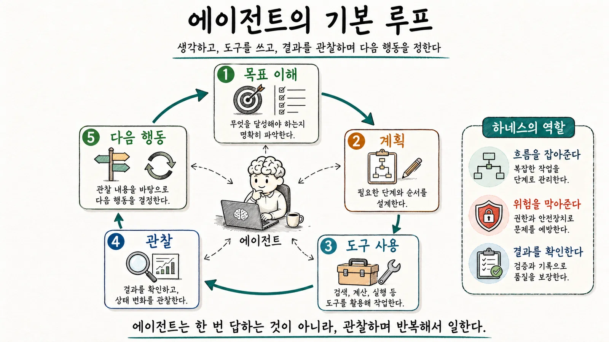
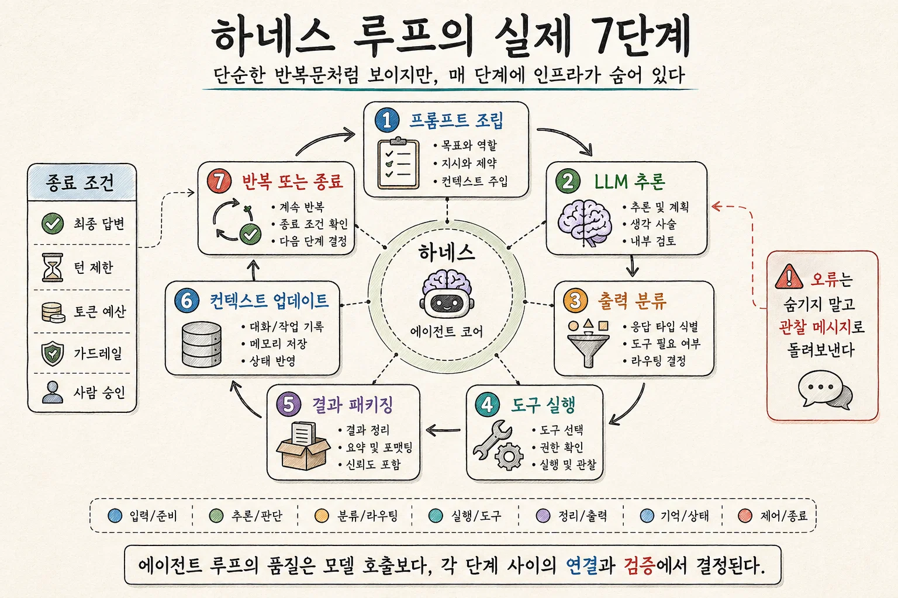
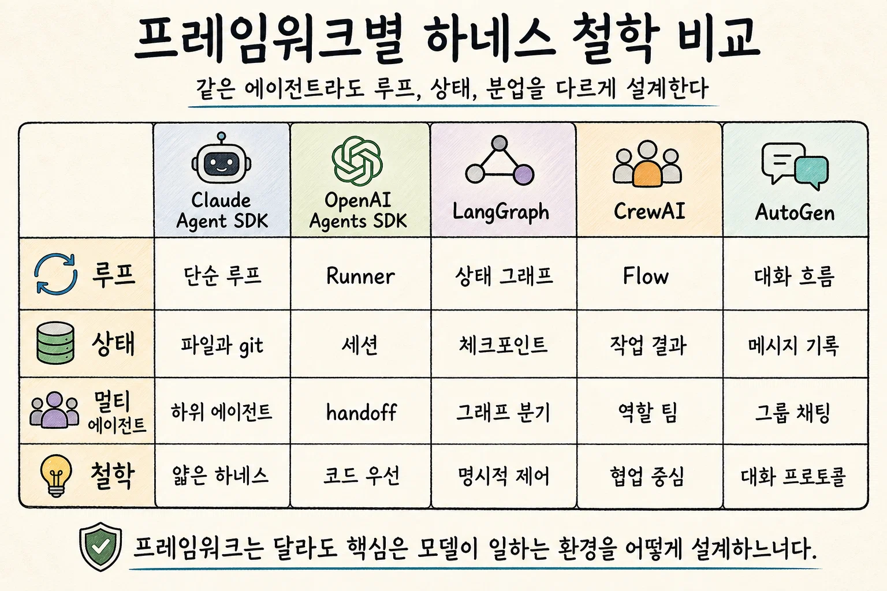

#  09. 제2장. LLM 에이전트의 작동 원리

* **🔖 LLM 에이전트는 단순 답변기가 아니라, 관찰 → 계획 → 행동 → 검증을 반복하며 작업하는 시스템이다.**
* **🔖 에이전트는 필요할 때 검색·파일 읽기·코드 실행 같은 도구를 호출하고, 그 결과를 다시 읽어 다음 행동을 결정한다.**
* **🔖 ReAct, Plan-and-Execute, handoff, subagent 같은 구조는 모두 “작업을 어떻게 분해하고 조율할 것인가”에 대한 서로 다른 하네스 전략이다.**

 

## 🎯 이 장을 읽고 나면 알게되는 3가지

* LLM 에이전트가 입력을 받고, 판단하고, 도구를 쓰고, 결과를 다시 읽는 기본 루프를 이해한다.
* ReAct, Plan-and-Execute, handoff, subagent같은 흐름의 차이를 구분한다.
* 에이전트의 행동이 마법이 아니라 반복되는 관찰·계획·행동·검증 과정임을 알게 된다.

 

## 2.1 LLM은 무엇을 입력받고 무엇을 출력하는가

**🔖에이전트는 "생각만 하는 모델"이 아니라 "도구를 사용하는 실행 시스템"이 된다.**

LLM은 텍스트, 이미지, 도구 결과 등 다양한 입력을 받아 다음에 올 가능성이 높은 출력을 생성한다.

실무는 이렇게만으론 부족하다. 고객이 “주문이 어디쯤 왔나요?”라고 묻는다면, 에이전트는 답을 상상해서 말하는 것이 아니라 주문 조회 API를 호출하고, 그 결과를 읽고, 고객에게 설명해야 한다.

  

## 2.2 토큰, 컨텍스트 창, 메시지 히스토리

* **토큰**은 모델이 **읽고 쓰는 정보의 단위**다. (한국어에서는 한 글자나 단어 조각이 토큰이 될 수 있다.)
* **컨텍스트 창**은 모델이 한 번에 볼 수 있는 **작업대의 크기**

Anthropic의 컨텍스트 엔지니어링 글은 컨텍스트를 LLM추론 시점에 포함되는 토큰 집합으로 보고, 이 제한된 자원을 어떻게 큐레이션할지 강조한다.

하네스 엔지니어링에서는 컨텍스트 창을 "AI의 책상"으로 본다.

**책상 위에는 필요한 자료만 올려야 한다. 나머지는 책자엥 넣고, 필요할 때 검색하게 해야한다.**

  

## 2.3 시스템 메시지, 개발자 메시지, 사용자 메시지.

- 시스템 메시지: 모델의 최상위 행동 원칙
- 개발자 메시지: 애플리케이션이나 프로젝트의 규칙
- 사용자 메시지: 지금 해결해야 할 요청
- 도구 결과: 외부 시스템에서 돌아온 관찰값

잘 설계된 하네스는 이 계층을 섞지 않는다. `사용자가 이렇게 말햇으니 보안 규칙을 무시하라`라는 시의 요구를 막아야 한다.

  

## 2.4 Tool Calling의 기본 구조

**Open AI** function calling문서는 도구 호출 흐름을 모델이 도구 호출을 생성하고, 애플리케이션이 실제 도구를 실행한 뒤, 결과를 다시 모델에 전달하는 구조로 설명함.

**Cluade** client tool과 server tool을 구분하며, 도구가 애플리케이션 쪽에서 실행될 수도 있고 제공자 인프라에서 실행될 수도 있다고 설명한다.

LLM은 모든 작업을 직접 수행하는 대신, 필요할 때 검색·파일 읽기·코드 실행 같은 도구를 호출하고 그 결과를 받아 판단한다. 의사가 직접 혈압을 재기보다 간호사에게 측정을 요청하고 결과를 받아 진단하는 방식과 비슷하다.

  

## 2.5 Function calling과 JSON schema

컴퓨터 도구는 `query`, `start_date`, `max_results`처럼 명확한 입력을 요구한다.

JSON schema는 도구 입력의 양식을 정하는 메뉴판이다.

**좋은 schema는 다음 조건을 만족**한다.

| 조건              | 설명                                         |
| :---------------- | :------------------------------------------- |
| 이름이 명확하다   | `search_customer_orders`처럼 목적이 드러난다 |
| 입력이 제한적이다 | 가능한 값과 타입이 정해져 있다               |
| 실패가 설명된다   | 잘못된 입력일 때 무엇이 문제인지 알려 준다   |
| 출력이 간결하다   | 모델이 판단하는 데 필요한 정보만 준다        |

  

## 2.6 Shell, browser, file system, MCP

에이전트가 강력해지는 순간은 파일 시스템, 브라우저, 셀, API, 데이터베이스와 연결될 때다. MCP는 이런 외부 도구와 데이터 소스를 연결하는 공개 표준으로 쓰이고 있다.

* Claude Code는 MCP를 통해 Jira, Sentr, Statsig, PostgreSQL, Figma등과 연결.
* OpenAI도 Response API에서 built-in tools, function calling, tool search등을 사용할수 있다고 설명한다.

셀 명령을 실행할 수 있다 = 테스틀 실행할 수 있다. = 파일을 삭제할 수도 있다.

중요한 민감 정보가 노출될 수도 있다.

  

## 2.7 Agent Loop: 관찰 → 계획 → 행동 → 검증 → 반복

에이전트는 보통 다음 루프를 돈다.

1. **관찰**: 현재 상황을 읽는다.
2. **계획**: 무엇을 할지 정한다.
3. **행동**: 도구를 호출하거나 파일을 수정한다.
4. **검증**: 결과가 맞는지 확인한다.
5. **기록**: 다음 반복을 위해 상태를 남긴다.

ReAct는 이 루프를 연구적으로 뒷받침한 대표 흐름이다.  추론과 행동이 분리되어 있지 않고, 서로 보완한다. 행동은 외부 정보를 가져오고, 추론은 그 정보를 해석한다.

 

### ★ 루프의 실제 7단계 - 커피 주문으로 이해하기

에이전트 루프는 기술적으로 단순히 반복문처럼 보일 수 잇지만, 제품급 하네스에서 루프는 식당의 주문 처리 시스템에 가깝다.

1단계는 **프롬프트 조립**이다.  하네스가 시스템 지시, 도구 스키마, 메모리, 대화 기록, 현재 사용자 요청을 한 입력으로 묶는다. **중요한 정보는 가능한 한 앞이나 뒤에 두는 것이 좋다.** 긴 문서의 중간에 묻힌 정보는 모델이 놓치기 쉽기 때문이다.

2단계는 **LLM 추론**이다.  모델은 최종 답변을 할지, 도구를 호출할지, 다른 에이전트에게 넘길지 판단한다. 이 단계에서 모델은 **“검색이 필요하다”, “파일을 읽어야 한다”, “이제 충분하니 답변하자” 같은 결정**을 내린다.

3단계는 **출력 분류**다.  현대적인 tool calling 환경에서는 **모델이 단순 텍스트만 내는 것이 아니라 `tool_calls` 같은 구조화된 객체를 반환**한다. 하네스는 이것이 최종 답변인지, 도구 실행 요청인지, handoff 요청인지 구분한다.

4단계는 **도구 실행**이다.  하네스는 인자가 맞는지 검사하고, 권한 정책을 확인하며, 가능하면 샌드박스에서 실행한다. 읽기 전용 작업은 병렬로 실행할 수 있지만, **파일 수정이나 데이터 변경처럼 부작용이 있는 작업은 순차적으로 실행하는 편이 안전**하다.

5단계는 **결과 패키징**이다.  도구 결과는 모델이 이해할 수 있는 관찰 메시지로 바뀐다. 오류가 나면 단순히 숨기지 말고, 모델이 복구할 수 있도록 “어떤 오류가 났고 어떤 제약이 있는지”를 전달한다.

6단계는 **컨텍스트 업데이트**다.  새 관찰, 파일 변경, 테스트 결과, 진행 기록이 상태에 반영된다. 컨텍스트가 너무 길어지면 요약, 압축, 기록 파일 업데이트가 필요하다.

7단계는 **반복 또는 종료**다.  모델이 도구 호출 없이 최종 답변을 내면 끝난다. 또는 최대 턴 수, 토큰 예산, 가드레일, 사람 승인 필요, 안전상 거절 같은 조건으로 멈춘다. 처음 배우는 사람이 기억할 핵심은 이것이다. 에이전트는 “한 번에 천재처럼 답하는 기계”가 아니라, **작게 보고, 작게 행동하고, 결과를 보고 다시 고치는 반복 시스템**이다.

 

### ReAct와 Plan-and-Execute의 차이

`ReAct`는 "생각하고, 행동하고, 관찰하고, 다시 생각하는" 방식이다. 즉석에서 1단계씩 진행하므로 유연하다.

`Plan-and-Execute`는 먼저 전체 계획을 세우고, 그 계획을 실행자에게 나누어 맡기는 방식이다.

LangChain은 ReAct가 명시적 계획 단계가 비용과 속도 측면에서 유리할 수 있다고 설명한다. LLMCompiler같은 구조는 작업을 DAG로 만들고 의존성이 충족된 작업부터 실행해 병렬성을 얻는다.

  

## 2.8 Handoff와 subagent

`handoff`는 한 에이전트가 다른 에이전트에게 일을 넘기는 방식이다.

OpenAI Agents SDK문서는 handoff를 전문화된 에이전트에게 작업을 위임하는 방식으로 설명한다.

Claude Code의 subagent문서는 subagent가 별도 컨텍스트 창에서 작업하고 요약만 반환할 수 있다고 설명한다.

  

## 2.9 멀티 에이전트 시스템

`멀티 에이전트 시스템`은 여러 에이전트가 역할을 나누어 일하는 구조다. 하지만 무조건 많다고 좋은건 아니다.

Anthropic의 managed agents글은 하네스가 모델의 한계를 가정해 만든 구조이므로, 모델이 발전하면 그 가정이 낡을 수 있다고한다. **👉 즉, 멀티에이전트는 목적이 있을 때만 써야 한다.**

| 역할       | 하는 일                            |
| :--------- | :--------------------------------- |
| Planner    | 목표를 작은 단계로 나눈다          |
| Researcher | 자료를 찾고 요약한다               |
| Builder    | 결과물을 만든다                    |
| Evaluator  | 결과를 비판적으로 검증한다         |
| Reporter   | 사람에게 이해 가능한 보고서를 쓴다 |

 

### 하위 에이전트 오케스트레이션의 3가지 형태

하위 에이전트는 무조건 "AI여러명이 회의한다"는게 아니다.

| 형태     | 쉬운 설명                                   | 언제 쓰나                           | 주의점                                             |
| :------- | :------------------------------------------ | :---------------------------------- | :------------------------------------------------- |
| Fork     | 부모의 컨텍스트를 복사해 별도 작업을 시킨다 | 독립적인 조사, 코드 리뷰, 대안 생성 | 결과 요약을 잘해야 부모 컨텍스트가 오염되지 않는다 |
| Teammate | 별도 터미널이나 세션에서 동료처럼 일한다    | 긴 작업, 병렬 작업, 지속적인 QA     | 누가 무엇을 했는지 기록이 필요하다                 |
| Worktree | 격리된 브랜치/작업공간에서 수정하게 한다    | 코드 수정, 실험, 위험한 변경        | merge와 충돌 해결 정책이 필요하다                  |

처음부터 멀티에이전트 시스템을 만들 필요가 없다. 한 에이전트가 너무 많은 역할을 떠안아 품질이 떨어지는 지점이 보일 떄 분업한다.

 

### 실제 프레임워크들의 하네스 구현 패턴

**🔖 내 업무에 어떤 하네스 구조가 필요한가가 더 중요하다.**

| 프레임워크                          | 하네스를 바라보는 관점                                       | 초보자 비유                           |
| :---------------------------------- | :----------------------------------------------------------- | :------------------------------------ |
| Claude Agent SDK                    | Claude Code의 도구, 루프, 컨텍스트 관리를 라이브러리처럼 사용 | 숙련된 작업자의 작업대를 빌려 쓰는 것 |
| OpenAI Agents SDK                   | Runner가 도구 호출, handoff, guardrail, tracing을 관리       | 업무 프로세스를 파이썬 코드로 쓰는 것 |
| LangGraph                           | 상태가 그래프 노드를 지나가며 변한다                         | 업무 플로우차트를 실행하는 것         |
| CrewAI                              | 역할, 목표, 태스크, 크루로 팀을 구성한다                     | 프로젝트 팀을 만드는 것               |
| AutoGen / Microsoft Agent Framework | 에이전트들이 대화하며 작업을 조정한다                        | 회의실에서 전문가들이 토론하는 것     |

핵심은 "어떤 프레임워크가 최고인가?"가 아니라, 내 업무에 상태 추적이 중요한지, 여러 역할 분담이 중요한지, 빠른 코드 기반 제어가 중요한지, 안전 승인과 관측성이 중요한지를 보고 골라야 한다.
