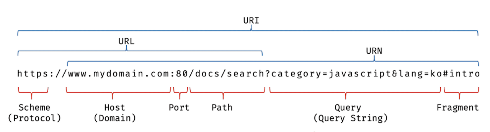

# 🐳 21장 빌트인 객체

## 🌏 21.1 자바스크립트 객체의 분류

**표준 빌트인 객체**

ECMAScript 사양에 정의된 객체. 애플리케이션 전역의 공통기능을 제공함.

자바스크립트 실행 환경에 상관없고, 별도 선언없이 언제나 참조하여 사용가능.


**호스트 객체**

ECMAScript 사양에 정의 되있지않지만, 자바스크립트 실행환경에서 추가로 제공하는 객체.

브라우저 - Web API (DOM, BOM, Canvas, ...)

서버 - Node.js고유의 API를 호스트 객체로 제공


**사용자 정의 객체**

사용자가 직접 정의한 객체


## 🌏 21.2 표준 빌트인 객체

자바스크립트는 Object, String, Number, Boolean, Symbol, Math, Promise, Reflect, JSON, ... 등등 40여개의 표준 빌트인 객체를 제공함.

Math, Reflect, JSON을 제외한 표준 빌트인 객체는 모두 인스턴스르 ㄹ생성할 수 있는 생성자 함수 객체다.

생성자 함수 객체인 표준 빌트인 객체는 프로토타입 메서드와 정적 메서드를 제공하고, 아닌경우 정적 메서드만 제공한다.

생성자 함수인 표준 빌트인 객체가 생성한 인스턴스의 프로토타입은 **표준 빌트인 객체의 prototype 프로퍼티에 바인딩된 객체**이다.

```javascript
// String 생성자 함수에 의한 String 객체 생성
const strObj = new String('Lee'); // String {"Lee"}
console.log(typeof strObj);       // object

//------------------------------------------------------------------------

// Number 생성자 함수에 의한 Number 객체 생성
const numObj = new Number(123); // Number {123}
console.log(typeof numObj);     // object

//------------------------------------------------------------------------

// Boolean 생성자 함수에 의한 Boolean 객체 생성
const boolObj= new Boolean(true); // Boolean {true}
console.log(typeof boolObj);      // object

//------------------------------------------------------------------------

// Function 생성자 함수에 의한 Function 객체(함수) 생성
const func = new Function('x', 'return x * x'); // ƒ anonymous(x )
console.log(typeof func);                       // function

//------------------------------------------------------------------------

// Array 생성자 함수에 의한 Array 객체(배열) 생성
const arr = new Array(1, 2, 3); // (3) [1, 2, 3]
console.log(typeof arr);        // object

//------------------------------------------------------------------------

// RegExp 생성자 함수에 의한 RegExp 객체(정규 표현식) 생성
const regExp = new RegExp(/ab+c/i); // /ab+c/i
console.log(typeof regExp);         // object

//------------------------------------------------------------------------

// Date 생성자 함수에 의한 Date 객체 생성
const date = new Date();  // Fri May 08 2020 10:43:25 GMT+0900 (대한민국 표준시)
console.log(typeof date); // object
```


## 🌏 21.3 원시값과 래퍼 객체

문자열, 숫자, 불리언 등 원시값이 있는데도 String, Number, Boolean이 있는 이유에 대해 알아보자.

```javascript
const str = 'hello';

// 원시 타입인 문자열이 프로퍼티와 메서드를 갖고 있는 객체처럼 동작한다.
console.log(str.length); // 5
console.log(str.toUpperCase()); // HELLO
```

원시값은 객체가 아니므로 프로퍼티나 메서드를 가질 수 없는데도 원시값인 문자열이 마치 객체처럼 동작한다.

원시값의 경우 **자바스크립트 엔진이 일시적으로 원시값을 연관된 객체로 변환해주기 때문.**

즉, 암묵적으로 연관된 객체를 생성하여 생성된 객체로 프로퍼티에 접근하거나 메서드를 호출하고 다시 원시값으로 되돌린다.

**❗ 문자열, 숫자, 불리언 값에 대해 객체처럼 접근하면 생성되는 임시 객체를 래퍼 객체(wrapper object)라 한다.**

위의 경우 마침표 표기법으로 접근하면 그 순간 래퍼 객체인 String 생성자 함수의 인스턴스가 생성되고 문자열은 래퍼 객체의 [[StringData]]내부 슬롯에 할당된다.

래퍼객체의 처리가 종료되면 [[StringData]] 내부 슬롯에 할당된 원시값으로 원래 상태, 즉 식별자가 원시값을 갖도록 되돌리고 래퍼 객체는 가비지 컬렉션의 대상이 된다.<br/>(String뿐만아니라 Number, Boolean, Symbol모두 동일)

```javascript
// ① 식별자 str은 문자열을 값으로 가지고 있다.
const str = 'hello';

// ② 식별자 str은 암묵적으로 생성된 래퍼 객체를 가리킨다.
// 식별자 str의 값 'hello'는 래퍼 객체의 [[StringData]] 내부 슬롯에 할당된다.
// 래퍼 객체에 name 프로퍼티가 동적 추가된다.
str.name = 'Lee';

// ③ 식별자 str은 다시 원래의 문자열, 즉 래퍼 객체의 [[StringData]] 내부 슬롯에 할당된 원시값을 갖는다.
// 이때 ②에서 생성된 래퍼 객체는 아무도 참조하지 않는 상태이므로 가비지 컬렉션의 대상이 된다.

// ④ 식별자 str은 새롭게 암묵적으로 생성된(②에서 생성된 래퍼 객체와는 다른) 래퍼 객체를 가리킨다.
// 새롭게 생성된 래퍼 객체에는 name 프로퍼티가 존재하지 않는다.
console.log(str.name); // undefined

// ⑤ 식별자 str은 다시 원래의 문자열, 즉 래퍼 객체의 [[StringData]] 내부 슬롯에 할당된 원시값을 갖는다.
// 이때 ④에서 생성된 래퍼 객체는 아무도 참조하지 않는 상태이므로 가비지 컬렉션의 대상이 된다.
console.log(typeof str, str);
```

❗ null이나 undefined는 래퍼객체를 생성하지 않기 때문에 객체처럼 사용하면 에러가 발생.


## 🌏 21.4 전역 객체

전역 객체(Global Object)는 **코드가 실행되기 이전 단계에 자바스크립트 엔진에 의해 어떤 객체보다도 먼저 생성되는 특수한 객체.**

**어떤 객체에도 속하지 않은 최상위 객체**다.

자바스크립트 환경에 따라 다르다.

브라우저 - window(또는 self, this, frames) / Node.js에서는 global.

> globalThis
>
> ES11에서 도입된 globalThis는 브라우저 환경, Node.js환경에서 전역 객체를 가리키던 다양한 식별자를 **통일한 식별자**
>
> ```javascript
> // 브라우저 환경
> globalThis === this   // true
> globalThis === window // true
> globalThis === self   // true
> globalThis === frames // true
> 
> // Node.js 환경(12.0.0 이상)
> globalThis === this   // true
> globalThis === global // true
> ```


전역 객체는 계층적 구조상 어떤 객체에도 속하지 않은 모든 빌트인 객체의 최상위 객체다.<br/>(프로토타입 상속 관계상에서 최상위 객체라는 의미가 아님.)


**❗ 전역 객체의 특징**

* 개발자가 의도적으로 생성할 수 없다 <br/>생성할 수 있는 생성자 함수가 제공되지 않는다.

* 전역 객체의 프로퍼티를 참조할 때 window(또는 global)를 생략할 수 있다.<br/>
  ```javascript
  // 문자열 'F'를 16진수로 해석하여 10진수로 변환하여 반환함.
  window.parseInt('F', 16); // -> 15
  // window.parseInt는 parseInt로 호출할 수 있다.
  parseInt('F', 16); // -> 15
  
  window.parseInt === parseInt; // -> true
  ```

* 전역객체는 모든 표준 빌트인 객체(String, Number, Boolean,...)를 프로퍼티로 가지고 있다.

* 자바스크립트 실행 환경에 따라 추가적으로 프로퍼티와 메서드를 갖는다.

* var키워드로 선언한 전역 변수와 선언하지 않은 변수에 값을 할당한 암묵적 전역, 그리고 전역함수는 전역 객체의 프로퍼티가 된다.<br/>
  ```javascript
  // var 키워드로 선언한 전역 변수
  var foo = 1;
  console.log(window.foo); // 1
  
  // 선언하지 않은 변수에 값을 암묵적 전역. bar는 전역 변수가 아니라 전역 객체의 프로퍼티다.
  bar = 2; // window.bar = 2
  console.log(window.bar); // 2
  
  // 전역 함수
  function baz() { return 3; }
  console.log(window.baz()); // 3
  ```

* let, const로 선언한 전역 변수는 전역 객체의 프로퍼티가 아니다.<br/>=> window.foo와 같이 접근 X<br/>let, const로 선언한 전역 변수는 보이지 않는 개념적인 블록내에 존재(23장에서 자세히)

* 브라우저 환경의 모든 자바스크립트 코드는 하나의 전역 객체 window를 공유함.


### 👉 21.4.1 빌트인 전역 프로퍼티

전역 객체의 프로퍼티를 의미.

**Infinity**

무한대를 나타내는 숫자값


**NaN**

숫자가 아님(Not a Number)을 의미한다.


**undefined**

원시타입 undefined를 값으로 가짐.


### 👉 21.4.2 빌트인 전역 함수

전역에서 호출할 수 있는 빌트인 함수.

**eval**

자바스크립트 코드를 나타내는 문자열을 인수로 전달받음

전달받은 문자열 코드가 표현식이 아니면, eval함수는 문자열 코드를 런타임에 평가해 값을 생성하고, 표현식이 아닌 문이라면 eval함수는 문자열 코드를 런타임에 실행함.

문자열 코드가 여러개의 문으로 이루어져 있다면 모든 문을 실행함.

```javascript
/*
* 주어진 문자열 코드를 런타임에 평가 또는 실행함.
* @param {string} code - 코드를 나타내는 문자열
* @returns {*} 문자열 코드를 평가/실행한 결과값
*/

// 표현식인 문
eval('1 + 2;'); // -> 3
// 표현식이 아닌 문
eval('var x = 5;'); // -> undefined

// eval 함수에 의해 런타임에 변수 선언문이 실행되어 x 변수가 선언되었다.
console.log(x); // 5

// 객체 리터럴은 반드시 괄호로 둘러싼다.
const o = eval('({ a: 1 })');
console.log(o); // {a: 1}

// 함수 리터럴은 반드시 괄호로 둘러싼다.
const f = eval('(function() { return 1; })');
console.log(f()); // 1

// 여러개의 문으로 되어있으면 모든 문을 실행한 다음 마지막 결과값 리턴.
eval('1+2; 3+4;'); // 7
```


eval함수는 자신이 호출된 위치에 해당하는 기존 스코프를 런타임에 동적으로 수정함.

```javascript
const x = 1;

function foo() {
  // eval 함수는 런타임에 foo 함수의 스코프를 동적으로 수정한다.
  eval('var x = 2;');
  console.log(x); // 2
}

foo();
console.log(x); // 1
```

foo함수 스코프에 x변수를 동적으로 추가하는 예제다.

함수가 호출되면 런타임 이전에 함수 내부의 모든 선언문을 실행하고 그 결과를 스코프에 등록함.<br/>따라서 eval함수가 호출되는 시점에는 이미 foo함수 스코프가 존재함.

❗ **eval함수는 기존 스코프를 런타임에 동적으로 수정한다.**

eval함수가 호출된 foo함수의 스코프에서 이미 그위치에 존재하던 코드처럼 동작한다.

단, strict mode에서 eval함수는 기존 스코프를 수정하지 않고, eval함수 자신의 자체적인 스코프를 생성한다.

또한, elt, const를 사용한 변수 선언문이라면 암묵적으로 strict mode가 적용된다.


**eval을 통해 입력받은 콘텐츠를 실행하는 것은 보안에 매우 취약하다.**

eval로 실행되는 코드는 **자바스크립트 엔진에 의해 최적화가 수행되지 않으므로 일반적인 코드 실행에 비해 처리가 느리다.**

**❗ eval함수의 사용은 금지해야한다.**


**isFinite**

전달 받은 인수가 정상적인 유한수인지 검사하여 유한수면 true를 리턴, 무한수면 false를 리턴함.

인수가 NaN이라면 false를 리턴함.

null인 경우 null을 숫자로 변환해 0으로 검사를 수행하여 true가 리턴된다.


**isNaN**

NaN인지 검사하여 boolean타입으로 리턴한다.


**parseFloat, parseInt**

전달받은 문자열을 실수/정수로 반환한다.

공백이 있는 경우 첫 번째 문자열만 변환하고, 첫 번째 문자열을 변환 못하면 NaN이 리턴.

parseInt의 경우 두번째 파라미터로 2~36을 전달할 수 있는데 해당 진수로 계산한다.


**encodeURI / decodeURI**

encodeURI는 완전한 URI(Uniform Resource Identifier)를 문자열로  전달받아 escape처리를 위해 인코딩한다.



```javascript
/*
* 완전한 URI를 문자열로 전달받아 이스케이프 처리를 위해 인코딩함.
* @param {string} uri - 완전한 URI
* @return {string} 인코딩된 URI
*/
encodeURI(uri);
```

이스케이프 처리는 네트워크를 통해 정보를 공유할 때 어떤 시스템에서도 읽을 수 있는 아스키 문자 셋으로 변환하는 것이다. 

대부분의 외국어(한국어 포함)나 아스키 문자 셋에 정의되지 않은 특수 문자의 경우 URL에 포함할 수 없다.

그렇기 때문에 그런 문자들을 이스케이프 처리해 야기될 수 있는 문제를 예방하려는 것이다.

❗ `알파벳, 0-9, -_.!~*'()`는 이스케이프 처리에서 제외됨.


decodeURI는 인코딩된 URI를 이스케이프 처리 이전으로 디코딩한다.

```javascript
/*
* 인코딩된 URI를 전달받아 이스케이프 처리 이전으로 디코딩함.
* @param {string} encodedURI - 인코딩된 URI
* @return {string} 디코딩된 URI
*/
decodeURI(uri);
```


**encodeURIComponent / decodeURIComponent**

encodeURIComponent함수는 URI 구성요소를 인수로 전달받아 인코딩함.

decodeURIComponent함수는 전달된 URI 구성요소를 디코딩함.

```javascript
/*
* URI의 구성요소를 전달받아 이스케이프 처리를 위해 인코딩함.
* @param {string} uri - URI의 구성요소
* @return {string} 인코딩된 URI의 구성요소
*/
encodeURIComponent(uriComponent);

/*
* 인코딩된 URI의 구성요소를 전달받아 이스케이프 처리 이전으로 디코딩함.
* @param {string} encodedURI - 인코딩된 URI의 구성요소
* @return {string} 디코딩된 URI의 구성요소
*/
decodeURIComponent(encodedURIComponent);
```

encodeURIComponent는  전달된 문자열을URI의 구성요소인 쿼리 스트링의 일부로 간주하므로 `=, ?, &`까지 인코딩함.

encodeURI는 문자열을 완전한 URI전체라 생각해 `=, ?, &`는 인코딩 안함.

```javascript
// URI의 쿼리 스트링
const uriComp = 'name=이웅모&job=programmer&teacher';

// encodeURIComponent 함수는 인수로 전달받은 문자열을 URI의 구성요소인 쿼리 스트링의 일부로 간주한다.
// 따라서 쿼리 스트링 구분자로 사용되는 =, ?, &까지 인코딩한다.
let enc = encodeURIComponent(uriComp);
console.log(enc);
// name%3D%EC%9D%B4%EC%9B%85%EB%AA%A8%26job%3Dprogrammer%26teacher

let dec = decodeURIComponent(enc);
console.log(dec);
// 이웅모&job=programmer&teacher

// encodeURI 함수는 인수로 전달받은 문자열을 완전한 URI로 간주한다.
// 따라서 쿼리 스트링 구분자로 사용되는 =, ?, &를 인코딩하지 않는다.
enc = encodeURI(uriComp);
console.log(enc);
// name=%EC%9D%B4%EC%9B%85%EB%AA%A8&job=programmer&teacher

dec = decodeURI(enc);
console.log(dec);
// name=이웅모&job=programmer&teacher
```


### 👉 21.4.3 암묵적 전역

```javascript
var x = 10; // 전역 변수

function foo () {
  // 선언하지 않은 식별자에 값을 할당
  y = 20; // window.y = 20;
}
foo();

// 선언하지 않은 식별자 y를 전역에서 참조할 수 있다.
console.log(x + y); // 30
```

foo 내부의 y는 선언하지 않은 식별자다. 따라서 참조 에러가 발생할 거 같지만,  선언된 전역 변수처럼 동작한다.

**선언하지 않은 식별자에 값을 할당하면 전역 객체의 프로퍼티가 되기 때문**

자바스크립트 엔진이 y=20을 window.y=20으로 해석해 전역 객체에 프로퍼티를 동적 생성한다.

이런 현상을 암묵적 전역(implict global)이라 한다.

y는 전역 객체의 프로퍼티로 추가되었을 뿐 변수가아니라 호이스팅이 발생하지 않는다.

```javascript
// 전역 변수 x는 호이스팅이 발생한다.
console.log(x); // undefined
// 전역 변수가 아니라 단지 전역 객체의 프로퍼티인 y는 호이스팅이 발생하지 않는다.
console.log(y); // ReferenceError: y is not defined

var x = 10; // 전역 변수

function foo () {
  // 선언하지 않은 식별자에 값을 할당
  y = 20; // window.y = 20;
}
foo();

// 선언하지 않은 식별자 y를 전역에서 참조할 수 있다.
console.log(x + y); // 30
```

변수가아니라 프로퍼티기 때문에 delete로 삭제가 가능하다.