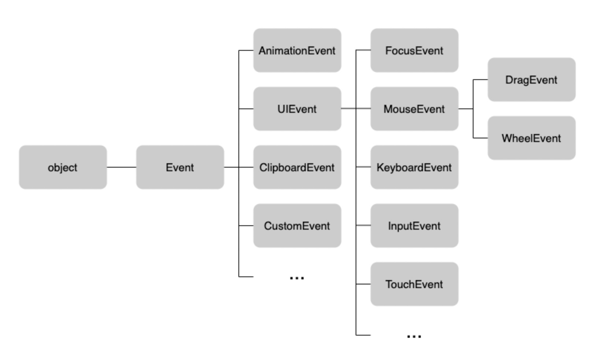
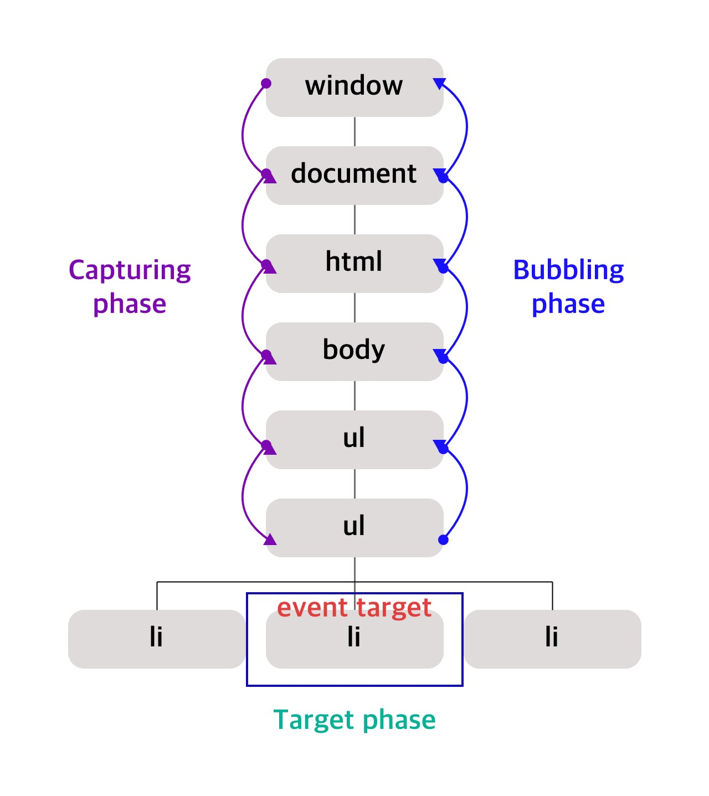

# 40장 이벤트

## 40.1 이벤트 드리븐 프로그래밍

브라우저는 처리할 특정 사건이 발생하면 이를 감지하여, 이벤트를 발생(event trigger)시킨다.<br/>애플리케이션에서 특정 타입의 이벤트에 대해 반응하여 어떤 일을 하고 싶다면 해당하는 타입의 이벤트가 발생했을 때 호출될 함수를 브라우저에게 알려 호출을 위임한다.

이때 이벤트가 발생했을 때 호출될 함수를 **이벤트 핸들러**. <br/>이벤트가 발생했을 때 브라우저에게 이벤트 핸들러의 호출을 위임하는 것을 **이벤트 핸들러 등록**이라한다.

프로그램의 흐름을 이벤트 중심으로 제어하는 프로그래밍 방식을 **이벤트 드리븐 프로그래밍** 이라한다.

<br/>

## 40.2 이벤트 타입

이벤트 타입은 이벤트의 종류를 나타낸다. (상세목록음 참고 링크 참고)

종류에 대해 알아보자.

### 📘 참고

* [MDN 공식문서 - Event reference](https://developer.mozilla.org/en-US/docs/Web/API/Event)

<br/>

### 40.2.1 마우스 이벤트

* `click`
* `dbclick`
* `mousedown`
* `mouseup`
* `mousemove`
* `mouseenter `
* `mouseover`
* `mouseleave`
* `mouseout`

> ❗ mouseneter, mouseleave vs mouseover, mouseout
>
> mouseenter와 mouseover는 커서를 HTML요소 안으로 이동했을 때를 말한다.<br/>mouseleave와 mouseout은 커서를 HTMl요소 밖으로 이동했을 때를 말한다.
>
> **mouseenter와 mouseleave는 버블링이 되지않지만**, **mouseover와 mouseout은 버블링**된다.
>
> 차이를 기억해두자.

### 40.2.2 키보드 이벤트

* `keydown` : 모든 키를  눌렀을 때 발생.<br/>문자, 숫자, 특수문자, enter는 연속적으로 발생하지만 그 외는 한 번만 발생
* `keypress` : 문자, 숫자, 특수문자, enter키만 눌렀을때 발생. <br/>(❗ deprecatd되었으니 권장하지않음.)
* `keyup`: 모든 키를 놓았을 때 발생.<br/> (keydown과 동일함)

### 40.2.3 포커스 이벤트

* `focus`
* `blur`
* `focusin`
* `focusout`

> ❗ focus, blur vs focusin, focusout
>
> focus, blur은 버블링되지 않고, blur와 focusout은 버블링이 된다.

### 40.2.4 폼 이벤트

* `submit`
  * form요소 내의 input(text, checkbox, radio), select 입력필드(textarea제외)에서 엔터 눌렀을 때
  * form요소 내의 submit버튼(`<button> `, `<input type="submit" />`)클릭 시
  * submit이벤트는 form요소에서 발생함.
* `reset` : form의 reset버튼 클릭시 사용. (최근엔 사용X)

### 40.2.5 값 변경 이벤트

* `input`
* `change`
* `readystatechange` : HTML 문서의 로드와 파싱 상태를 나타내는 `document.readyState`프로퍼티 값(`loading`, `interactive`, `complete`)이 변경될 때

> ❗ change
>
> change이벤트는 input과 달리 **HTML요소가 포커스를 잃었을 때 사용자 입력이 종료되었다고 인식하여 발생**한다.<br/>즉, 사용자가 **입력하고 있을 때는 input이벤트**가 발생하고 사용자 **입력이 종료되어 값이 뱐경되면 change이벤트** 발생

### 40.2.6 DOM 뮤테이션 이벤트

* `DOMContentLoaded` : HTML문서의 로드와 파싱이 완료되어 **DOM 생성이 완료**되었을 때

### 40.2.7 뷰 이벤트

- `resize` : window의 크기를 리사이즈할 때 연속적으로 발생.<br/>❗ 오직, winidow객체에서만 발생
- `scroll` : 웹페이지(document)또는 HTML요소를 스크롤할 떄 연속적으로 발생

### 40.2.8 리소스 이벤트

* `load` : **DOMContentLoaded**이벤트가 발생한 이후, 모든 리소스의 로딩이 완료되었을 때
* `unload` : 리소스가 언로드될 때 (주로 새로운 웹페이지를 요청한 경우)
* `abort` : 리소스 로딩이 중단되었을 떄
* `error` : 리소스 로딩이 실패했을 떄

<br/><br/>

## 40.3 이벤트 핸들러 등록

`이벤트 핸들러`는 이벤트가 발생했을 때 브라우저에 호출을 위임한 함수.<br/>이벤트 핸들러를 등록하는 방법은 3가지가 있다.

* 이벤트 핸들러 어트리뷰트 방식
* 이벤트 핸들러 프로퍼티 방식
* addEventListener 메서드 방식

<br/>

### 40.3.1 이벤트 핸들러 어트리뷰트 방식

`이벤트 핸들러 어트리뷰트`에는 **on접두사**와 이벤트의 종류를 나타내는 이벤트 타입으로 이루어져 있다.

```html
<body>
  <button onclick="sayHi('Lee')">
    Click me
  </button>
</body>
```

❗ 함수 참조가 아닌 함수 호출문등의 **문을 할당**한다는 것을 주의

>  why?
>
> 이벤트 핸들러 등록은 함수 호출을 브라우저에게 위임하는 것이라 하였었다. <br/>이벤트 핸들러를 등록할 때 콜백 함수와 마찬가지로 함수 참조를 등록해야 브라우저가 이벤트 핸들러를 호출할 수 있다.
>
> 함수 호출문이 되면, 평가 결과가 이벤트 핸들러로 등록되버린다. 함수를 반환하는 고차 함수 호출문을 이벤트 핸들러로 등록한다면 문제가 없겠지만, 값을 반환하는 함수 호출문을 이벤트 핸들러로 등록하면 브라우저가 호출할 수 없게 되버린다.

결국, 이벤트 핸들러 어트리뷰트 값으로 할당한 문자열은 암묵적으로 생성될 이벤트 핸들러의 함수 몸체를 의미한다.

HTML과 JS는 관심사가 다르기 때문에 혼재하는 것 보다 분리하는 것이 좋고, 이 방식을 알고만 있는 것이 좋다.

하지만, 모던 자바스크립트에서는 이벤트 핸들러 어트리뷰트 방식을 사용하는 경우가 있다. **CBD(Component Based Development)방식**의 `Angular / React / Svelte / Vue`같은 프레임워크/라이브러리에서는 이벤트 핸들러 어트리뷰트 방식으로 이벤트를 처리한다. CBD에서는 HTML, CSS, JS를 관심사가 다른 개별적인 요소가 아닌 뷰를 구성하기 위한 구성요소로 보기 때문에 관심사가 다르지 않다.

### 📘 참고

* [Wiki - 겸손한 자바스크립트](https://en.wikipedia.org/wiki/Unobtrusive_JavaScript)
* [Wiki - 컴포넌트 기반 소프트웨어 공학_CBD](https://ko.wikipedia.org/wiki/컴포넌트_기반_소프트웨어_공학)

<br/>

### 40.3.2 이벤트 핸들러 프로퍼티 방식

`window`객체와 `Document`, `HTMLElement`타입의 DOM 노드 객체는 이벤트에 대응하는 이벤트 핸들러 프로퍼티를 가지고 있다. 이벤트 핸들러 프로퍼티의 키는 이벤트 핸들러 어트리뷰트와 마찬가지로 onclick과 같이 on접두사와 이벤트의 종류를 나타내는 이벤트 타입으로 이루어져있다.

이벤트 핸들러 프로퍼티에 함수를 바인딩하면 이벤트 핸들러가 등록된다.

```html
<body>
  <button>Click me!</button>
  <script>
	  const $button = document.querySelector('button');
    // 이벤트 핸들러 프로퍼티에 이벤트 핸들러 바인딩
    $button.onclick= function(){
      console.log('click')
    }
  </script>
</body>
```

이벤트 핸들러 등록을 위해 이벤트를 발생시킬 객체인 **이벤트 타깃**과 이벤트 종류를 나타내는 문자열인 **이벤트 타입**그리고 **이벤트 핸들러**를 지정할 필요가 있다.

이벤트 핸들러는 대부분 이벤트를 발생시킬 타깃에 바인딩하는데, 반드시 바인딩 해야하는 것은 아니다. <br/>이벤트 핸들러는 타깃 또는 전파된 이벤트를 캐치할 DOM노드 객체에 바인딩한다. (40.6 이벤트 전파와 40.7 이벤트 위임 참고)

<br/>

### 40.3.3 addEventListener 메서드 방식

DOM Level 2에서 도입된 `EventTarget.prototype.addEventListener`메서드를 사용해 등록할 수 있다. (앞의 2방식은 Level0부터 제공됨.)

```
EventTarget.addEventListener('eventType', functionName [, useCapture])
```

* useCapture : capture여부를 나타내며 true면 캡처링, false면 bubbling (default).

> ❗ 동일한요소에서 동일한 이벤트에 대해 이벤트 핸들러를 등록하는 경우
>
> 다른 방식으로 등록하게 되면 2개 모두 호출되지만, 동일한 addEventListener로 중복 등록하면 하나의 이벤트만 등록된다.

<br/><br/>

## 40.4 이벤트 핸들러 제거

`addEventListener`로 등록한 이벤트 핸들러를 제거하려면 `EventTarget.prototype.removeEventListener`를 사용. <br/>전달할 인수는 `addEventListener`와 동일하다.

❗ 단, addEventListener에서 전달한 인수와 removeEventListener에 전달한 인수가 일치하지 않으면, 제거되지않는다.

**제거되지 않는 경우**

* addEventListener에서 전달한 인수와 removeEventListener에 전달한 인수가 일치하지 않으면, 제거되지않는다.
* 무명함수를 호출한 경우 제거할 수 없다.
* 이벤트 핸들러 프로퍼티 방식으로 등록한 이벤트 핸들러는 `removeEventListener`메서드로 제거할 수 없다.<br/>이 경우 프로퍼티에 `null`을 할당한다.

**제거 되는 경우**

* 이벤트 핸들러 내부에서 removeEventListener 메서드를 호출하여 이벤트 핸들러를 제거하는 것은 가능.

  여러번 호출해도, 이벤트 핸들러는 단 한번만 호출됨.

* 기명 함수를 이벤트 핸들러로 등록할 수 없다면 호출된 함수, 즉 함수 자신을 가리키는 `arguments.callee`를 사요할 수도 있다.

>  ❗ arguments.callee
>
> 코드 최적화를 방해하므로 strict moe에서 사용이 금지된다. 가급적 이벤트 핸들러의 참조를 변수나 자료구조에 저장하여 제거하는 편이 좋다.

<br/><br/>

## 40.5 이벤트 객체

이벤트가 발생하면, 이벤트에 관련한 다양한 정보를 담은 이벤트 객체가 동적으로 생성된다. <br/>**생성된 이벤트 객체는 이벤트 핸들러의 첫 번쨰 인수로 전달된다.**

이벤트 핸들러 어트리뷰트 방식인 경우, 첫 번째 매개변수 이름이 반드시 event이어야 한다. 이벤트 핸들러 어트리뷰트 값은 사실 암묵적으로 생성되는 이벤트 핸들러의 함수 몸체를 의미하기 때문이다.

즉, `onclick="showCoords(event)"`어트리뷰트는 파싱되어 다음과 같은 함수를 암묵적으로 생성하여 onclick이벤트 핸들러 프로퍼티에 할당한다.

<br/>

### 40.5.1 이벤트 객체의 상속 구조



위 사진을 보면, `Event`, `UIEvent`, `MouseEvent`등 모두는 생성자 함수다. 따라서 생성자 ㅎ마수를 호출하여 이벤트 객체를 생성할 수 있다.

```html
<!DOCTYPE html>
<html>
<body>
  <script>
    // Event 생성자 함수를 호출하여 foo 이벤트 타입의 Event 객체를 생성한다.
    let e = new Event('foo');
    console.log(e);
    // Event {isTrusted: false, type: "foo", target: null, ...}
    console.log(e.type); // "foo"
    console.log(e instanceof Event); // true
    console.log(e instanceof Object); // true

    // FocusEvent 생성자 함수를 호출하여 focus 이벤트 타입의 FocusEvent 객체를 생성한다.
    e = new FocusEvent('focus');
    console.log(e);
    // FocusEvent {isTrusted: false, relatedTarget: null, view: null, ...}

    // MouseEvent 생성자 함수를 호출하여 click 이벤트 타입의 MouseEvent 객체를 생성한다.
    e = new MouseEvent('click');
    console.log(e);
    // MouseEvent {isTrusted: false, screenX: 0, screenY: 0, clientX: 0, ... }

    // KeyboardEvent 생성자 함수를 호출하여 keyup 이벤트 타입의 KeyboardEvent 객체를
    // 생성한다.
    e = new KeyboardEvent('keyup');
    console.log(e);
    // KeyboardEvent {isTrusted: false, key: "", code: "", ctrlKey: false, ...}

    // InputEvent 생성자 함수를 호출하여 change 이벤트 타입의 InputEvent 객체를 생성한다.
    e = new InputEvent('change');
    console.log(e);
    // InputEvent {isTrusted: false, data: null, inputType: "", ...}
  </script>
</body>
</html>
```

이벤트가 발생하면 암묵적으로 생성되는 이벤트 객체도 생성자 함수에 읭해 생성된다. 그리고 생성된 이벤트 객체는 생성자 함수와 더불어 생성되는 프로토타입으로 구성된 프로토타입 체인의 일원이 된다.

이벤트 객체 중 일부는 사용자의 행위에 의해 생성된 것이고 일부는 자바스크립트 코드에 의해 인위적으로 생성된 것이다. ex) MouseEvent타입의 이벤트 객체는 사용자가 마우스로 동작했을 때 생성되는 이벤트 객체이며, CusteomEvent타입의 이벤트 객체는 JS코드에 의해 인위적으로 생성한 이벤트 객체이다.

Event 인터페이스에는 모든 이벤트 객체의 공통 프로퍼티가 정의되있고, `FocusEvent`, `MouseEvent`, `KeyboardEvent`, `WheelEvent`같은 하위 인터페이스에는 이벤트 타입에 따라 고유한 프로퍼티가 정의되어 있다.

```html
<!DOCTYPE html>
<html>
<body>
  <input type="text">
  <input type="checkbox">
  <button>Click me!</button>
  <script>
    const $input = document.querySelector('input[type=text]');
    const $checkbox = document.querySelector('input[type=checkbox]');
    const $button = document.querySelector('button');

    // load 이벤트가 발생하면 Event 타입의 이벤트 객체가 생성된다.
    window.onload = console.log;

    // change 이벤트가 발생하면 Event 타입의 이벤트 객체가 생성된다.
    $checkbox.onchange = console.log;

    // focus 이벤트가 발생하면 FocusEvent 타입의 이벤트 객체가 생성된다.
    $input.onfocus = console.log;

    // input 이벤트가 발생하면 InputEvent 타입의 이벤트 객체가 생성된다.
    $input.oninput = console.log;

    // keyup 이벤트가 발생하면 KeyboardEvent 타입의 이벤트 객체가 생성된다.
    $input.onkeyup = console.log;

    // click 이벤트가 발생하면 MouseEvent 타입의 이벤트 객체가 생성된다.
    $button.onclick = console.log;
  </script>
</body>
</html>
```

<br/>

### 40.5.2 이벤트 객체의 공통 프로퍼티

Event 인터페이스, 즉 Event.prototype에 정의되어 있는 이벤트 관련 프로퍼티는 모든 파생 이벤트 객체에 상속된다. Event인터페이스의 이벤트 관련 프로퍼티는 모든 이벤트 객체가 상속받는 공통 프로퍼티다.

| 공통 프로퍼티    | 설명                                                         | 타입          |
| ---------------- | ------------------------------------------------------------ | ------------- |
| type             | 이벤트 타입                                                  | string        |
| target           | 이벤트 발생시킨 DOM 요소                                     | DOM 요소 노드 |
| currentTarget    | 이벤트 핸들러가 바인딩된 DOM 요소                            | DOM 요소 노드 |
| eventPhase       | 이벤트 전파 단계<br/>0: 이벤트 없음<br/>1: 캡처링 단계<br/>2: 타깃 단계<br/>3: 버블링 단계 | number        |
| bubbles          | 버블링 하지 않는다.<br/>`focus/blur`, `load/unload/abort/error`, `mouseenter/mouseleave` | boolean       |
| cancelable       | `preventDefault`를 호출하여 이벤트의 기본 동작을 취소할 수 있는지 여부.<br/>`cancelable: false`로 취소할 수 없는 경우.<br/>`focus/blur` , `load/unload/abort/error`, `dbclick/mouseenter/mouseleave` | boolean       |
| defaultPrevented | preventDefault 메서드를 호출해 이벤트를 취소했는지 여부      | boolean       |
| isTrusted        | 사용자 행위에 의해 발생한 이벤트인지 여부.<br/>인위적으로 발생시킨 이벤트인 경우 `isTrusted`는 false | boolean       |
| timeStamp        | 이벤트 발생한 시각                                           | number        |

<br/>

#### 🔸 target과 currentTarget

```html
<!DOCTYPE html>
<html>
<body>
  <input type="checkbox">
  <em class="message">off</em>
  <script>
    const $checkbox = document.querySelector('input[type=checkbox]');
    const $msg = document.querySelector('.message');

    // change 이벤트가 발생하면 Event 타입의 이벤트 객체가 생성된다.
    $checkbox.onchange = e => {
      console.log(Object.getPrototypeOf(e) === Event.prototype); // true

      // e.target은 change 이벤트를 발생시킨 DOM 요소 $checkbox를 가리키고
      // e.target.checked는 체크박스 요소의 현재 체크 상태를 나타낸다.
      $msg.textContent = e.target.checked ? 'on' : 'off';
    };
  </script>
</body>
</html>
```

일반적으로 target과 currentTarget은 동일한 DOM요소를 가리키지만 나중에 살펴볼 이벤트 위임에서 서로 다른 DOM요소를 가리킬 수 있다.

<br/>

### 40.5.3 마우스 정보 취득

`MouseEvent`타입의 이벤트 객체는 다음과 같은 고유의 프로퍼티를 갖는다.

* 마우스 포인터의 좌표 정보를 나타내는 프로퍼티 : `screenX/screenY`, `clinetX/clientY`, `pageX/pageY`, `offsetX/offsetY`
* 버튼 정보를 나타내는 프로퍼티: `altKey`, `ctrlKey`, `shiftKey`, `button`

드래그의 경우, 드래그가 시작되면 드래그 시작지점(mousedown이 발생했을 때)의 좌표와 드래그 하고 있는 지점(mousemove가 발생할때 마다)의 좌표를 비교하여 드래그 대상의 이동 거리를 계산한다.

<br/>

### 40.5.4 키보드 정보 취득

`KeyboardEvent`타입의 이벤트 객체는 `altKey`, `ctrlKey`, `shiftKey`, `key`, `keyCode`같은 프로퍼티를 가진다.

❗ keycode는 폐지되었으니 key를 이용하는 것을 권장함.

<br/><br/>

## 40.6 이벤트 전파

DOM트리 상에 존재하는 DOM요소 노드에서 발생한 이벤트는 DOM트리를 통해 전파된다. 이를 **이벤트 전파(event propagation)**이라 한다.

```html
<!DOCTYPE html>
<html>
<body>
  <ul id="fruits">
    <li id="apple">Apple</li>
    <li id="banana">Banana</li>
    <li id="orange">Orange</li>
  </ul>
</body>
</html>
```

두 번쨰 자식 요소를 클릭하면 클릭 이벤트가 발생한다. 생성된 **이벤트 객체는 이벤트를 발생시킨 DOM 요소인 이벤트 타깃을 중심으로 DOM트리를 통해 전파**된다.



아래 3단계로 구분할 수 있다.

1. 캡처링 단계 : 이벤트가 상위 요소에서 하위 요소 방향으로 전파
2. 타깃 단계 : 이벤트가 이벤트 타깃에 도달.
3. 버블링 단계 : 이벤트가 하위 요소에서 상위 요소 방향으로 전파

```html
<!DOCTYPE html>
<html>
<body>
  <ul id="fruits">
    <li id="apple">Apple</li>
    <li id="banana">Banana</li>
    <li id="orange">Orange</li>
  </ul>
  <script>
    const $fruits = document.getElementById('fruits');

    // #fruits 요소의 하위 요소인 li 요소를 클릭한 경우
    $fruits.addEventListener('click', e => {
      console.log(`이벤트 단계: ${e.eventPhase}`); // 3: 버블링 단계
      console.log(`이벤트 타깃: ${e.target}`); // [object HTMLLIElement]
      console.log(`커런트 타깃: ${e.currentTarget}`); // [object HTMLUListElement]
    });
  </script>
</body>
</html>
```

**1. 캡처링 단계**

li요소를 클릭하면, 클릭 이벤트가 발생하여 클릭 이벤트 객체가 생성되고, 클릭된 li요소가 이벤트 타깃이 된다. 이때 클릭 이벤트 객체는 window에서 시작해서 이벤트 타깃 방향으로 전파된다 

**2. 타깃 단계**

이후 이벤트 객체는 이벤트를 발생시킨 이벤트 타깃에 도달.

**3. 버블링 단계**

이후 이벤트 객체는 이벤트 타깃에서 시작해 window방향으로 전파된다.

❗ 이벤트 핸들러 어트리뷰트/프로퍼티 방식으로 등록한 이벤트 핸들러는 타깃과 버블링 단계의 이벤트만 캐치할 수 있고, <br/>addEventListener방식으로 등록한 이벤트 핸들러는 3번째 인수를 true로 전달해주면 캡처링 단계의 이벤트도 선별적으로 캐치할 수 있다. 

**이벤트는 이벤트를 발생시킨 이벤트 타깃은 물론 상위 DOM요소에서도 캐치할 수 있다.** 즉, DOM트리를 통해 전파되는 이벤트는 이벤트 패스에 위치한 모든 DOM요소에서 캐치할 수 있다.<br/>(이벤트 패스는 이벤트가 통과하는 DOM트리상의 경로이다.)

단, `focus/blur`, `load/unload/abort/error`, `mouseenter/mouseleave`는 버블링을 통해 전파되지 않는다. 이 이벤트들을 캐치하려면 캡처링 단계의 이벤트를 캐치해야하고, 상위 요소에서 캐치해야할 경우 대체할 이벤트들로 대체할 수 있다.

<br/><br/>

## 40.7 이벤트 위임

```html
<!DOCTYPE html>
<html>
<head>
  <style>
    #fruits {
      display: flex;
      list-style-type: none;
      padding: 0;
    }

    #fruits li {
      width: 100px;
      cursor: pointer;
    }

    #fruits .active {
      color: red;
      text-decoration: underline;
    }
  </style>
</head>
<body>
  <nav>
    <ul id="fruits">
      <li id="apple" class="active">Apple</li>
      <li id="banana">Banana</li>
      <li id="orange">Orange</li>
    </ul>
  </nav>
  <div>선택된 내비게이션 아이템: <em class="msg">apple</em></div>
  <script>
    const $fruits = document.getElementById('fruits');
    const $msg = document.querySelector('.msg');

    // 사용자 클릭에 의해 선택된 내비게이션 아이템(li 요소)에 active 클래스를 추가하고
    // 그 외의 모든 내비게이션 아이템의 active 클래스를 제거한다.
    function activate({ target }) {
      [...$fruits.children].forEach($fruit => {
        $fruit.classList.toggle('active', $fruit === target);
        $msg.textContent = target.id;
      });
    }

    // 모든 내비게이션 아이템(li 요소)에 이벤트 핸들러를 등록한다.
    document.getElementById('apple').onclick = activate;
    document.getElementById('banana').onclick = activate;
    document.getElementById('orange').onclick = activate;
  </script>
</body>
</html>
```

위 예제는 li를 선택하면 해당 아이템에 active클래스를 추가하고, 그 외의 모든 아이템의 active클래스는 제거한다.<br/>만일 li가 100개면, 100개의 이벤트 핸들러를 등록해야한다. 이는 성능 저하로 이어지게 된다.

`이벤트 위임`은 여러 개의 하위 DOM요소에 각각 이벤트 핸들러를 등록하는 대신 하나의 상위 요소에 이벤트 핸들러를 등록하는 방법을 말한다.

이전의 이벤트 전파에서 살펴본 것 처럼, 이벤트 타깃은 상위 DOM에서 캐치할 수 있기 때문에 여러개의 하위 DOM요소에 등록하지 않고, 상위 DOM요소에 등록할 수 있다.

❗ 주의할 점은 상위 요소에 이벤트 핸들러를 등록하기 때문에 이벤트 타깃, 즉 이벤트를 실제로 발생시킨 DOM요소가 개발자가 기대한 DOM요소가 아닐 수 있다는 점이다.

<br/><br/>

## 40.8 DOM요소의 기본 동작 조작

### 40.8.1 DOM요소의 기본 동작 중단

이벤트 객체의 `preventDefault`메서드는 DOM요소의 기본 동작을 중단 시킨다.

```html
<!DOCTYPE html>
<html>
<body>
  <a href="https://www.google.com">go</a>
  <input type="checkbox">
  <script>
    document.querySelector('a').onclick = e => {
      // a 요소의 기본 동작을 중단한다.
      e.preventDefault();
    };

    document.querySelector('input[type=checkbox]').onclick = e => {
      // checkbox 요소의 기본 동작을 중단한다.
      e.preventDefault();
    };
  </script>
</body>
</html>
```

### 40.8.2 이벤트 전파 방지

이벤트 객체에서 `stopPropagation`으로 이벤트 전파를 방지할 수 있다.

```html
<!DOCTYPE html>
<html>
<body>
  <div class="container">
    <button class="btn1">Button 1</button>
    <button class="btn2">Button 2</button>
    <button class="btn3">Button 3</button>
  </div>
  <script>
    // 이벤트 위임. 클릭된 하위 버튼 요소의 color를 변경한다.
    document.querySelector('.container').onclick = ({ target }) => {
      if (!target.matches('.container > button')) return;
      target.style.color = 'red';
    };

    // .btn2 요소는 이벤트를 전파하지 않으므로 상위 요소에서 이벤트를 캐치할 수 없다.
    document.querySelector('.btn2').onclick = e => {
      e.stopPropagation(); // 이벤트 전파 중단
      e.target.style.color = 'blue';
    };
  </script>
</body>
</html>
```

`container`에 이벤트를 위임했기 때문에 하위 요소에서 발생한 이벤트를 상위인 `container에서 캐치하여 처리한다.<br/>하위 요소중 btn2는 자체적으로 이벤트를 처리하는데, 이때 btn2가 발생시킨 이벤트가 전파되는 것을 중단하여 자신에게 바인딩된 이벤트를 처리하게 한다.

<br/><br/>

## 40.9 이벤트 핸들러 내부의 this

### 40.9.1 이벤트 핸들러 어트리뷰트 방식

```html
<!DOCTYPE html>
<html>
<body>
  <button onclick="handleClick()">Click me</button>
  <script>
    function handleClick() {
      console.log(this); // window
    }
  </script>
</body>
</html>
```

22장 this에서 살펴본 바와 같이 **일반 함수로서 호출되는 함수 내부의 this는 전역객체를 가리킨다.**<br/>이전에 이벤트 핸들러 어트리뷰트의 값으로 지정한 문자열은 사실 암묵적으로 생성되는 이벤트 핸들러의 문이라고 했었다. 그렇기 때문에 handleClick메서드는 이벤트 핸들러에 의해 일반 함수로 호출되고, 함수 내부의 this는 전역객체 window를 가리키게 된다.

❗ 단, 이벤트 핸들러를 호출할 때 인수로 전달한 this는 이벤트를 바인딩한 DOM요소를 가리킨다.

### 40.9.2 이벤트 핸들러 프로퍼티 방식과 addEventListener 메서드 방식

* 2가지 방식 모두 이벤트 핸들러 내부의 this는 **이벤트를 바인딩한 DOM요소**를 가리킨다. 즉, 이벤트 핸들러 내부의 this는 이벤트 객체의 currentTarget프로퍼티와 같다.

* 화살표 함수로 정의한 이벤트 핸들러 내부의 this는 상위 스코프의 this를 가리킨다.<br/>(26.3.3 에서 화살표 함수는 함수 자체의 바인딩을 갖지 않는다.)

* 클래스에서 이벤트 핸들러를 바인딩하는 경우 this에 주의해야한다.

  ```html
  <!DOCTYPE html>
  <html>
  <body>
    <button class="btn">0</button>
    <script>
      class App {
        constructor() {
          this.$button = document.querySelector('.btn');
          this.count = 0;
  
          // increase 메서드를 이벤트 핸들러로 등록
          this.$button.onclick = this.increase;
        }
  
        increase() {
          // 이벤트 핸들러 increase 내부의 this는 DOM 요소(this.$button)를 가리킨다.
          // 따라서 this.$button은 this.$button.$button과 같다.
          this.$button.textContent = ++this.count;
          // -> TypeError: Cannot set property 'textContent' of undefined
        }
      }
  
      new App();
    </script>
  </body>
  </html>
  ```

  increase내부의 this는 클래스가 생성할 인스턴스를 가리키지 않는다. 이벤트 핸들러 내부의this는 이벤트를 바인딩한 DOM요소를 가리키므로 increase내부의this는 `this.$button`을 가리킨다.<br/>increase메서드를 이벤트 핸들러로 바인딩할 때 **bind메서드를 사용해 this를 전달**하여 increase메서드 내부의 클래스가 생성할 인스턴스를 가리키도록 해야한다.<br/>또는 클래스 필드에 할당한 **화살표 함수를 이벤트 핸들러로 등록**하여 이벤트 핸들러 내부의this가 인스턴스를 가리키도록 할 수 있다.

<br/><br/>

## 40.10 이벤트 핸들러에 인수 전달

`이벤트 핸들러 프로퍼티 방식`과 `addEventListener`메서드 방식의 경우 이벤트 핸들러를 브라우저가 호출하기 때문에 함수  호출문이 아닌 함수 자체를 등록해야 하므로 인수를 등록할 수 없다. 

하지만 **이벤트 핸들러 내부에서 함수를 호출하면서 인수를 전달**하거나 **이벤트 핸들러를 반환하는 함수를 호출**하면서 인수를 전달할 수 있다.

#### 🔸 이벤트 핸들러 내부에서 함수를 호출하면서 인수를 전달

```html
<!DOCTYPE html>
<html>
<body>
  <label>User name <input type='text'></label>
  <em class="message"></em>
  <script>
    const MIN_USER_NAME_LENGTH = 5; // 이름 최소 길이
    const $input = document.querySelector('input[type=text]');
    const $msg = document.querySelector('.message');

    const checkUserNameLength = min => {
      $msg.textContent
        = $input.value.length < min ? `이름은 ${min}자 이상 입력해 주세요` : '';
    };

    // 이벤트 핸들러 내부에서 함수를 호출하면서 인수를 전달한다.
    $input.onblur = () => {
      checkUserNameLength(MIN_USER_NAME_LENGTH);
    };
  </script>
</body>
</html>
```

#### 🔸  **이벤트 핸들러를 반환하는 함수를 호출**

```html
<!DOCTYPE html>
<html>
<body>
  <label>User name <input type='text'></label>
  <em class="message"></em>
  <script>
    const MIN_USER_NAME_LENGTH = 5; // 이름 최소 길이
    const $input = document.querySelector('input[type=text]');
    const $msg = document.querySelector('.message');

    // 이벤트 핸들러를 반환하는 함수
    const checkUserNameLength = min => e => {
      $msg.textContent
        = $input.value.length < min ? `이름은 ${min}자 이상 입력해 주세요` : '';
    };

    // 이벤트 핸들러를 반환하는 함수를 호출하면서 인수를 전달한다.
    $input.onblur = checkUserNameLength(MIN_USER_NAME_LENGTH);
  </script>
</body>
</html>
```

<br/><br/>

## 40.11 커스텀 이벤트

### 40.11.1 커스텀 이벤트 생성

이벤트 객체는 `Event`, `UIEvent`, `MouseEvent`같은 이벤트 생성자 함수로 생성할 수 있다.

이벤트가 발생하면 암묵적으로 생성되는 이벤트 객체는 발생한 이벤트의 종류에 따라 이벤트 타입이 결정되지만, `Event`, `UIEvent`, `MouseEvent`같은 이벤트 생성자 함수를 호출하여 명시적으로 생성한 이벤트 객체는 임의의 이벤트 타입을 지정할 수 있다.

이를 **커스텀 이벤트**라고 한다.

```js
// KeyboardEvent 생성자 함수로 keyup 이벤트 타입의 커스텀 이벤트 객체를 생성
const keyboardEvent = new KeyboardEvent('keyup');
console.log(keyboardEvent.type); // keyup

// CustomEvent 생성자 함수로 foo 이벤트 타입의 커스텀 이벤트 객체를 생성
const customEvent = new CustomEvent('foo');
console.log(customEvent.type); // foo
```

❗ 생성된 커스텀 이벤트 객체는 버블링되지 않으며 preventDefault로 취소할 수도 없다.<br/>=> `bubbles`와 `cancelable`프로퍼티의 값이 false로 기본 설정 된다. 이를 true로 하고 싶으면, 2개 값을 두번쨰 인수로 전달한다.

```js
// MouseEvent 생성자 함수로 click 이벤트 타입의 커스텀 이벤트 객체를 생성
const customEvent = new MouseEvent('click');
console.log(customEvent.type); // click
console.log(customEvent.bubbles); // false
console.log(customEvent.cancelable); // false

// MouseEvent 생성자 함수로 click 이벤트 타입의 커스텀 이벤트 객체를 생성
const customEvent = new MouseEvent('click', {
  bubbles: true,
  cancelable: true
});

console.log(customEvent.bubbles); // true
console.log(customEvent.cancelable); // true
```

❗ `bubbles`와 `cacelable`뿐만 아니라 마우스의  `screenX/screenY`같은 정보들도 전달해줄 수 있다.

<br/>

### 40.11.2 커스텀 이벤트 디스패치

생성된 커스텀 이벤트는 `dispatchEvent`메서드로 dispatch할 수 있다. `dispatchEvent`메서드에 이벤트 객체를 인수로 전달하면서 호출하면 인수로 전달한 이벤트 타입의 이벤트가 발생한다.

```html
<!DOCTYPE html>
<html>
<body>
  <button class="btn">Click me</button>
  <script>
    const $button = document.querySelector('.btn');

    // 버튼 요소에 click 커스텀 이벤트 핸들러를 등록
    // 커스텀 이벤트를 디스패치하기 이전에 이벤트 핸들러를 등록해야 한다.
    $button.addEventListener('click', e => {
      console.log(e); // MouseEvent {isTrusted: false, screenX: 0, ...}
      alert(`${e} Clicked!`);
    });

    // 커스텀 이벤트 생성
    const customEvent = new MouseEvent('click');

    // 커스텀 이벤트 디스패치(동기 처리). click 이벤트가 발생한다.
    $button.dispatchEvent(customEvent);
  </script>
</body>
</html>
```

일반적으로 이벤트 핸들러는 비동기 처리 방식으로 동작하지만 `dispatchEvent`는 이벤트 핸들러를 동기 처리 방식으로 호출한다. => `dispatchEvent`를 호출하면 커스텀 이벤트에 바인딩된 이벤트 핸들러를 직접 호출하는 것과 같다.

따라서 `dispatchEvent`메서드로 이벤트를 디스패치하기 이전에 커스텀 이벤트를 처리할 이벤트 핸들러를 등록해야 한다.

임의의 이벤트 타입을 지정하여 이벤트 객체를 생성하는 경우 일반적으로 CustonEvent이벤트 생성자 함수를 사용한다. 이때 같이 전달하고 싶은 정보를 전달할 수 있다.

```js
<!DOCTYPE html>
<html>
<body>
  <button class="btn">Click me</button>
  <script>
    const $button = document.querySelector('.btn');

    // 버튼 요소에 foo 커스텀 이벤트 핸들러를 등록
    // 커스텀 이벤트를 디스패치하기 이전에 이벤트 핸들러를 등록해야 한다.
    $button.addEventListener('foo', e => {
      // e.detail에는 CustomEvent 함수의 두 번째 인수로 전달한 정보가 담겨 있다.
      alert(e.detail.message);
    });

    // CustomEvent 생성자 함수로 foo 이벤트 타입의 커스텀 이벤트 객체를 생성
    const customEvent = new CustomEvent('foo', {
      detail: { message: 'Hello' } // 이벤트와 함께 전달하고 싶은 정보
    });

    // 커스텀 이벤트 디스패치
    $button.dispatchEvent(customEvent);
  </script>
</body>
</html>
```

임의의 이벤트 타입을 지정해 커슽텀 이벤트 객체를 생성한 경우 반드시 `addEventListener`방식으로 이벤트 핸들러를 등록해야한다. 왜냐하면 다른 방식은 `on + 이벤트 타입`으로 이루어진 이벤트 핸들러 어트리뷰트/프로퍼티가 요소 노드에 존재하지 않기 때문이다.
