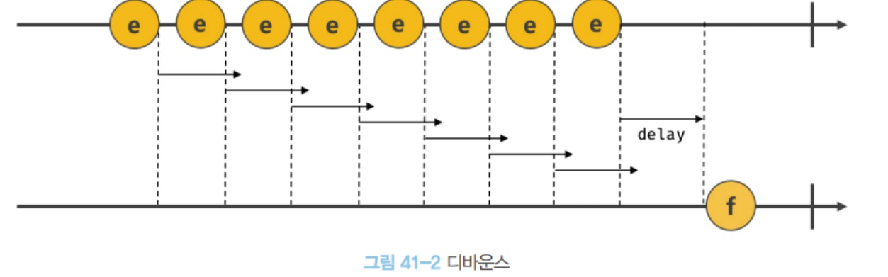
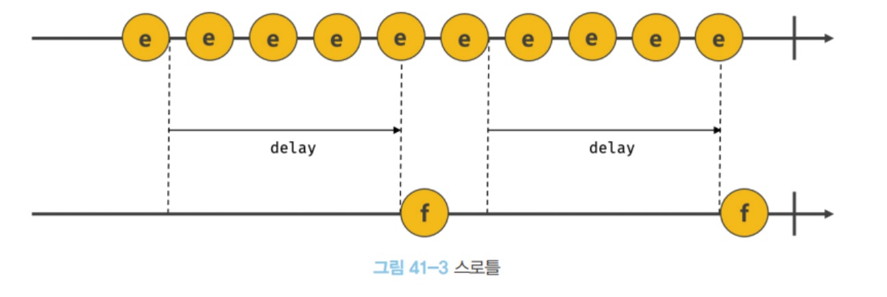

# 41장 타이머

## 41.1 호출 스케줄링

함수를 명시적으로 호출하면 함수가 즉시 실행된다. 명시적으로 호출하지 않고 일정 시간이 경과된 후에 호출되도록 예약하려면 타이머 함수를 사용하고, 이를 **호출 스케줄링**이라 한다.

타이머를 생성할 수 있는 함수로는 `setTimeout`과 `setInterval`, 타이머를 제거하는 `clearTimeout`과 `clearInterval`을 제공함. 타이머함수는 ECMA Script 사양에 정의된 빌트인 함수가 아니다.<br/>하지만 Node.js환경에서 모두 전역 객체의 메서드로서 타이머 함수를 제공한다. 즉, 타이머함수는 호스트 객체이다.

자바스크립트 엔진은 단 하나의 실행 컨텍스트 스택을 갖기 때문에 두 가지 이상의 태스크를 동시에 실행할 수 없다. 즉, **싱글 스레드**로 동작한다.이런 이유로 타이머 함수는 **비동기 처리 방식**으로 동작한다.

<br/><br/>

## 41.2 타이머 함수

### 41.2.1 setTimeout / clearTimeout

`setTimeout`은 두 번째 인수로 전달받은 시간으로 단 한번 동작하는 타이머를 생성한다. 첫 번쨰 인수로 전달받은 콜백 함수가 호출된다. 즉, `setTimeout`함수의 콜백 함수는 두 번쨰 인수로 전달받은 시간 이후 단 한 번 실행되도록 호출 스케줄링 된다.

```js
const timeoutId = setTimeout(func|code[, delay, param1, param2, ...]);
```

* func : 타이머가 만료된 뒤 호출될 콜백 함수.
  * 콜백 함수 대신 문자열로 전달할 수 있다. eval함수와 유사하며 권장하지는 않음.
* delay : 타이머 만료시간(ms단위)
  * 생략할 경우 0이 default
  * 4ms이하이면, 최소 지연시간 4ms가 지정된다.
* param : 호출 스케줄링된 콜백함수에 전달해야 할 인수가 존재하는 겨웅 3번째 인수로 전달할 수 있다.

`clearTimeout`함수는 호출 스케줄링을 취소한다.

<br/>

### 41.2.2 setInterval / clearInterval

`setInterval`은 두 번째 인수로 전달받은 시간으로 반복 동작하는 타이머를 생성한다. 타이머가 만료될 때 마다 첫 번째 인수로 받은 콜백 함수가 반복 호출된다. (타이머가 취소될 때 까지). 즉, `setInterval`함수의 콜백 함수는 두 번째 인수로 전달받은 시간이 경과할 때마다 반복 실행되도록 호출 스케줄링된다.

```js
const timeoutId = setInterval(func|code[, delay, param1, param2, ...])
```

`clearInterval`함수는 호출 스케줄링을 취소한다.

<br/><br/>

## 41.3 디바운스와 스로틀

scroll, resize, input, mousemove같은 이벤트는 짧은 시간 간격으로 연속해서 발생한다. 그렇기 때문에 과도하게 호출되어 성능에 문제를 일으킬 수 있다.

`디바운스`와 `스로틀`은 짧은 시간 간격으로 연속해서 발생하는 이벤트를 그룹화해서 과도한 이벤트 핸들러의 호출을 방지하는 프로그래밍 기법이다.

### 41.3.1 디바운스

`디바운스`는 짧은 시간 간격으로 이벤트가 연속해서 발생하면 이벤트 핸들러를 호출하지 않다가 일정 시간이 경과한 후 이벤트 핸들러가 한 번만 호출되도록 한다.

즉, 짧은 시간 간격으로 발생하는 이벤트를 그룹화하여 **마지막 한 번만 이벤트 핸들러가 호출되도록** 한다.

```html
<!DOCTYPE html>
<html>
<body>
  <input type="text">
  <div class="msg"></div>
  <script>
    const $input = document.querySelector('input');
    const $msg = document.querySelector('.msg');

    const debounce = (callback, delay) => {
      let timerId;
      // debounce 함수는 timerId를 기억하는 클로저를 반환한다.
      return event => {
        // delay가 경과하기 이전에 이벤트가 발생하면 이전 타이머를 취소하고
        // 새로운 타이머를 재설정한다.
        // 따라서 delay보다 짧은 간격으로 이벤트가 발생하면 callback은 호출되지 않는다.
        if (timerId) clearTimeout(timerId);
        timerId = setTimeout(callback, delay, event);
      };
    };

    // debounce 함수가 반환하는 클로저가 이벤트 핸들러로 등록된다.
    // 300ms보다 짧은 간격으로 input 이벤트가 발생하면 debounce 함수의 콜백 함수는
    // 호출되지 않다가 300ms 동안 input 이벤트가 더 이상 발생하면 한 번만 호출된다.
    $input.oninput = debounce(e => {
      $msg.textContent = e.target.value;
    }, 300);
  </script>
</body>
</html>
```

input의 이벤트는 사용자가 텍스트 입력 필드에 값을 입력할 때마다 연속해서 발생하는데, 이러한 경우 사용자가 입력을 완료하지 않아도 계속 요청이 전송될 것이다. 언제 입력이 완료되는지는 알 수없기 때문에 일정 시간 동안 텍스트 입력 필드에 값을 입력하지 않으면 입력이 완료된 것으로 간주한다.



디바운스는 `resize`이벤트 처리, input 입력에 대한 `입력 필드 자동 완성`, `버튼 중복 클릭 방지 처리`등에 유용하다.

<br/>

### 41.3.2 스로틀

`스로틀`은 짧은 시간 간격으로 이벤트가 연속해서 발생하더라도 일정 시간 간격으로 이벤트 핸들러가 최대 한 번만 호출되도록 한다. 즉, 스로틀은 짧은 시간 간격으로 연속해서 발생하는 이벤트를 그룹화해서 일정 시간 단위로 이벤트 핸들러가 호출되도록 호출 주기를 만든다.

```html
<!DOCTYPE html>
<html>
<head>
  <style>
    .container {
      width: 300px;
      height: 300px;
      background-color: rebeccapurple;
      overflow: scroll;
    }

    .content {
      width: 300px;
      height: 1000vh;
    }
  </style>
</head>
<body>
  <div class="container">
    <div class="content"></div>
  </div>
  <div>
    일반 이벤트 핸들러가 scroll 이벤트를 처리한 횟수:
    <span class="normal-count">0</span>
  </div>
  <div>
    스로틀 이벤트 핸들러가 scroll 이벤트를 처리한 횟수:
    <span class="throttle-count">0</span>
  </div>

  <script>
    const $container = document.querySelector('.container');
    const $normalCount = document.querySelector('.normal-count');
    const $throttleCount = document.querySelector('.throttle-count');

    const throttle = (callback, delay) => {
      let timerId;
      // throttle 함수는 timerId를 기억하는 클로저를 반환한다.
      return event => {
        // delay가 경과하기 이전에 이벤트가 발생하면 아무것도 하지 않다가
        // delay가 경과했을 때 이벤트가 발생하면 새로운 타이머를 재설정한다.
        // 따라서 delay 간격으로 callback이 호출된다.
        if (timerId) return;
        timerId = setTimeout(() => {
          callback(event);
          timerId = null;
        }, delay, event);
      };
    };

    let normalCount = 0;
    $container.addEventListener('scroll', () => {
      $normalCount.textContent = ++normalCount;
    });

    let throttleCount = 0;
    // throttle 함수가 반환하는 클로저가 이벤트 핸들러로 등록된다.
    $container.addEventListener('scroll', throttle(() => {
      $throttleCount.textContent = ++throttleCount;
    }, 100));
  </script>
</body>
</html>
```

scroll처럼 짧은 시간 간격으로 연속해서 발생하는 이벤트의 과도한 이벤트 핸들러 호출을 방지하기 위해 throttle함수는 이벤트를 그룹화해서 일정 시간 단위로 이벤트 핸들러가 호출되도록 호출 주기를 만든다.

throttle은 전달한 시간이 경과하기 이전에 이벤트가 발생하면 아무것도 하지 않다가 delay시간이 경과했을 떄 이벤트가 발생하면 콜백 함수를 호출하고 새로운 타이머를 재설정한다. 따라서 **delay시간 간격으로 콜백함수가 호출**된다.



무한스크롤  UI구현 등에 유용하게 사용된다.