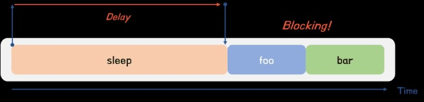
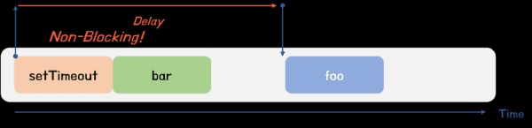
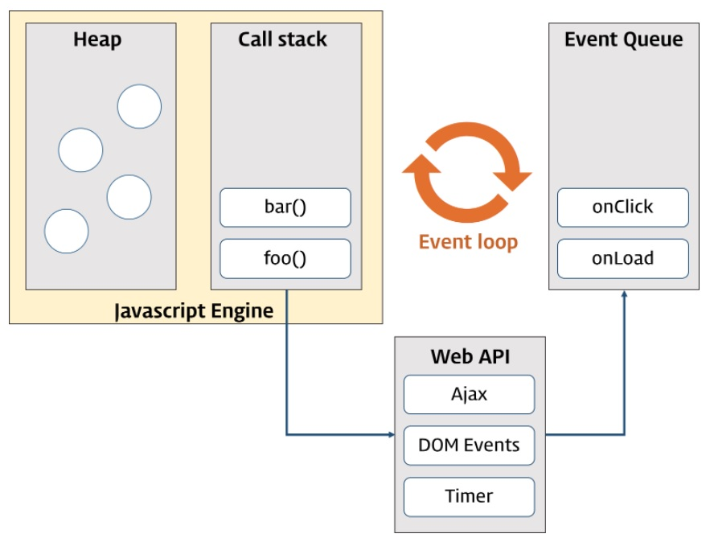

# 42장 비동기 프로그래밍

## 42.1 동기 처리와 비동기 처리

23장 "실행 컨텍스트"에서 살펴본 바와 같이 함수를 실행되려면

1. 함수를 호출하면 **함수 코드가 평가**되어 
2. 함수 실행 컨텍스트가 실행 컨텍스트 스택에 푸시되어야 한다.

다시 말해, 실행 컨텍스트 스택에 함수 실행 컨텍스트가 푸시되는 것은 함수 실행의 시작을 의미한다. 함수가 호출된 순서대로 순차적으로 실행되는 이유는 함수가 호출된 순서대로 함수 실행 컨텍스트가 실행 컨텍스트 스택에 푸시되기 때문이다.(함수의 실행 순서는 실행 컨텍스트 스택으로 관리한다.)

<br/>

**자바스크립트 엔진은 단 하나의 실행 컨텍스트 스택을 갖는다.**<br/>이는 함수를 실행할 수 있는 창구가 단 하나이며, 동시에 2개 이상의 함수를 실행할 수 없다는 것을 의미한다.

실행 컨텍스트 스택의 최상위 요소인 **"실행 중인 실행 컨텍스트"**를 제외한 모든 실행 컨텍스트는 모두 실행 대기 중인 태스크들 이다. 대기 중인 태스크들은 현재 실행 중인 실행 컨텍스트가 팝되어 실행 컨텍스트 스택에서 제고되면, 다시 말해 현재 실행중인 함수가 종료하면 비로소 실행되기 시작한다.

<br/>

### 동기 처리

자바스크립트 엔진은 한 번에 하나의 태스크만 실행할 수 있는 **싱글 스레드** 방식으로 동작한다.

`싱글 스레드`방식은 한 번에 하나의 태스크만 실행할 수 있기 때문에 처리에 시간이 걸리는 태스크를 시랳ㅇ하는 경우 **블로킹(작업 중단)**이 발생한다.

```js
// sleep 함수는 일정 시간(delay)이 경과한 이후에 콜백 함수(func)를 호출한다.
function sleep(func, delay) {
  // Date.now()는 현재 시간을 숫자(ms)로 반환한다.("30.2.1. Date.now" 참고)
  const delayUntil = Date.now() + delay;

  // 현재 시간(Date.now())에 delay를 더한 delayUntil이 현재 시간보다 작으면 계속 반복한다.
  while (Date.now() < delayUntil);
  // 일정 시간(delay)이 경과한 이후에 콜백 함수(func)를 호출한다.
  func();
}

function foo() {
  console.log('foo');
}

function bar() {
  console.log('bar');
}

// sleep 함수는 3초 이상 실행된다..
sleep(foo, 3 * 1000);
// bar 함수는 sleep 함수의 실행이 종료된 이후에 호출되므로 3초 이상 블로킹된다.
bar();
// (3초 경과 후) foo 호출 -> bar 호출
```

sleep함수는 3초 후에 foo함수를 호출한다. 이때 bar 함수는 sleep함수의 실행이 종료된 이후에 호출되므로 3초 이상(foo함수 실행시간 + 3초) 호출되지 못하고 블로킹(작업 중단)된다.

이처럼 현재 실행 중인 태스크가 종료할 떄 까지 다음에 실행될 태스크가 대기하는 방식을 **동기처리** 라고한다.

태스크를 순서대로 하나씩 처리하므로 실행 순서가 보장된다는 장점이 있지만, 앞선 태스크가 종료할 때까지 이후 태스크들이 블로킹되는 단점이 있다.



### 비동기 처리

앞의 예제를 setTimeout을 이용해 수정해보자.

```js
function foo() {
  console.log('foo');
}

function bar() {
  console.log('bar');
}

// 타이머 함수 setTimeout은 일정 시간이 경과한 이후에 콜백 함수 foo를 호출한다.
// 타이머 함수 setTimeout은 bar 함수를 블로킹하지 않는다.
setTimeout(foo, 3 * 1000);
bar();
// bar 호출 -> (3초 경과 후) foo 호출
```

setTimeout함수는 앞서 살펴본 sleep함수와 유사하게 일정 시간이 경과한 이후에 콜백 함수를 호출하지만 setTimeout함수 이후의 태스크를 블로킹하지 않고 곧바로 실행한다. 이처럼 현재 실행중인 태스크가 종료되지 않은 상태라 해도 다음 태스크를 곧바로 실행하는 방식을 **비동기 처리** 라고한다.



비동기 처리 방식은 현재 실행 중인 태스크가 종료되지 않은 상태라 해도 다음 태스크를 곧바로 실행하므로 블로킹이 발생하지 않는다는 장점이 잇지만, 태스크의 실행 순서가 보장되지 않는 단점이 있다.

<br/>

비동기 처리를 수행하는 비동기 함수는 전통적으로 콜백 패턴을 사용한다. 비동기 처리를 위한 콜백 패턴은 콜백 헬을 발생시켜 가독성을 나쁘게 하고, 비동기 처리 중 발생한 에러의 예외 처리가 곤란하며, 여러 개의 비동기 처리를 한 번에 처리하는데도 한계가 있다.

타이머 함수인 `setTimeout`, `setInterval` `HTTP요청`, `이벤트 핸들러`는 **비동기 처리 방식**으로 동작한다.

<br/><br/>

## 42.2 이벤트 루프와 태스크 큐

싱글 스레드 방식은 한 번에 하나의 태스크만 처리할 수 있다. 하지만 브라우저는 한 번에 많은 태스크가 동시에 처리되는 것처럼 느껴진다.

HTML요소가 애니메이션 효과를 통해 움직이면서 이벤트를 처리하기도 하고, HTTP요청을 통해 서버로부터 데이터를 가지고 오면서 렌더링하듯이 자바스크립트의 동시성을 지원하는 것이 **이벤트 루프**이다.

이벤트 루프는 브라우저에 내장된 기능 중 하나로 자바스크립트 엔진들 대부분은 크게 2개의 영역으로 구분할 수 있다.



#### 🔸 콜스택과 힙

* 콜스택
  * 소스코드 평가 과정에서 실행된 실행 컨텍스트가 추가되고 제거되는 스택 자료구조인 실행 컨텍스트 스택이 바로 콜 스택이다.
  * js엔진은 단 하나의 콜 스택을 사용하기 때문에 최상위 실행 컨텍스트가 종료되어 콜 스택에서 제거되기 전까지는 다른 어떤 태스크도 실행되지 않는다.
* 힙
  * 힙은 객체가 저장되는 메모리 공간으로, 콜 스택의 요소인 실행 컨텍스트는 힙에 저장된 객체를 참조한다.
  * 메모리에 값을 저장하려면 먼저 값의 저장할 메모리 공간의 크기를 결정해야 한다. 원시 값과는 달리 크기가 정해져 있지 않으므로 할당해야 할 메모리 공간의 크기를 런타임에 결정(동적 할당)해야 한다. 따라서 객체가 저장되는 메모리 공간인 힙은 구조화 되어 있지 않다는 특징이 있다.

콜 스택과 힙으로 구성되어 있는 js엔진은 단순히 태스크가 요청되면 콜 스택을 통해 요청된 작업을 순차적으로 실행할 뿐이다. 비동기 처리에서 소스코드의 평가와 실행을 제외한 모든 처리는 자바스크립트 엔진을 구동하는 환경인 브라우저 또는 node.js가 담당한다.

#### 🔸 태스크 큐와 이벤트 루프

* 태스크 큐 (task queue / event queue / callback queue)
  * setTimeout이나 setInterval 같은 **비동기 함수의 콜백 함수 또는 이벤트 핸들러가 일시적으로 보관되는 영역**이다. 
  * 프로미스의 후속 처리 메서드의 콜백 함수가 일시적으로 보관되는 마이크로태스크 큐도 존재한다.
* 이벤트 루프
  * 이벤트 루프는 **현재 실행 중인 실행 컨텍스트가 있는지, 태스크 큐에 대기중인 함수가 있는지 반복해서 확인**한다.
  * 콜스택이 비어있고, 태스크 큐에 대기 중인 함수가 있다면 순차적으로(FIFO) 태스크 큐에 대기 중인 함수를 콜 스택으로 이동 시킨다.

<br/>

```js
function foo(){
  console.log('foo')
}

function bar(){
  console.log('bar')
}

setTimeout(foo, 0)
bar();
```

비동기 함수인 setTimeout의 콜백 함수는 태스크 큐에 푸시되어 대기하다가 콜 스택이 비게되면, 비로소 콜 스택에 푸시되어 실행된다. (전역 코드 및 명시적으로 호출된 함수가 모두 종료하면)

❗ 싱글 스레드 방식으로 동작하는 것은 브라우저가 아닌 자바스크립트 엔진이다. => 브라우저는 멀티 스레드, 엔진은 싱글 스레드 방식으로 동작한다.

브라우저는 자바 스크립트 엔진외에도 렌더링 엔진과 WebAPI를 제공한다. `Web API`는 ECMAScript 사양에 정의된 함수가 아니라 브라우저에서 제공하는 API이고, DOM API와 타이머함수, HTTP요청같은 비동기 처리도 포함한다. 예제처럼, 브라우저의 WebAPI인 setTimeout함수가 호출되면 자바스크립트 엔진의 콜 스택에 푸시되어 실행된다.

하지만 setTmeout 함수의 2가지 기능인 타이머 설정과 만료하면 콜백 함수를 태스크 큐에 등록하는 처리는 자바스크립트 엔진이 아니라 브라우저가 실행한다. ㅇ