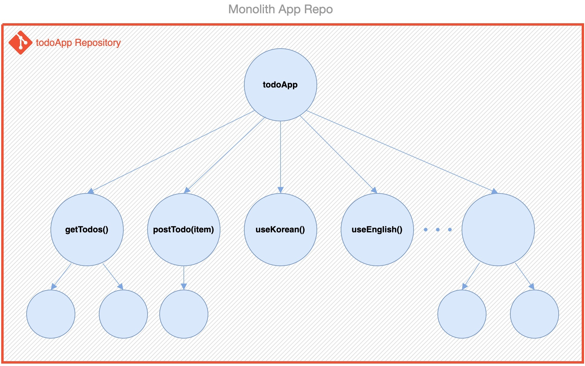
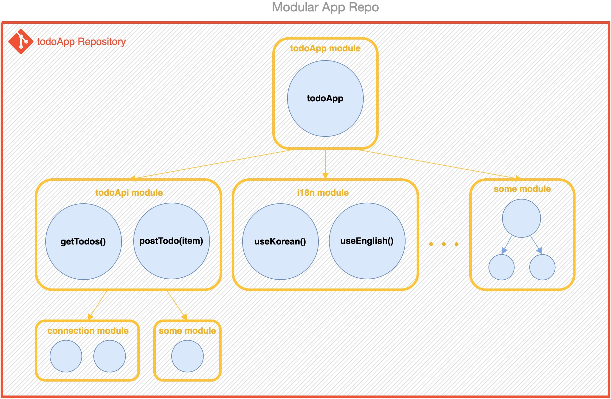
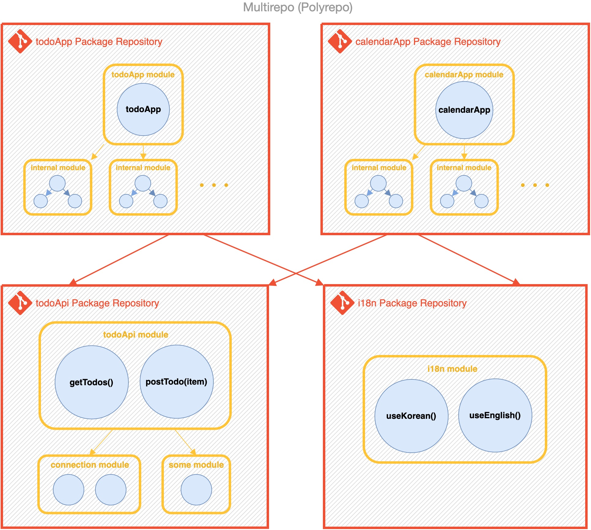
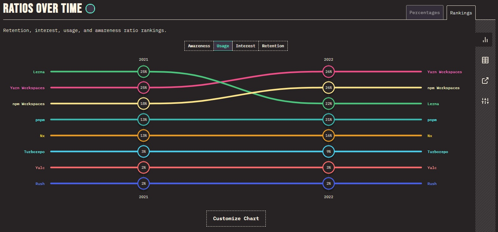

# 🐳 모노 레포 - 개념

📘 [Naver D2 - Mono Repo](https://d2.naver.com/helloworld/0923884)의 글을 읽어보고, 정리한 내용입니다 :)

사용된 이미지는 위 주소의 블로그에 작성된 이미지와 https://2022.stateofjs.com/en-US/libraries/monorepo-tools/의 차트이미지를 캡처하여 사용하였습니다.

## 🌏 등장 배경

### 👉 위키에서

📘 [Wiki - Monorepo](https://en.wikipedia.org/wiki/Monorepo)

위키에서 모노레포에 대한 정의를 잠시 살펴보자. 

버전 관리 시스템에서 mono는 단일, repo는 저장소를 의미한다. 모노레포는 **여러 프로젝트의 코드가 동일한 저장소에 저장되는 소프트웨어 개발 전략**입니다.

**장점**

- 코드 재사용 용이성
- 단순화된 종속성 관리
- 원자적 커밋 (Atomic Commit) : <br/>함께 동작하는 프로젝트가 별도의 저장소에 포함되어 있는 경우 릴리스는 한 프로젝트의 어떤 버전이 다른 프로젝트와 작동하는지 동기화 해야하는데, 큰 프로젝트에서는 종속성 간의 호환 가능한 버전을 관리하는 것이 종속성 지옥이 될 수 있다.
- 대규모 코드 리팩토링
- 팀간 협업

**단점**

* 버전 정보 손실
* 프로젝트별 액세스 제어 부족
* 기본적으로 더 많은 저장용량이 필요.

<br/>

### 👉 모놀리식 애플리케이션의 한계

"*소프트웨어 엔지니어링에서 모놀리식 애플리케이션은 모듈화 없이 설계된 소프트웨어 애플리케이션을 말한다.*"



네이버 같은 거대 서비스에서 소스코드가 모듈화 없이 1개 프로젝트가 된다면, 코드가 서로 직접적으로 의존하며 단 하나의 버전으로 관리되면서 관심 분리가 어려워지고, 설계, 리팩터링, 배포 등 **매번 거대한 단위로 처리해야 하므로 개발상 많은 제약과 비효율**이 있을 것이다.

<br/>

### 👉 모듈화와 재사용성

이런 모놀리식 구조의 한계는 모듈화를 통해 해결할 수 있다. 

로직의 일부를 재사용할 수 있도록 지원하고, 전체 교체없이 애플리케이션의 일부를 수정 또는 교체할 수 있게 해 유지 관리를 용이하게 한다.



이렇게 만든 모듈이 **다른 애플리케이션에도 사용하기 위해 모듈을 위한 독자적인 저장소에 위치**시켜 관리하기 쉽게 할 수 있다. 이 구조가 바로 **멀티레포**이다.

<br/>

### 👉멀티레포 (폴리레포)

앞에서 분리된 각 모듈은 멀티레포 구조에서 고유한 저장소가 있는 독자적 프로젝트가 된다.<br/> 각 프로젝트는 자율성이 높으며 독립적인 개발, 린트, 테스트, 빌드, 게시, 배포 파이프라인이 존재한다.

**팀의 자율성**이란 큰 이유 때문에 이 방식을 선호하며, 팀은 애플리케이션 개발의 라이프사이클을 스스로 결정하기를 원한다.

하지만 이 **자율성은 고립(isolation)에 의해 제공되고 고립은 협업을 방해한다**.



<br/>

### 👉 멀티레포의 문제

#### 🔸번거로운 프로젝트 생성

새로운 공유 패키지를 생성할 때마다 `저장소 생성 > 커미터 추가 > 개발 환경 구축 > CI/CD 구축 > 빌드 > 패키지 저장소에 publish`과정을 거쳐야한다.

#### 🔸 패키지의 중복 코드 가능성

각 프로젝트에서 공통 구성 요소를 자체적으로 작성하면, 초기 시간은 아끼지만 보안 및 품질 관리 부담을 증가시킨다.

#### 🔸 관리 포인트 증가

늘어난 프로젝트 저장소의 수만큼 관리포인트가 늘어나고, 개발, 린트, 테스트, 빌드, 게시등의 과정이 저장소 수만큼 늘어난다.

#### 🔸 일관성 없는 개발자 경험(DX)

각 프로젝트는 해당 과정에서 고유한 명령 집합을 사용해 불일치가 일어 날 수 있다. A repo는 `npm run dev`, B repo는 `npm run serve` 이런식으로 차이가 있을 수 있다.

#### 🔸 다른 패키지의 변경 사항 파악

관련 패키지의 변화를 계속 지켜보거나 통지 받지 않는 이상 파악이 어렵다.

#### 🔸 교차 저장소의 리팩터링 비용

리팩터링된 각 패키지의 버전 관리또한 어렵다.

<br/><br/>

### 

## 🌏 2. 모노레포가 해결하는 문제

### 👉 모노레포의 특징

모노레포구조는 2개 이상의 프로젝트가 동일한 저장소에 저장되는 소프트웨어 개발 전략이다.

앞서 분리된 모듈들은 이제 여전히 독자 프로젝트로 존재하지만 같은 저장소를 사용하게 된다.


모노레포에서 가장 중요한 특징 중 하나는 바로 **프로젝트간의 관계**이다.

단순히 여러 프로젝트가 하나의 저장소를 사용하는게 아니라, **프로젝트 사이에 의존성이 존재하거나 같은 제품군이거나 하는 정의된 관계가 존재**한다. `모노레포 관리 도구`는 이런 관계를 효율적으로 관리해주는 도구라 할 수 있다.

<br/>

### 👉 모노레포가 해결되는 멀티레포의 문제

#### 🔸 더 쉬운 프로젝트 생성

기존 DevOps를 이용하기 때문에 새 프로젝트 생성에 대한 오버헤드가 없다..

#### 🔸 더 쉬운 의존성 관리

의존성 패키지가 같은 저장소에 있기 때문에 지정된 패키지를 npm registry가은 곳에 publish할 필요가 있다.

#### 🔸 단일화된 관리 포인트

개발환경 및 DevOps에 대한 업데이트를 한 번에 반영할 수 있다.

#### 🔸 일관된 개발자 경험 제공

다른 팀의 애플리케이션에 자신 있게 기여하고 변경 사항이 안전한지 확인할 수 있다.

#### 🔸 프로젝트들에 걸친 원자적 커밋

커밋할 때마다 모든 것이 함꼐 작동한다. 변경 사항의 영향을 받는 조직에서 쉽게 변화를 확인할 수 있다.

#### 🔸 서로 의존하는 저장소들의 리팩터링 비용 감소

대규모 변경을 훨씬 간단하게 만든다. 100개의 라이브러리로 만든 10개의 앱을 리팩터링하고 변경을 커밋하기 전에 모두 작동하는지 확인할 수 있다.

> **그 밖의 모노레포의 특징**
>
> 테스트 및 빌드 범위 최소화
>
> 소스 변경 시 모든 프로젝트를 다시 빌드하거나 다시 테스트하지 않는다. 대신 변경 사항의 영향을 받는 프로젝트만 다시 테스트하고 빌드한다.

 <br/>

### 👉모노레포에 대한 오해 Q&A

#### 🔸 Q. 다른 팀이 내가 모르는 사이에 내 코드를 변경하면?

A : Github에서는 [CODEOWNERS](https://docs.github.com/en/repositories/managing-your-repositorys-settings-and-features/customizing-your-repository/about-code-owners)와 같은 기능을 사용하여 폴더 기반으로 소유권을 구성할 수 있다.

```text
@global-owner1 @global-owner2 ## 이 저장소에 대한 모든 PR을 소유자에게 리뷰받아야 머지할 수 있다.
packages/todo-api/* @john @jane ## todo-api 경로는 john과 jane에게 리뷰받아야 한다.  
packages/i18n/* @michael ## i18n은 michael에게 리뷰받아야 한다.  
```

#### 🔸 Q. 모노레포가 멀티레포보다 항상 더 나은 방법인가?

A : 멀티레포의 단점이 모노레포의 장점이고, 장단점이 교차하기 때문에 적절하게 사용해야 한다.<br/>모노레포의 핵심적인 특징은 프로젝트 사이의 관계이다.

#### 🔸 그렇담 언제 쓰는게 좋을까?

- 유사한 제품의 집합
- 여러 프로젝트의 변화를 한눈에 파악해야 할 때
- 호스트 애플리케이션을 플러그인 등으로 확장할 때
- 공통 기능을 재사용하는 관련된 프로젝트의 집합
- 유사한 DevOps로 구성된 프로젝트의 집합

<br/><br/>

## 🌏 모노레포를 구축할 때 고려할 측면

모노레포를 구축하려고 할 때 **관리 용이성**, **속도** 그리고 **프로젝트 구조 관리** 측면에서 다음과 같은 사항을 고려해야 한다.

❗ 분류 기준은 [Monorepo features](https://monorepo.tools/#monorepo-features)을 참고.

<br/>

### 👉 관리 측면

* **코드 공유**: 서로 다른 프로젝트 간에 쉽게 소스 코드를 공유
* **일관성 있는 도구**: 서로 다른 프로젝트들(심지어 서로 다른 프레임워크를 사용하더라도)에서 일관된 개발 경험을 제공
* **스케폴딩**: 새로운 프로젝트를 생성할 때 초기 코드를 쉽게 생성
* **프로젝트 제약 및 가시성(visibility)**: 저장소 내에서 의존 관계를 제한하는 규칙 정의 지원. 예를 들어, 일부 프로젝트를 팀 전용으로 표시하거나 특정 프레임워크을 사용 중임을 기술.

### 👉 속도 측면

* **로컬 캐싱**: 같은 머신에서 같은 것을 두 번 빌드하거나 테스트하지 않음
* **분산 캐싱**: 다양한 환경에서 캐시 아티팩트를 공유. 즉, 조직 단위로 여러 CI 환경에 걸쳐 같은 것을 두 번 빌드, 테스트하지 않음
* **로컬 작업 오케스트레이션**: 빌드 및 테스트 등의 작업을 순서에 맞게 병렬로 실행
* **분산 작업 실행**: 단일 시스템에서 실행되어 여러 시스템에 명령을 전달
* **변화에 영향을 받는 프로젝트 감지**: 변경의 영향을 받을 수 있는 항목을 결정하여 영향을 받는 프로젝트만 빌드/테스트

### 👉 구조 파악 측면

- **워크스페이스 분석**: 추가 구성 없이 주어진 워크 스페이스의 의존성 관계를 분석
- **의존성 그래프 시각화**: 프로젝트 및 작업 간의 종속 관계를 시각화

<br/><br/>

## 🌏 모노레포 구축을 도와주는 도구

[2022.stateofis.com](https://2022.stateofjs.com/en-US/libraries/monorepo-tools/)기준으로 인기있는 도구를 살펴보자. (작성일인 2024.05기준으로 2022가 가장 최신)

### 👉 얼마나 사용되는가?

2022에는 `yarn, npm, lerna, pnpm`순서로 2021과 비교했을때 lerna의 사용도가 내려간 것을 볼 수 있다.



<br/>

### 🌏 요약

**모노레포**란 **여러 프로젝트의 코드가 동일한 저장소에 저장되는 소프트웨어 개발 전략**이다.

모듈화 없이 설계된 소프트웨어 애플리케이션의 경우, 변경사항에 대해 매번 거대한 단위로 처리해야해 큰 제약과 비효율이 발생한다.

이러한 문제를 모듈화를 통해 해결하고, 다른 애플리케이션에도 사용하기 위해 모듈을 위한 독자적인 저장소에 위치시켜 관리하기 쉽게 할 수 있게 하는 구조인 **멀티레포**가 등장.

모듈별로 자율성을 얻었지만, 그에 따라 고립되어 있기 때문에 관리포인트가 증가하고, 명령어 불일치등의 DX문제, 관련 패키지에 대해 다른 패키지의 변경 사항을 파악하기 어려움 등의 문제가 있다.

이를 **모노레포**에서는 동일한 저장소에 저장하여 독자적인 프로젝트로 존재하지만, 같은 저장소를 사용하게끔 하여 해결할 수 있다. 여기서 단순히 여러 프로젝트를 모은게 아니라 프로젝트간에 의존서잉 존재하거나 같은 제품군이거나 하는 정의된 관계가 존재해야한다. 즉, **프로젝트간의 관계가 중요**하다.

**주의할 점**은 모노레포가 항상 멀티레포보다 나은 방법은 아니며, 멀티레포의 단점이 모노레포의 장점이고, 서로 장단점이 교차한다는 것을 명심해야한다.

유사한 제품의 집합, 호스트 애플리케이션을 플로그인 등으로 확장할 때,  공통 기능을 재사용하거나 유사한 DevOps로 구성된 프로젝트의 집합에서 사용하는 것이 좋다.
