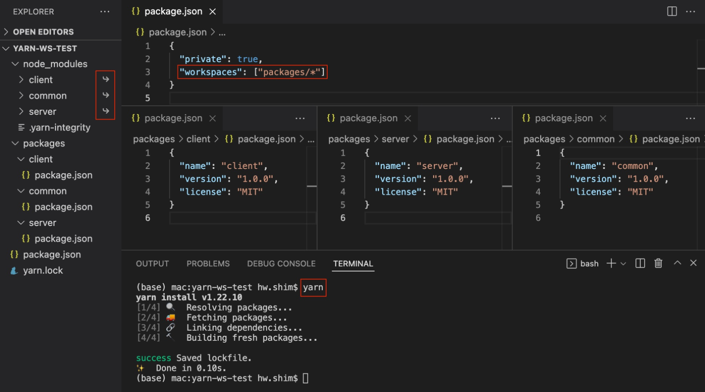
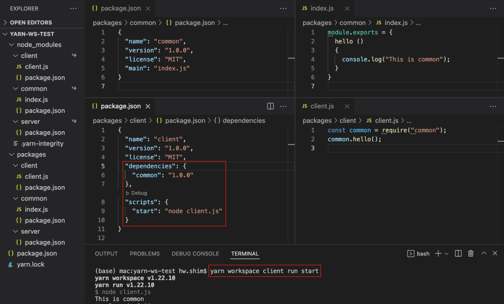
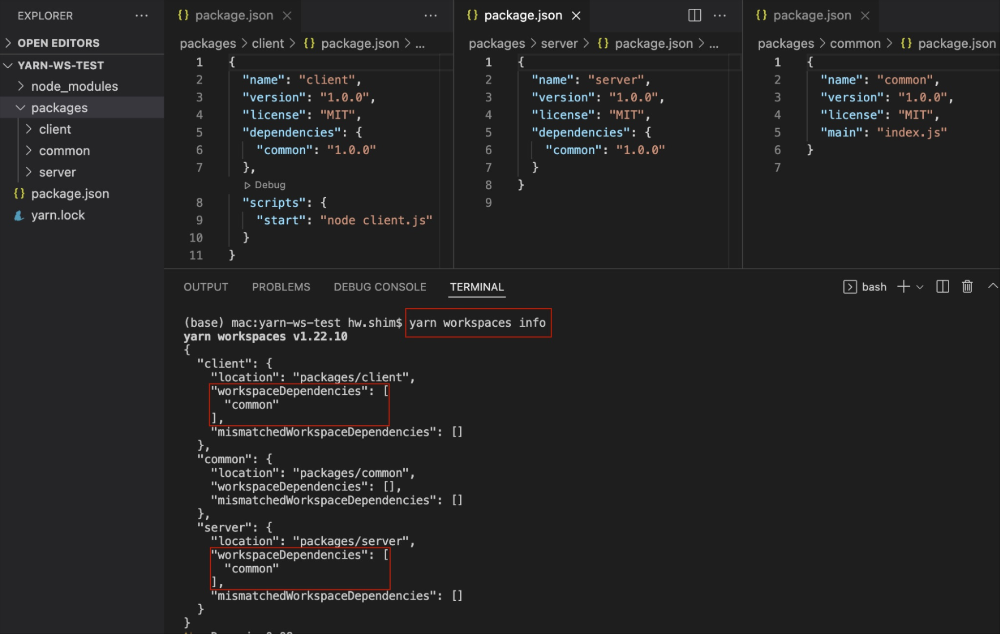
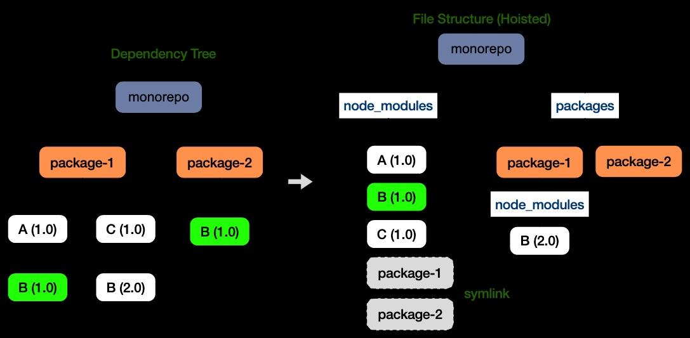
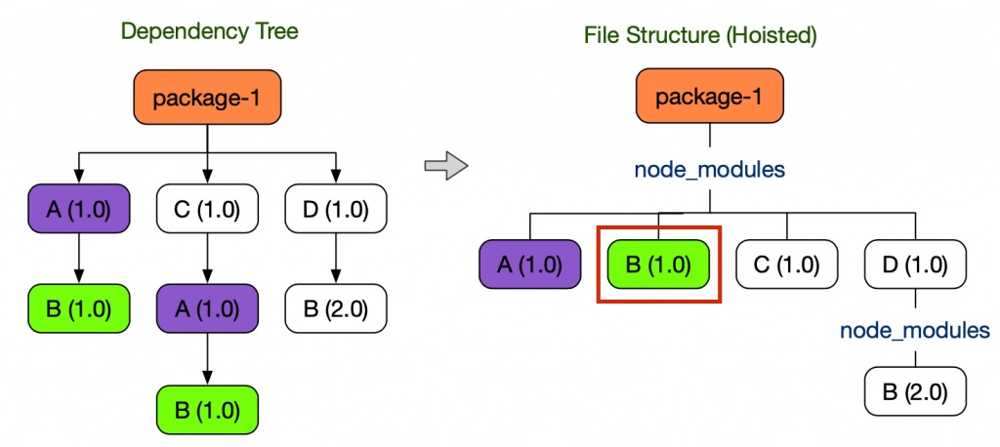
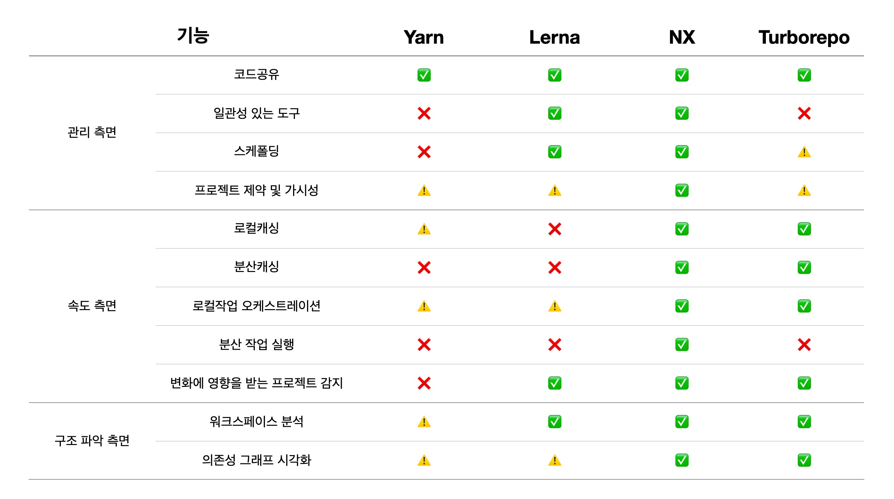

#  🐳 모노레포 - 개발 도구

📘 [Naver D2 - Mono Repo](https://d2.naver.com/helloworld/7553804)의 글을 읽어보고, 정리한 내용입니다 :)<br/>(해당 글에서 Yarn, Lerna, Nx, Turborepo에 대해 자세히 알려주고 있다. 여기서 Yarn에 대해서만 알아보았습니다.)

정리하며 사용된 이미지는 위 블로그에 작성된 이미지를 사용하였습니다.


## 🌏 Yarn

### 👉 Yarn 1.x

주소 : https://classic.yarnpkg.com/en/docs/cli/

(위 주소에서 명령어들을 확인할 수 있다.)

Yarn(1.x) 또는 npm(7.x)의 workspaces필드를 사용해 간단히 모노레포를 구성할 수 있다.

`yarn link` 또는 `npm link`기능을 선언적으로 사용하는 것으로 node_modules디렉터리에 workspace에 대한 심볼릭 링크가 생성된다. 이를 통해 하나의 저장소에 있는 여러 프로젝트가 서로 쉽게 상호 참조할 수 있다.

#### 🔸 용어

* project : 저장소
  * 하나 이상의 worktree 포함
  * 최소 한 개의 workspace(즉, 루트 workspace)존재
* workspace : 모노레포 패키지
* worktree : 자식 workspace를 갖는 workspace

#### 🔸 worktree 선언

worktree를 구성하는 workspace의 위치를 glob패턴의 배열을 나타낸다.

```json
{
    "private": true, // 1.x에서는 필수지만, 2.x부터는 필수가 아니다.
    "workspaces": ["packages/*"]
}
```

#### 🔸workspace 추가



 client, server, common 3개의 workspace를 추가하고, 루트 경로에서 yarn명령어를 실행해 루트 경로에 node_modules디렉터리에 workspace들에 대한 심볼릭 링크가 생긴다.

#### 🔸workspace에 대한 명령 실행

[특정 workspace에 정의된 스크립트를 실행](https://classic.yarnpkg.com/en/docs/cli/workspace)

```shell
yarn workspace <WORKSPACE_NAME> <COMMAND_NAME>
```

#### 🔸 workspace를 의존성으로 추가

client가 common패키지를 의존하게 하려면 package.json에 의존성을 명시하거나 바로 위에서 설명한 명령을 이용하면 된다.

```shell
yarn workspace client add common@1.0.0  
```

npm레지스트리에 publish된 common이란 이름의 패키지가 있어도 **의존성 버전을 충족한다면, 로컬에 존재하는 common workspace를 우선하여 설치**한다.



<br/>

client에서 common의존성을 잘부르는지 확인해보자.

```shell
yarn workspace client run start
```

#### 🔸 workspace를 의존 관계 확인

```shell
yarn workspace info
```

> ❗ 2.x부터는 list명령어를 사용한다.
>
> ```shell 
> yarn workspace list
> ```



#### 🔸 모든 workspace에 대해 명령 실행

`yarn workspaces run \`를 사용해 모든 workspace에 대해 명령을 실행할 수 있다. 아래 명령어는 모든 workspace를 순회하며 test명령어를 실행한다.

```shell
yarn workspaces run test
```

> ❗ 2.x부터는 `yarn workspaces foreach \`를 사용한다.

#### 🔸 루트 프로젝트에 의존성 추가

workspace가 아니라 루트 프로젝트에 의존성을 추가하려면 다음 명령을 실행한다.

```shell
yarn add <PACKAGE_NAME> -W
```

#### 🔸 호이스팅(의존성 끌어올리기)

npm yarn등은 중복 의존성 설치를 방지하기 위해 호이스팅을 사용한다.



일부 모듈 로더는 심볼릭 링크를 지원하지않아 B(2.0)을 탐색할 수 없다. 이땐 `nohoist`필드를 사용한다.

```json
{
    "workspaces": {
        "packages": ["packages/*"],
        "nohoist": [ "**/react-native" ]
    }
}
```

<br/><br/>

### 👉 Yarn Berry (2.x, 3.x)

주소 : https://yarnpkg.com/cli

Yarn workspace를 도입하려 할 때 성능면에서 Yarn Berry를 검토해 볼 수 있다.

> Yarn Berry
>
> 1. `Yarn Berry`는 yarn의 두 번째 버전으로 2018년 9월 yarn RFC 저장소에서 시작해 1.x의 주요개발자인 Mael Nison에 의해 Typescript로 개발되고 
> 2. 2020년 1월에 정식 버전이 출시 되었다.
> 3. Yarn 1.x는 v1.22.17에서 코드가 프리징 되었고
> 4. https://github.com/yarnpkg/berry에서 2022.03.09 기준 v3.2.0이 출시 되었다.
> 5. 2024.05.31기준 현재 4.1.0까지 나왔으며, 4.0버전에서 Node.js 16이 이제 지원 종료됨에 따라 18.12보다 낮은 Node.js버전에 대한 지원을 중단함. (Change log의 마지막 업데이트가 3주전)

#### 🔸node_modules의 문제점

* 의존성 탐색 알고리즘의 비효율
  * node.js에서 require()를 실행하면 모듈을 찾을 때까지 상위 node_modules디렉터리를 순회한다. 이때 느린 디스크I/O동작이 경로의 깊이만큼 발생한다.
* 저장 공간과 설치 시간
  * node_modules 디렉터리는 흔히 매우 큰 공간을 필요로하고, 설치도 오래걸린다.
* 유령 의존성 (phantom dependency)
  * 의존성 중복 방지를 위해 `호이스팅 기법`을 사용하는데 **의도치 않은 side effect를 발생**시킨다.

> **호이스팅 기법의 Side Effect**
>
> **package-1은 B(1.0)을 설치한 적 없지만 require('B')가 동작한다.** <br/>require('B')를 사용하는 경우 B(1.0)을 의존하던 패키지를 제거하면 B를 찾지 못하는 오류가 발생한다.
>
> 

#### 🔸 Yarn Berry의 해결 방법 PnP

어떤 프로젝트를 구성하는 의존성은 결정적이다. **node_modules에 패키지 파일을 저장하는 대신 패키지의 압축파일을 `.yarn/cache`폴더에 수평적으로 저장하는 방식으로 위 문제를 해결**했다. 이 방식을 **PnP(Plug 'n' Play)**라 부른다.

#### 🔸 PnP로 얻는것

* 빠른 의존성 검색
  * `.yarn/cache`에 수평적으로 존재하므로 모든 패키지에 대한 접근 시간이 O(1)이 된다. 
  * 그 결과 `require()`에 소요되는 시간이 크게 단축된다.
* 빠른 설치
  * 압축 파일 단위로 설치되기 때문에 의존성을 구성하는 파일의 수가 절대적으로 감소한다.
  * `zero-install전략`을 사용하면 아예 설치 과정을 생략할 수 있다.
* 유령 의존성 방지
  * 호이스팅을 사용하지 않아 의도하지 않은 의존성이 발생하지 않는다.

<br>

#### 🔸 zero-install 전략

주소 : https://github.com/yarnpkg/berry/tree/master/.yarn/cache

**zero-install전략**은 **하나의 압축 파일로 의존성을 관리하고 이 파일을 git으로 관리하면 설치 과정을 제거하는 전략**을 말한다.

<br/>

**장점**

* 다른 브랜치에서 새로운 의존성이 설치되었을 때 설치 과정 없이 바로 사용할 수 있다.
* CI에서 의존성 설치에 드는 시간을 크게 줄일 수 있다.

#### 🔸 오프라인 미러 (오프라인 캐시)

주소 : https://yarnpkg.com/features/caching

(위 주소는 블로그의 링크주소가 사라져, yarnkpkg의 캐싱전략에 대한 주소. 문서의 내용상 offline mirror부분이 이 내용인듯 함)

네트워크가 다운되었을 때도 Yarn이 제대로 작동하도록 하는 기능이다.

#### 🔸 사용 방법

```shell
$ npm install -g yarn
$ cd ../path/to/your-package
$ yarn init -y
$ yarn set version berry
```

```shell
# 버전확인
yarn -v
```

의존성을 추가하면, `.yarn/cache`경로에 추가된다.

❗ .pnp.cjs파일에는 모든 의존성에 대한 메타정보 (zip경로, 의존성)와 함께 ZipFS에 대한 처리 코드가 들어있다.

따라서 Berry 기반의 프로젝트는 `node src/main.js`와 같은 명령으로는 실행할 수 없고 `yarn node src/main.js`와 같이 Yarn을 통해서 실행

```json
{
    "scripts": {
        "start": "node src/main.js"
    }
}
```

<br/>

## 🌏 마치며

**Yarn, Lerna, Nx, Turborepo를 비교한 표**



<br/>

| 사용목적                                                     | 사용           |
| ------------------------------------------------------------ | -------------- |
| 단순히 공통 요소를 공유                                      | Yarn           |
| 패키지간 의존성 관리 및 테스트, 배포 등의 작업에 대한 더 나은 무언가를 필요 할 때 | Lerna          |
| 프로젝트가 성장하면서, 개발, 관리에 유용한 더 많은 기능이 필요하다면 | Nx와 TurboRepo |

`Nx`와 `TurboRepo`의 경우 모두 **캐싱을 지원**해 빌드 측면에서 우수한 속도를 보여주고, **의존성 그래프 시각화**로 어떤 의존관계를 갖는지 한 눈에 파악이 가능하게 해준다.

둘 중 좀더 가벼운 시작을 원한다면, `Zero Config`를 지향해 초기 설정이 상대적으로 쉬운 Turborepo를 시도<br/>관련 레퍼런스, 지원IDE플러그인 등 `풍부한 생태계`가 형성된 것을 지향한다면 Nx도 좋은 선택이다.

> ❗ 참고 이슈
>
> Nx의 개발사인 Nrwl이 Lerna의 관리직을 인수하였다.
>
> https://github.com/lerna/lerna/issues/3121