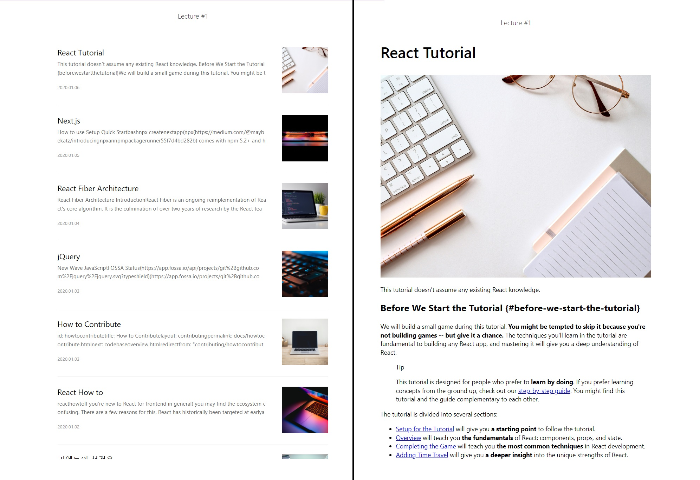

# 🐳 01. 블로그 서비스 최적화

## 🌏 학습할 최적화 기법 및 간단한 소개

* 이미지 사이즈 최적화
* 코드 분할
* 텍스트 압축
* 병목 코드 최적화

<br/>

### 👉 이미지 사이즈 최적화

너무 큰 사이즈의 이미지를 무분별하게 사용하면 네트워크 트래픽이 증가해 서비스 로딩이 오래 걸리게된다.<br/>너무 작은 사이즈의 이미지는 이미지 화질이 저하되어 서비스 이용이 불편해진다.

어떤 이미지 사이즈가 적절한지 살펴보고, 적용해보자.

### 👉 코드 분할

말 그대로 코드를 분할하는 기법으로 SPA특성상 모든 리액트 코드가 하나의 JS파일로 번들링되어 로드 되기 때문에, 첫 페이지 진입 시 당장 사용하지 않는 코드가 다소 포함되어 있다.

이때 필요없는 코드를 떼어내고 필요한 시점에 따로 로드 할 수 있다.

### 👉 텍스트 압축

웹 페이지의 리소스를 내려받을 때 HTML, CSS, JS등이 포함되어있는데 이런 리소스들은 다운로드 전에 서버에서 미리 압축할 수 있다.

그로인해 우너래 사이즈 보다 더 작은 사이즈로 다운로드하여 빠르게 로드 시킬 수 있다.

### 👉 병목 코드 최적화

특정 코드로 인해 너무 느리게 다운되거나 실행되는 경우가 있다.

이렇게 느리게 만드는 코드들을 병목 코드라하고, 어떻게 찾아내고 최적화할 수 있는지 알아보자.

<br/>

## 🌏 분석 툴 소개

분석 툴은 크롬의 개발자도구를 이용.

### 👉 Network 패널

현재 웹 페이지에서 발생하는 모든 네트워크 트래픽을 상세히 볼 수 있다.<br/>어느 시점에 어떤 리소스가 로드되고, 리소스의 크기 등 정보를 확인 할 수 있다.

### 👉 Performance 패널

웹페이지가 로드 될 떄 실행되는 모든 작업을 보여준다.<br/>리소스가 로드되는 타이밍, 메인 스레드에서 실행되는 JS를 차트형태로 확인하고, 여기서 어떤 코드가 느린지 확인 가능

### 👉 Lighthouse패널

웹 사이트의 성능을 측정하고, 개선방향을 제시해 주는 자동화 툴.

이를 이용하여 성능 점수를 측정하고, 개선 가이드를 확인해 어떤 부분을 중점적으로 분석하고 최적화 해야하는 지 알 수 있다.

### 👉 webpack-bundle-analyzer

직접 설치해야 하는 툴로 번들링된 파일이 어떤 코드, 즉 어떤 라이브러리를 담고 있는지 보여준다.

이를 통해 최종적으로 완성된 번들 파일 중 불필요한 코드가 어떤 코드고, 번들 파일에서 어느정도 비중을 차지하는 지 알 수 있다.

<br/><br/>

## 🌏프로젝트 살펴보기

terminal을 2개열어 아래 명령어를 따로 실행. 

**❗ 프로젝트는 Node 16Version에서 진행할 것!**

```shell
npm run server
npm run start
```



* 타이틀과 게시물 일부내용, 섬네일 이미지로 이루어진 글 목록페이지.
* 게시물의 내용을 확인할 수 있는 내용 상세 페이지

<br/>

### 👉 살펴 볼 곳.

* components폴더의 Article 컴포넌트
  * Article 컴포넌트는 블로그 글을 나열 할 때 하나의 블로그 글을 렌더링하는 컴포넌트
  * removesSpecialCharacter함수와 getParametersForUnsplash함수 살펴볼 예정
* pages폴더의 ViewPage 컴포넌트
  * react-markdown라이브러리를 이용해 마크다운 포맷의 문자열을 마크다운 스타일에 맞게 렌더링하는 컴포넌트.

