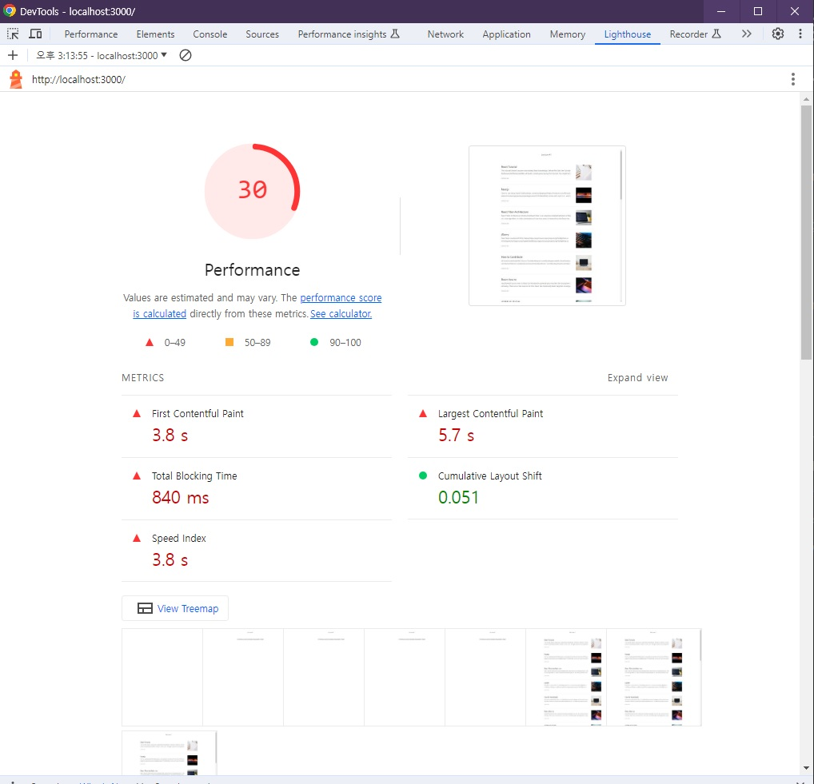

# 🐳 01. 블로그 서비스 최적화

## 🌏 Lighthouse 툴을 이용한 페이지 검사

* Mode : Navigation (Default)
* Device : Desktop
* Categories : Performance

> Mode와 Categories 항목
>
> **Mode**
>
> * Navigation : 기본값으로, 초기 페이지 로딩 시 발생하는 성능 문제 분석
> * Timespan : 사용자가 정의한 시간 동안 발생한 성능 문제를 분석
> * Snapshot : 현재 상태의 성능 문제를 분석
>
> **Categories**
>
> * Performance : 웹페이지의 로딩 과정에서 발생하는 성능 문제를 분석
> * Accessibility : 서비스의 사용자 접근성 문제를 분석
> * Best Practices : 웹사이트의 보안 측면과 웹 개발의 최신 표준에 중점을 두고 분석
> * SEO : 검색 엔진에서 얼마나 잘 크롤링되고 검색 결과에 표시되는지 분석
> * Progressive Web App : 서비스 워커와 오프라인 동작 등 PWA와 관련된 문제를 분석

 

## 🌏 검사 결과

* 가장 위의 30은 종합 성능 점수로, 아래 6가지 지표에 가중치를 적용해 평균 값을 낸 점수.
* 이런 지표를 `웹 바이탈(Web Vitals)`이라고 한다.
* 하나씩 알아가보자.

 

### 👉 First Contentful Paint (FCP)

페이지가 로드 될 때 브라우저가 **DOM 콘텐츠의 첫 번째 부분을 렌더링 하는데 걸리는 시간**에 관한 지표. (위 경우 3.8s)

총점 계산시 10% 가중치를 갖는다.

### 👉 Speed Index (SI)

페이지 로드 중 **콘텐츠가 시각적으로 표시되는 속도**를 나타내는 지표

총점 계산시 10%의 가중치를 갖는다.

### 👉 Largest Contentful Paint (LCP)

페이지가 로드될 때 **화면 내에 있는 가장 큰 이미지나 텍스트 요소가 렌더링되기까지 걸리는 시간**을 나타내는 지표

총점 계산시 25%의 가중치를 갖는다.

### 👉 Time to Interactive (TTI)

사용자가 **페이지와 상호 작용이 가능한 시점까지 걸리는 시간**을 측정한 지표. (상호작용은 클릭, 키보드 누름 등)

즉, 이 시점 전에 화면이 보여도 클릭 같은 입력이 동작하지 않는다.

총점 계산시 10%의 가중치를 갖는다.

### 👉 Total Blocking Time (TBT)

페이지가 클릭, 키보드 입력 등의 사**용자 입력에 응답하지 않도록 차단된 시간을 총합**한 지표.

측정은 **FCP와 TTI사이의 시간 동안** 일어나며, 메인 스레드를 독점하여 다른 동작을 방해하는 작업에 걸린 시간을 총합한다.

총점 계산 시 30%의 가중 치를 갖는다.

### 👉 Cumulative Layout Shift (CLS)

페이지 로드 과정에서 발생하는 **예기치 못한 레이아웃 이동을 측정**한 지표. (레이아웃 이동은 요소의 위치나 크기가 순간적으로 변하는 것.)

총점 계산 시 15%의 가중치를 갖는다.

 

 

### 👉 Opportunities & Diagnotics 섹션

검사 결과 하단에는 `Opportunities`와 `Diagnotics`섹션이 있다.

**❗ 이 두 섹션은 웹 페이지의 문제점과 해결 방안, 문제를 해결함으로써 이점이 무엇인지 보여준다.**

* `Opportunities`섹션 : 페이지를 더욱 빨리 로드하는데 잠재적으로 도움되는 제안을 나열
* `Diagnotics`섹션 : 로드 속도와 직접적인 관계는 없지만 성능과 관련된 기타 정보를 보여줌.

 

 

### 👉 검사 환경 확인

가장 하단에서 검사 환경을 살펴볼 수 있으며, `Emulated Desktop`과 `Custom throttling`을 클릭해 추가 정보를 확인할 수 있다.

이 두가지를 조정하여 CPU성능을 제한하거나 네트워크 속도를 제한하여 테스트를 진행할 수 있다.
