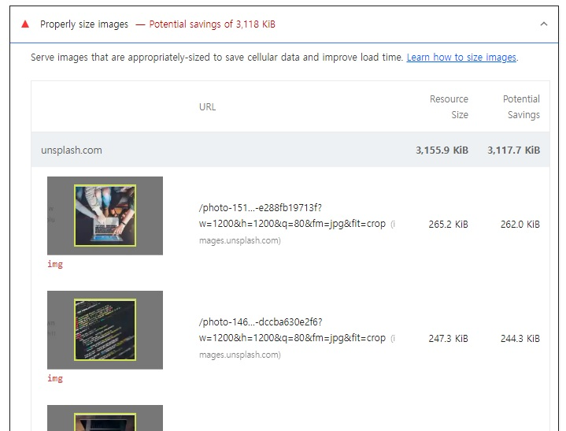

# 🐳 01. 블로그 서비스 최적화

## 🌏 이미지 사이즈 최적화

### 👉 비효율적인 이미지 분석

가장 먼저 주목할 항목은 Opportunities섹션의 `Properly size images`로 여기서 적절한 사이즈로 이미지를 사용하도록 제안한다.



첫 번째 사진을 보면 1200 x 1200px사이즈인데 화면에서는 120 x 120px 이다.

❗ 요즘 사용되는 레티나 디스플레이는 같은 공간에 더 많은 픽셀을 그릴 수 있기 때문에 **너비 기준으로 2배 정도 큰 이미지를 사용하는것이 적절**하다.

> KiB (키비바이트 / Kilo binary bye)
>
> 흔히 KB와 혼용되지만, 정확히는 KiB = 2의 10제곱(1024) 이고, KB = 10의 3제곱(1000)
>
> 초기 1000을 의미하는 K를 2의 10제곱과 동일하게 취급하였지만, 정확한 표현을 위해 KiB라는 단위를 만들었다.

<br/>

### 👉 이미지 CDN

이미지 CDN은 이미지에 특화된 CDN이라 볼 수 있으며, 기본적인 CDN기능과 더불어 이미지를 사용자에게 보내기 전에 특정 형태로 가공하여 전해주는 기능까지 있다. (이미지 사이즈 조절, 특정 포맷 변환등)

이미지 CDN주소 예시: `http://cdn.images/com?src=[img src]&width=240&height=240`

위 주소 처럼 쿼리스트링으로 가져올 이미지의 주소, 이름그리고 필요에따라 width, height가 변환된 상태로 받아올 수 있으며, CDN을 자체적으로 만들어 사용할 수 있지만, Imgix같은 이미지 CDN솔루션을 사용할 수도 있다.

<br/>

```jsx
/* 파라미터 참고: https://unsplash.com/documentation#supported-parameters */
function getParametersForUnsplash({width, height, quality, format}) {
  return `?w=${width}&h=${height}&q=${quality}&fm=${format}&fit=crop`
}
...

```

예제의 Article컴포넌트에서 사용중인 `getParametersForUnsplacsh`함수를 이용해 반환값을 연결하여 사용하고 있다.

실제 API로 전달된 props.image값은 `Unsplash`서비스의 이미지를 사용하고 있으며, 위 함수에서 반환하는 쿼리스트링을 붙여 이미지를 가공하여 전달받을 수 있게 된다.

즉, `Unsplash`라는 서비스가 일종의 이미지 CDN역할을 하고 있는 것이다.

<br/>

### 👉 적절한 이미지 사이즈로 최적화

width와 height의 사이즈를 240으로 변경하여 실행해보면, 더 이상 `Properly size Images`항목이 보이지 않는 것을 확인할 수 있다.

