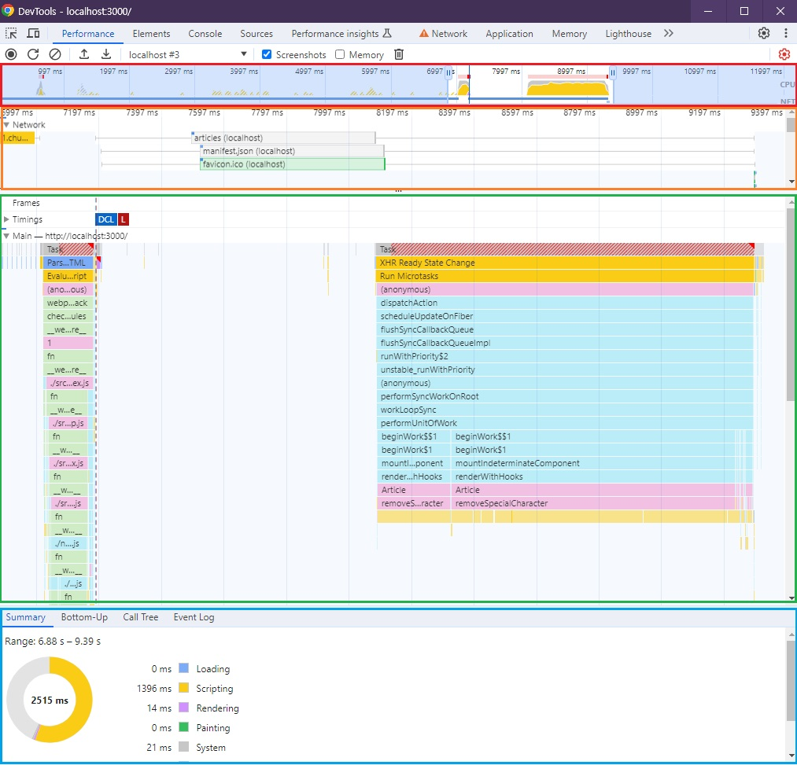
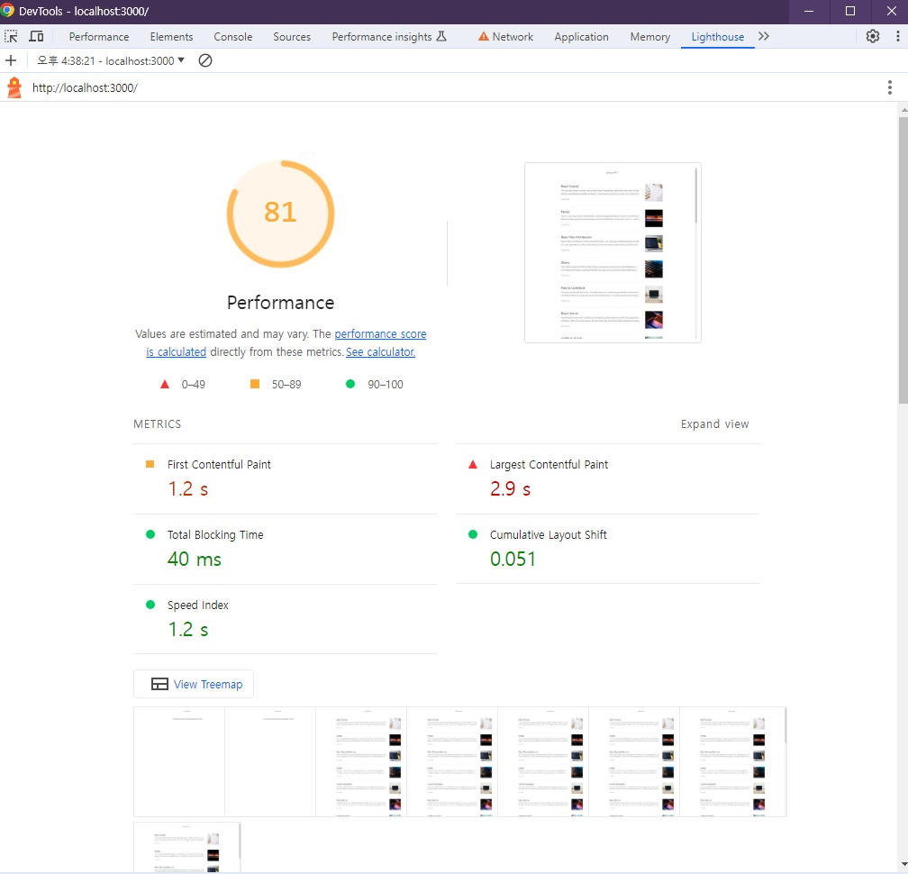

# 🐳 01. 블로그 서비스 최적화

## 🌏 병목 코드 최적화

### 👉 Performance 패널 살펴보기

`Reduce JavaScript execution time`항목을 살펴보자.<br/>js파일에서 오랫동안 실행되었다는 것은 확인이 되지만, 무엇인지는 파악할 수 없다.

무엇이 문제인지 파악하기 위해 `Performance패널`을 확인해보자. <br/>( Performance패널에서 새로고침 버튼을 눌러 실행이 가능한데 좀 더 상세히 보기위해 설정버튼에서 네트워크 설정을 `Fast 3G`로 제한된 환경을 구성할 수 있다. )



* **CPU 차트, Network 차트, 스크린샷**
  * 빨간 테두리 영역
  * `CPU 차트`는 시간에 따라 CPU가 어떤 작업에 리소스를 사용하는지 비율을 보여준다.
  * JS실행은 노랑, 렌더링/레이아웃은 보라, 페인팅작업은 초록, 기타 작업은 회색으로 표시됨.
  * **상단의 빨간 선이 병목이 발생하는 지점**
  * `Network 차트` 는 CPU차트 밑에 막대형태로 표시되며, 대략적인 네트워크 상태를 보여준다.
  * 우선순위가 높을 수록 진한 막대로 표시
  * `스크린샷`이 리스트 하단에 나오며, 서비스가 로드 되는 과정을 보여준다.
* **Network 타임라인**
  * 주황색 영역
  * Network패널과 유사하며, 서비스 로드과정에서의 네트워크 요청을 시간 순서에 따라 보여준다.
  * 좌측 회색선 - 초기 연결 시간
  * 막대 옅은 색 영역 - 요청을 보낸 시점으로부터 응답을 기다리는 시점까지의 시간(TTFB, Time to First Byte)
  * 막대의 짙은 영역 - 콘텐츠 다운로드 시간
  * 오른쪽 회색 선 - 해당 요청에 대한 메인 스레드 작업시간
* **Frames, Timings, Main**
  * 초록색 영역
  * `Frames`는 화면의 변화가 있을 때 마다 스크린샷을 보여준다.
  * `Timings`는 `User Timing API`를 통해 기록된 정보를 기록함. <br/>(해당 API는 React 17이후 정확성, 유지보수 문제로 지원이 종료되었으며 참고만 하면된다.)
  * `Main`은 브라우저의 메인 스레드에서 실행되는 작업을 플레임 차트로 보여준다.
* **하단 탭**
  * 파란색 영역
  * `Summary`, `Bottom-up`, `Call Tree`, `Event Log`에서 전체 또는 선택된 영역에 대한 상세 내용 확인이 가능하다.
  * `Sumamry` : 선택 영역에서 발생한 작업시간의 총합과 각 작업이 차지하는 비중을 보여줌
  * `Bottom-up` : 가장 최하위작업부터 상위작업까지 역순으로 보여준다.
  * `Call Tree` : 가장 상위 작업부터 하위작업까지 순으로 작업 내용을 트리뷰형태로 보여줌.
  * `Event Log` : 발생한 이벤트를 보여줌<br/>(Loading, Experience, Scripting, Rendering, Painting)

<br/>

### 👉 최적화 포인트 찾아내기

살펴 볼 포인트를 찾아보자.

* 처음 `localhost`로 요청이 오고, 이후 `bundle.js`, `chunk.js`등의 파일을 로드하고 있다.
* localhost 요청이후 Main 섹션을 확인해보면, 파란색으로 `Parse HTML`을 진행 중인 것을 볼 수 있다.
* `chunk.js`의 다운로드가 끝나고 JS작업이 실행되고 있다.
* 빨간 박스부분을 보면, App.js 즉, 리액트 코드를 실행하는 작업을 볼 수 있다.
* 이후 컴포넌트렌더링 작업이 기록된 것을 확인할 수 있다.
* Article컴포넌트에서 요청한 내용이 Network섹션에서 확인이 가능하다. (**이 부분이 2초이상으로 오래걸리는 것이 확인되었다.**)

해당 내용을 확인해 보면, `removeSpecialCharacter`작업이 렌더링 시간을 길어지게 했다는 것을 확인할 수 있고, 이를 개선하여 실행 시간도 단축할 수 있다는 최적화 포인트를 찾아낼 수 있게 되었다.

<br/>

### 👉 병목 코드 개선

```javascript
/*
 * 파라미터로 넘어온 문자열에서 일부 특수문자를 제거하는 함수
 * (Markdown으로 된 문자열의 특수문자를 제거하기 위함)
 * */
function removeSpecialCharacter(str) {
  const removeCharacters = ['#', '_', '*', '~', '&', ';', '!', '[', ']', '`', '>', '\n', '=', '-']
  let _str = str
  let i = 0,
    j = 0

  for (i = 0; i < removeCharacters.length; i++) {
    j = 0
    while (j < _str.length) {
      if (_str[j] === removeCharacters[i]) {
        _str = _str.substring(0, j).concat(_str.substring(j + 1))
        continue
      }
      j++
    }
  }

  return _str
}
```

특수문자를 제거하는데 일치하는 문자열을 찾고 제거하기 위해 반복문을 중첩하고, substring과 concat을 이용중이다.

2가지 방법이 있다.

* 특수문자를 효율적으로 제거하기 : replace 이용
* 작업량 줄이기 : replace할 내용 줄이기

일치하는 문자를 찾아 제거해주는 replace를 이용해 쉽고 빠르게 수정이 가능하다.<br/>넘어 오는 데이터는 몇만자씩 될 정도로 길기 때문에 화면에 표시될 200자 정도만 잘라서 replace를 진행해볼 수 있다.

```javascript
function removeSpecialCharacter(str) {
  // replace 이용
  str = str.replace(/[#_*~&;![\]`>\n=\->]/g, '')

  //문자열 줄이기
  let _str = str.substring(0,300);
  return _str;
}
```



TBT가 크게 줄어든 것을 확인할 수 있고, `Reduce Javascript execution time`항목이 사라진 걸 확인할 수 있다.
