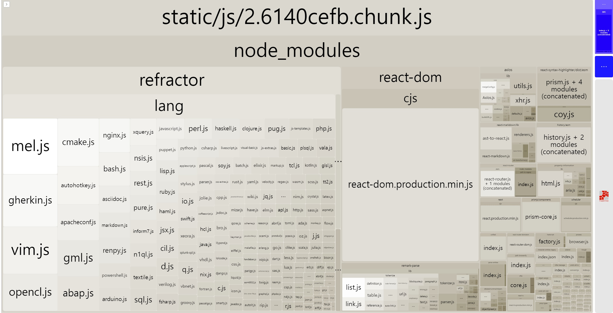
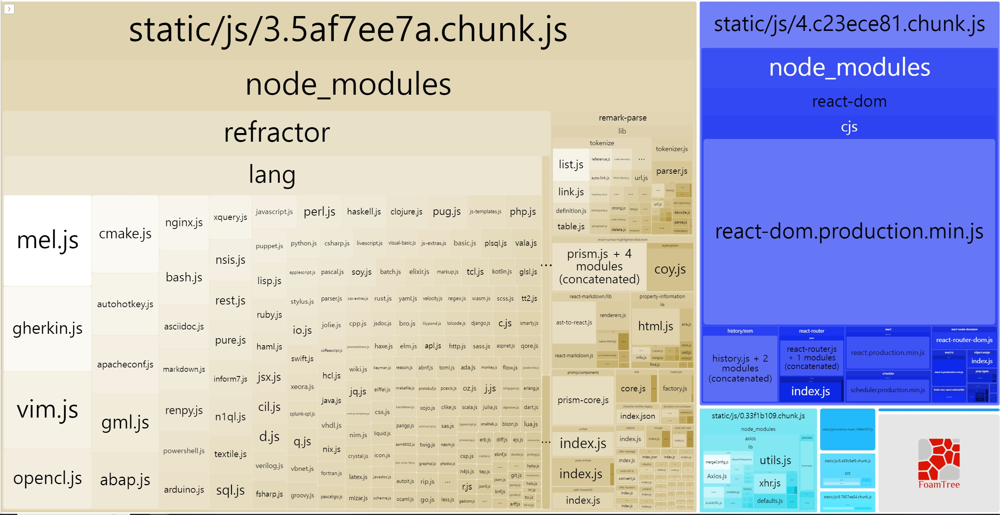

# 🐳 01. 블로그 서비스 최적화

## 🌏 코드 분할 & 지연로딩

### 👉 번들 파일 분석

bundle파일을 분석해보자.

`Webpack Bundle Analyzer`를 이용하려면 `npm run eject`스크립트를 통해 cra설정파일들을 추출해야하는데, 이런 작업없이 간편하게 할 수 있는 `cra-bundle-analyzer`를 이용해보자.

```shell
npm i --save-D cra-bundle-analyzer
npx cra-bundle-analyzer
```



chunk파일의 내부를 보면, `refractor`와 `react-dom`이 매우 큰 비중을 차지 하고 있는 것으로 보인다.

`refractor`의 패키지를 타고들어가다 보면, `react-syntax-hylight`에서 `refractor`를 참조하고, 블로그에서는 CodeBlock.js에서 사용중이다.

이 컴포넌트는 상요자가 처음 진입하는 목록페이지에서는 필요없기 때문에 번들 파일을 페이지별로 필요한 내용만 분리하여 필요할 때만 따로로드하는 것이 좋을 듯하다.

<br/>

### 👉 코드 분할이란?

페이지에서 필요한 코드만 따로 로드하면 불필요한 코드를 로드하지 않아 더욱 빨라진다. 이를 위해 코드 분할 기법을 이용해 페이지별로 코드를 분리할 수 있다.

분할된 코드는 사용자가 서비스를 이용하는 중 해당 코드가 필요해지는 시점에 로드되어 실행된다. 이를 **지연 로딩**이라 한다.

<br/>

코드 분할 기법에는 각 페이지가 공통으로 사용하는 모듈이 많고 사이즈가 큰 경우 페이지 별로 분할하지 않고, 모듈별로 분할하는 등 여러가지 패턴이 있다.

**❗ 핵심은 불필요한 코드 또는 중복되는 코드 없이 적절한 사이즈의 코드가 적절한 타이밍에 로드되도록 하는 것**

<br/>

<br/>

### 👉 코드 분할 적용 하기

가장 좋은 방법은 **동적 import**를 사용하는 방법.

```javascript
import {add} from './math';
console.log(`1+4=${add(1,4)}`)
```

이렇게 임포트했을 때 해당 모듈은 빌드 시에 함께 번들링이 된다.

<br/>

```javascript
import('add').then((module)=>{
  const {add} = module;
  console.log(`1+4=${add(1,4)}`)
})
```

위 코드 처럼 import문을 사용하면 빌드할 떄가 아니라 런타임 시에 모듈을 로드하는데 이를 동적 임포트라고 한다.

문제는 위처럼 사용시 Promise형태로 반환하기 때문에 Promise내부의 컴포넌트를 빼내야한다.

<br/>

리액트에서는 `lazy`와 `suspense`함수를 이용하여 비동기 문제를 신경쓰지 않고 간편하게 동적 import 할 수 있다.

```jsx
import React, { Suspense } from 'react';

const SomeComponent = React.lazy(()=>import('./SomeComponent'));

function MyCOmponent(){
  return (
    <Suspense fallback={<div>로딩중...</div>}>
	  	<SomeComponent />
    <Suspense/>
  )
}
```

* lazy함수로 동적 import를 호출해 Promise를 반환하는 함수를 인자로 받는다.
* import한 컴포넌트는 Suspense안에서 렌더링해야하며, 동적 import하는 동안 SomeComponent내용이 없다면,  fallback에 정의된 내용으로 렌더링된다.

<br/>

예제에 적용해보자.

```jsx
import React, { Suspense, lazy } from 'react'
import { Switch, Route } from 'react-router-dom'
import './App.css'
// import ListPage from './pages/ListPage/index'
// import ViewPage from './pages/ViewPage/index'
const ListPage = lazy(()=>import('./pages/ListPage/index'))
const ViewPage = lazy(()=>import('./pages/ViewPage/index'))
function App() {
  return (
    <div className="App">
      <Suspense fallback={<div>Loading...</div>}>
        <Switch>
          <Route path="/" component={ListPage} exact />
          <Route path="/view/:id" component={ViewPage} exact />
        </Switch>
      </Suspense>
    </div>
  )
}

export default App
```

* 각 페이지 컴포넌트는 코드가 분할되고, 사용자가 해당 페이지에 접근했을 때 전체 코드가 아닌 ListPage컴포넌트의 코드만 동적으로 임포트하여 화면을 띄운다.



상세페이지 진입 시 Fallback의 내용이 표시되고, 새로운 자바스크립트 파일을 불러와 해당 페이지로 진입하는 것을 볼 수 있다.
