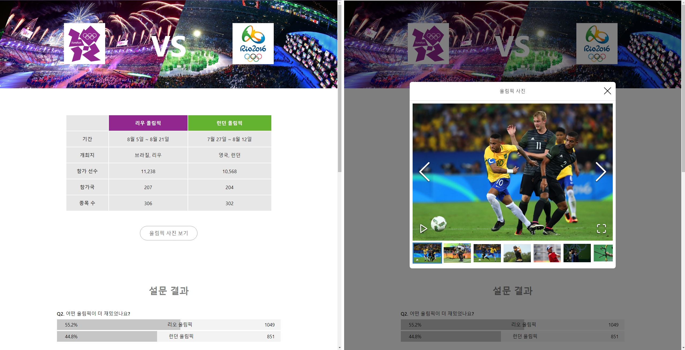

# 🐳 02. 올림픽 통계 서비스 최적화

## 🌏 학습할 최적화 기법 및 간단한 소개

* CSS 애니메이션 최적화
* 컴포넌트 지연 로딩
* 컴포넌트 사전 로딩
* 이미지 사전 로딩

<br/>

### 👉 애니메이션 최적화

적용된 애니메이션이 버벅거리며 동작하여, 이를 최적화 해보자.

### 👉 컴포넌트 지연 로딩

1장에서 코드 분할 기법을 통해 분할된 코드를 필요한 시점에 로드되도록 했다.

이번에는 페이지 대신 단일 컴포넌트르 ㄹ분할하여 컴포넌트가 쓰이는 순간에 불러오도록 만들 예정.

### 👉 컴포넌트 사전 로딩

서비스 이용과정에서 분할된 컴포넌트를 사용하려 할 때, 다운로드되어 있지 않은 코드를 추가로 다운로드 하는 시간만큼 서비스 이용에 지연이 발생한다.<br/>이런 문제를 해결하기 위해 코드를 분할해 첫 화면 진입 시 다운로드 하지는 않지만, 이후 해당 코드가 필요한 시점 보다는 먼저 코드를 로드해 해당 코드를 지연 없이 사용할 수 있도록 해볼 것이다.

### 👉 이미지 사전 로딩

컴포넌트와 마찬가지로 필요한 시점에 로드하면 이미지가 로드되는 시간만큼 기다리기 때문에 먼저 다운로드 하여 이미지를 바로 보여주도록 이미지 사전 로딩 기법을 적용해볼 예정.

<br/>

## 🌏 분석 툴 소개

분석 툴은 크롬의 개발자도구를 이용.

* 크롬 Network 패널
* 크롬 Performance 패널
* Webpack Bundle Analyzer

<br/><br/>

## 🌏프로젝트 살펴보기

terminal을 2개열어 아래 명령어를 따로 실행. 

**❗ 프로젝트는 Node 16Version에서 진행할 것!**

```shell
npm run server
npm run start
```



* 올림픽 사진 보기를 클릭 시 이미지가 바로 뜨지 않는다.
* 설문 결과의 그래프 애니메이션이 끊기는 느낌이 있다.

<br/>

### 👉 살펴 볼 곳.

* ImageModal 컴포넌트가 showModal 값에 따라 화면에 보여진다.
  * 처음에는 화면에 보이지 않는다는 점.
  * 외부 라이브러리를 사용해 이미지 데이터를 넘겨 화면에 표시한다는 점.
  * 외부 라이브러리를 사용함에 따라 최종 번들링된 JS의 크기도 커지며, 로드하는데 오래 걸리게 된다.

* Bar컴포넌트
  *  styled-component를 이용해 width값이 변하면서 애니메이션을 보여준다.


