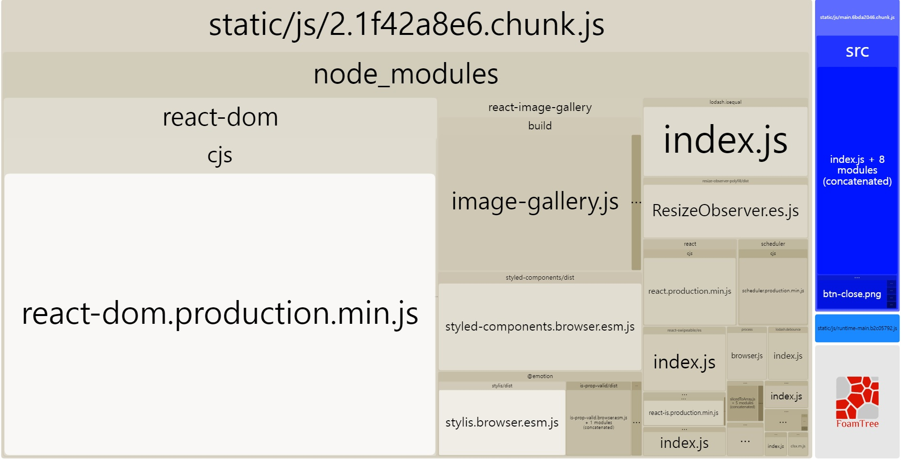
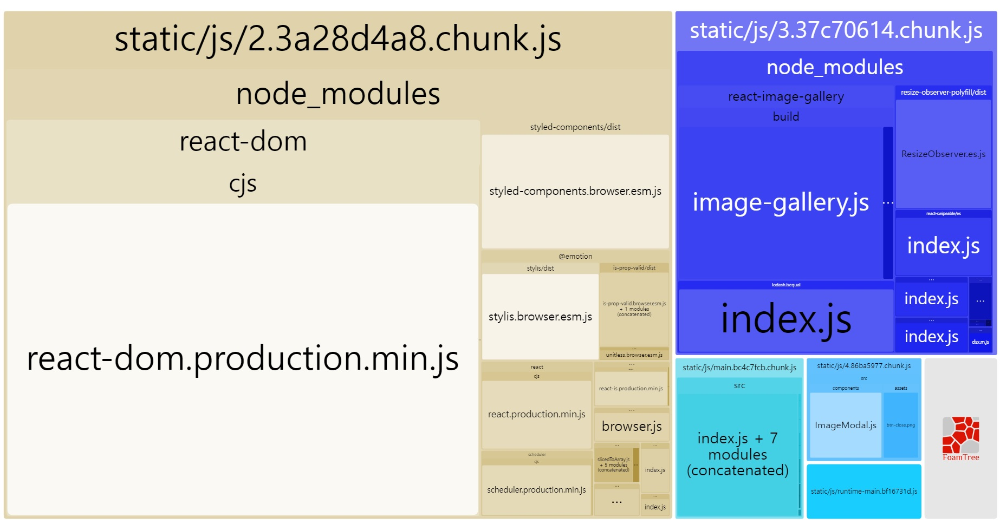
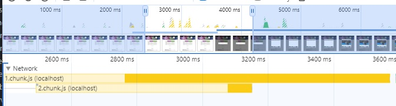
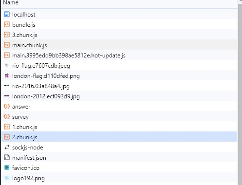

# 🐳 02. 올림픽 통계 서비스 최적화

## 🌏 컴포넌트 지연 로딩

### 👉 번들 파일 분석

먼저 서비스에 어떤 문제가 있는지 파악하기 위해 번들 파일을 분석해보자.

```shell
npm i --save-dev cra-bundle-analyzer
npx cra-bundle-analyzer
```



* 좌측은 라이브러리 우측 파란색은 올림픽 통계 서비스의 코드.
* 라이브러리에는 react-image-gallery도 포함된 것을 확인할 수 있는데, 서비스 첫 화면 부터 필요하지 않다.
* 이부분에 대해서 지연로딩을 적용해보자.

<br/>

### 👉 모달 코드 분리하기

Suspence컴포넌트와 lazy함수를 불러와 사용.

```jsx
...
const LazyImageModal = lazy(() => import("./components/ImageModal"));


function App() {
  const [showModal, setShowModal] = useState(false);

  return (
    <div className="App">
     ...
      <Suspense fallback={null}>
        {showModal ? (
          <LazyImageModal
            closeModal={() => {
              setShowModal(false);
            }}
          />
        ) : null}
      </Suspense>
    </div>
  );
}
```



파란색 블록에 `react-iamge-gallery`라이브러리가 분리되고, 하늘색 블록에 ImageModal이 분리된 것을 볼 수 있다.

❗ `react-image-gallery`를 참조하는 모든 라이브러리가 함께 묶여 분할됐다는게 포인트

<br/>

## 🌏 컴포넌트 사전 로딩

### 👉 지연 로딩의 단점

앞에서 지연 로딩을 통해 최초 페이지 로드 시 당장 필요없는 모달과 관련 코드가 번들에 포함되지 않아, 로드할 파일의 크기가 작아지고 초기 로딩 속도나 자바스크립트 실행 타이밍이 빨라져 화면에 더 빨리 표시된다는 점을 확인.

하지만 **모달을 띄우는 시점**에서는 모달 코드를 분리했기 때문에 **모달을 띄울 떄 새롭게 모달코드를 로드**해야하고, 로드가 완료되야만 화면에 띄울 수 있어 **약간의 지연이 발생**한다.



<br/>

이러한 문제를 **사전 로딩**을 통해 해결할 수 있다. <br/>말 그대로 필요한 모듈을 필요해지기 전에 미리 로드하는 기법이다.

한 가지 문제가 있다면, 로드되는 시점을 정하는 데 문제가있다. 여기서 고려할 방안은 사용자가 버튼 위에 마우스를 올려놨을떄, 또는 최초 페이지가 로드되고 모든 컴포넌트의 마운트가 끝났을 떄 이다.

### 👉 컴포넌트 사전 로딩 타이밍

#### 🔸 버튼 위에 마우스를 올려놓았을 때 사전 로딩

1. 마우스 커서를 버튼에 올려놓는다.
2. 클릭한다.

즉, 버튼 클릭을 위해 마우스가 위에 올라오면 모달을 띄울 것이라 예측하고 로드하는 것이다.

```jsx
<ButtonModal
  onClick={() => {
    setShowModal(true);
  }}
  onMouseEnter={onHandleMouseEnter}
>
  올림픽 사진 보기
</ButtonModal>
```

버튼을 클릭할 때, 마우스를 올리고 클릭할 때까지 약간의 시간차가 있지만 파일을 새로 로드하기에는 충분하다.

<br/>

#### 🔸 컴포넌트의 마운트 완료 후 사전 로딩

만약 모달 컴포넌트의 크기가 큰 경우 마우스 커서를 버튼에 올렸을 때 보다 먼저 파일을 로드해야한다.

즉, 모든 컴포넌트의 마운트가 완료된 후에 컴포넌트를 로드하는 것이다.

함수형 컴포넌트를 사용하기 때문에 `useEffect`에 작성해 줄 수 있다.

```jsx
...
function App() {
  ...
  useEffect(()=>{
    const component = import("./components/ImageModal");
  }, [])
  
  return (
    <div className="App">
      ...
    </div>
  );
}

```



필요한 파일을 모두 다운한 후에 Modal과 관련된 chunk를 로드하는 것을 볼 수 있다.

물론, 이 2가지 방법만 있는 것이 아니며, 서비스나 기능의 특성에 따라 다양한 방법으로 적용할 수 있다.
