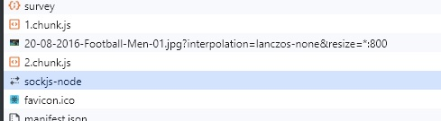

# 🐳 02. 올림픽 통계 서비스 최적화

## 🌏 이미지 사전 로딩

### 👉 느린 이미지 로딩

이미지 modal이 열릴 떄 이미지의 사이즈가 크다보니 다운로드 시간이 오래 걸려 완료될 떄까지 아무것도 뜨지 않는 경우를 볼 수 있다. (테스트시 캐시지우고 할것)

이를 해결하기 위해 이미지 사전 로딩 기법을 적용해보자.

<br/>

### 👉 이미지 사전 로딩

컴포넌트는 import함수로 로드했는데, 이미지는 이미지가 화면에 그려지는, **이미지를 사용하는 시점에 로드 된다.**

이런 경우 외에 JS로 이미지를 직접 로드하는 방법이 있는데 바로 **Image객체를 이용**하는 것이다.

```javascript
const img = new Image()
img.src=`${이미지 주소}`
```

<br/>사전 로드할 이미지는 모달에서 가장 먼저 보이는 이미지로 넣어 줄 것이다. 코드를 수정해보자.

```javascript
 useEffect(()=>{
    const component = import("./components/ImageModal");
    const img = new Image();
    img.src= 'https://stillmed.olympic.org/media/Photos/2016/08/20/part-1/20-08-2016-Football-Men-01.jpg?interpolation=lanczos-none&resize=*:800'
  }, [])
```

Network 패널을 다시 호가인 해보자.



미리 첫 번째 이미지를 다운한 것을 확인할 수 있다.

다시 캐시를 비우고 실행해보면, 미리 로드한 이미지가 먼저 보여지는 것을 확인할 수 있다.

마지막으로 가장 중요한 것은 어디까지 미리 로드하느냐 정하는 것이 가장 중요하다. 그렇기 때문에 사전 로딩이 정말로 필요한지 고민해봐야 한다.
