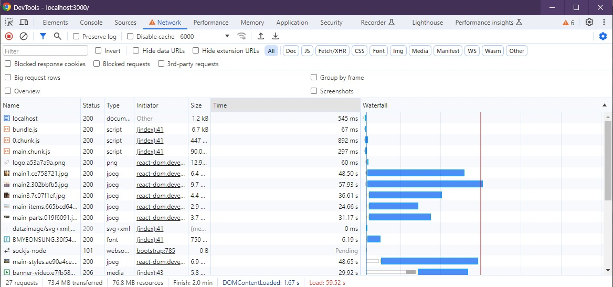
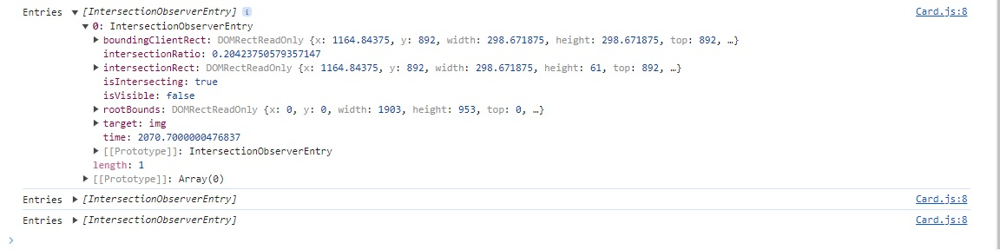
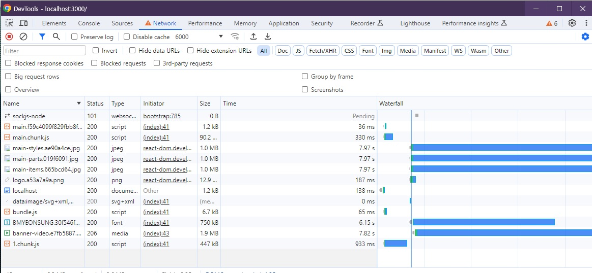

# 🐳 03. 홈페이지 최적화

## 🌏 이미지 지연 로딩

### 👉 네트워크 분석

>  **시작하기 전에**
>
> ❗ 서비스를 분석하고 최적화할 때 어떤 작업을 먼저 해야 한다는 규칙은 없다. 그렇기 때문에 상황에 따라 판단하여 원하는 분석을 진행하면 된다.

네트워크 `Custom Throtling`을 만들어,Download, Upload, Latency를 6000 / 6000 / 20으로 설정해서 진행해보자.



굉장히 오랜시간에 걸쳐 리소스가 다운되는 것을 볼 수 있다.

bundle, main1, 2, 3이미지가 다운되고 video는 pending된 상태로 존재하다 일부 다운로드가 완료된 후에 다운로드 되는것을 볼 수 있다.

**어떻게 해결해야할까?**<br/>=> 동영상의 다운로드를 방해하는, **당장 사용되지 않는 이미지를 나중에 다운로드** 시켜 동영사잉 먼저 다운로드 되게 할 수 있다. 즉, **이미지를 지연 로딩** 시키는 것이다.

❗ 그 시점은? 화면에 보이는 순간 또는 그 직전에 이미지를 로드.<br/>뷰포트에 이미지가 표시될 위치까지 스크롤 되었을 때 이미지를 로드할지 말지 판단하는 것이다.

<br/>

### 👉 Intersection Obeserver

이미지 지연 로딩 작업을 위해 스크롤이 이동했을 떄 해당 뷰포트에 이미지를 보이게 할지 판단해야 하는데, 스크롤 이벤트에 이 로직을 넣으면 **스크롤할 때마다 해당 로직이 아주 많이 실행**된다.

이렇게 되면, 메인스레드에 무리가 가게 된다. `lodash`의 `throttle`을 이용할 수 있지만, 근본적인 해결 방법은 아니다.

이 문제를 해결할 수 있는 것이 바로 `Intersection Observer`이다.

`Intersection Observer`는 브라우저에서 제공하는 API로 웹 페이지의 특정 요소를 관찰하면 페이지 스크롤 시 해당 요소가 화면에 들어왔는지 아닌지 알려준다. <br/>즉, 스크롤 이벤트 처럼 스크롤할 때 마다가 아니라 **요소가 화면에 들어왔을 때만 함수를 호출**하는 것이다. 따라서 성능면에서 스크롤 이벤트 보다 훨씬 효율적이다.

간단하게 살펴보자.

```javascript
const options = {
  root: null,
  rootMargin: '0px',
  threshold: 1.0
}

const callback = (entries, observer) => {
  console.log('Entries', entries)
}

const observer = new IntersectionObserver(callback, options)

observer.observe(document.querySelector('#target-element1'))
observer.observe(document.querySelector('#target-element2'))
```

* options : Intersection Observer에 사용될 옵션
  * root : 대상 객체의 가시성을 확인할 때 사용되는 뷰포트 요소로 null이면 브라우저의 뷰포트로 설정된다.
  * rootMargin : root요소의 여백
  * threshold : 가시성 퍼센티지. 대상 요소가 어느 정도로 보일때 콜백을 실행할지 결정.<br/>0이라면, 1px이라도 보이면 실행한다.
* callback : 실행할 함수
  * entries : 가시성이 변한 요소를 배열 형태로 받는다.

<br/>

### 👉 Intersection Observer 적용하기

가장 먼저 지연 로딩할 이미지는 소개를 나타내는 3개의 이미지 이다. 현재 Card컴포넌트에서 img요소로 렌더링 되고 있다. 따라서 이미지에 대한 지연 로딩 로직도 Card안에 추가할 수 있따.

```jsx
import React, { useEffect, useRef } from 'react'

function Card(props) {
	const imgRef = useRef(null);
	useEffect(()=>{
		const options = {}
		const callback = (entries, ovserver) => {
			console.log('Entries' , entries);
		}
		const observer = new IntersectionObserver(callback, options);
		observer.observe(imgRef.current)
		return ()=>observer.disconnect();
	},[])
	return (
		<div className="Card text-center">
			
			<div className="p-5 font-semibold text-gray-700 text-xl md:text-lg lg:text-xl keep-all">
				{props.children}
			</div>
		</div>
	)
}

export default Card
```

만약 useEffect안에서 수행하지 않는다면, 렌더링할 때마다 인스턴스가 생성되고, 관찰하게 되면서 여러개의 콜백이 실행되기 때문에 useEffect에서 인스턴스를 생성하고, clean-up함수에서 `observer.disconnect`를 통해 리소스가 낭비되지 않도록 한다.



boundingClientRect, intersectionRatio등 다양한 정보가 있는데 여기서 가장 중요한건 바로 `isIntersecting`이다.<br/>❗ `isIntersecting`은 해당 요소가 뷰포트 내에 들어왔는지를 나타내는 값.

이제 이미지가 보이는 순간 이미지를 로드해보자.

```jsx
import React, { useEffect, useRef } from 'react'

function Card(props) {
	const imgRef = useRef(null);
	useEffect(()=>{
		const options = {}
		const callback = (entries, ovserver) => {
			// console.log('Entries' , entries);
			entries.forEach(entry=>{
				if(entry.isIntersecting){
					console.log('is intersecting', entry.target.dataset.src)
					entry.target.src = entry.target.dataset.src;
					observer.unobserve(entry.target);
				}
			})
		}
		const observer = new IntersectionObserver(callback, options);
		observer.observe(imgRef.current)
		return ()=>observer.disconnect();
	},[])
  
	return (
		<div className="Card text-center">
			
			<div className="p-5 font-semibold text-gray-700 text-xl md:text-lg lg:text-xl keep-all">
				{props.children}
			</div>
		</div>
	)
}

export default Card
```

먼저 img의 src를 `data-src`로 변경하였다. 이렇게 되면 src에는 값이 할당되지 않기 때문에 이미지를 로드하지 않고, 이후 뷰포트에 이미지가 들어왔을 떄 data-src의 값을 src로 옮기기 위해서이다.

`observer.unobserve(entry.target)`은 해당 요소의 observe를 해제하는 부분이다.



최초 페이지 로딩 시에는 main1, 2, 3이미지가 로드되지 않고 있다가 스크롤이 이미지 영역에 도달하면 3개의 이미지가 로드되는 것을 볼 수 있다.

(다른 부분들에 지연 로딩을 적용하는 방법도 동일하기 때문에 이외작업의 설명은 생략. App.js에 코드는 수정 완료.)
