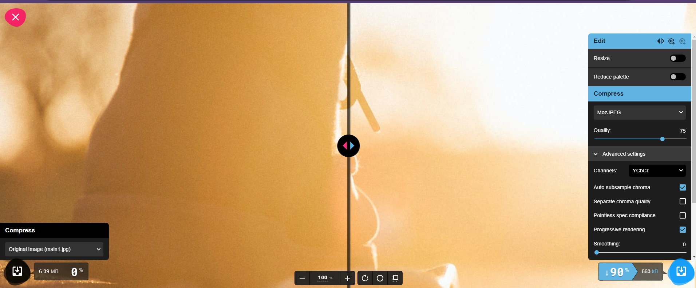

# 🐳 03. 홈페이지 최적화

## 🌏 이미지 사이즈 최적화

### 👉 느린 이미지 로딩 분석

앞서 지연 로딩을 통해 배너의 동영상 콘텐츠가 별다른 지연 없이 바로 다운로드 될 수 있도록 하였다.하지만 막상 이미지가 로드 되는 속도는 굉장히 느리다.

해당 이미지들을 보면, 이미지의 크기가 Mb단위로 굉장히 큰것을 볼 수 있다. 이미지 사이즈 최적화를 통해 수정해보자.

<br/>

### 👉 이미지 포맷 종류

간단히 말하자면, 가로 세로 사이즈를 줄여 이미지 용량을 줄이고 그만큼 더 빠르게 다운로드 하는 기법이다. <br/>그 전에 이미지 포맷에 대해 알아보고 넘어가자.

svg같이 벡터 이미지가 아닌 비트맵 이미지 포맷중 대표적인 포맷으로는 `PNG`, `JPG(JPEG)`, `WebP`가 대표적이다.

| PNG                                                          | JPG (JPEG)                                                   | WebP                                                         |
| ------------------------------------------------------------ | ------------------------------------------------------------ | ------------------------------------------------------------ |
| · 뭇손실 압축 방식.<br/>· 원본을 휘손 없이 압축하며, 알파채널 지원(투명도) | · 압축과정에서 정보 손실이 발생하지만 그만큼 더 작게 압축이 가능 | · 무손실 압축과 손실 압축을 모두 제공하는 최신 이미지 포멧<br/>· 대단히 효율적으로 압축이 가능<br/>· 최신 이미지 포맷이라 모든 브라우저에서 지원되지는 않음 |

> 추가 정보
>
> 사이즈 : PNG > JPG > WebP
>
> 화질 : PNG = WebP > JPG
>
> 호환성 : PNG = JPG > WebP
>
> WebP가 PNG대비 26%, JPG대비 25~34%정도 더 나은 효율을 가지고 있다고 한다.

<br/>

### 👉 Squoosh를 이용한 이미지 변환

JPG또는 PNG포맷의 이미지를 WebP포맷으로 변환하여, 고화질, 저용량의 이미지로 최적화 진행.<br/>이떄 사용할 이미지 컨버터로 `Squoosh`를 이용할 것이다.



왼쪽이 원본, 우측이 변환될 이미지. 여기서 우선 Resize와 Compress섹션만 이용할 것이다.

* 보여지는 이미지는 300x300px이므로 600x600px로 리사이즈.
* Compress에서 압축방식과 압축율을 Webp와 75로 설정
* Effort는 CPU의 리소스를 어느 정도 사용하는지 정도로 기본 값인 4로 설정.

❗ 압축율의 경우 너무 작으면 화질이 떨어지고, 너무크면 용량이 커져 70~80을 권장한다.

압축결과 6.09Mb -> 14.3Kb가 되었다.

나머지 파일들도 모두 변환 후 import 경로를 수정해주어 적용한 결과, 굉장히 빠르게 로드되는 것을 확인할 수 있다.

<br/>

하지만, Webp가 모든 브라우저에서 지원하지 않기 때문에 제대로 렌더링 되지 않을 수 있어 이 문제를 해결해야한다.

❗ img태그 대신 picture태그를 이용하여 해결할 수 있는데, picture태그는 다양한 타입의 이미지를 렌더링하는 컨테이너로 사용된다.

```jsx
// MainPage.js
<ThreeColumns
  columns={[
    <Card image={main1} webp={main1_webp}>롱보드는 아주 재밌습니다.</Card>,
    <Card image={main2} webp={main2_webp}>롱보드를 타면 아주 신납니다.</Card>,
    <Card image={main3} webp={main3_webp}>롱보드는 굉장히 재밌습니다.</Card>
  ]}
/>
```

```jsx
// Card.js
import React, { useEffect, useRef } from 'react'

function Card(props) {
	const imgRef = useRef(null);
	useEffect(()=>{
		const options = {}
		const callback = (entries, ovserver) => {
			// console.log('Entries' , entries);
			entries.forEach(entry=>{
				if(entry.isIntersecting){
					const target = entry.target;
					const previousSibling = target.previousSibling;
					
					console.log('is intersecting', entry.target.dataset.src)
					target.src = target.dataset.src;
					previousSibling.srcset = previousSibling.dataset.srcset;
					observer.unobserve(entry.target);
				}
			})
		}
		const observer = new IntersectionObserver(callback, options);
		observer.observe(imgRef.current)
		return ()=>observer.disconnect();
	},[])
	return (
		<div className="Card text-center">
			<picture>
				<source data-srcset={props.webp} type='image/webp' />
				
			</picture>
			<div className="p-5 font-semibold text-gray-700 text-xl md:text-lg lg:text-xl keep-all">
				{props.children}
			</div>
		</div>
	)
}

export default Card
```

* props로 webp를 추가하고, Card에서는 picture태그로 수정하고, source와 img태그를 추가
* 이렇게 되면, 가장 상위의 webp가 먼저 로드되고, 없으면 img의 jpg를 렌더링한다.
* ❗ 잊지 말아야 할 것이 img에 지연로딩을 위해 data-src로 임시 저장한 뒤 Intersection Observer의 콜백이 실행될 때 이미지의 src를 세팅한다.
* 테스트 시에는 soruce태그의 타입을 `image/not-support`로 설정하여 페이지를 새로고침하면 jpg파일이 로딩되는 것을 볼 수 있다.

이제 다시 우리가 해야할건?

jpg가 로드 될수도 있으니 jpg파일도 사이즈 최적화 해주고, 나머지 이미지들에 대해서도 picture태그로 변경해주자.

최적화 후에 굉장히 빠른 속도로 화면에 표시되는 것을 확인할 수 있다.
