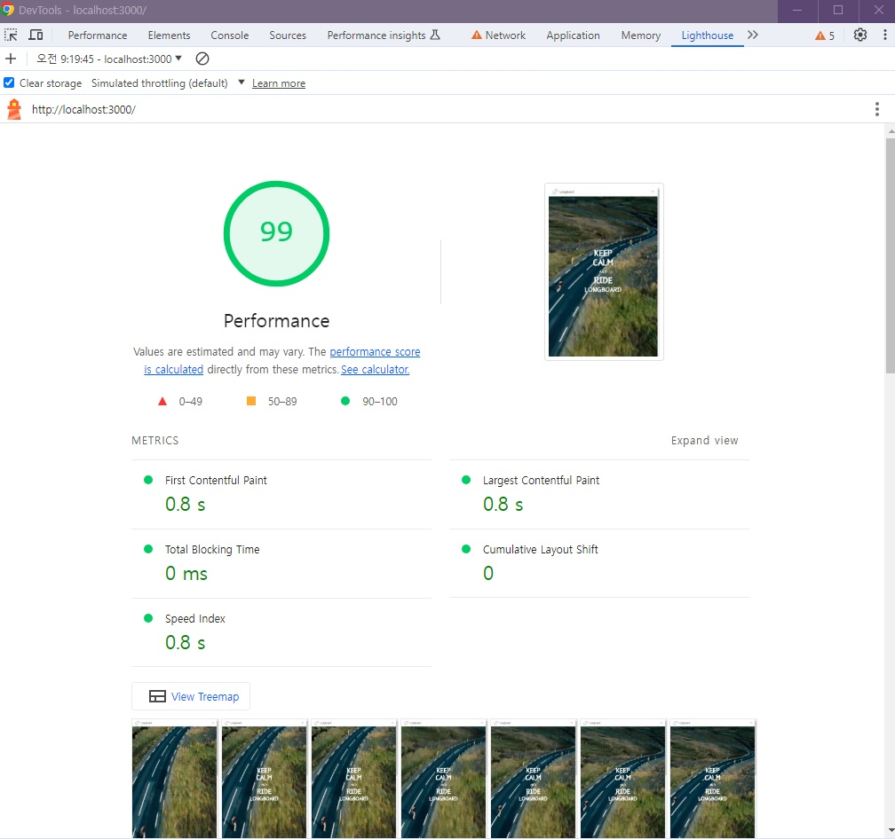
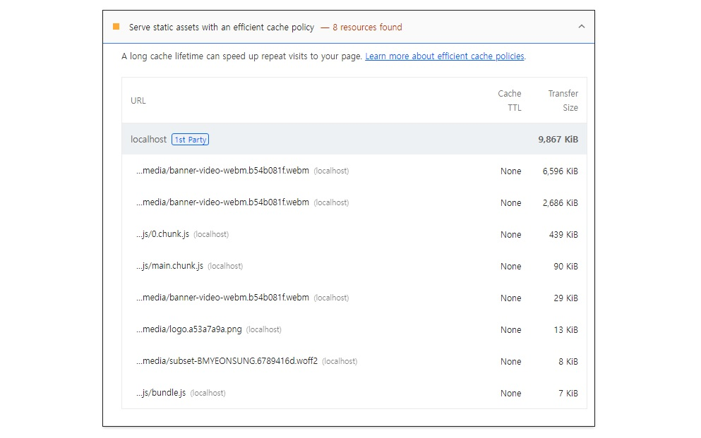
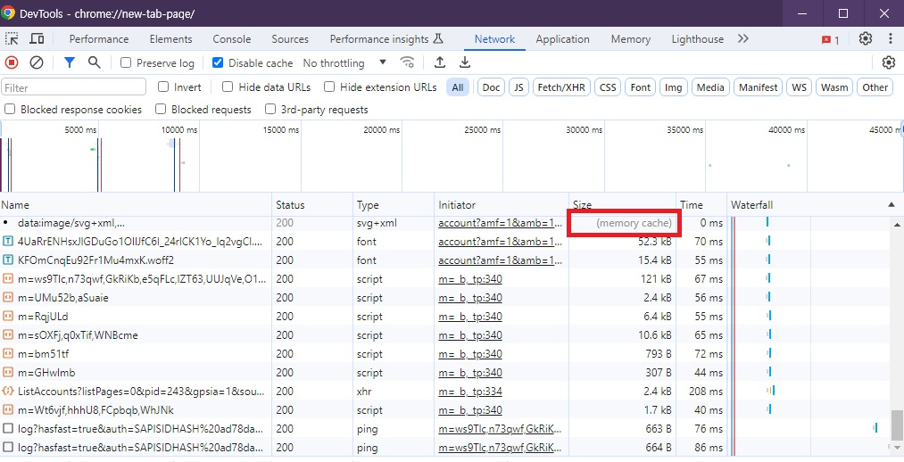
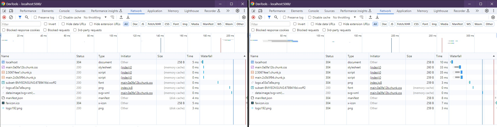

# 🐳 03. 홈페이지 최적화

## 🌏 캐시 최적화



lighthouse를 진행해보면, 간단한 페이지이기도 하고, 많은 최적화를 적용해 점수가 높다. <br/>그런데 아래에 보면, `Server static assets with an effcient cache policy`라는 항목을 볼 수 있다.



이 항목은 **네트워크를 통해 다운로드하는 리소스에 캐시를 적용하라는 뜻**이다.<br/>(실제로 Network 패널에서 위 리소스 중 하나를 확인해 보면 응답헤더에 캐시에 대한 설정인 Cache-Control이란 헤더가 없다. 즉, `npm run st art`로 실행한 서버에는 캐시 설정이 제대로 되어 있지 않다는 것)

<br/>

### 👉 캐시란?

캐시는 간단히 말하면, 자주 사용하는 데이터나 값을 미리 복사해 둔 임시 저장 공간 또는 저장하는 동작이다.

웹에서 사용하는 캐시는 크게 2가지로 구분할 수 있다.

* 메모리 캐시 : 메모리(RAM)에 저장하는 방식. 
* 디스크 캐시 : 파일 형태로 디스크에 저장하는 방식

어떤 캐시를 사용할지는 직접 제어할 수 없고, 브라우저가 사용 빈도나 파일 크기에 따라 특정 알고리즘에 의해 알아서 처리된다.

❗ 캐시를 확인할 때는 Network패널의 `Disable cache`설정을 꺼야한다.

**구글 Network패널**



캐시가 적용된 리소스를 클릭해보면, 응답헤더에 Cache-Control이라는 헤더가 있다. 이 헤더는 서버에서 설정되며, 이를 통해 브라우저는 해당 리소스를 얼마나 캐시할지 판단한다.

<br/>

### 👉 Cache-Control

`cache-Control`은 리소스의 응답 헤더에 설정되는 헤더이다. 브라우저는 서버에서 이 헤더를 통해 캐시를 어떻게, 얼마나 적용해야 하는지 판단한다.

* **no-cache** : 캐시를 사용하기 전 서버에 검사 후 사용
* **no-store** : 캐시 사용 안함
* **public** : 모든 환경에서 캐시 사용 가능
* **private** : 브라우저 환경에서만 캐시 사용, 외부 캐시 서버에서는 사용 X
* **max-age** : 캐시의 유효 시간

❗ `no-cache`는 캐시를 사용하지 않는 것이 아니라 사용 전에 서버에 캐시된 리소스를 사용해도 되는지 체크하는 옵션.<br/>캐시를 사용하지 않는건 `no-store`

public과 private로 설정하면 , max-age에 설정한 시간만큼은 서버에 사용 가능 여부를 묻지 않고 캐시된 리소스를 바로 사요아고, 유효시간이 지났다면 사용해도되는지 체크하고 유효 시간만큼 더 사용한다.

> public과 private 차이
>
> 캐시 환경에 차이가 잇다. 웹리소스는 웹 서버와 브라우저 사이를 연결하는 캐시 서버에서도 캐시될 수 있어 중간 서버에서 캐시를 적용하고 싶지 않다면, private옵션을 사용.

* Cache-Control : max-age=60<br/>60초 동안 캐시를 사용. 기본값인 public으로 설정되어, 모든 환경에서 캐시함.
* Cache-Control : private, max-age=600<br/>600초 동안 브라우저 환경에서만 캐시를 사용.
* Cache-Control : public, max-age=0<br/>모든 환경에서 0초동안 캐시. 즉, no-cache와 동일한 설정

<br/>

### 👉 캐시 적용

캐시는 응답 헤더에서 Cache-Control헤더를 통해 설정된다고 했었고, 이를 서버에서 설정한다 하였다.

`server/server.js`에 구현되있고, 1번 빌드 후 사용. <br/>max-age=10으로 설정 후 다시 실행해보자.

```javascript
const header = {
    setHeaders: (res, path) => {
        res.setHeader('Cache-Control', 'max-age=10')
    },
}
```



좌측이 처음, 우측이 유효시간인 10초가 지난 후의 모습이다.

캐시의 유효기간이 만료되면서 브라우저는 기존에 캐시된 리소스를 그대로 사용해도 될지, 아니면 리소스를 새로 다운로드해야 할지 서버에 확인하기 때문이다. 그렇기 때문에 **304상태 코드를 응답으로 보냈다**.

> 캐시된 리소스와 서버의 최신 리소스가 같은지 다른지 어떻게 체크할까?
>
> 캐시 유효 시간이 만료되면 브라우저는 캐시된 리소스를 계속 사용해도 될지 서버에 확인한다.<br/>이때 서버에서는 캐시된 리소스의 응답헤더에 있는 `Etag`값과 서버에 있는 최신 리소스의 `Etag`값을 비교하여 최신인지 아닌지 판단한다.

<br/>

### 👉 적절한 캐시 유효 시간

앞서 적용한 방식은 모든 리소스에 동일한 캐시 설정이 적용되기 때문에 효율적이지 않다.

❗ 리소스마다 사용이나 변경 빈도가 달라 캐시의 유효 시간도 달라져야 한다.

**리소스 종류별 캐시 설정**

* HTML : no-cache
* JS : public, max-age=3153600
* CSS : public , max-age=3153600
* IMG : public, max-age=3153600

3153600은 1년을 뜻함.

<br/>

다시 코드를 수정해보자.

```javascript
const header = {
  setHeaders: (res, path) => {
    if(path.endsWith('.html')){
      res.setHeader("Cache-Control", 'no-cache');
    }else if(path.endsWith('.js') || path.endsWith('.css') || path.endsWith('.webp')){
      res.setHeader("Cache-Control", 'public, max-age=31536000');
    }else{
      res.setHeader("Cache-Control", 'no-store');
    }
  },
};
```

