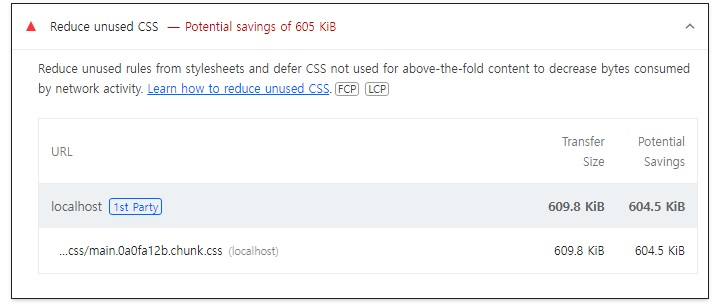
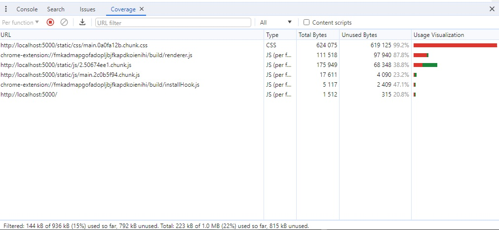

# 🐳 03. 홈페이지 최적화

## 🌏 불필요한 CSS 제거

Lighthouse결과를 다시 살펴보면, `Reduce unused CSS`항목이 있다. 말그대로 사용하지 않는 CSS를 지우면 성능에 긍정적인 영향을 준다는 것이다.



Coverage패널을 이용해보자. (우측의 More tools에 Coverage표시가 있다.)

Coverage패널은 페이지에서 사용하는 JS및 CSS리소스에서 실제로 실행하는 코드가 얼마나 되는지 알려주고, 그 비율을 표시해준다.



우측의 **Unused Bytes(사용하지 않는 바이트)**와 **Usage Visualization(사용량 시각화)**에서 전체 코드 대비 실행된 코드 양을 비율로 보여준다.

js파일의 경우 if문으로 실행 되었다 안되었다하기 때문에 어느정도 커버리지를 감안해야한다.

하지만 css의 경우 별다른 분기가 없지만, 상당히 많은 유틸클래스가 사용되지 않았음을 확인할 수 있다.

<br/>

### 👉 PurgeCSS

`PurgeCSS`는 파일이 있는 모든 키워드를 추출해 해당 키워드를  이름으로 갖는 css만 보존하고, 나머지는 모두 지우는 방식으로 파일을 최적화 한다.

```shell
npm i --save-dev purgecss
```

keyword를 추출할 파일과 불필요한 클래스를 제거할 css파일 지정하여 script작성.

```json
"scripts": {
	...
  "purge": "purgecss --css ./build/static/css/*.css --output ./build/static/css/--content ./build/index.html ./build/static/js/*.js"
  },
```

그냥 실행했을 때 클래스명중 `lg:m-8`의 경우 콜론때문에 lg와 m-8이 다르게 인식되버려 스타일이 깨진다.

config파일을 추가하여 아래처럼작성.

```js
// purgecss.config.js
module.exports = {
  defaultExtractor: (content) => content.match(/[\w\:\-]+/g) || []
}
```

`defaultExtractor`는 인자로 대상 파일의 전체 코드를 넘겨받고 문자열 배열을 반환한다.

인자로 받은 전체 코드는 match메서드를 통해 정규식에 만족하는 키워드를 배열 형태로 추출한다. 그리고 이 문자여 ㄹ배열이 클래스를 필터링할 텍스트 키워드가 되는 것이다.

script 내용에 config경로를 추가하여 수정

```json
"scripts": {
	...
	"purge": "purgecss --css ./build/static/css/*.css --output ./build/static/css/ --content ./build/index.html ./build/static/js/*.js --config ./purgecss.config.js"
  },
```

```shell
npm run build
npm run purge
```

다시 실행해보면, 정상 반영된것을 확인할 수 있다.

> PurgeCSS로 사용하지 않는 스타일을 지웠는데도 왜 사용하지 않는 코드 비율이 75%나 되는가?
>
> Coverage패널은 파일의 코드가 실행되었는지 아닌지 체크한다. 만약 if같은 조건문을 통해 분기가 일어났다면 일부 코드는 실행되지 않을 것이고, Coverage패널에서도 해당 코드는 실행되지 않았다고 체크할 것이다.
>
> 이후 사용자가 서비스를 이용하다 해당 코드가 실행되면, 그때 해당 코드가 실행되었다고 표시하며 Coverage패널의 결과도 변한다.
>
> CSS도 만찬가지로 페이지에 따라 아직 표시되지 않은 요소들이 있기 때문에 처음부터 모든 css코드가 실행되지 않는다. 
>
> **❗ 즉, 코드의 실행 비율은 사용자가 서비스를 이용하면서 조금씩 증가한다.**
