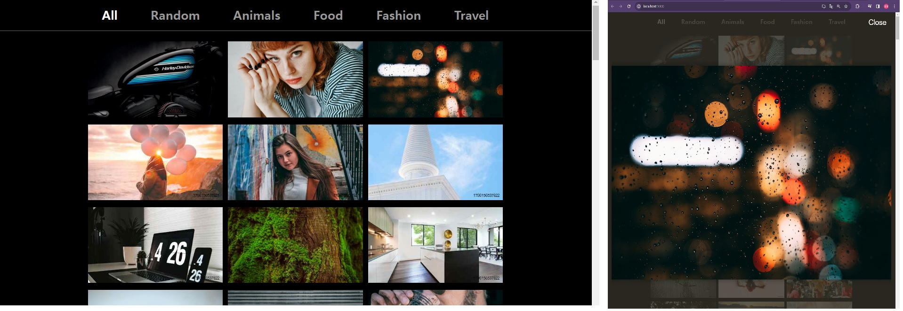

# 🐳 04. 이미지 갤러리 최적화

## 🌏 학습할 최적화 기법 및 간단한 소개

* 이미지 지연 로딩
* 레이아웃 이동 피하기
* 리덕스 렌더링 최적화
* 병목 코드 최적화

### 👉 이미지 지연 로딩

3장에서는 Intersection Observer를 사용했다면, 이번엔 npm에 등록된 라이브러리를 이용

### 👉 레이아웃 이동 피하기

`레이아웃 이동(Layout shift)`은 화면상의 요소 변화로 레이아웃이 갑자기 밀리는 현상. 이를 분석하고 해결해보자.

### 👉 리덕스 렌더링 최적화

리덕스의 useSelector훅을 이용해 리덕스에 저장된 데이터를 가져올 수 있는데 이 과정에서 성능 문제가 발생할 수 있다.

이를 해결하고 효율적으로 사용할 수 있는 방법을 알아보자.

### 👉 병목코드 최적화

로직 개선과 메모이제이션을 통해 성능문제를 해결해 볼 것이다.

<br/>

## 🌏 분석 툴 소개

* React Developer Tools(Profiler)
  * Profilers패널을 사용할 예정.
  * 리액트 프로젝트를 분석하여 얼마만큼의 렌더링이 발생하고 어떤 컴포넌트가 렌더링되었는지, 그리고 어느 정도의 시간이 소요됐는지 플레임차트로 보여준다.

<br/>

<br/>

## 🌏프로젝트 살펴보기

**❗ 프로젝트는 Node 16Version에서 진행할 것!**

```shell
npm install
npm start
npm run server
```



* 이미지를 클릭하면, 화면 위로 이미지가 뜨는것을 볼 수 있다.
* 이미지 뒤의 배경색이 이미지 전체적인 색상과 비슷하게 맞춰진다.
* 하지만, 이미지가 늦게뜨고, 한참뒤에 배경이 변한다는 점이 있다.

<br/>

### 👉 살펴 볼 곳.

* Redux 스토어 코드가 redux폴더에 존재.

* 해당 스토어와 연결되는 컨테이너 컴포넌트가 containers폴더에 존재.

* 유틸의 getAverageColorOfImage함수로 픽셀 값의 평균을 구해준다.


