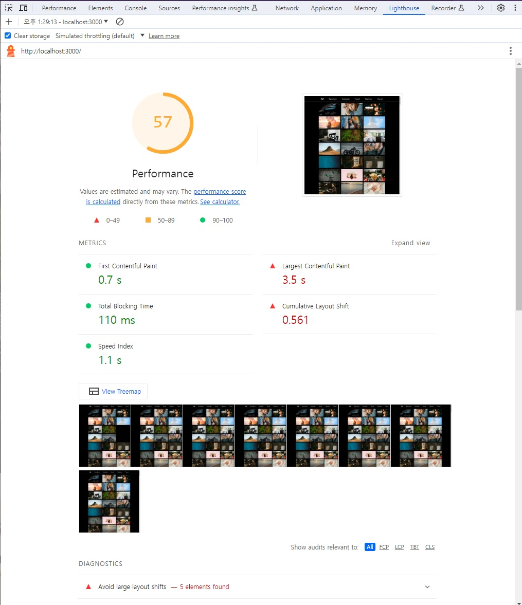
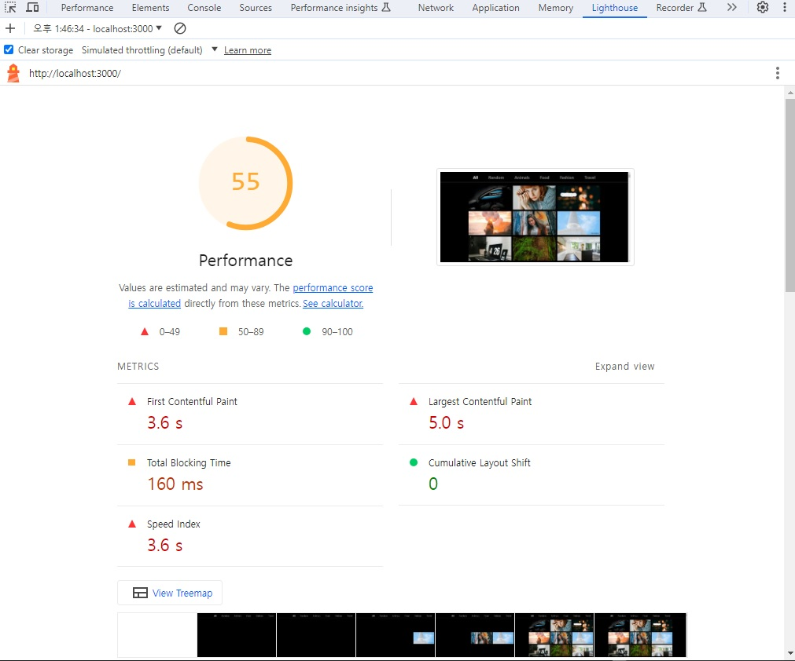

# 🐳 04. 이미지 갤러리 최적화

## 🌏 레이아웃 이동 피하기

`레이아웃 이동`이란, 화면상의 요소 변화로 레이아웃이 갑자기 밀리는 현상을 말한다.<br/>( 예제의 경우, 새로고침시에 앞의 이미지가 늦게 로드되서 뒤의이미지가 밀려나는 현상. )



초기 라이트하우스의 검사 결과이다.

**레이아웃 이동이 얼마나 발생하는지**를 나타내는 지표(**CLS - Cumulative Layout Shift**)를 살펴보자.

이 점수는 0~1까지 값을 가지며, 전혀 발생하지않으면 0 반대가 1이다.

Performance패널의 Experience 부분을 살펴보면, LayoutShift가 발생했다는 것을 확인할 수 있다.

<br/>

### 👉 레이아웃 이동의 원인

원인은 다양한데, 가장 흔한 경우를 나열하면 크게 4가지 정도가 있다.

* 사이즈가 미리 정의되지 않은 이미지 요소
* 사이즈가 미리 정의되지 않은 광고 요소
* 동적으로 삽입된 콘텐츠
* 웹 폰트(FOIT, FOUT)

해당 예제에서는 `사이즈를 미리정의하지 않은 이미지`가 원인이다.

<br/>

### 👉 레이아웃 이동 해결

레이아웃 이동을 일으키는 요소의 사이즈를 지정해서 해결하면 된다. 하지만, 갤러리의 이미지 사이즈는 브라우저의 크기에 따라 변한다.

그에 따라 설정하는 방법이 2가지가 있다. 첫 번째는 padding을 이용하여 박스를 만든 뒤, 그 안에 이미지를 absolute로 띄우는 방식이다.

```html
<div class="wrapper">
  
</div>
```

```scss
.wrapper{
  position:relative;
  width:160px;
  padding-top:56.25%; // 16:9비율
}
.image{
  position:absolute;
  width:100%;
  height:100%;
  top: 0;
  height: 0;
}
```

하지만, 매전 padding을 매번 계산해야한다는 점이 불편하다.

그래서 사용할 수 있는 두번째 방법이 `aspect-ratio`라는 css속성이다.

```scss
.wrapper{
  width:100%;
  aspect-ratio: 16/9;
}
.image{
  width:100%;
  height:100%;
}
```

해당 속성으로 비율만명시해주고, position을 적용해줄 필요가 없다. 하지만 일부 브라우저에서는 지원하지 않으므로, 호환성을 잘체크하고 적용해야한다.

예제에서는 padding을 이용해서 적용해보자.

```js
const ImageWrap = styled.div`
  /*너비는 상위 컴포넌트에서 정의*/
  width: 100%;
  padding-bottom: 56.25%;
  position: relative;
`;

const Image = styled.img`
  cursor: pointer;
  width: 100%;
  position: absolute;
  height: 100%;
  top: 0;
  left: 0;
`;
```

이제 새로고침하게 되면, 고정된 위치에서 렌더링 되는 것을 확인할 수 있고, CLS도 0점이 나온다.

즉, 레이아웃 이동이 없어졌다는 것이다.


