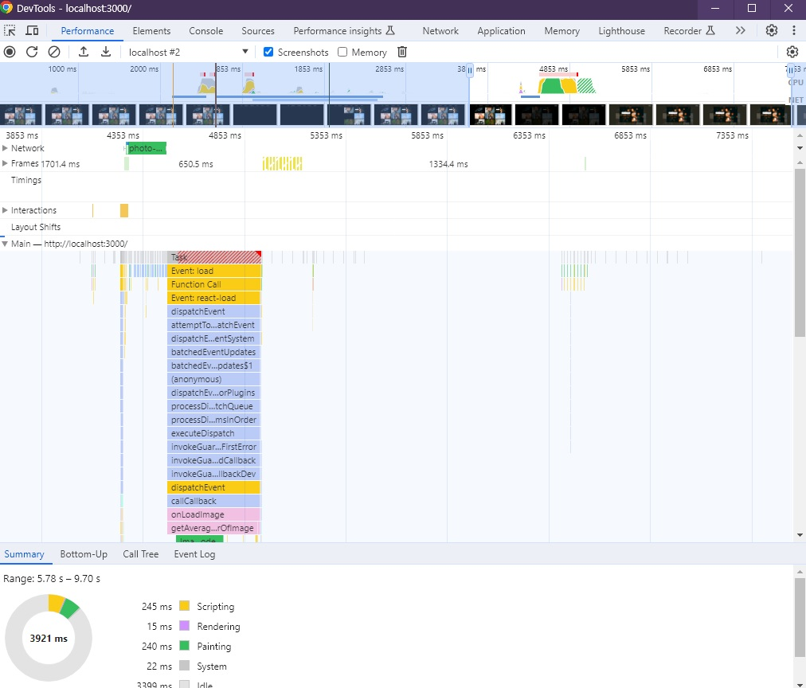

# 🐳 04. 이미지 갤러리 최적화

## 🌏 병목 코드 최적화

### 👉 이미지 모달 분석

1장때 처럼 Performance 탭을 사용해보자.

* 최초 로드 될때
* 카테고리를 변경했을 때
* 이미지 모달을 띄웠을 때

직접 이미지 갤러리를 탐색해보면 페이지 로딩과정과 카테고리 변경 과정에서 별로 느린느낌이 없지만, 이미지를 클릭해서 이미지 모달을 띄웠을 때는 이미지도 늦게 뜨고 배경색도 늦게 변한다.<br/>이미지가 늦게 뜨는 것은 사이즈가 커서 그럴 수 있지만, 배경색이 늦게 변하는것은 문제가 있다.



`getAverageColorOfImage`함수작업을 하고, 마지막에 iageDecode작업이 보인다. 그리고 해당 작업이 끝나고, 새롭게 렌더링되면서 변경된 배경화면에 보인다.

### 👉 getAverageColorOfImage 함수 분석

이 함수는 이미지의 평균 픽셀 값을 계산하는 함수로 캔버스에 이미지를 올리고 픽셀 정보를 불러온 뒤 하나씩 더해서 평균을 내고 있다.

그래서 큰 이미지를 통째로 캔버스에 올려 반복문을 통해 가져온 픽셀 정보를 하나하나 더하고 있어 느리다.

#### 🔸 메모이제이션으로 코드 최적화하기

`메모이제이션`이란 한 번 실행된 함수에 대해 해당 반환 값을 기억해 두고 있다가 똑같은 조건으로 실행되었을 때 함수의 코드를 모두 실행하지 않고 바로 전에 기억해 둔 값을 반환하는 기술.

메모이제이션을 적용하는 대상이나 방식에 따라 코드는 달라져도, **결과를 저장해두고 재활용한다는 개념은 동일**하다.

적용해보자

```javascript
const cache = {};

export function getAverageColorOfImage(imgElement) {
  if (cache.hasOwnProperty(imgElement.src)) {
    return cache[imgElement.src];
  }
	...
  cache[imgElement.src] = averageColor;

  return averageColor;
}
```

이제 처음 동작은 배경 색이 늦게뜨지만, 이후 동작에서는 빠르게 적용되는 것을 볼 수 있다.

> 메모이제이션 단점
>
> 값을 저장하여 재활용하기 때문에 두 번째 실행부터는 성능이 대폭 향상된다는 장점이있다.
>
> 하지만, 여전히 첫 번째 실행이 느리다는 단점이 있다.
>
> 또한, 항상 새로운 인자가 들어오는 함수는 메모이제이션을 적용해도 재활용할 수 있는 조건이 충족되지 않아 오히려 메모리만 잡아먹는 골칫거리가 된다.
>
> **따라서 해당 로직이 동일한 조건에서 충분히 반복 실행되는지 먼저 체크해야 한다.**

<br/>

#### 🔸 함수의 로직 개선

여전히 첫 번째 실행시 변화가 느리다는 단점을 고쳐보자.

느린 코드는 캔버스에 이미지를 올리고, 픽셀 정보를 불러오는 drawImage와 getImageData함수, 그리고 모든 픽셀에 대해 실행되는 반복문이다.  3가지모두 이미지의 사이즈에 따라 작업량이 결정되기 때문에 **이미지 사이즈를 줄여** 작업량을 줄여볼 수 있을 것이다.

어떻게 사이즈를 줄일까?

```json
{
  "photos": [
    {
      "id": "sYbVbxSmdVQ",
      "alt": "black Harley-Davidson motorcycle wallpaper",
      "urls": {
        "small": "https://images.unsplash.com/photo-1558980664-4d79c6e77b93?ixlib=rb-1.2.1&q=100&fm=jpg&cs=tinysrgb&w=800&h=450&fit=crop&ixid=eyJhcHBfaWQiOjExMzQyMX0",
        "full": "https://images.unsplash.com/photo-1558980664-4d79c6e77b93?ixlib=rb-1.2.1&q=85&fm=jpg&cs=srgb&ixid=eyJhcHBfaWQiOjExMzQyMX0"
      },
      "category": "random"
    },
    {
      "id": "gok_MXg2Ntk",
      "alt": null,
      "urls": {
        "small": "https://images.unsplash.com/photo-1580893472468-01373fe4c97e?ixlib=rb-1.2.1&q=100&fm=jpg&cs=tinysrgb&w=800&h=450&fit=crop&ixid=eyJhcHBfaWQiOjExMzQyMX0",
        "full": "https://images.unsplash.com/photo-1580893472468-01373fe4c97e?ixlib=rb-1.2.1&q=85&fm=jpg&cs=srgb&ixid=eyJhcHBfaWQiOjExMzQyMX0"
      },
      "category": "random"
    },
    ...
  ]
}
```

사진 정보를 보면, 섬네일과 원본 이미지 2개가 존재한다. 그렇기 때문에 현재 원본 이미지로 하는 작업을 섬네일 이미지로 작업을 한다면 작업량이 많이 단축 될 것이다. 또한, 섬네일 이미지를 사용해 원본 이미지가 다운로드 되기 전에 계산할 수 있어 더 빠르게 배경색을 적용할 수 있을 것이다.

ImageModal컴포넌트에서는 ㅅ머네일 이미지 요소를 가져올 수 없으니 PhotoItem컴포넌트에서 배경색을 계산하도록 수정하자.

```jsx
...
function PhotoItem({ photo: { urls, alt } }) {
  const dispatch = useDispatch();

  const openModal = e => {
    dispatch(showModal({ src: urls.full, alt }));

    // 섬네일 이미지로 배경색 계산 후, 리더긋에 저장
    const averageColor = getAverageColorOfImage(e.target);
    dispatch(setBgColor(averageColor));
  };

  return (
    <ImageWrap>
      <LazyLoad offset={1000}>
        <Image
          src={urls.small + '&t=' + new Date().getTime()}
          alt={alt}
          onClick={openModal}
          crossOrigin="*"
        />
      </LazyLoad>
    </ImageWrap>
  );
}
```

이제 원본 이미지가 아닌 섬네일 이미지로 색상을 계산해 더욱 빠르고, 원본 이미지가 다운로드 되지 않아도 배경 색을 설정할 수 있기 때문에 병렬적으로 배경색이 설정 된다.
