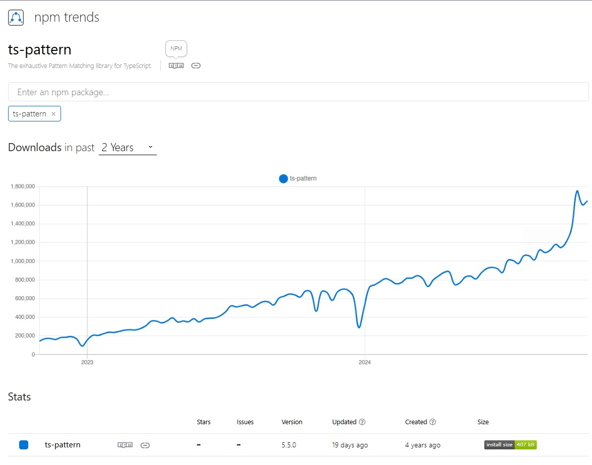

# 🐳 ts-pattern

패턴 매칭을 Typescript환경에서 사용할 수 있는 라이브러리.

## 🌏개요

패턴 매칭을 Typescript환경에서 사용할 수 있는 라이브러리. <br/>(tc39에서도 제안하는 라이브러리)

조건에 따라 다른 로직을 수행해야할 때? → `if문`, `switch문`, ...  → 복잡해지는 조건들 → 분기문이 많아지고, 유지보수는 더 어려워짐. + TS에서는 타입이 추가될 때마다 모든 분기 조건을 다 신경써야하며, 이를 놓쳤을때 버그 발생.

`ts-pattern`은 이런 문제를 해결하기 위해 도입되었고, TC39에서 제안한 패턴 매칭을 기반으로 하고 있음.

> 패턴매칭
>
> 데이터를 검색할 때 특정 패턴이 출현하는지, 또 어디에 출현하는지 등을 특정하는 방법.
>
> 검색, 분석, 정규화, 추츨 등 다양한 분야에서 사용하고 있으며, JS에서도 정규표현식을 활용하여 문자열에서 특정 패턴을 찾아 검색, 추출, 대체등을 수행할 때 사용하는 개념이다.
>
> Javascript에서 패턴매칭은 아직 Stage1이기 때문에 라이브러리의 도움을 받아야 한다.



<br/><br/>

## 🌏 어떻게 사용할까?

```ts
import { match } from 'ts-pattern';

const value = [1, 2, 3];

const result = match(value)
  .with([1, 2, 3, 4], () => 'it is [1, 2, 3, 4]')
  .with([1, 2, 3], () => 'it is [1, 2, 3]')
  .with([1, 2], () => 'it is [1, 2]')
  .run();

console.log(result); // it is [1, 2, 3]
```

### 👉 match(value)

`ts-pattern`이 내부적으로 `MatchExpression`이란 클래스를 사용해 매칭을 처리함.

이 클래스의 인스턴스를 생성하여 반환해주는 간단한 함수. → 항상 선행 되어야 한다.

### 👉 with(pattern, [...patterns], handler)

입력값을 패턴별로 매칭 시켜주는 메서드

패턴 인자의 타입은 일반적으로 입력값의 타입에 의해 결정된다.

```ts
import { match } from 'ts-pattern';

const upperCase: string = 'A';
const printUpper = () => 'it is upper';
const printLower = () => 'it is lower';

const first = match(upperCase)
  .with('a', printLower)
  .with('b', printLower)
  .with('A', printUpper)
  .with('B', printUpper)
  .otherwise(() => 'where is it?');

const second = match(upperCase)
  .with('a,', 'b', printLower)
  .with('A', 'B', printUpper)
  .otherwise(() => 'where is it?');

console.log(first); // 'it is upper'
console.log(second); // 'it is upper'
```

이처럼 `.with()`는 체이닝 되는것 처럼 **호출 순서가 위에서 아래**로 흐른다. 중첩객체  처럼 복잡한 구조를 가진 패턴들을 검사하고자 한다면, **항상 세부적인 형태의 패턴은 먼저 검사를 해야한다.**

### 👉 exhaustive(), otherwise(), run()

이 메서드들은 결과를 반환하기 위해서는 반드시 써야하기 때문에 특징들을 잘 알고 ㅣㅇㅆ어야 한다.

| 메서드                                                    | 설명                                                         |
| :-------------------------------------------------------- | :----------------------------------------------------------- |
| `exhaustive(): TOutput`                                   | - **입력 값과 일치하는 패턴이 없으면 타입 체크가 실패한다.** (철저한 타입 체크, Exhaustiveness Type Check) - **일치하는 패턴이 런타임에 꼭 있어야 한다.** (그렇지 않으면 오류가 발생한다.) |
| `otherwise(handler: (value: TInput) => TOutput): TOutput` | - **일치하는 패턴이 없을 경우에 실행된다.** - `switch`의 `default`로 생각하면 편하다. |
| `run(): TOutput`                                          | - **일치하는 패턴이 런타임에 꼭 있어야 한다.** (그렇지 않으면 오류가 발생한다.) |

<br/>

### 👉 isMatching(pattern, value?)

`isMatching`은 타입 가드 함수이다.

- `isMatching(pattern, value): boolean`: 패턴과 값의 매치가 성공하면 결과를 `boolean` 값으로 알려준다.
- `isMatching(pattern): (value) => boolean` : 패턴만 넣고 함수를 실행하면 해당 패턴에 대한 타입 가드 함수가 반환된다.

커링이 된 버전

```ts
import { isMatching } from 'ts-pattern';

const isDiscountProduct = isMatching({
  salePrice: P.number.gt(0),
  discountedSalePrice: P.number.gt(0),
});

if (isDiscountProduct(res.data)) {
  // do something!
}
```

### 👉 Patterns

`.with`와 `isMatching`의 인자로 들어가는 패턴들

- **`Literals`**
- **`Wildcards`**
- **`Objects`**
- **`Tuples (arrays)`**
- **`Sets`**
- **`Maps`**
- **`P.array patterns`**
- **`P.when patterns`**
- **`P.not patterns`**
- **`P.select patterns`**
- **`P.optional patterns`**
- **`P.instanceOf patterns`**
- **`P.union patterns`**
- **`P.intersection patterns`**
- **`P.string predicates`**
- **`P.number and P.bigint predicates`**

<br/><br/>

## 🌏 if문을 대체 할 수 있을까?

[ts-pattern-benchmark](https://github.com/bdbaraban/ts-pattern-benchmark)

최근 ts-pattern 벤치마크에 따르면 기본 `if/else`, `switch`, `삼항연산자`에 비해 성능이 현저히 떨어진다.

`if/else`는 초당 약 10억회 이상 연산을 처리할 수 있지만, `ts-pattern`의 `.exhaustive()`,`.otherwise()`, `.run()`같은 메서드는 초당 130만회 정도의 연산을 수행하며 99%더 느려진다.

### 👉 원인

`ts-pattern`은 다양한 데이터 구조와 복잡한 타입 추론을 지원하기 위해 입력 타입의 가능한 모든 경우를 사전에 계산하는데, 내부 코드를 봤을 때 `match.ts`에서 클래스 기반으로 패턴 매칭을 구현하고, this를 사용해 상태를 함수 체이닝을 통해 공유하여 안전한 타입 매칭을 제공하기 때문에 기본 `if/else`보다 성능이 떨어질 수 밖에 없다.

### 👉 실제로?

복잡한 분기 로직이나 타입체크가 필요한 상황에서는 큰 도움이 되었지만, 대부분 복잡하지 않은 코드에서 사용되고 있엇고 오히려 오버엔지니어링처럼 느껴진다.

<br/>

## 🌏 복잡한 분기문을 간결하고 안전하게 처리하는 방법

### 👉 1. 단순하고 안전하게 처리하기

복잡한 분기는 피할 수 있다면 `if/else`, 또는 `switch`로 단순하게 표현하는 것이 좋다.

```ts
type 가위바위보타입 = '가위' | '바위' | '보';

function 가위바위보처리(union: 가위바위보타입) {
  switch (union) {
    case '가위':
      console.log("✌️ 가위를 선택하셨습니다.");
      break;
    case '바위':
      console.log("✊ 바위를 선택하셨습니다.");
      break;
    case '보':
      console.log("🖐 보를 선택하셨습니다.");
      break;
    default:
      // 타입스크립트가 모든 케이스를 처리했는지 확인하는 검증
      union satisfies never; 
      neverCheck(union);
  }
}

function neverCheck(v: never) {
  // 여기에 적절한 에러 처리를 넣습니다.
}
```

* `union satisfies never` : <br/>`union`타입 이외에 처리되지 않은 다른 케이스가 없는지를 타입 시스템에서 강제. 만약 새로운 타입이 추가되었는데 처리되지 않았다면, Typescript 경고를 발생시켜 코드 안정성을 높일 수 있다.<br/>만약 처리되지 않은 케이스가 있다면, neverCheck()같은 코드로 런타임에러를 발생시키고, 이를 `ErrorBoundary`나 `Sentry`와 연동하여 더욱 안정적인 에러 처리와 모니터링이 가능하다.

<br/>

### 👉 JSX코드에서 선언적 분기 처리(Typescript)

match인터페이스와 체이닝을 통해 코드를 선언적으로 쓸 수 있다는 장점이 있다.

```ts
import { match } from 'ts-pattern';

type 가위바위보타입 = '가위' | '바위' | '보';

const 가위바위보 = ({ choice }: { choice: 가위바위보타입 }) => {
  return (
    <div>
      {
        match(choice)
          .with('가위', () => <div>✌️ 가위를 선택하셨습니다!</div>)
          .with('바위', () => <div>✊ 바위를 선택하셨습니다!</div>)
          .with('보', () => <div>🖐 보를 선택하셨습니다!</div>)
          .exhaustive()  // 모든 가능한 값이 처리되었는지 체크
      }
    </div>
  );
};
```

## 📘 참고

* [Blog - ts-pattern](https://www.kimcoder.io/blog/ts-pattern)
* [Toss Tech Blog](https://toss.tech/article/ts-pattern-usage)
* [TC39 - proposal-pattern-matching](https://github.com/tc39/proposal-pattern-matching?tab=readme-ov-file#userland-matching)