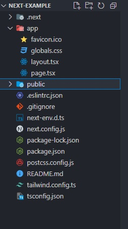

# 🐳 04. 서버 사이드 렌더링

## 🌏 4.1  서버 사이드 렌더링이란?

먼저, 왜 서버사이드 렌더링이 주목받게 됐는지 알아보자.

<br/>

### 👉 4.1.1 싱글 페이지 애플리케이션의 세상

#### 🔸 싱글 페이지 애플리케이션?

`싱글 페이지 애플리케이션 (Single Page Application : SPA)`는 렌더링과 라우팅에 필요한 대부분의 기능을 브라우저의 자바스크립트에 의존하는 방식이다.

최초 첫 페이지에서 데이터를 불러온 이후 페이지 전환을 위한 모든 작업이 브라우저의 `history.pushState`와 `history.replaceState`로 이뤄지기 때문에 페이지를 불러온 이후엔 서버에서 HTML을 받지 않고 하나의 페이지에서 모든 작업을 처리한다.

실제 개발자도구로 SPA의 코드를 보면, `<body>`안에 내용이 없는 것을 볼 수 있다.<br/> => 여기에 **들어갈 내용들을 js로 넣는다**.<br/>또 페이지 전환시에도 새로운 HTML 페이지를 요청하는게 아니라 JS에서 다음 페이지의 렌더링에 필요한 정보만 HTTP 요청 등으로 가져온 다음, 결과를 `<body>`내부에 DOM을 추가 수정 삭제 하는 방법으로 페이지가 전환된다.

**최초 로딩해야할 자바스크립트 리소스가 커지는 단점**이 있지만 한 번 **로딩된 이후에 서버를 거쳐 필요한 리소스를 받아올일이 적어지기 때문에 사용자에게 훌륭한 UI/UX를 제공한다는 장점**이 있다.

<br/>

#### 🔸 전통적인 방식의 애플리케이션과 싱글 페이지 애플리케이션의 작동 비교

네이버같은 대형 포털 사이트에서 서버사이드에서 작동하던 애플리케이션을 생각해보면, `페이지 전환이 발생할때마다 페이지를 요청하고,` HTML 페이지를 다운로드해 파싱하는 작업을 거친다.<br/>=> 페이지를 처음부터 그려야 해서 일부 사용자는 **페이지 전환마다 부자연스러움**을 느낀다.

이런 페이지 전환을 모두 **JS로 한다면**, 최초에 한번 모든 리소스를 다운하고나면 이후 페이지 전환 시 추가로 리소스를 다운할 시간이 필요 없어진다. **페이지 전체가 아니라 일부만 다시 그려 매끄러운 UI를 보여 줄 수 있다**.

이런 장점으로 최근 웹페이지들은 싱글 페이지 렌더링 방식을 많이 선택했다.

<br/>

#### 🔸 싱글 페이지 렌더링 방식의 유행과 JAM 스택의 등장

 어떻게 싱글 페이지 렌더링 방식이 등장하였는지 알아보자.

1. 과거 PHP, JSP를 기반으로 대부분의 웹 애플리케이션이 만들어졌을 때는 거의 대부분 서버사이드에서 렌더링이 이루어졌다. `(페이지요청 -> 서버에서 완성된 HTML 받고 -> 이동 시 새 페이지를 서버에서 내려받음)`
2. JS가 서서히 다양한 작업을 수행하면서 `JS를 모듈화하는 방안이 점차 논의`되고, 이에따라 `CommonJS`, `AMD(Asynchronous Module Definition)`이 등장했다.
3. 이런 변화에 따라 2010년경 `Backbone.js`, `AngularJS`, `Knockout.js`등이 MVx 프레임워크를 구현하기 시작함.<br/>JS의 역할과 규모가 점점 커져간다.
4. 이후  React, Vue, Angular의 시대가 오게 된다.<br/>웹페이지의 모든 영역( 페이지의 렌더링에서부터 사용자 인터렉션까지 )을 담당하면서 이를 모두 아우를 수 있는 방식인 **싱글 페이지 렌더링이 인기를 얻게 됐다.**
5. 단순히 더 멋진 UX를 제공하는것이 끝이아니라, PHP시절 개발시 어려웠던 점을 개선하여 **더 간편한 개발 경험을 제공**하고, 간단히 웹 애플리케이션을 만들수 있기 때문에 선택되었다.
6. 이떄 SPA의 유행으로 생긴 용어가 바로 **JAM 스택**이다.

> JAM (Javascript, API, Markup) 스택
>
> 웹은 `LAMP 스택`, 즉 Linux, Apache, MySQL, PHP/Python등으로 구성되어 있었고, 과거에 웹 애플리케이션 확장 시 문제가되었던게 바로 서버 의존적인 문제였다.<br/>앞의 프레임워크들이 등장하면서 JAM(Javascript, API, Markup) 스택이 등장하였다.
>
> Frontend는 JS와 Markup을 미리 빌드해두고, 정적으로 사용자에게 제공하면 이후 작동은 모두 사용자의 클라이언트에서 실행되어 서버 확장성 문제에서 좀 더 자유로워 질 수 있었다.
>
> JAM스택의 인기와 Node.js의 고도화에 힘입어 MEAN(Mongo DB, Express.js, Angular, Node.js), MERN(Mongo DB, Express.js, React, Node.js)스택처럼 아예 API 서버 자체도 자바스크립트로 구현하는 구조가 인기를 끌기 시작했다.

❗ Google Trends에서 LAMP, MEAN, MERN의 스택들을 비교해보면 과거에 인기를 끌던 LAMP나 MEAN의 사용도가 ㅈ루어들고, MERN스택이 대세가 되고있음을 볼 수 있다.

<br/>

### 📘 참고

* [Google Trends - php vs react](https://trends.google.com/trends/explore?date=today%205-y&geo=KR&q=php,react&hl=ko)
* [Google Trends - LAMP vs MEAN vs MERN](https://trends.google.com/trends/explore?date=today%205-y&geo=KR&q=LAMP%20stack,MEAN%20stack,MERN%20stack&hl=ko)

<br/>

####  🔸 새로운 패러다임의 웹서비스를 향한 요구

자바스크립트의 코드규모가 커짐에 따라 이에 대해 우려의 목소리가 나오기 시작했지만, 기술의 발전으로 자연스레 해결될거라 생각했다. (2012년 대비 리소스양이 100배 이상 증가함.) 과거와 비교했을 때 Javascript 파싱을 위해 CPU를 소비하는 시간이 눈에 띄게 증가했다. 그만큼 코드의 양이 증가했다는 거다.

물론 SPA의 탓은 아니다. 과거 웹 애플리케이션은 단순히 무언가 정보를 보여주기 위한 수단이였지만, 현재는 다양한 작업을 처리하고, 앱 내부에서도 웹처럼 동작하는 경우도 많다.

과거와 비교했을 때 사용자의 기기나 인터넷 속도등 **웹 환경이 전반적으로 크게 개선됐지만, 사용자들이 느끼는 로딩속도는 5년전이나 지금이나 크게 차이가 없거나 오히려 더 느리다.**

<br/>

### 👉 4.1.2 서버 사이드 렌더링이란?

SPA가 자바스크립트를 활용해 하나의 페이지에서만 렌더링을 수행한다면, **SSR(Server Side Rendering)**은 **최초에 사용자에게 보여줄 페이지를 서버에서 렌더링해 빠르게 사용자에게 화면을 제공하는 방식**을 의미한다.

❗ 웹 페이지가 점점 느려지는 상황에 대한 문제의식을 SPA의 태생적인 한계에서 찾고, 이를 개선하고자 SSR로 페이지를 제공하는 방식이 떠오르고 있다.


위 사진에서 볼 수 있듯이 MPA는 모든 페이지를 서버에서 요청받은 후 완성된 HTML을 렌더링한다.

즉,  SPA와 SSR의 차이는, 웹페이지 **렌더링의 책임을 어디에 두느냐의 차이**이다.<br/>`SPA`는 사용자에게 제공되는 **자바스크립트 번들**에서, `SSR`은 렌더링에 필요한 작업을 모두 **서버**에서 수행한다.<br/>❗ 렌더링 되는 곳의 차이 때문에 **CSR은 사용자 기기의 영향을 받지만**, **SSR의 경우** 서버에서 제공하므로 **비교적 안정적인 렌더링이 가능**하다.

<br/>

#### 🔸 서버 사이드 렌더링의 장점

* 최초 페이지 진입이 빠르다
* 검색 엔진과 SNS 공유 등 메타데이터 제공이 쉽다
* 누적 레이아웃 이동이 적다
* 사용자의 디바이스 성능에 비교적 자유롭다.
* 보안에 좀 더 안전하다.

<br/>

##### 최초 페이지 진입이 빠르다

최초 사용자에게 보여줘야 할 화면에 표시할 정보가 외부 API호출에 많이 의지해야 한다고 가정해보자.<br/>(서버가 사용자에게 렌더링을 제공할 수 있을 정도의 충분한 리소스가 확보돼 있다고 가정)

SPA에서는 사용자가 해당 페이지에 진입하고, 리소스 다운하고, HTTP요청 수행하고, 렌더링할 것이다.<br/>이런 작업이 서버에서 이뤄지면 HTTP요청은 더욱 빠를 것이고, HTML을 그리는 작업도 서버에서 미리 그려서 내려주는 것이 기존 HTML에 삽입하는것 보다 빠르다.

❗ 서버가 사용자를 감당하지 못하고, 리소스 확보하기 어렵다면 오히려 SPA보다 느려질 수 있다.

<br/>

##### 검색 엔진과 SNS 공유 등 메타데이터 제공이 쉽다.

SSR은 **검색엔진최적화(SEO)**에 유리하다.

검색 엔진이 사이트에서 필요한 정보를 가져가는 과정을 먼저 알아보자.

1. 검색 엔진 로봇이 페이지에 진입.
2. 페이지가 HTML 정보를 제공해 로봇이 이 HTML을 다운한다. (**JS는 실행하지 않음**)
3. 다운로드한 HTML페이지 내부의 오픈 그래프나 메타 태그 정보를 기반으로 페이지의 검색(공유)정보를 가져오고 이를 바탕으로 검색엔진에 저장한다.

2번에 주목하자. 사용자의 경우 브라우저로 페이지 방문 시 JS를 실행하지만, 검색엔진의 경우 그렇지 않다.<br/>검색엔진은 페이지의 정적인 정보를 가져오는 것이 목적이기 때문이다.

그렇기 때문에 별도의 메타 정보를 제공하지 않는다면, CSR의 경우 불이익이 발생할 수 있다.

> 좀 더 쉽게 말하자면, 
>
> CSR의 경우 결과물에 `<div id="app> </div>`이러한 형식에 JS코드가 실행되어 app내부에 내용이 채워진다. 그러나 검색엔진은 JS코드를 실행하지 않으니까, 별도로 정보를 제공하지 않는다면, 어느 페이지에서든 같은 정보가 제공될 것이다.
>
> SSR의 경우 HTML이 다 그려져서 제공되기 때문에 정보가 다 올바르게 제공되므로 SEO에서 유리하다.

<br/>

##### 누적 레이아웃 이동이 적다.

> **누적 레이아웃 이동(Cumulative Layout Shift)**란?
>
> 사용자에게 페이지를 보여준 이후 뒤늦게 어떤 HTML정보가 추가되거나 삭제되어 마치 화면이 덜컹 거리는 것과 같은 부정적인 사용자 경험을 말한다.<br/>즉, 예기치 못한 시점에서 페이지가 변경되어 불편을 초래하는 것을 말한다.

만약, 뉴스 페이지의 경우에 기사는 로딩이 빨리 이뤄져 먼저 노출되는데, 이미지는 뒤늦게 로딩이 되면 글을 읽는중에 이미지만큼 밀려나면서 사용자에게 불편을 초래하게 된다.

SSR의 경우에 이런 작업들이 모두 완료되고 완성된 페이지가 제공되므로 비교적 적다.<br/>하지만, SSR도 완전히 자유로운 것은 아니다. 만약 완성되기까지 오래걸린다면, 최초 페이지 다운로드가 굉장히 느려질 수도 있다.

<br/>

##### 사용자의 디바이스 성능에 비교적 자유롭다.

자바스크립트의 리소스 실행은 사용자의 디바이스에서만 실행되므로 절대적으로 사용자 디바이스에 의존적이다.

SSR은 이런 부담을 서버에 나눌 수 있어 좀 더 자유롭다. 하지만, 인터넷 속도가 느리다면, 어떤 방법론을 쓰든 느릴 것이고, 서버에 부담이 가중됐을 떄 적절한 처리가 없으면 SSR도 충분히 느려질 수 있다.

<br/>

##### 보안에 좀 더 안전하다.

**JAM스택**을 사용한 프로젝트의 공통문제로 **애플리케이션의 모든 활동이 브라우저에 노출된다는 것**이다.<br/>(개발자도구에서 어떤 API를 쏘는지 등 대부분 확인이 가능.)

SSR의 경우 민감한 작업들을 서버에서 수행하고 결과만 브라우저에 제공해 이런 위협을 피할 수 있다.

<br/>

#### 🔸 서버 사이드 렌더링의 단점

* 소스코드를 작성할 때 항상 서버를 고려해야 한다.
* 적절한 서버가 구축돼 있어야 한다.
* 서비스 지연에 따른 문제.

<br/>

##### 소스코드를 작성할 때 항상 서버를 고려해야 한다.

서버환경을 항상 고려해야한다. 그 중 하나가 바로 브라우저의 전역객체인 `window`나 `sessionStorage`같은 브라우저에만 있는 전역 객체 등이다.

만약 라이브러리에서 window를 사용하고 있다면, 서버에서 실행됐을때 에러가 발생한다. 만약 window를 사용해햐한다면, 서버 사이드에서 실행되지 않도록 해야한다.

그리고 클라이언트에서 실행되는 코드가 많아질수록 SR의 장점을 잃는 셈이니 주의해야한다.

<br/>

##### 적절한 서버가 구축돼 있어야 한다.

SPA의 경우 단순히 리소스를 다운할 준비하고, 서버는 정적인 데이터인 js와 html을 제공하면 모든 역할이 끝난다.

SSR의 경우 사용자의 요청을 받아 렌더링을 수행할 서버가 필요하고, 이를 구축하는게 쉬운일은 아니다.<br/>(사용자의 요청에 따라 적절한 대응을 할 수 있는 물리적인 가용량 확보, 예기치 못한 장애 상황에 대응할 수 있는 복구 전략, 요청 분산, 프로세스가 다운될 때를 대비해 `PM2`같은 **프로세스 매니저의 도움**도 필요하다)

<br/>

##### 서비스 지연에 따른 문제

SPA의 경우 느린 작업 발생 시 로딩중이란 UI를 보여주며, 진행 중임을 안내하면 된다.

하지만, SSR의 경우 최초 렌더링 시 이런 문제가 발생하면 문제가 된다.<br/>서버에서 보여줄 페이지에 대한 렌더링 작업이 끝나기 까지 사용자에게 그 어떤  정보도 제공해줄  수 없다.<br/>애플리케이션이 복잡해지고, 규모가 커짐에 따라 다양한 요청에 얽혀 병목현상이 심해진다면 ssr이 더 안좋은 사용자경험을 제공해 줄 수도 있다.

<br/>

### 📘 참고

* [Lvivity - SPA vs MPA](https://lvivity.com/single-page-app-vs-multi-page-app)
* [PM2 공식사이트](https://pm2.keymetrics.io/)

<br/>

### 👉 4.1.3 SPA와 SSR을 모두 알아야 하는 이유

#### 🔸 서버 사이드 렌더링 역시 만능이 아니다.

클라이언트의 무거운 작업을 서버에 미룬다 해도 모든 성능 문제가 해결되는 것은 아니다.

잘못된 셜계는 오히려 성능을 해칠 뿐만 아니라 눈에 띄는 성능 개선도 얻지 못하고, 오히려 관리포인트가 늘어나기만 한 역효과를 낳게된다.

웹페이지의 설계와 목적, 그리고 우선순위에 따라 SPA가 더 효율적일 수도 있다.

<br/>

#### 🔸 싱글 페이지 애플리케이션과 서버 사이드 렌더링 애플리케이션

SPA와 LAMP스택과 같이 서버에서 모든 페이지를 각각 빌드하는 SSR방식인 MPA에 대해서는 다음과 같이 이야기 할 수 있다.

1. 가장 뛰어난 SPA는 가장 뛰어난 MPA보다 낫다.<BR/>Gmail처럼 완성도가 뛰어난 spa가 있다고 가정해보자. <br/>최초 진입시 **필요한 정보만 최적화해 요청해 렌더링**하고, 이미지같은 **리소스는 게으른 로딩**으로 렌더링에 방해되지 않도록 처리했으며, **`코드 분할(code splitting)`또한 칼같이 지켜 불필요한 js리소스의 다운및 실행을 방지**했다.<br/>라우팅이 발생하면, 변경이 필요한 영역만 교체하여 피로감을 최소화 시켰다. 이런 매끄러운 라우팅보다 뛰어난 성능은 SSR에서 보여주기 어렵다.
2. 평균적인 SPA는 평균적인 MPA보다 느리다.<br/>서버는 안정적인 리소스를 기반으로 매 요청마다 비슷한 성능의 렌더링을 수행할 것이다. <br/>그러나 일반적인 SPA는 렌덜이과 라우팅에 최적화가 돼 있지 않다면 사용자 기기에 따라 성능이 들쑥날쑥하고, 적절한 성능 최적화도 돼 있지 않을 가능성이 높으므로, MPA대비 성능이 아쉬울 가능성이 크다.<br/>이런 최적화는 매우 어렵기 때문에 평균적인 노력을 기울여 동일한 서버를 만들 때 SSR을 수행하는 MPA가 더 우위에 있을 수 있다.

**최적화 기법**

* **페인트 홀딩 (Paint Holding)** : 같은 출처(origin)에서 라우팅이 일어날 경우 화면을 잠깐 하얗게 띄우는 대신 이전 페이지의 모습을 잠깐 보여주는 기법
* **back forward cache(bfcache)** : 브라우저 앞으로가기, 뒤로가기 실행 시 캐시된 페이지를 보여주는 기법
* **Shared Element Transition** : 페이지 라우팅 발생 시 두 페이지에 동일한 요소가 있다면 해당 콘텍스를 유지해 부드럽게 전화되게 하는 방법

이런 기법들은 SPA에서 구현 가능한 것이지만 완벽하게 구현하려면 JS뿐만 아니라 css등의 도움을 받아야하고, 상당한 노력을 기울여야 한다. **평균적인 노력으로 평균적인 사용자 경험을 제공한다고 가정한다면 별도의 최적화를 해야하는 spa보다 mpa가 더 나은 경험을 제공한다고 볼 수 있다.**

<BR/>

#### 🔸 현대의 서버 사이드 렌더링

현대의 SSR은 LAMP스택에서 표현한 SSR방식과는 조금 다르다.

`LAMP스택`은 **모든 페이지 빌드를 서버에서** 렌더링해 **초기 페이지 진입이 빠르다**는 장점이 있지만, **이후 라우팅이 발생할 때**도 마찬가지로 **서버에 의존**해야 하기 때문에 **싱글페이지 렌더링보다 느리다**는 단점이 있다.

`현대 SSR`은 이 장점을 모두 취한 방식으로 작동된다.

❗ **최초 웹사이트 진입 시에는 SSR방식으로 완성된 HTML을 제공**받고, **이후 라우팅에서는 서버에서 받은 JS를 바탕으로 SPA처럼 작동**한다. (Next.js, Remix등 요즘의 SSR프레임워크들은 다 이런 방식으로 동작한다.)

이런 라우팅과 렌더링 방식을 이해하지 못하면 모든 페이지에 대해 lamp스택과 다름없는 MPA를 만들어 버릴 수 도, 혹은 서버에서 아무동작 않는 SPA방식의 잘못된 웹 서비스를 만들어버릴 수도 있다.

<BR/>

### 📘 참고

* [Twitter - SPA와 그렇지 않은 환경에서 라우팅을 비교](https://twitter.com/Rich_Harris/status/1539084063558062080)
* [Chrome for Developers - Paint Holding](https://developer.chrome.com/blog/paint-holding/)
* [bfcache](https://web.dev/articles/bfcache?hl=ko)
* [Git WICG - view-transitions](https://github.com/WICG/view-transitions)

<BR/><BR/>

## 🌏 4.2 서버 사이드 렌더링을 위한 React API 살펴보기

리액트는 리액트 애플리케이션을 서버에서 렌더링 할 수 있는 API를 제공하며, 이는 Node.js같은 서버 환경에서만 실행할 수 있다.<br/>서버사이드 렌더링 시에 사용되는 API는 참고 링크를 확인. (`react-dom/server.js`에서 확인)

리액트18에서 `react-dom/server`에 `renderToPipeableStream`이 추가됐고, 나머지는 대부분 지원 중단되는 등 큰 변화를 거쳤지만, 이번 장에서는 기존에도 있던 기본적은 4개 함수에 대해 하나씩 알아보자.

* renderToString
* renderToStaticMarkup
* renderToNodeStream
* renderToStaticNodeStream

<br/>

### 👉 renderToString

**리액트 컴포넌트를 렌더링해서 HTML문자열로 반환하는 함수**이다.

서버 사이드 렌더링 시에 최초의 페이지를 HTML로 먼저 렌더링 한다고 했었는데, 그 역할을 하는 함수이다.

```tsx
import ReactDOMServer from 'react-dom/server';

function ChildrenComponent({ furits }: { fruits: Array<string> }){
  useEffect(()=>{
    console.log(fruits)
  }, [fruits])
  
  function handleClick(){
    console.log('hello')
  }
  return (
  	<ul>
      {fruits.map((fruit)=>(
        <li key={fruit} onClick={handleClick}>{fruit}</li>
      )}
    </ul>
  )
}

function SampleComponent(){
  return (
  	<>
    	<div>hello</div>
    	<ChildrenComponent fruits={['apple', 'banana', 'peach']} />
    </>
  )
}

const result = ReactDOMServer.renderToString(
	React.createElement('div', {id: 'root'}, <SampleComponent />)
)
```

위 result는 다음의 **문자열을 리턴**하게 된다.

```text
<div id="root" data-reactroot="">
	<div>hello</div>
	<ul>
		<li>apple</li>
		<li>banana</li>
		<li>peach</li>
	</ul>
</div>
```

`renderToString`함수가 실제 브라우저가 그려야 할 HTML 결과를 만들어 낸 것을 확인할 수 있다.

❗ 여기서 눈여겨 볼 점은 useEffect나 handleClick같은 **이벤트 핸들러는 결과물에 포함되지 않았다**는 점이다.<br/>여기서 리액트 컴포넌트를 기준으로 빠르게 브라우저가 렌더링 할 수 있는 **HTML을 제공하는데 목적**이 있는 것을 확인할 수 있다.

`renderToString`을 사용하면, 앞에서 설명한 서버 사이드의 이점인 클라이언트에서 실행되지 않고, 일단 먼저 완성된 HTML을 서버에서 제공할 수 있어 `초기 렌더링에 뛰어난 성능을 확인`할 수 있다. 또한, 메타 정보도 미리 준비한 채로 제공할 수 있으므로 SPA구조 보다 손쉽게 완성할 수 있다.

❗ 다시 한번, **`renderToString`함수는 최초의 HTML페이지를 빠르게 그려주는 것에 목적**이 있다. <br/>이벤트 핸들러등은 별도의 자바스크립트 코드를 모두 다운로드, 파싱, 실행하는 과정을 거쳐야 한다.

> `data-reactroot` 속성
>
> 이 속성은 리액트 컴포넌트의 루트 엘리먼트가 무엇인지 식별하는 역할을 한다.<br/>이후 JS를 실행하기 위한 `hydrate`함수에서 루트를 식별하는 기준점이 된다.

<br/>

### 👉 4.2.2 renderToStaticMarkup

`renderToString`과 매우 유사한 함수이며, 리액트 컴포넌트를 기준으로 HTML문자열을 만든다는 점에서 동일하다.

한 가지 차이로는 루트 요소에 추가한 data-reactroot같은 리액트에서만 사용하는 **추가적인 DOM속성을 만들지 않는다**는 차이가 있다.<br/>그렇기 때문에 리액트에서만 사용하는 속성을 제거해 결과물인 HTML의 크기를 아주 약간 줄일 수 있다.

```tsx
...
const result = ReactDOMServer.renderToStaticMarkup(
	React.createElement('div', {id: 'root'}, <SampleComponent />)
)
```

```text
<div id="root">
	<div>hello</div>
	<ul>
		<li>apple</li>
		<li>banana</li>
		<li>peach</li>
	</ul>
</div>
```

이 함수를 실행한 결과로 렌더링을 수행 시 클라이언트에서는 리액트에서 제공하는 useEffect같은 **브라우저 API를 절대 실행할 수 없다.**<br/>실행하려하면, 서버와 클라이언트 내용이 맞지 않다고 에러가 발생한다.

정적인 내용만 필요한 경우 사용한다.

<br/>

### 👉 4.2.3 renderToNodeStream

`renderToNodeStream`과 `renderToString`은 결과물이 완전히 동일하지만 2가지 차이가 있다.

* `renderToString`과 `renderToStaticMarkup`은 브라우저에서도 실행할 수 있지만, `renderToNodeStream`은 브라우저에서 사용이 불가하다.
* `renderToString`은 결과물이 string인 문자열이지만, `renderToNodeStream`은 Node.js의 `Readablestream`이다.

브라우저에서 사용하지 못하는 이유는 `renderToNodeStream`이 완전히 Node.js환경에 의존하고 있기 때문이다.

> ReadableStream
>
> utf-8로 인코딩된 바이트 스트림으로 Node.js환경에서만 사용할 수 있다.
>
> ReadableStream자체는 브라우저에서 사용이 가능하지만, ReadableStream을 만드는 과정이 브라우저에서 불가능하게 구현되어있다.

<br/>

#### 🔸 왜 필요할까?

스트림을 이해하기 위해 웹에서 동영상을 본다고 가정하자. 전체 영상이 전부 다운되기까지 기다리지 않고, 먼저 다운로드되면 그 부분을 먼저 보여준다.<br/>`stream`은 큰 데이터를 다룰 때 데이터를 `청크(chunk, 작은 단위)`로 분할 해 조금씩 가져오는 방식이다.

`renderToString`으로 만든 결과물의 크기가 작다면 한 번에 생성하든 스트림으로 하든 문제가 없지만, 굳이 여러 번에 나눠서 만들 필요가 없다.<br/>반대로 결과물의 크기가 크다면, Node.js가 실행되는 서버에 큰 부담이 될 수 있어 스트림을 활용해 청크 단위로 분리후 순차적으로 처리할 수 있다.

현재 리액트 서버 사이드 렌더링 프레임워크는 모두 `renderToString`대신 `renderToNodeStream`을 채택하고 있다.

<br/>

### 📘 참고

* [readableStream Spec](https://caniuse.com/mdn-api_readablestream)
* **renderToNodeStream thunk 과정 - `React Deep Dive` p275 참고.**

<br/>

### 👉 4.2.4 renderToStaticNodeStream

`renderToStaticMarkup`때와 마찬가지로 `renderToNodeStream`과 결과물은 동일하지만, 리액트 자바스크립트에 필요한 리액트 속성이 제공되지 않는다.

`hydrate`할 필요가 없는 순수 HTML 결과물이 필요할 때 사용한다.

<br/>

### 👉 4.2.5 hydrate

`hydrate`는 `renderToString`과 `renderToNodeStream`으로 생성된 HTML 콘텐츠에 **자바스크립트 핸들러나 이벤트를 붙이는 역할**을 한다.

`hydrate`를 살펴보기전에 이와 비슷한 `render`함수를 먼저 살펴보자.

아래 코드는 `cra`로 생성한 리액트 프로젝트의 내용이다.

```jsx
// index.js
import * as ReactDOM from 'react-dom';
import App from './App';

const rootElement = document.getElementById('root');

ReactDOM.render(<App />, rootElement);
```

`render`함수는 컴포넌트와 HTML요소를 인수로 받아 이 정보를 바탕으로 HTMl요소에 해당 컴포넌트를 렌더링하고, 이벤트 핸들러르 붙이는 작업까지 한번에 수행한다.

<br/>

이번엔 `hydrate`함수를 살펴보자.

```jsx
// index.js
import * as ReactDOM from 'react-dom';
import App from './App';

// containerId를 가리키는 element는 서버에서 렌더링된 HTML의 특정 위치를 의미함.
const element = document.getElementById(containerId);
// element를 기준으로 리액트 이벤트 핸들러를 붙인다.
ReactDOM.hydrate(<App />, element);
```

❗ `render`와 차이점은 기본적으로 이미 렌더링된 HTMl이 있다는 가정하에 작업하고, 이 렌더링된 HTML을 기준으로 이벤트를 붙이는 작업만 실행한다는 것이다.

`hydrate`함수는 단순히 이벤트나 핸들러를 추가하는 것 이외에도 렌더링을 한 번 수행하면서 `hydrate`가 수행한 렌더링 결과물 HTML과 인수로 넘겨받은 HTML을 비교하는 작업을 수행한다.<br/>그렇기 때문에 `renderToStaticMarkup`같이 순수한 HTML정보만을 넘기게 되면, 에러가 발생한다.

불가피 하게 사용할 수는 있지만 지양해야한다.

<br/>

### 👉4.2.6 서버 사이드 렌더링 예제 프로젝트

#### 🔸 시작하기 전에 알아두기

위의 API를 이해하기 위해 서버사이드 렌더링을 직접 구현하여 실습하는 예제이지만, 리액트 팀에서도 직접 구현보다는 Next.js같은 프레임워크를 사용할 것을 권장한다. 

또 ,대부분의 애플리케이션에는 자바스크립트 이벤트 핸들러가 필요하므로 정적인 HTML결과물만 반환하는 `renderToStaticMarkup`과 `renderToStaticNodeStream`은 다루지 않는다.

예제는 특정 `/api`에서 할 일 목록을 가져오고, 각 할 일을 클릭해 useState로 완료 여부를 변경할 수 있는 간단한 구조로 설계할 것이다.<br/>SSR이 필요하므로 서버 사이드에서 먼저 할 일 목록을 ㅂ루러온 뒤 이를 완성한 HTML을 클라이언트에 지공한 뒤, 클릭 이벤트 핸들러를 추가하는 구조로 만들 것이다.

어디까지나 학습용이니 실제로 사용하는데는 어려움이 있고, 참고만 하자.

(우선 뒤의 내용 부터 살펴보고 추후 작성 예정)

<br/><br/>

## 🌏 4.3 Next.js 톺아보기

(톺아보기 : 샅샅이 더듬어 살피다)

리액트 서버 사이드 렌더링 프레임워크로 가장 인기있는 `Next.js`를 살펴보고, 어떤 API가 있고, 어떻게 리액트를 기반으로 작동하는지 살펴보자.

<br/>

### 👉 4.3.1 Next.js란?

리액트 기반 서버 사이드 렌더링 프레임워크다. <br/>실제로 PHP의 대용품으로 사용되기 위해 만들었다고 언급한 것으로 봐서 최초 설계당시 부터 SSR을 염두에 둔 듯 하다.

페이스북 팀에서 리액트 기반 서버 사이드 렌더링을 위해 고려했던 프로젝트인 `react-page`라고 있다. 현재는 개발이 중지됐지만, 여기서 구현해 둔 방향성에 Next.js가 영감을 받아 개발된 것을 확인해 볼 수 있는 내용이 하나 있다. => **디렉터리 기반 라우팅**<br/>Next.js의 페이지 구조, 실제 디렉터리구조가 URL로 변화되는 것은 `react-age`에서 이미 라우팅을 위해 구현해 놓은 기능으로, Next.js에서도 `디렉터리 기반 라우팅`을 서비스하고 있다.

Next.js는 2023년 2월 기준으로 Remix나 Hydrogen에 비해 역사도 오래되고 사용자도 압도적으로 많이 보유하고 있다.

뿐만 아니라, 모기업인 Vercel의 전폭적인 지원을 받고 있기도 하며, Next.js뿐만 아니라 SWR, SWC, Turbopack, Svelte등 웹 생태계 전반에 영향력 있는 프로젝트를 계속해서 개발하거나 인수했으며, 꾸준히 새로운 기능을 추가해서 릴리스 하고있다.

### 📘 참고

* [Npm - Next.js초기 FAQ : PHP의 대용으로 사용되기 위해 만들어졌다.](https://www.npmjs.com/package/next/v/1.0.0#faq)
* [Github - react-page](https://github.com/facebookarchive/react-page)
* [Github - hydrogen](https://github.com/shopify/hydrogen)


### 👉 4.3.2 Next.js 시작하기

`cra`와 유사하게 Next.js는 `create-next-app`을 제공한다.<br/>(❗ 교재는 12 version으로 작성되있기 때문에 우선 12버전으로 정리.)

```shell
npx create-next-app@latest --ts

# 12버전 설치
npx create-next-app@12 next-example-v12 --ts
```

현재 next는 14버전으로 책은 12버전으로 진행되어 내용이 다를 수 있다. <br/>(Node 18버전 부터 사용가능. Error발생 시 버전확인 잘하자.)

<br/>

#### 🔸 package.json

기본 명령어와 필요 라이브러리들이 설치되어 있다.

`eslint-config-next`는 Next에서 사용하도록 만들어진 ESLint 설정.

```json
{
  "name": "next-example",
  "version": "0.1.0",
  "private": true,
  "scripts": {
    "dev": "next dev",
    "build": "next build",
    "start": "next start",
    "lint": "next lint"
  },
  "dependencies": {
    "react": "^18",
    "react-dom": "^18",
    "next": "14.0.3"
  },
  "devDependencies": {
    "typescript": "^5",
    "@types/node": "^20",
    "@types/react": "^18",
    "@types/react-dom": "^18",
    "autoprefixer": "^10.0.1",
    "postcss": "^8",
    "tailwindcss": "^3.3.0",
    "eslint": "^8",
    "eslint-config-next": "14.0.3"
  }
}
```

<br/>

#### 🔸 next.config.js

Next.js 프로젝트의 환경 설정 파일.

```js
/** @type {import('next').NextConfig} */
const nextConfig = {
  reactStrictMode: true,
  swcMinify: true
}

module.exports = nextConfig
```

* `/** @type {import('next').NextConfig} */`는 타입스크립트의 타입 도움을 받기 위해 추가된 코드이다.
* `swcMinify`는 SWC를 기반으로 코드 최소화 작업을 할 것인지 여부를 설정하는 속성이다.

> **SWC**
>
> Vercel에서 만든 도구로, 번들링과 컴파일을 더욱 빠르게 수행하기 위해 만들어진 바벨의 대안책. (국내 강동윤 개발자님이 만든 프로젝트)
>
> 바벨보다 빠른 이유는 먼저, 바벨은 JS기반이지만, SWC는 Rust라는 완전히 다른 언어로 개발되었다.<br/>또 병렬로 작업을 처리하기 때문에 바벨보다 빠르다.

이 외의 옵션들은 공식홈페이지나 next.config.js를 읽는 파일 자체를 깃허브에서 확인해보자.

### 📘 참고

* [next.confg.js 공식문서 - Options](https://nextjs.org/docs/app/api-reference/next-config-js)
* [Github - Vercel config-shared](https://github.com/vercel/next.js/blob/canary/packages/next/src/server/config-shared.ts)

<br/>

#### 🔸 폴더 구조

12버전과 생성되는 파일에 차이가 있다. 특징과 파일들에 대해서는 위의 실습 작성시 수정할 예정.

**version14 생성 후 구조**



**version12 생성 후 구조**


<br/>

#### 🔸 서버 라우팅과 클라이언트 라우팅의 차이

Next.js는 서버 사이드 렌더링을 수행하지만 동시에 싱글 페이지 애플리케이션과 같이 클라이언트 라우팅  또한 수행한다. 이처럼 혼재되있어서 혼란할 수도 있다.

 최초 페이지 렌더링이 서버에서 수행된다는 것을 확인해보자.<br/>(SSR이기 때문에 console은 개발자도구가아니라 에디터에서 확인.)

```tsx
// hello/page.tsx
const Hello = () =>{
  console.log(typeof window === 'undefined' ? 'server' : 'client')
  return (
    <div>
      hello
    </div>
  )
}
export default Hello;
```

<br/>

main page파일의 내용을 수정해보자.

```tsx
import Link from "next/link";

export default function Home() {
  return (
    <ul>
      <li>
        {/*next의 eslint룰을 잠시 끄기 위해 추가.*/}
        {/* eslint-disable-next-line */}
        <a href="/hello">Go Hello By Anchor</a>
      </li>
      <li>
        {/* 차이를 극적으로 보기 위해 해당 페이지의 리소스를 미리 가져오는 prefetch를 꺼둠.} */}
        <Link prefetch={false} href="/hello">Go Hello By Link</Link>
      </li>
    </ul>
  )
}
```

<br/>

개발자도구 네트워크 탭에서 그 차이를 확인할 수 있다.

* `a tag`는 모든 리솟스를 처음부터 다시 받고, 깜빡인 후 페이지를 라우팅.
* `Link tag`는 hello 페이지 이동에 필요한 내용만 받고, 매끄럽게 페이지 전환이 일어남.

`a tag`로 이동한 경우 네트워크에는 hello라는 이름의 문서를 요청하고 있고, 이후 css, webpack등 페이지를 만드는데 필요한 리소스를 요청하는 것을 볼 수 있다.<br/>서버에서 렌더링을 수행하고, 클라이언트에서 hydrate하는 과정에서 한 번 더 실행되는 것을 알 수 있다.

`Link tag`로 이동한 경우 네트워크에 hello.js만 존재하며, 나머지 어떠한 요청도 없는 것을 볼 수 있다.

hello.js는 hello페이지르 ㄹ위한 js이고, next/link로 이동하는 경우 서버사이드 렌더링이 아니라 클라이언트에서 필요한 자바스크립트만 불러온 뒤 라우팅하는 클라이언트 라우팅/렌더링방식으로 작동하는 것을 확인할 수 있다.<br/>=> 즉, Next.js는 서버 사이드 렌더링의 장점인 사용자가 빠르게 페이지를 볼 수 있는 최초 페이지를 제공한다는 점과 SPA의 장점인 자연스러운 라우팅 2가를 함꼐 작동한다는 것을 확인할 수 있다.

##### 지켜야 할 규칙

* a대신 `Link`를 이용한다.
* window.location.push대신 `router.push`를 사용한다.

<br/>

#### 🔸 api 폴더

(14 version에서 사용은 추후 정리)

12version 기준으로 pages의 api폴더가 있는데 이는 **서버의 API를 정의하는 폴더**이다.

기본적인 디렉터리에 딸느 라우팅 구조는 페이지와 동일하되, /pages/api가 api라는 접두사가 붙는다는 점만 다르다.<br/>api폴더 hello의 경우 `/api/hello`로 호출이 가능하다.

HTML파일이 아닌 **단순히 서버 요청을 주고받게** 된다.

```ts
// Next.js API route support: https://nextjs.org/docs/api-routes/introduction
import type { NextApiRequest, NextApiResponse } from 'next'

type Data = {
  name: string
}

export default function handler(
  req: NextApiRequest,
  res: NextApiResponse<Data>
) {
  res.status(200).json({ name: 'John Doe' })
}

```

❗ 일반적인 FE프로젝트를 만든다면, 작성할일이 없겠지만, 서버에서 내려주는 데이터를 조합해 **BFF(Backend for Frontend)**형태로 활용하거나, 완전한 풀스택 애플리케이션을 구축하고 싶을 떄, 혹은 CORS문제를 우회하기 위해 사용될 수 있다.

<br/>

### 👉 4.3.3 Data Fetching

`Data Fetching`은 서버 사이드 렌더링 지원을 위해 몇가지  데이터 불러오기 전략이다.

❗ 이 함수는 pages/ 폴더에 있는 **라우팅이 되는 파일에서만 사용**할 수 있으며, **예약어로 지정되어 반드시 정해진 함수명으로 export를 사용해 한수를 파일 외부로 보내야 한다.**

이를 활용하면 서버에서 미리 필요한 페이지를 만들어서 제공하거나 해당 페이지에 요청이 있을 때 마다 서버에서 데이터를 조회해 미리 페이지를 만들어 제공할 수 있다.

<br/>

#### 🔸 getStaticPaths와 getStaticProps

이 함수들은 어떤 페이지를 CMS(Contents Management System)나 블로그, 게시판과 같이 사용자와 관계없이 **정적으로 결정된 페이지를 보여주고자 할 때** 사용되는 함수다. <br/>**두 함수는 반드시 같이 있어야 사용할 수 있다.**

<br/>

`/pages/post/[id]`와 같은 페이지가 있을 때 해당 페이지에서 두 함수를 썻다고 가정해보자.

```tsx
import {GetStaticPaths, GetStaticProps} from 'next';

export const getStaticPaths: GetStaticPaths = async () =>{
  return {
    paths: [{params: {id: '1'}}, {params: {id: '2'}}],
		fallback: false,
  }
}
export const GetStaticProps: GetStaticProps = async ({params}) =>{
  const {id} = params
  const post = await fetchPost(id);
  
  return {
    props: {post}
  }
}

export default function Post({psot}: {post: Post}){
  // render post page
}
```

`getStaticPaths`는 `/pages/post/[id]`가 접근 가능한 주소를 정의하는 함수다.<br/>즉, 위의 경우 `pages/post/1`,`pages/post/2`만 접근 가능하고 이 외의 경우 404를 반환한다.

`getStaticProps`는 앞에서 정의한 페이지를 기준으로 해당 페이지 요청이 있을 때 제공할 Props를 반환하는 함수.<br/>fetchPost(1), fetchPost(2)를 기준으로 props의 {post}로 반환함.

`Post`는 `getStaticProps`가 반환한 post를 렌더링하는 역할이다.

<br/>

두 함수를 사용해 `next build`ㅡㄹ 수행한 결과 `./next/server`에 해당 페이지에 필요한 HTML과 JSON 데이터가 모두 준비돼 있음을 알 수 있다.<br/>사용자가 접근할 수 있는 페이지를 모조리 빌드해 두고 배포하면 사용자는 굳이 페이지가 렌더링되는 것을 기다릴 필요 없이 이미 완성된 페이지를 받기만 하면 되므로 굉장히 빠르게 페이지를 확인할 수 있다.

`getStaticPaths`의 fallback옵션은 미리 빌드해야할 페이지가 너무 많은 경우 사용이 가능하며, paths에 밀 ㅣ빌드해 둘 몇개의 페이지만 리스트에 반환하고, true나 "blocking"으로 값을 선언할 수 있다.

* true : 사용자가 미리 빌드하지 않은 페이지에 접근할 경우, 빌드되기 전까지는 fallback 컴포넌트를 보여주고, 빌드가 완료된 후에 해당 페이지를 보여주는 욥션
* blocking : 별도의 로딩과 같은 처리를 하지 않고, 단순히 빌드가 완료될 떄 까지 사용자를 기다리게 하는 옵션. 서버 사이드에서 렌더링할 때까지 대기한 후 렌더링이 완료되면 해당 페이지를 제공함.

<br/>

#### 🔸 getServerSideProps

`getServerSideProps`는 서버에서 실행되는 함수이며, **해당 함수가 있으면 무조건 페이지 진입 전에 이 함수를 실행**한다.<br/> 응답에 따라 ㅍprops를 반환하거나 다른 페이지로 리다이렉트 할 수 있다.

Next.js에서 꼭 서버에서 실행해야 하는 페이지로 분류해 빌드 시에도 서버용 자바스크립트파일을 별도로 만든다.

Next.js의 서버 사이드 렌더링은 getServerSideProps의 실행과 함꼐 이뤄지며, 이 정보를 기반으로 페이지를 렌더링하는 과정이 바로 서버사이드렌더링을 나타내는 것임을 알 수 있다. 

결과물을 보면, `__NEXT_DATA__`라는 id가 지정된 script가 있는데, 이 스크립트는 `getServerSideProps`의 정보인 props뿐만 아니라 현재 페이지정보, query등 Next.js구동에 필요한 다양한 정보가 담겨있다.

왜 script 형태일까?

서버 사이드 렌더링이 작동하는 중에 FETCH시점에 따라 겨과물의 불일치가 발생할 수 있어 결과물인 HTML에 script형태로 내려주는 것이다. 이를 통해 불필요한 요청을 막을 수 있고, 시점 차이로 인한 결과물의 차이도 막을 수 있다. <br/>Next.js에서는 이 정보를 window객체에도 저장해둔다.

❗ `getServerSideProps`의 props로 줄 수 있는 값은 JSON으로 직렬화할 수 없는 값, 즉 class나 Date등은 props로 제공할 수 없다. **반드시 JSON.stringify로 직렬화할 수 있는 값만 제공**해야하고, ㄱ밧에 대한 가공이 필요하다면 실제 페이지나 컴포넌트에서 해야한다.

또한, 서버에서만 동작하므로 제약사항이 있다. 또한, useEffect와 같은 몇가지 경우를 제외하고는 서버에서 실행될 수 있다는 사실 또한 기억해야한다. 함수의 실행이 끝나기전까지는 어떤 HTML도 보여주지 않기 때문에 `getServerSideProps`내부의 코드는 최대한 간결하게 작성해야 한다.

**제약사항**

* window, document같이 브라우저에서만 접근할 수 있는 객체에는 접근할 수 없다.
* API호출 시 /api/some/path와 같이 protocol과 domain없이 fetch 요청을 할 수 없다. 블아ㅜ저와 다르게 서버는 자신의 호스트를 유추할 수 없기 때문에 반드시 완전한 주소를 제공해야 fetch가 가능.
* 에러가 발생하면 500.tsx같이 미리 정의한 에러 페이지로 리다이렉트 된다.

<br/>

#### 🔸 getInitialProps

`getStaticProps`나 `getServerSideProps`이전에 사용할 수 있었던 유일한 페이지 데이터 불러오기 수단이였다.

대부분 위 두함수를 이용하고, 제한적인 예시에서만 사용.

```tsx
export default function Todo({todo}){
  return (
  	<>
    ...
    </>
  )
}

Todo.getInitialProps = async (ctx) =>{
  const {query: {id=''}} = ctx
  const response = await fetch(`${myUrl}`)
  const result = await response.json();
  console.log('fetch Complete')
  return {todo: result}
}
```

눈에 띄는 특징을 살펴보자.

* 이처럼 페이지의 루트 함수에 정적 메서드로 추가된다.
* props객체를 반환하는 것이 아니라 바로 객체를 리턴한다.

`getInitialProps`는 라우팅에 따라서 서버와 클라이언트 모두에서 실행 가능한 메서드이다. 그렇기 때문에 코드 작성시 주의를 기울여야 한다.

context객체에 다양한 값이 존재한다. 이곳에 값이 있다면, 서버 없다면 클라이언트에서 실행된 것이다.

**context**

* pathname : 현재 경로명. (실제 경로가 아닌 페이지상 경로 - /todo/[id])
* asPath : 브라우저에 표시되는 실제 경로 - /todo/1
* query : URL에 존재하는 쿼리
* req : Node.js에서 제공하는 HTTP request 객체
* res : Node.js에서 제공하는 HTTP response 객체

<br/>

### 👉 4.3.4 스타일 적용하기.

#### 🔸 전역 스타일.

애플리케이션 전체에 적요하고 싶은 스타일이 있는 경우 `_app.tsx`를 활용.<br/>이곳에 필요한 스타일을 직접 improt로 불러와 애플리케이션 전체에 영향을 미칠 수 있다.

<br/>

#### 🔸 컴포넌트 레벨 CSS

`[name].mdoule.css`와 같은 명명 규칙만 준수하면 되며, 이 컴포넌트 레벨 CSS는 다른 컴포넌트의 클래스명과 겹쳐 스타일에 충돌이 일어나지 않도록 고유한 크래스명을 제공한다.

```tsx
import styles from './Button.module.css';
export function Button(){
  return(
  	<button type="button" className={styles.alert}>경고!</button>
  )
}
```

실제 클래스는 Button_alert__62TGU같이 조금 다른 형태로 적용되는데 컴포넌트별로 스타일 충돌을 방지하기 위함이다.

<br/>

#### 🔸 SCSS, SASS

sass도 npm으로 설치하여 별도 설정없이 적용 가능하다.

sass의 변수를 컴포넌트에서 사용하고 싶다면 export로 사용이 가능.

```tsx
$primary: blue;
:export {
	primary: $primary;
}

import styles from './Button.module.css';
export function Button(){
  return(
  	<button type="button" className={styles.primary}>경고!</button>
  )
}
```

<br/>

#### 🔸 CSS-in-JS

최근에 주목받는 방식으로 자바스크립트 내부에 스타일시트를 삽입하는 `CSS-in-JS`방식이 있다.

대표 라이브러리로는 `styled-jsx`, `styled-components`, `Emotion`, `Linaria`등 여러가지가 있다. (가장 인기있는 styled-components로 예제 진행)

`styled-compoennts`를 next.js에 추가하려면 `_document.tsx`에 해당 내용을 작성해야한다.

```tsx
import Document, {
  Html, Head, Main, NextScript, DoucumentContext, DocumentInitialProps
} from 'next/document'
import {ServerStyleSheet} from 'styled-components';

export default function MyDocument(){
  return (
  	...
  )
}

MyDocument.getInitialProps = async(ctx: DocumentContext): Promise<DocumentInitialProps>{
  const sheet = new ServerStyleSheet();
	const originalRenderPage = ctx.renderPage;
	console.log(sheet)

	try{
    ctx.renderPage = () => originalRenderPage({
      enhanceApp: (App) => (props) => sheet.collectStyles(<App {...props} />)
    })
    const initialProps = await Document.getInitialProps(ctx);
    return {
      ...initialProps,
      styles:(
      	<>
        	{initialProps.styles}
    			{sheet.getStyleElement()}
        </>
      )
    }
  }finally{ sheet.seal() }
}
```

`_document.tsx`는 문서를 초기화하기 위한 특별한 페이지이지만, 서버와 클라이언트 모두 동작하는 `getIntitialProps`를 사용해 뭔가 처리하는 것이 이해되지 않는다. 살펴보자.

* `ServerStyleSheet`는 `styled-components`스타일을 서버에서 초기화해 사용되는 클래스.
* `originalRenderPage`는 `ctx.renderPage`가 하는 작업에 추가적인 `styled-components`관련 작업을 하귀위해 별도 변수로 분리.
* `ctx.renderPage`에는 기존에 해야하는 작업과 함꼐 enhanceApp, 즉 App을 렌더리앟ㄹ 때 추가로 수행하고 싶은 작업을 정의함.
* `const initialProps = await Document.getInitialProps(ctx);`는 기존의 _document.tsx가 렌더링을 수행할 때 필요한 getinitialProps를 생성하는 작업.
* 마지막 반환문구 에서 기존에 기본적으로 내려주는 props에 추가적으로 `styled-compoennts`가 모아둔 자바스크립트 파일 내 스타일을 변환한다.

❗ 요약 하자면, 리액트 트리 내부에서 사용하고 있는 `styled-components`의 스타일을 모두 모은 다음 각각 스타일에 유니크한 클래스명을 부여해 `_document.tsx`가 렌더링 할 때 **React.Context형태로 제공**하는 것이다.

한번에 모아서 제공하지 않는다면, 스타일이 브라우저에 뒤늦게 추가되어 `FOUC(flash of unstyled content)`라는 날것의 HTML이 잠시 사용자에게 노출되버린다.

<br/>

babel대신 SWC를 사용한다면, next.config.js에서 compiler에다 추가하면된다.

```js
/** @type {import('next').NextConfig} */
const nextConfig = {
  reactStrictMode: true,
  swcMinify: true,
  compiler: {
    styledComponents: true,
  }
}

module.exports = nextConfig
```

<br/>

> **SPEEDY_MODE**
>
> 프로덕션 모드로 빌드했을 떄 `<style />`태그 내부가 비어있는데 정상 적용 된걸 볼 수 있다.
>
> `styled-components`가 개발 모드와 다르게 프로덕션 모드에서는 이른바 `SPEEDY_MODE`라고 하는 설정을 사용하기 때문이다. <BR/>이 설정은 HTML에 스타일을 적용하는 대신 자바스크립트를 활용해 CSSOM트리에 직접 스타일을 넣는다.

SWC를 고려한다면, `styled-jsx`, `styled-components`, `emotion`중에 사용하는 것을 추천.

<br/>

### 👉 4.3.5 _app.tsx 응용

`_app.tsx`는 최초 진입점이다. 이를 통해 사용자가 처음 서비스에 접근했을 떄 하고 싶은 무언가를 여기서 처리가 가능하다.

웹서비스를 최초에 접근했을때만 실행하고 싶은 내용을 app.getInitialProps내부에 담아둘 수 있다.

```tsx
MyApp.getInitialProps = async(context: AppContext) =>{
  const {ctx: {req}, router: {pathname}} = context
  if(req && !req.url?.startWith('/_next') && !['/500', '/404', '/_error'].includes(pathname)){
    doSomething()
  }
  return appProps
}
```

* req : req가 있다면 서버로 오는 요청
* req.url : `/_next`로 시작하지 않으면, 클라이언트 렌더링으로 발생한 getServerSideProps요청이 아님.
* pathname : 접근 요청하는 경로가 에러페이지가 아니라면, 정상 접근.

doSomething에서는 userAgent확인이나 사용자 정보와 같은 애플리케이션 전역에서 걸쳐 사용해야 하는 정보 등을 호출하는 작업을 수행할 수 있을 것이다.

<br/>

### 📘 참고

* [styled-components 공식문서](https://styled-components.com/)

<br/>

### 👉 4.3.6 next.config.js 살펴보기

`next.config.js`는 Next.js실행에 필요한 설정을 추가하는 파일이다.<br/>설정파일은 자바스크립트지만 `@type`구문을 통해 미리 선언돼 있는 설정 타입의 도움을 받을 수 있다.

```js
/** @type {import('next').NextConfig} */
const nextConfig = {
  reactStrictMode: true,
  swcMinify: true
}

module.exports = nextConfig
```

<br/>

##### 자주 사용하는 옵션

* basePath : 기본적으로 애플리케이션을 실행하면 호스트 아래 /에 애플리케이션이 제공될 것이다. basePath에 문자열을 추가하면 해당 문자열을 추가한 형태로 기본 url이 잡힌다.

* swcMinify : swc를 이용해 코드를 압축할지를 나타냄.

* poweredByHeader : 응답 헤더에 `X-Power-by: Next.js`저보를 제공하는데, false를 선언하면 이 정보가 사라진다.<br/>기본적으로 보안 관련 솔루션에서는 `posered-by`헤더를 취약점으로 분류해 false로 설정하는 게 좋다.

* redirects : 특정 주소를 다른 주소로 보내고 싶을때 사용.

* reactStrictMode : React.에서 제공하는 엄격 모드 설정 여부

* assetPrefix 

  * next에서 빌드된 겨과물을 동일한 호스트가 아니라 CDN등에 업로드 하고자 한다면 이 옵션에 해당 CDM주소를 명시하면 된다.

  * 이 설정이 활성화 되면 static 리소스들은 해당 주소에 있다고 가정하고 해당 주소로 요청을 하게 된다.

  * ```js
    const isProduction = process.env.NODE_ENV === 'production'
    
    module.exports = {
      assetPrefix: isProduction ? `${target url}` : undefined,
    }
    ```

  * 

<br/><br/>

## 🌏 정리

* `SPA`는 대부분 기능을 브라우저의 자바스크립트에 의존하는 방식.

  * 최초 로딩해야할 자바스크립트 리소스가 커지는 단점이 있지만, 
  * 한 번 로딩한 후 서버를 거쳐 필요한 리소스를 받아올 일이 적어지기 때문에 사용자에게 훌륭한 UI/UX를 제공한다는 장점이 있다.
  * 만약 서버사이드에서 페이지 전환마다 페이지를 요청하게 되면, 전환과정이 부자연스럽다. 이런 부분을 JS로 하여 페이지 일부만 다시 그려 매끄러운 UI를 보여줄 수 있어 최근 웹 페이지들이 SPA방식을 선택했다.
  * JS 코드 규모가 커지면서 인터넷 속도나 기기에 대한 환경이 개선되긴 했지만, 사용자들이 느끼는 로딩 속도는 크게 차이가 없거나 더 느리게 느껴져 SSR이 다시 떠오르고 있다.

* `SSR`은 최초에 사용자에게 보여줄 페이지를 서버에서 렌드링해 빠르게 사용자에게 화면을 제공하는 방식이다.

  * 렌더링에 필요한 작업은 모두 서버에서 수행되어 비교적 안정적인 렌더링이 가능하다.
  * 최초 페이지 진입이 빠르다
  * 검색 엔진과 SNS공유 등 메타데이터 제공이 쉽다. (SEO)
  * 누적 레이아웃 이동이 적다.
  * 보안에 좀 더 안정적이다.
  * 코드 작성시 항상 서버를 고려해야한다. (window나 sessionStorage등의 전역 객체)
  * 적절한 서버가 구축되어 있어야 한다.
  * 서비스 지연에 따른 문제 (CSR과 다르게 로딩UI를 보여줄 수 없다.)

* 현대의 SSR은 최초 웹 사이트 진입 시에는 SSR방식으로 완성된 HTML을 제공 받고, 이후 라우팅에서는 서버에서 받은 JS를 바탕으로 SPA처럼 작동한다.

* ❗ 라우팅과 렌더링 방식을 제대로 이해해야한다.

* SSR을 위한 `React API`

  * `renderToString `: 컴포넌트를 렌더링해서 HTML 문자열로 반환하는 함수 <br/>이때 이벤트 핸들러는 결과물에 포함되지 않는다. 최초의 HTML페이지를 빠르게 그려주는 것에 목적이 있다.
  * ``renderToStaticMarkup` : `renderToString`과 유사한데, `data-reactroot`같은 추가적인 DOM 속성을 만들지 않는다. <br/>정적인 내용만 필요한 경우 사용하며, 브라우저 API를 절대 실행할 수 없다.
  * `renderToNodeStream` : `renderToString`과 결과물은 동일하지만, 브라우저에서 사용이 불가하다는 특징이 있다.<br/>그리고, 결과물이 String이 아닌 `Readablestream`이다.
  * `renderToStaticNodeStream` : `renderToNodeStream`과 결과물은 동일하지만, 리액트 자바스크립트에 필요한 리액트 속성이 제공되지 않는다. 순수 HTML 결과물이 필요할 때 사용한다.
  * `hydrate` : `renderToString`과 `renderToNodeStream`으로 생성된 HTML콘텐츠에 자바스크립트 핸들러나 이벤트를 붙이는 역할

  
