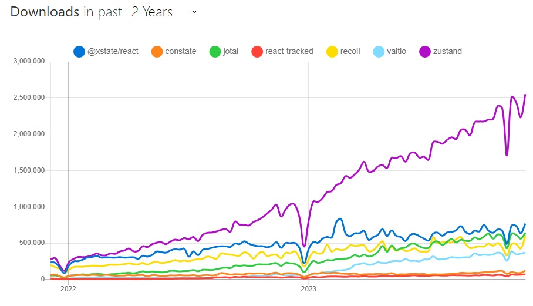

# 🐳 05. 리액트와 상태 관리 라이브러리

## 🌏 5.1 상태 관리는 왜 필요한가?

먼저, `상태`가 무엇인지 정의해보자.

웹 애플리케이션에서 `상태`는 어떠한 의미를 지닌 값이며 애플리케이션의 시나리오에 따라 지속적으로 변경될 수 있는 값을 의미한다.

**웹에서 상태로 분류되는 것들**

* UI : 애플리케이션에서 상태라 함은 상호 작용이 가능한 모든 요소의 현재 값을 의미.<br/>다크/라이트 모드, input, 알림창의 노출 여부 등.
* URL : 브라우저에서 관리되고 있는 상태 값.
* 폼 : 로딩중인지(loading), 제출 됐는지(submit), 접근 불가능한지(disabled), 값이 유효한지(validate)
* 서버에서 가져온 값 : 말 그래도 서버로 요청해 가져온 값. (API요청)

단순히 '상태를 관리한다'라고 봤을 때 이는 단순히 손이 많이가는 문제일 수 있다. 하지만 애플리케이션 전체적으로 관리해야 할 상태가 있다거나 그 상태에 따라 다양한 요소들이 각 상태에 맞는 UI를 보여줘야 한다.<br/>상태를 어디에 둘지, 전역 변수에 둘지, 별도의 클로저를 만들지 등등 상태를 효율적으로 관리하고, 상태가 필요한 쪽에서는 빠르게 반응할 수 있는 모델에 대한 고민이 본격적으로 시작된 것이다.

<br/>

### 👉 5.1.1 리액트 상태 관리의 역사

리액트도 상태 관리에 대한 필요성이 존재했다.

애플리케이션 개발에 모든 것을 제공하는 프레임워크가아니라 리액트는 단순히 사용자 인터페이스를 만들기 위한 라이브러리일 뿐이기에 그 이상의 기능을 제공하지 않는다. 어떻게 사용해왔는지 알아보자.

<br/>

#### 🔸 Flux패턴의 등장

이전엔 Redux가 나타나기 전까지 딱히 이름있는 상태 관리 라이브러리가 없었다. 2014년경, 리액트의 등장과 비슷한 시기에 Flux패턴과 함께 이를 기반으로 한 라이브러리인 `Flux`를 소개하게 된다.

Flux가 나타날 당시 웹 생태계에서는 웹 애플리케이션이 비대해지고 상태(데이터)도 많아짐에 따라 어디서 어떤일이 일어나서 이 상태가 변했는지 등을 **추적하고 이해하기가 어려운 상황**이였고, 페이스북 팀은 이 **문제의 원인이 양방향 데이터 바인딩**으로 봤다.<br/>코드 작성하는 입장에서는 간단하지만, 양이 많아지고 변경 시나리오가 복잡해질 수록 관리가 어렵다. 그래서 양방향이 아닌 단방향으로 데이터 흐름을 변경하는 것을 제안했는데 이것이 바로 Flux패턴이다.

❗ **Flux의 기본적인 단방향 데이터 흐름** : `Action -> Dispatcher -> Model -> View`

* **Action** : 어떤 작업을 처리할 액션과 그 액션 발생 시 함께 포함시킬 데이터를 의미한다. <br/>액션 타입과 데이터를 각각 정의해 이를 dispatcher로 보낸다.
* **Dispatcher** : 액션을 스토어에 보내는 역할. <br/> 액션이 정의한 타입과 데이터 모두 스토어로 보낸다.
* **Store** : 실제 상태에 따른 값과 상태를 변경할 수 있는 메서드를 가지고있다.<br/>액션 타입에 따라 어떻게 이를 변경할지가 정의됨.
* **View** : 리액트 컴포넌트에 해당하는 부분.<br/>스토어에서 만들어진 데이터를 가져와 화면을 렌터링 하는 역할.

```tsx
type StoreState = {
  counter: number
}

type Action = {type: 'add'; payload: number}

function reducer(prevstate: StoreState, action: Action){
  const {type: Actiontype} = action
  if(ActionType === 'add'){
		return {
      count: prevState.count + action.payload,
    }
  }
}

throw new Error(`Unexpected Action [${ActionType}]`)

export default function App(){
  const [state, dispatcher] = useReducer(reducer, {count: 0})
  
  function handleClick(){
    dispatcher({type: 'add', payload: 1})
  }
  
  return (
  	<div>
    	<h1>{state.count}</h1>
      <button onClick={handleClick}>+</button>
    </div>
  )
}
```

<br/>

이런 사용자의 입력에 따라 데이터를 갱신하고 어떻게 업데이트해야 하는지도 코드로 작성해야 해서 코드양이 많아진다는 단점도 있다.<br/>그러나 데이터 흐름은 모두 액션이라는 한 방향으로 줄어드므로 데이터의 흘므을 추적하기 쉽고, 코드를 이해하기 한결 수월해진다.

리액트 역시 단방향 데이터 바인딩을 기반으로 한 라이브러리이기 때문에 Flux와 잘맞았고, 다양한 라이브러리들이 등장했다.<br/>(Flux, alt, RefluxJS, NuclearJS, Fluxible, Fluxxor, ...)

<br/>

#### 🔸 시장 지배자 리덕스의 등장

이후 Redux가 등장했다. Reedux역시 Flux구조를 구현한 라이브러리 중 한가지였는데 특별한 점이 있다면 `Elm 아키텍처`를 도입했다는 것이다.

> Elm이란?
>
> Elm은 웹 페이지를 선언적으로 작성하기 위한 언어이다.
>
> ```elm
> module Main exposing (..)
> import Browser
> import HTML exposing (Html, button, div, text)
> import Html.Events exposing (onClick)
> 
> -- MAIN
> main = 
> 	Browser.sandbox {init = init, update = update, view = view}
> 
> -- MODEL
> type alias Model = Int
> 
> init : model
> init = 
> 	0
> 
> --UPDATE
> tyoe MSG
> 	= Increment
> 	| Decrement
> 
> update: Msg -> Model -> Model
> update msg mode = 
> 	case msg of
> 		Increment ->
> 			model + 1
> 			
>     Decrement ->
>     	model - 1
> 
> -- VIEW
> 
> view : Model -> Html Msg
> view model = 
> 	div []
> 		[ button [ onClick Decrement ] [ text "-" ]
> 		, div [] [ text (String.fromint model) ]
> 		, button [ onClick Increment ] [ text "+" ]
> 		]
> <div>
> 	<button>-</button>
> 	<div>2</div>
> 	<butotn>+</button>
> </div>
> ```
>
> 여기서 주목할 것은 `model`, `update`, `view` 이다.
>
> * model : 애플리케이션의 상태
> * view : 모델을 표현하는 HTML
> * update : 모델을 수정하는 방식

`Elm`은 `Flux`와 마찬가지로 데이터 흘므을 세가지로 분류하고, 이를 단방향으로 강제해서 웹 애플리케이션의 상태를 안정적으로 관리하고자 했으며, redux는 이에 영향을 받았다.

<br/>

redux는 하나의 상태 객체를 스토어에 저장하고, 이 객체를 업데이트 하는 ㅈ가업을 디스패치해 업데이트를 수행한다.<br/>이를 reducer함수로 발생시킬 수 있는데 이 함수는 웹 애플리케이션 상태에 대한 완전히 새로운 복사본을 반환하고, 새롭게 만들어진 상태를 전파하게 된다.

redux의 등장으로, props내려주기 문제를 해결하고 스토어가 필요한 컴포넌트라면 어디서든 connect만 쓰면 바로 접근할 수 있었다.<br/>하지만, 하나의 상태를 바꾸기 위해 해야할 일이 너무 많았다.

<br/>

#### 🔸 Context API와 useContext

리액트가 세상에 나온 뒤에도 어떻게 상태를 적절하게 주입해야하는지에 대한 고민이 계속 되었다.

리액트 16.3에서 전역 상태를 하위 컴포넌트에 주입할 ㅜㅅ 있는 새로운 `Context API`를 출시 했다.<br/>props를 넘겨주지 않도라도 Context API를 사용해 원하는 곳에서 Context Provider가 주입하는 상태르 라용할 수 있게 되었다.

16.3이전에도 context는 존재했고, 이를 다루기 위해 getChildContext()를 제공했었다.<br/>하지만, 몇가지 문제가 있었다.

* 첫 번째로 상위 컴포넌트가 렌더링되면, `getChildContext`도 호출됨과 동시에 shouldComponentUpdate가 항상 true를 반환해 불필요한 렌더링이 일어남.
* context를 인수로 받아야 해서 컴포넌트와 결합도가 높아진다.

<br/>

간단하게 살펴보자. 부모에 props를 넘기지 않아도 ChildComponent에 state를 전달할 수 있는 것을 볼 수 있다.

```tsx
type Counter = {counter: number}
const CounterContext = createContext<Counter | undefined>(undefined)

class CounterComponent extends Component {
  render(){
    return (
    	<CounterContext.Consumer>
      	{(state)=> <p>{state?.count}</p>}
      </CounterContext.Consumer>
    )
  }
}

class DummyParent extends Component {
  render(){
    return (
    	<CounterComponent />
    )
  }
}

export default class MyApp extends Component<{}, Counter>{
  state = {count: 0}
	componentDidMount(){ this.setState({count: 1}) }
	handleClick = () =>{ this.setState((state)=>({count: state.count+1}))}
  render(){
    return (
    	<Countercontext.Provider value={this.state}>
      	<button onClick={this.handleClick}>+</button>
        <DummyParent />
      </Countercontext.Provider>
    )
  }
}
```

<br/>

#### 🔸 훅의 탄생, 그리고 React Query와 SWR

`Context API`등장 후 16.8버전에서 함수형 컴포넌트에 사용할 수 있는 다양한 훅 API를 추가했다.<br/>가장 큰 변경점으로 state를 매우 손쉽게 재사용 가능하도록 만들 수 있다는 것이다.

```jsx
function useCounter(){
  const [count, set] = useState(0)
  
  function increase(){
    setCount(prev=>prev+1)
  }
  
  return {count, increase}
}
```

내부적으로 관리하고있는 state가 잇으며 또 이를 필요한 곳에 재사용할 수도 있게 됐다.

이런 훅의 등장과 함께 `React Query`와 `SWR`이 등장하게 되었다. fetch를 관리하는데 특화된 라이브러리지만, API호출에 대한 상태를 관리하기 때문에 HTTP요청에 특화된 상태 관리 라이브러리라 볼 수 있다.

SWR코드를 살펴보자.

```jsx
import React from 'react';
import useSWR from 'swr';

const fetcher = (url) => fetch(url).then(res=>res.json())

export default function App(){
  const {data, err}  = useSWR(
  `${myUrl}`,
    fetcher
  )
  
  if(error) return 'An error has occured'
  if(!data) return 'Loading'
  
  return (
  	<div>
    	<p>{JSON.stringify(data)}</p>
    </div>
  )
}
```

`useSWR`은 조회할 API주소와 조회에 사용되는 fetch를 넘겨준다. API주소는 키로도 사용되며, 이후 **다른 곳에서 동일한 키로 호출하면 재조회가 아니라 useSWR에서 관리하는 캐시의 값을 활용**한다.

<br/>

#### 🔸 Recoil, Zustand, Jotai, Valtio에 이르기 까지

SWR과 React Query가 HTTP요청에만 사용할 수 있다면 좀 더 범용적으로 쓸 수 있는 상태 관리 라이브러리에 대해 알아보자.

```tsx
// Recoil
const counter = atom({key: 'count', default: 0})
const todoList = useRecoilValue(counter)

// Jotai
const countAtom = atom(0)
const [count, setCount] = useAtom(countAtom)

// Zustand
cosnt useCounterStore = create((set)=>{
  count: 0,
  increase: ()=>set((state)=>({ count: state.count + 1 }))
})

// Valtio
const state = proxy({count: 0})
const snap = useSnapshot(state)
state.count++;
```

Redux와 차이점은 훅을 활용해 작은 크기의 상태를 효율적으로 관리한다는 점이다. ( 16.8버전이상의 React를 요구한다.)

`Redux`나 `Mobx`도 `react-redux`나 `mobx-react-lite`등을 설치하면 동일하게 훅으로 상태를 가져올 수 있지만, 위 라이브러리들은 애초에 리액트와의 연동을 전제로 작동해 별도로 다른 라이브러리를 설치하지 않아도된다.

<br/><br/>

## 🌏 5.2 리액트 훅으로 시작하는 상태 관리

리액트 16.8에서 등장한 리액트 훅과 함수형 컴포넌트의 패러다임에서 애플리케이션 내부 상태관리는 어떻게 할 수 있고, 새로운 방법을 채택한 라이브러리는 무엇이고 어떻게 동작하는지 알아보자.


### 👉 5.2.1 가장 기본적인 방법 : useState와 useReducer

`useState`로 리액트에서는 여러 컴포넌트에 걸쳐 손쉽게 동일한 인터페이스의 상태를 생성하고 관리할 수 있게 됐다.

```tsx
function useCounter (initCount: number = 0){
  const [counter, setCounter] = useState(initCount);
  function inc() {setCounter((prev)=>prev+1)}
  return {counter, inc}
}

function Counter1(){
  const {counter, inc} = useCounter()
  return(
  	<>
    	<h3>Counter1 : ${counter}</h3>
    	<button onClick={inc}>+</button>
    </>
  )
}
function Counter2(){
  const {counter, inc} = useCounter()
  return(
  	<>
    	<h3>Counter2 : ${counter}</h3>
    	<button onClick={inc}>+</button>
    </>
  )
}
```

<br/>

`useReducer`또한 마찬가지로 지역 상태를 관리할 수 있는 훅이다. <br/>(2장에서 preact의 코드를 발췌해 useState또한 useReducer로 구현됐다는 사실을 확인했었다.)

<br/>

`useState`나 `useReducer` 모두 약간의 구현상 차이만 있을 뿐, **모두 지역 상태 관리를 위해 만들어 졌다.** 하지만 모든 필요성과 문제를 해결해 주지는 않는다.

훅을 사용할 때마다 컴포넌트별로 초기화되므로 컴포넌트에 따라 서로 달느 상태를 가질 수 밖에 없다. 즉, **해당 컴포넌트 내에서만 유효**하다.

만약 동일한 상태를 바라보게 하려면 어떻게 해야할까?  먼저, 상태를 컴포넌트 밖으로 한 단계 끌어올리는 방법을 생각해볼 수 있다.

```tsx
function Counter1({counter, inc}: {counter:number; inc: ()=>void}){
	return(
  	<>
    	<h3>Counter1: {counter}</h3>
	    <button onClick={inc}>+</button>
    </>
  )
}
function Counter2({counter, inc}: {counter:number; inc: ()=>void}){
	return(
  	<>
    	<h3>Counter2: {counter}</h3>
	    <button onClick={inc}>+</button>
    </>
  )
}

function Parent(){
  const {counter, inc} = useCounter();
	return (
  	<>
    	<Component1 counter={counter} inc={inc}/>
      <Component2 counter={counter} inc={inc} />
    </>
  )
}
```

<br/>

❗ 정리해보자.<br/>`useState`와 `useReducer`를 이용해 지역 상태 관리를 할 수 있다. 만들기에 따라 재사용할 수 있는 지역 상태를 만들어주지만, **지역 상태**라는 한계로 인해 여러 컴포넌트에 걸쳐 공유하기 위해서는 컴포넌트 트리를 재설계하는 등의 수고로움이 필요하다.

<br/>

### 👉 5.2.2 지역 상태의 한계를 벗어나보자 : useState의 상태를 바깥으로 분리하기

만약, `useState`가 리액트 클로저가 아니라 다른 자바스크립트 실행 문맥 어디선가, 즉 완전히 다른 곳에서 초기화돼어 관리되면 어떨까?

```typescript
// counter.ts
export type State = {count: number}

// 밖에 상태를 선언. 각 컴포넌트가 이 state를 바라보게 할 것이다.
let state: State = { counter: 0}

// getter
export function get(): State {return state}

// useState와 동일하게 구현하기 위해 게으른 초기화 함수나 값을 받을 수 있게 함.
type Initializer<T> = T extends any ? T | ((prev: T)=>T) : never

// setter
export function set<T>(nextState: Initializer<T>){
  staet = typeof nextState==='function' ? nextState(state) : nextState
}

function Counter(){
  const state = get();
  function handleClick(){
    set((prev:State)=>({counter: prev.counter+1}))
  }
  
  return(
  	<>
    	<h3>{state.counter}</h3>
	    <button onClick={handleClick}>+</button>
    </>
  )
}
```

얼핏 보면 동작할 듯 하지만, 동작하지 않는다. => **컴포넌트가 리렌더링 되지 않기 때문**이다.<br/>새로운 상태를 보여주기 위해서는 `리렌더링`이 반드시 필요하지만, 여기서는 리렌더링을 일으키는 장치가 없다.

* useState, useReducer의 반환값 중 두 번째 인수가 어떻게든 호출되야한다.
* 부모 컴포넌트가 리렌더링 되거나 해당 함수가 다시 실행돼야한다.

`useState`의 인수로 컴포넌트 밖에서 선언한 state를 넘겨주는 방식으로 해보자.

```tsx
function Counter1(){
  const [count, setCount] = useState(state)
  function handleClick(){
    // 외부에서 선언한 setㅎ마수 내부에서 다음 상태값을 연산한 다음, 그 값을 로컬 상태값에도 넣음.
    set((prev:State)=>{
      const newState = {counter: prev.counter+1}
      setCount(newState)
      return newState
    })
  }
  return (...)
}

function Counter2(){
  ...
}
```

억지로 전역에 있는 상태를 참조하게 만들었다. `useState`의 두 번째인수로 업데이트하여 리렌더링 되게 했지만, 굉장히 비효율적이다.

외부에 상태가 있음에도 함수형 컴포넌트의 리렌더링을 위해 **내부에 동일한 상태를 관리하기 때문에 중복해서 관리**하기 때문이다.<br/>그리고 같은 상태를 바라보지만, 한쪽의 버튼을 클릭했을 때 반대쪽은 업데이트 되지 않는 현상을 볼 수 있다. => useState는 어디까지나 해당 컴포넌트 자체에서만 유효하기때문에 반대쪽 컴포넌트를 리렌더링 시킬만한 요소가 없다.

함수 외부에서 상태를 참조하고 이를 통해 렌더링 까지 자연스럽게 하기위한 조건을 종합해보자.

* window나 global에 있어야 할 필요는 없지만 컴포넌트 외부 어딘가에 상태를 두고 여러 컴포넌트가 같이 쓸 수 있어야 함.
* 외부 상태를 사용하는 컴포넌트는 상태의 변화를 알아챌 수 있어야하고, 상태가 변할때마다 최신 상태 값으로 리렌더링이 발생해야한다. 뿐만아니라 동일한 상태를 참조한다면, 모든 컴포넌트에서 동일하게 동작해야 한다.
* 상태가 원시값이 아닌 객체인 경우 객체 내에 감지하지 않는 값이 변한다 하더라도 리렌더링이 발생해서는 안된다.

<br/>

지역 상태를 벗어나는 새로운 상태 관리 코드를 만들어보자.<br/>store의 값이 변경될 때마다 변경됐음을 알리는 callback함수를 실행해야하고, callback을 등록할 수 있는 subscribe함수가 필요하다.

```typescript
type Initializer<T> = T extends any ? T | ((prev:T)=>T): never

type Store<State> = {
  get: ()=>State
  set: (action: Initializer<State>) => State
  subscribe: (callback: ()=>void) => () => void
}
```

```typescript
export const createStore = <State extends unknown>(
	initialState: Initializer<State>
): Store<State> => {
  // useState와 마찬가지로 초기값을 게으른 초기화를 위한 함수 또한 그냥 값을 받게 해준다.
  // 스토어 내부에서 보관해야하므로 변수로 선언
  let state = typeof initialState !== 'function' ? initialState : initialState()
  
  // callbacks는 자료형에 관계없이 유일한 값을 저장할 수 있는 Set이용.
  const callbacks = new Set<()=>void>();
  // 언제든 get이 호출되면 최신값을 가져오도록 함수로 만듬.
	const get = () => state
  const set = (nextState: State | ((prev: State) => State)) => {
    // 인수가 함수면 함수를 실행해 값을 받고, 아니면 새로운 값을 그대로 사용
    state = typeof nextState === 'function'
    	? (nextState as (prev:State)=>State)(state)
    	: nextState
    
    // 값의 설정이 발생하면 콜백 목록을 순회하면서 모든 콜백을 실행 => 컴포넌트의 렌더링 유도.
    callbacks.forEach((callback)=>callback())
    return state
  }

  // callback Set에 cabllback을 등록할 수 있는 함수.
  const subscirbe = (callback: ()=>void) => {
    // 받은 함수를 callback목록에 추가
    callbacks.add(callback)
    // 클린업 실행 시 이를 삭제해 반복적으로 추가되는 것을 막음
    return () => {
      callbacks.delete(callback)
    }
  }
  return {get, set, subscribe}
}
```

요약하자면, `createStore`는 자신이 관리해야하는 상태를 내부 변수로 가진다음, get함수로 해당 변수의 최신값을 제공하며, set함수로 내부 변수를 최신화 하며 이 과정에서 등록된 콜백을 모조리 실행하는 구조이다.

<br/>

`createStore`로 만들어진 store의 값을 참조하고, 이 값의 변화에 따라 컴포넌트 렌더링을 유도할 사용자 정의 훅을 만들어보자 (useStore)

```typescript
export const useStore = <State extends unknown>(store: Store<State>) => {
  const [state, setState] = useState<State>(()=>store.get())
  
  useEffect(()=>{
    const unsubscribe = store.subscribe(()=>{
      setState(store.get())
    })
    return unsubscribe
  }, [store])
  
  return [state, store.set] as const
}
```

* 훅의 인수로 사용할 store를 받고, 이 스토어의 값을 초기값으로 하는 `useState`를 만든다.  => `useState`가 컴포넌트의 렌더링을 유도.
* `useEfefct`는 store의 현재 값을 가져와 setState를 수행하는 함수를 store의 subscirbe로 등록해 두었다.<br/>내부에서 값이 변경될 때마다 subcribe에 등록된 함수를 실행하므로 useStore내부에서는 store의 값이 변경될 때마다 state값이 변경되는 것을 보장받을 수 있다.
* 마지막으로 useEffect의 클린업 함수로 unsubscribe를 등록. <br/>useEffect동작 후에 callback에서 해당 함수를 제거해 callback이 계속 쌓이는 현상을 방지.

<br/>

여기까지 만든 store는 원시값일땐 정상동작하겠지만, 객체인 경우 객체의 값 하나만 바뀌어도 계속 리렌더링 하게 될 것이다.

```typescript
export const useStoreSelector = <State extends unknown, value extends unknown>(
	store: Stoer<State>,
  selector: (state: State) => Value,
) => {
  const [state, setState] = useState(()=>selector(store.get()))
  
  useEffect(()=>{
    const unsubscribe = store.subscribe(()=>{
      const value = selector(store.get())
      setState(value)
    })
    
    return unsubscribe
  }, [store, selector])
  
  return state;
}
```

`useStore`를 기반으로 만들어졌지만, 두 번째 인수로 selector라고 하는 함수를 받는다.<br/>이 함수는 store의 상태에서 어떤 값을 가져올지 정의하는 함수로 이 함수를 활용해 `store.get()`을 수행한다. store의 값이 변경됐더라도 `selector(store.get())`이 변경되지 않는다면 리렌더링이 일어나지 않는다.

❗ `useStoreSelector`에 제공하는 selector를 컴포넌트 밖에 선언하거나 이것이 불가능하면 `useCallback`을 사용해 참조를 고정시켜야 한다. 그렇지 않으면 컴포넌트가 리렌더링될 때 마다 함수가 계속 재생성되어 store의 subscribe를 반복적으로 수행할 것이다.

<br/>

이미 페이스북 팀에서 이런 방식으로 `useSubscription`이라고 만든 것이 있다.<br/>`useSubscription`을 사용하면 외부에 데이터를 가져와 사용하고 리렌더링까지 정상적으로 수행되는 것을 확인할 수 있다.

`useStore`나 `useStoreSelector`모두 useEffect의 의존성 배열에 store나 selector가 들어가 있어 이 객체가 임의로 변경될 경우 불필요하게 리렌더링이 발생한다는 문제가 있다. <br/>이를 방지하기 위해 `useSubscription`내부에는 예외 처리를 추가해 이런 변경이 알려지는 동안 store나 selector의 변경을 무시하고 한정적으로 원하는 값을 반환하게끔 훅이 작성되있다.

리액트 18버전에서는 `useSyncExternalStore`로 재작성돼 있는 것을 볼 수 있다.

```javascript
/**
 * Copyright (c) Facebook, Inc. and its affiliates.
 *
 * This source code is licensed under the MIT license found in the
 * LICENSE file in the root directory of this source tree.
 *
 * @flow
 */

import {useSyncExternalStore} from 'use-sync-external-store/shim';

// Hook used for safely managing subscriptions in concurrent mode.
//
// In order to avoid removing and re-adding subscriptions each time this hook is called,
// the parameters passed to this hook should be memoized in some way–
// either by wrapping the entire params object with useMemo()
// or by wrapping the individual callbacks with useCallback().
export function useSubscription<Value>({
  // (Synchronously) returns the current value of our subscription.
  getCurrentValue,

  // This function is passed an event handler to attach to the subscription.
  // It should return an unsubscribe function that removes the handler.
  subscribe,
}: {|
  getCurrentValue: () => Value,
  subscribe: (callback: Function) => () => void,
|}): Value {
  return useSyncExternalStore(subscribe, getCurrentValue);
}
```


### 📘 참고

* [Github - react v17.0.2_use-subscription](https://github.com/facebook/react/blob/17.0.2/packages/use-subscription/src/useSubscription.js) 
* [Github - react v18.2.0_useSyncExternalStore](https://github.com/facebook/react/blob/v18.2.0/packages/use-subscription/src/useSubscription.js)

<br/>

### 👉 useState와 Context를 동시에 사용해보기

앞의 훅을 활용해 상태 관리 라이브러리처럼 사용해보았다. 하지만 훅과 스토어를 사용하는 구조는 **반드시 하나의 스토어만 가진다는 단점**이 있다.

여러개의 스토어를 가지고 싶다면 어떻게 해야할까?

<br/>

가장 먼저 떠오르는 방법은 `createStore`를 동일한 타입으로 여러 개 만드는 것이다.

하지만, 이 작업은 번거롭고, 훅은 스토어에 의존적인 1:1관계를 맺고 있어 스토어를 만들 때마다 해당 스토어에 의존적인 useStore같은 훅을 동일한 개수로 만들어야 한다.

이 문제를 해결하는 좋은 방법이 바로 `Context`이다.<br/>Context를 활용해 **해당 스토어를 하위 컴포넌트에 주입하면 컴포넌트에서는 자신이 주입된 스토어에 대해서만 접근**할 수 있게 될 것이다.

<br/>

```typescript
// 어떤 context를 만들지 타입과 함께 정의.
// Context를 생성하면 자동으로 스토어도 함께 생성됨
export const CounterStoreContext = createContext<Store<CounterStore>>(
	createStore<CounterStore>({count: 0, text: 'hello'})
)

export const CounterStoreProvider = ({
  initialState,
  children
}: PropsWithChildren<{
	initialState: CounterStore
}>) => {
  
  // Provider로 넘기는 props가 불필요하게 변경돼서 렌더링 되는 것을 막음
  const storeRef = useRef<Store<CounterStore>>();
  
  // 스토어를 생성한 적이 없다면 최초에 한 번 생성함.
  if(!storeRef.current) {
    storeRef.current = createStore(initialState)
  }
  
  return (
  	<CounterStoreContext.Provider value={storeRef.current}>
			{ <Children />}
    </CounterStoreContext.Provider>
  )
}
```

<br/>

Context에서 내려주는 값을 사용하기 위해 `useStore`나 `useStoreSelector`대신에 다른 접근 방법이 필요하다. 기존 두 훅은 스토어에 직접 접근하지만, 이제 Context에서 제공하는 스토어에 접근해야하므로 `useContext`를 사용해 접근할 수 있는 훅을 만들자.

```typescript
export const useCounterContextSelector = <State extends unknown>(
	selector: (state: CounterStore) => State
) => {
	const store = useContext(CounterStoreContext)
  // useStoreSelector를 사용해도 동일함.
  const subscription = useSubscription(
  	useMemo(
    	()=>({
        getCurrentValue: ()=>selector(store.get()),
        subscribe: store.subscribe,
      }),
      [store, selector]
    )
  )
  
  return [subscription, store.set] as const
}
```

`useContext`를 사용하므로, 스토어에서 값을 찾는게 아니라 `Context.Provider`에서 제공된 스토어를 찾게 만든다.

<br/>

Context와 Provider를 기반으로 각 store값을 격리해서 관리하면, 

* 스토어를 사용하는 컴포넌트는 해당 상태가 어느 스토어에서 온 상태인지 신경쓰지 않아도 되서 어떤 값을 보여줄 지만 고민하면 되어 좀 더 편리하게 코드를 작성할 수 있다.
* Contex소아 Provider를 관리하는 부모 컴포넌트 입장에서는 자신이 자식 컴포넌트에 따라 보여주고 싶은 데이터를 Context로 잘 격리만 하면된다.

❗ 부모와 자식 컴포넌트의 책임과 역할을 이름이 아니라 명시적인 코드로 나눌 수 있어 코드 작성이 용이해 진다.

<br/>

상태 관리 라이브러리들이 동작하는 방식을 정리해보자

* `usesState`, `useReducer`가 가지고 있는 한계(**컴포넌트 내부에서만 사용할 수 있는 지역상태**)를 극복하기 위해 외부 어딘가에 상태를 둔다.
* 이 외부의 상태 변경을 각자의 방식으로 감지해 컴포넌트의 렌더링을 일으킨다.

<br/>

### 👉 5.2.4  상태 관리 라이브러리 Recoil, Jotai, Zustand 살펴보기

Redux와 MobX는 제외하고, 최근 각광받고있는 라이브러리들에 대해 알아보자.

`Recoil`과 `Jotai`는 Context와 Provider, 그리고 훅을 기반으로 가능한 작은 상태를 효율적으로 관리하는데 초점을 두고있고, `Zustand`는 리덕스와 비슷하게 하나의 큰 스토어를 기반으로 상태를 관리하는 라이브러리 이다. REcoil, Jotai와 다르게 이 하나의 큰 스토어는 Context가 아니라 스토어가 가지는 클로저를 기반으로 생성되며, 스토어의 상태가 변경되면 이 상태를 구독하고 있는 컴포넌트에 전파해 리렌더링을 알리는 방식이다.

하나씩 알아가보자.

#### 🔸 페이스북이 만든 상태 관리 라이브러리 Recoil

페이스북에서 만든 리액트를 위한 상태 관리 라이브러리 이며, 훅의 개념으로 상태 관리를 시작한 최초의 라이브러리 중 하나이다.<br/>최소 상태 개념인 `Atom`을 처음 리액트 생태계에서 선보이기도 했다.

아직 정식 출시된 라이브러리가 아니라 실험적으로 개발되고 운영되는 라이브러리이다.<br/>(리액트18에서 제공하는 동시성 렌더링, 서버 컴포넌트, Streaming SSR등이 지원되기 전에는 1.0.0을 릴리스 하지 않을 것이라 한다.)

먼저 Recoil이 어떻게 작동하는지, Recoil의 핵심 API들을 살펴보고 어떻게 상태값을 저장하고, 컴포넌트 렌더링은 어떻게 일으키는지 알아보자.

**주요 API**

* RecoilRoot
* atom
* useRecoilValue
* useRecoilState

<br/>

##### RecoilRoot

가장 먼저 `Recoil`을 사용하기 위해 `RecoilRoot`를 애플리케이션 최상단에 선언해야한다.

```tsx
export default function App(){
  return <RecoilRoot>{ /*Some Components*/ }</RecoilRoot>
}
```

아래의 코드는 Recoil의 소스코드이다.

```tsx
function RecoilRoot(props: Props): React.Node {
  const {override, ...propsExceptOverride} = props;

  const ancestorStoreRef = useStoreRef();
  if (override === false && ancestorStoreRef.current !== defaultStore) {
    // If ancestorStoreRef.current !== defaultStore, it means that this
    // RecoilRoot is not nested within another.
    return props.children;
  }

  return <RecoilRoot_INTERNAL {...propsExceptOverride} />;
}
```

* `useStoreRef`로 `ancestorStoreRef`의 존재를 확인하는데, 이는 Recoil에서 생성되는 atom과 같은 상태값을 저장하는 스토어를 의미. `useStoreRef`가 가리키는 것은 AppContext가 가지고 있는 스토어이다.

```typescript
// useStoreRef
const AppContext = React.createContext<StoreRef>({current: defaultStore})
const useStoreRef = (): StoreRef => useContext(AppContext)
```

current의 defaultStore는 아래와 같다.

```typescript
// defaultStore
function notInAContext() {
  throw err('This component must be used inside a <RecoilRoot> component.');
}

const defaultStore: Store = Object.freeze({
  storeID: getNextStoreID(),
  getState: notInAContext,
  replaceState: notInAContext,
  getGraph: notInAContext,
  subscribeToTransactions: notInAContext,
  addTransactionMetadata: notInAContext,
});
```

* store의 id를 가져오는 `getnextStoreID()`와 스토어 값을 가져오는 `getState`, 값을 수정하는 `replaceState`등으로 이루어져 있다. 
* `RecoilRoot`로 감싸지 않은 컴포넌트에서는(해당 스토어의 아이디를 제외하고는) 스토어에 접근할 수 없다는 것을 알 수 있다.

또 하나 살펴볼 것이 `replaceState`다

```tsx
const replaceState = (replacer: TreeState => TreeState) => {
    startNextTreeIfNeeded(storeRef.current);
    // Use replacer to get the next state:
    const nextTree = nullthrows(storeStateRef.current.nextTree);
    let replaced;
    try {
      stateReplacerIsBeingExecuted = true;
      replaced = replacer(nextTree);
    } finally {
      stateReplacerIsBeingExecuted = false;
    }
    if (replaced === nextTree) {
      return;
    }
...

    // Save changes to nextTree and schedule a React update:
    storeStateRef.current.nextTree = replaced;
    if (reactMode().early) {
      notifyComponents(storeRef.current, storeStateRef.current, replaced);
    }
    nullthrows(notifyBatcherOfChange.current)();
  };
```

* 변경된 상태를 하위 컴포넌트로 전파해 컴포넌트에 리렌더링을 일으키는 `notifyComponents`가 있는 것을 알 수 있다.
* `notifyComponents`는 store와 상태를 전파할 storeState를 인수로 받아 이 스토어를 사용하는 하위 의존성을 모두 검색하여 여기에 있는 컴포넌트들을 모두 확인해 콜백을 실행한다.

<br/>

정리해보자.

* Recoil의 상태값은 RecoilRoot로 생성된 Context의 스토어에 저장된다.
* 스토어의 상태값에 접근할 수 있는 함수들이 있으며, 이 함수를 활용해 상태값에 접근하거나 상태값을 변경할 수 있다.
* 값의 변경이 발생하면 이를 참조하고 있는 하위 컴포넌트에 모두 알린다.

<br/>

##### atom

`atom`은 상태를 나타내는 최소 상태 단위 이다.

```typescript
type Statement = {
	name: string,
  amount: number
}

const initialStatements: Array<Statement> = [
  {name: '과자', amount: -500},
  {name: '용돈', amount: 1000},
  {name: '네이버페이충전', amount: -5000},
]

// Atom선언
const statementsAtom = atom<Array<Statement>>{
  key: 'statements',
  default: InitialStatements
}
```

* `atom`은 key를 필수로 가지며, 이 키는 다른 atom과 구별하는 식별자가 되는 필수 값이다. (selector를 만들때 주의)
* atom의 값을 컴포넌트에서 읽어오고 이 값의 변화에 따라 컴포넌트를 리렌더링하려면 다음 2가지 훅(`useRecoilValue`, `useRecoilState`)을 이용


##### useRecoilValue

`atom`의 값을 읽어오는 훅이다.

```typescript
function Statements(){
  const statements = useRecoilValue(statementsAtom)
  return (
	  <>{/* do something...*/}</>
  )
}
```

useRecoilValue훅의 구현 코드를 살펴보자.

```typescript
function useRecoilValue<T>(recoilValue: RecoilValue<T>): T {
  if (__DEV__) {
    validateRecoilValue(recoilValue, 'useRecoilValue');
  }
  const storeRef = useStoreRef();
  const loadable = useRecoilValueLoadable(recoilValue);
  return handleLoadable(loadable, recoilValue, storeRef);
}
```

```typescript
function useRecoilValueLoadable_LEGACY<T>(
  recoilValue: RecoilValue<T>,
): Loadable<T> {
  const storeRef = useStoreRef();
  const [, forceUpdate] = useState([]);
  const componentName = useComponentName();

  const getLoadable = useCallback(() => {
    if (__DEV__) {
      recoilComponentGetRecoilValueCount_FOR_TESTING.current++;
    }
    const store = storeRef.current;
    const storeState = store.getState();
    const treeState = reactMode().early
      ? storeState.nextTree ?? storeState.currentTree
      : storeState.currentTree;
    return getRecoilValueAsLoadable(store, recoilValue, treeState);
  }, [storeRef, recoilValue]);

  const loadable = getLoadable();
  const prevLoadableRef = useRef(loadable);
  useEffect(() => {
    prevLoadableRef.current = loadable;
  });

  useEffect(() => {
    const store = storeRef.current;
    const storeState = store.getState();
		// 현재 recoil의 값을 구독하는 함수
    const subscription = subscribeToRecoilValue(
      store,
      recoilValue,
      _state => {
        if (!gkx('recoil_suppress_rerender_in_callback')) {
          return forceUpdate([]);
        }
        const newLoadable = getLoadable();
        // is는 두 객체가 같은지 비교하고, 다르다면 렌더링을 유도
        if (!prevLoadableRef.current?.is(newLoadable)) {
          forceUpdate(newLoadable);
        }
        prevLoadableRef.current = newLoadable;
      },
      componentName,
    );

    if (storeState.nextTree) {
      store.getState().queuedComponentCallbacks_DEPRECATED.push(() => {
        prevLoadableRef.current = null;
        forceUpdate([]);
      });
    } else {
      if (!gkx('recoil_suppress_rerender_in_callback')) {
        return forceUpdate([]);
      }
      const newLoadable = getLoadable();
      // 값을 비교해서 값이 다르다면 forceUpdate실행
      if (!prevLoadableRef.current?.is(newLoadable)) {
        forceUpdate(newLoadable);
      }
      prevLoadableRef.current = newLoadable;
    }
		// 클린업 함수에 subscribe를 해제하는 함수를 반환
    return subscription.release;
  }, [componentName, getLoadable, recoilValue, storeRef]);

  return loadable;
}
```

(코드를 직관적으로 이해하기 위해 `useRecoilValueLoadable_LEGACY`를 가지고 설명.)

* line 8 : getLoadable
  * getLoadable은 현재 Recoil이 가지고 있는 상태값을 가지고 있는 클래스인 loadable을 반환하는 함수.
  * 이 값을 이전 값과 비교하여 렌더링이 필요한지 확인하기 위해 렌더링을 일으키지 않으면서 값을 저장할 수 있는 ref에 매번 저장한다.
* line 26 : useEffect
  * useEffect를 통해 recoilValue가 변경됐을 때 forceUpdate를 호출해 렌더링을 강제로 일으킨다.

<br/>

##### useRecoilState

`useRecoilState`는 좀 더 useState와 유사하게 값을 가져오고 변경할 수 있는 훅이다.

```typescript
function useRecoilState<T>(
  recoilState: RecoilState<T>,
): [T, SetterOrUpdater<T>] {
  if (__DEV__) {
    validateRecoilValue(recoilState, 'useRecoilState');
  }
  return [useRecoilValue(recoilState), useSetRecoilState(recoilState)];
}
```

* 현재 값을 가져오기 위해 이전에 작성한 `useRecoilValue`를 그대로 사용.
* 상태를 설정하는 훅으로 `useSetRecoilState`를 사용

```typescript
function useSetRecoilState<T>(recoilState: RecoilState<T>): SetterOrUpdater<T> {
  if (__DEV__) {
    validateRecoilValue(recoilState, 'useSetRecoilState');
  }
  const storeRef = useStoreRef();
  return useCallback(
    (newValueOrUpdater: (T => T | DefaultValue) | T | DefaultValue) => {
      setRecoilValue(storeRef.current, recoilState, newValueOrUpdater);
    },
    [storeRef, recoilState],
  );
}
```

* 내부에서 먼저 스토어를 가져온 다음에 `setRecoilValue`를 호출해 값을 업데이트 하고 있다.

<br/>

정리해보자.

* 애플리케이션의 최상단에 `<RecoilRoot/>`를 선언해 하나의 스토어를 만든다.
* atom이란 상태단위를 스토어에 등록한다.
* atom은 Recoil에서 관리하는 작은 상태단위이며, 각 값은 고유한 key를 바탕으로 구분된다.
* Recoil에서 제공하는 훅을 통해 atom의 상태변화를 굳고(subscribe)하고 ,값이 변경되면 forceUpdate를 통해 리렌더링을 실행해 최신 atom값을 가져오게 된다.

> selector
>
> 앞의 API들 말고, selector라는 함수가 있다.
>
> selector는 1개 이상의 atom값을 바탕으로 새로운 값을 조립할 수 있는 API로, useStoreSelector와 유사한 역할을 수행한다.
>
> 이 외에도 비동기 작업을 지원하기 위한 API들도 있다.

<br/>

#### 🔸 특징

* 리액트 팀에서 개발하고 있다보니, 앞으로도 다른 라이브러리보다 새로운 기능들이 잘 지원할 것으로 기대됨.
* 비동기 작업을 지원하는 API들로 `redux-saga`나 `redux-thunk`등 추가적인 미들웨어 사용하지 않아도된다.
* 하지만, 아직 1.0.0이 릴리즈되지 않아 주의는 필요하다.

<br/>

### 📘 참고

* [Recoil 홈페이지](https://recoiljs.org/ko/)
* [Github-Recoil RecoilRoot](https://bit.ly/46guoMz)
* [Github-Recoil useRecoilValue](https://bit.ly/3Lt1Res)
* [Github-Recoil useRecoilState](https://bit.ly/45Weg2y)
* [Github-Recoil useSetRecoilValue](https://bit.ly/3t3zGfB)

<br/><br/>

#### 🔸 Recoil에서 영감을 받은, 그러나 조금 더 유연한 Jotai

`Jotai`는 Recoil의 atom모델에 영감을 받아 만들어진 상태 관리 라이브러리 이다.

`상향식(bottom-up)`접근법을 취하고 있다고 나와있는데 리덕스와 같이 하나의 큰 상태를 애플리케이션에 내려주는게 아니라, **작은 단위의 상태를 위로 전파할 수 있는 구조**를 의미한다.

또한, Context의 문제점인 불필요한 리렌더링이 일어난다는 문제를 해결하고자 설계돼있고, 추가적으로 개발자들이 메모이제이션이나 최적화를 거치지 않아도 리렌더링이 발생되지 않도록 설계돼있다.

<br/>

##### atom

Recoil과 마찬가지로 **최소 단위의 상태**를 의미한다. <br/>Recoil과 다르게 `atom`하나만으로도 상태를 만들수도, 이에 파생된 상태를 만들수도 있다.<br/>=> atom하나만으로 파생된 상태까지 만들 수 잇다는 점에서 차이가 있다.

```typescript
const counterAtom = atom(0)
console.log(counterAtom)
// ...
// {
// init: 0,
//   read: (get) => get(config),
//   write: (get, set, update) => 
//     set(config, typeof update ==='function' ? update(get(config)) : update)
// }
```

<br/>

**atom의 구조**

```typescript
export function atom<Value, Update, Result extends void | Promise<void>>(
  read: Value | Read<Value>,
  write?: Write<Update, Result>
) {
  const key = `atom${++keyCount}`
  const config = {
    toString: () => key,
  } as WritableAtom<Value, Update, Result> & { init?: Value }
  if (typeof read === 'function') {
    config.read = read as Read<Value>
  } else {
    config.init = read
    config.read = (get) => get(config)
    config.write = (get, set, update) =>
      set(config, typeof update === 'function' ? update(get(config)) : update)
  }
  if (write) {
    config.write = write
  }
  return config
}
```

* Recoil과 구현 자체에는 약간의 차이가 있다.
* Recoil에서는 고유한 key가 필요했지만, Jotai는 별도의 key를 넘겨주지 않아도 된다.
* `config`라는 객체를 반환하는데, 초기값 init, 값을 가져오는 read, 값을 설정하는 write만 존재한다.<br/>=> **즉, atom에 다로 상태를 저장해두지 않고 있다.**

<br/>

##### useAtomValue

```typescript
export function useAtomValue<Value>(
  atom: Atom<Value>,
  scope?: Scope
): Awaited<Value> {
  const ScopeContext = getScopeContext(scope)
  const scopeContainer = useContext(ScopeContext)
  const { s: store, v: versionFromProvider } = scopeContainer

  const getAtomValue = (version?: VersionObject) => {
    const atomState = store[READ_ATOM](atom, version)
   ...
  }

  // Pull the atoms's state from the store into React state.
  const [[version, valueFromReducer, atomFromReducer], rerenderIfChanged] =
    useReducer<
      Reducer<
        readonly [VersionObject | undefined, Awaited<Value>, Atom<Value>],
        VersionObject | undefined
      >,
      VersionObject | undefined
    >(
      (prev, nextVersion) => {
        const nextValue = getAtomValue(nextVersion)
        if (Object.is(prev[1], nextValue) && prev[2] === atom) {
          return prev // bail out
        }
        return [nextVersion, nextValue, atom]
      },
      versionFromProvider,
      (initialVersion) => {
        const initialValue = getAtomValue(initialVersion)
        return [initialVersion, initialValue, atom]
      }
    )

  let value = valueFromReducer
  if (atomFromReducer !== atom) {
    rerenderIfChanged(version)
    value = getAtomValue(version)
  }

  useEffect(() => {
    const { v: versionFromProvider } = scopeContainer
    if (versionFromProvider) {
      store[COMMIT_ATOM](atom, versionFromProvider)
    }
    // Call `rerenderIfChanged` whenever this atom is invalidated. Note
    // that derived atoms may not be recomputed yet.
    const unsubscribe = store[SUBSCRIBE_ATOM](
      atom,
      rerenderIfChanged,
      versionFromProvider
    )
    rerenderIfChanged(versionFromProvider)
    return unsubscribe
  }, [store, atom, scopeContainer])

 ...
  return value
}
```

* line 14 : Pull the atoms's state from the store into React state.
  * atom의 상태를 저장소에서 react state로 가져온다.
* line 16 : useReducer
  * useReducer에서 반환하는 [version, valueFromReducer, atomFromReducer] 상태값을 눈여겨 보자.
  * 첫번째는 store의 버젼, 두번째는 atom에서 get을 수행했을 때 반환값, 세번쨰는 atom그 자체를 의미한다.
  * 컴포넌트 루트 레벨에서 Context가 존재하지 않아도 되는데, Context가 없으면 Provider가 없는 형태로 기본 스토어를 루트에 생성하고 이를 활용해 값을 저장한다.
* line19, 67, 71 ...
  * atom의 값이 store에 존재하고, store에 atom객체 그 자체를 키로 활용해 값을 저장한다.
  * `core/store.ts`에서 weakMap으로 구현된 것을 확인할 수 있다.
  * weakMap은 자바스크립트에서 객체만을 키로 가질 수 있는 독특한 방식의 Map이다.
  * weakMap을 활용해 별도의 key를 받지 않아도 된다.
* `renderIfChanged` 일어나는 경우
  * 넘겨받은 atom이 Reducer를 통해 스토어에 있는 atom과 달라지는 경우
  * subscribe를 수행하다가 어디선가 이 값이 달라지는 경우

❗ 이런 로직덕분에 atom값이 어디서 변경되더라도 `useAtomValue`로 값을 사용하는 쪽에서는 언제든 최신값의 atom을 사용해 렌더링 할 수 있게된다.

<br/>

##### useAtom

`useState`와 동일한 형태의 배열을 반환한다.

```typescript
export function useAtom<Value, Update, Result extends void | Promise<void>>(
  atom: Atom<Value> | WritableAtom<Value, Update, Result>,
  scope?: Scope
) {
  if ('scope' in atom) {
    console.warn(
      'atom.scope is deprecated. Please do useAtom(atom, scope) instead.'
    )
    scope = (atom as { scope: Scope }).scope
  }
  return [
    useAtomValue(atom, scope),
    // We do wrong type assertion here, which results in throwing an error.
    useSetAtom(atom as WritableAtom<Value, Update, Result>, scope),
  ]
}
```

* 반환 값의 첫번째는 atom의 현재 값을 나타내는 useAtomValue훅의 결과.
* 두번째는 useSetAtom 훅을 반환한다. (수정할 수 있는 기능을 제공한다.)

```typescript
export function useSetAtom<Value, Update, Result extends void | Promise<void>>(
  atom: WritableAtom<Value, Update, Result>,
  scope?: Scope
): SetAtom<Update, Result> {
  const ScopeContext = getScopeContext(scope)
  const { s: store, w: versionedWrite } = useContext(ScopeContext)
  const setAtom = useCallback(
    (update: Update) => {
      ...
      const write = (version?: VersionObject) =>
        store[WRITE_ATOM](atom, update, version)
      return versionedWrite ? versionedWrite(write) : write()
    },
    [store, versionedWrite, atom]
  )
  return setAtom as SetAtom<Update, Result>
}
```

* write함수는 스토어에서 해당 atom을 찾아 직접 값을 업데이트 하는 것을 볼 수 있다.
* 이후 스토어에서 새로운 값을 작성한 이후에는 해당 값의 변화에 대해 알고 있어야 하는 listener함수를 실행해 변화가 있음을 전파하고, 사용하는 쪽에서 리렌더링이 수행된다.

<br/>

정리해보자.

* Jotai에서 상태를 선언하기 위해서는 atom이란 API를 사용한다.
* react의 useState와 다르게 컴포넌트 외부에서도 선언할 수 있다.
* 값 뿐만 아니라 함수를 인수로 받을 수 있기 때문에 atom의 값으로 파생된 atom을 만들 수도 있다.
* 컴포넌트 내부에서는 useAttom을 활용해 useState와 비슷하게 사용하거나 useAttomValue로 getter만 가져올 수도 있다.
* 이외에도 localStorage와 연동해 영구적으로 데이터를 저장하거나 Next.js, RN과 연동하는 등 다양한 작업을 지원함.

<br/>

##### 특징

* Recoil의 atom개념을 도입해 APi가 간결함
  * Recoil의 atom은 모두 별도의 key를 가져야하지만, Jotai는 weakMap을 이용해 사용자가 키를 관리할 필요가 없다. => 해당 객체가 변경되지 않는 이상 별도 키가 없이도 객체 참조를 통해 값을 관리함.
* Recoil에서는 atom에서 파생된 값을 만들기 위해 selector가 필요했지만, Jotai는 atom만으로 파생된 상태를 만들 수 있어 간결하다.
* 타입스크립트 지원 굳!

<br/>

### 📘 참고

* [Jotai 공식 홈페이지](https://jotai.org/)
* [Github - Jotai Atom](https://bit.ly/46kYo9H)
* [Github - Jotai useAtomValue](https://bit.ly/3LR7hjn)
* [Github - Jotai useAtom](https://bit.ly/3PIKmYD)
* [Github - Jotai useSetAtom](https://github.com/pmndrs/jotai/blob/main/src/react/useSetAtom.ts)

<br/>

#### 🔸 작고 빠르며 확장에도 유연한 Zustand

`Zustand`는 리덕스에 영감을 받아 만들어 졌다.<br/>즉, **하나의 스토어를 중앙 집중형으로 활용**해 이 스토어 내부에서 상태를 관리하고 있다. Zustand를 이해하기 위해서는 이 큰 스토어가 어떻게 만들어지는지를 살펴봐야한다.

##### Zustand의 바닐라 코드

```typescript
const createStoreImpl: CreateStoreImpl = (createState) => {
  type TState = ReturnType<typeof createState>
  type Listener = (state: TState, prevState: TState) => void
  let state: TState
  const listeners: Set<Listener> = new Set()

  const setState: SetStateInternal<TState> = (partial, replace) => {
    // ...
    const nextState =
      typeof partial === 'function'
        ? (partial as (state: TState) => TState)(state)
        : partial
    if (nextState !== state) {
      const previousState = state
      state =
        replace ?? typeof nextState !== 'object'
          ? (nextState as TState)
          : Object.assign({}, state, nextState)
      listeners.forEach((listener) => listener(state, previousState))
    }
  }

  const getState: () => TState = () => state

  const subscribe: (listener: Listener) => () => void = (listener) => {
    listeners.add(listener)
    // Unsubscribe
    return () => listeners.delete(listener)
  }

  const destroy: () => void = () => listeners.clear()
  const api = { setState, getState, subscribe, destroy }
  state = (createState as PopArgument<typeof createState>)(
    setState,
    getState,
    api
  )
  return api as any
}
```

* line 2, 4 : state
  * state값을 useState외부에서 관리하는 것을 볼 수 있다.
  * state변수가 바로 스토어의 상태값을 담아두는 곳이다.
* line 7 : setState
  * setState는 state값을 변경하는 용도.
  * partial과 replace로 나눠져 있는데, partial은 state의 일부만, replace는 완전히 새로운 값으로 변경하고 싶을때 사용
* line 23 : getState
  * getState는 클로저의 최신 값을 가져오기 위해 함수로 만들어 져있다.
* line 25 : subscribe
  * subscribe는 listener를 등록하는데, listener는 Set형태로 선언되어 중복 관리가 용이하다.
* line 31 : destroy
  * listeners를 초기화 하는 역할.

❗ 특이한 점은 export하는 유일한 함수 및 변수가 `createStore`이며, 이 외에는 createStore를 쓰는데 필요한 타입뿐이다. 또한, 어떤 것도 import하지 않고 있다. <br/>즉, 완전히 독립적으로 구성돼어 순수 JS환경에서도 사용할 수 있다.

<br/>

**example**

```typescript
type CounterStore = {
  count: number
  increase:(num: number) => void
}

const store = createStore<CounterStore>((set)=>({
  count: 0,
  increase(num: number) => set((state)=>({count: state.count + num}))
}))

store.subscribe((state, prev)=>{
  if(state.count !== prev.count) console.log('count has been changed', state.count)
})

store.setState((state)=>({count: state.count +1}))
store.getState().increase(10);
```

* `createStore`사용 시 `set`이란 인수를 활용
* 이를 통해 스토어의 값을 재정의할 수도 있고, get을 추가해 현재 스토어 값을 받아올 수도 있다.

<br/>

##### Zustand React code

```typescript
export function useStore<TState, StateSlice>(
  api: WithReact<StoreApi<TState>>,
  selector: (state: TState) => StateSlice = api.getState as any,
  equalityFn?: (a: StateSlice, b: StateSlice) => boolean
) {
  const slice = useSyncExternalStoreWithSelector(
    api.subscribe,
    api.getState,
    api.getServerState || api.getState,
    selector,
    equalityFn
  )
  useDebugValue(slice)
  return slice
}
```

* `useSyncExternalStoreWithSelector`를 사용해 `useStore`의 `subscribe`, `getState`를 넘ㄱ주고, 스토어에서 원하는 state를 고르는 `selector`를 넘겨주고 끝난다.

> useSyncExternalStoreWithSelector
>
> 리액트18에서 만들어진 훅으로, 리액트 외부에서 관리되는 상태값을 리액트에서 사용할 수 있도록 도와준다.<br/>(10장에서 자세히)

<br/>

```typescript
const createImpl = <T>(createState: StateCreator<T, [], []>) => {
  const api =
    typeof createState === 'function' ? createStore(createState) : createState

  const useBoundStore: any = (selector?: any, equalityFn?: any) =>
    useStore(api, selector, equalityFn)

  Object.assign(useBoundStore, api)

  return useBoundStore
}

const create = (<T>(createState: StateCreator<T, [], []> | undefined) =>
  createState ? createImpl(createState) : createImpl) as Create

export default create
```

* vanila의 `createStore`를 기반으로 만들어져 거의 유사하다.
* `useStore`를 사용해 리액트 컴포넌트에서 사용할 수 있도록 했다는 차이가 있다.
* line5 : useBoundStore
  * `Object.assign`으로 복사했는데, `useBoundStore`에 api의 모든 함수를 복사해서 api도 동일하게 사용할 수 있게 제공했다.

```typescript
const useCounterStore = create((set)=>({
  count: 1,
  inc: () => set((state)=>({count: state.count+1})),
  dec: () => set((state)=>({count: state.count-1})),
}))
```

<br/>

##### 특징

* 특별히 많은 코드를 작성하지 않아도 빠르게 스토어를 만들고 사용할 수 있다.
* 라이브러리가 가볍다(2.9kb)
* typescript기반으로 작성되어 별도의 @types를 설치할 필요 없다.
* 리덕스와 마찬가지로 미들웨어를 지원한다.

<br/>

### 📘 참고

* [Github - Zustand createStoreImpl](https://bit.ly/3PryRVA)
* [Github - Zustand React Code](https://bit.ly/45ehmxK)

<br/>

### 👉 5.2.5 정리

이외에도 `React Tracked`, `Constate`, `Valtio`, `XState`등 여러라이브러리가 있다.

각 상태 관리 라이브러리가 상태를 관리하는 방식에는 조금씩 차이가 있지만, 리렌더링을 일으키기 위한 방식은 제한적이라 어떤 방식으로 상태를 관리하든지 리렌더링을 만드는 방법은 모두 거의 동일하다.

**리덕스를 제외한 주요 상태 관리 라이브러리의 다운로드 횟수**



<br/>

### 📘 참고

* [NPM Trends - 각 라이브러리들 비교](https://npmtrends.com/@xstate/react-vs-constate-vs-jotai-vs-react-tracked-vs-recoil-vs-valtio-vs-zustand)

<br/><br/>

## 🌏 정리

* 리액트는 `Flux` -> `리덕스` -> `Context API`와 `useContext` -> `SWR` -> `Recoil`, `Zustand` , `Jotai`, `Valtio`의 순서로 발전해왔다.
* `Flux`는 Action -> Dispatcher -> Model -> View 의 단방향 데이터 흐름
* 지역 상태를 관리하기 위한 방법으로 `useState`, `useReducer`가 있다.
* 지역 상태의 한계를 벗어나기 위해  `useState`가 클로저가 아닌 다른 JS 문맥 어딘가에 초기화되어 관리되 하더라도, 새로운 상태를 보여주기 위해 setState가 필요하다.
* 자신이 관리해야하는 상태를 내부 변수로 가진다음, get함수로 해당 변수의 최신값을 제공하며, set함수로 내부 변수를 최신화 하며 이 과정에서 등록된 콜백을 모조리 실행하는 구조가 되어야 한다.
* 훅을 이용해 상태 관리 라이브러리 처럼 사용하더라도, 하나의 스토어만 가진다는 단점이 있다.
* `Context`를 이용하여 해당 스토어를 하위 컴포넌트에 주입하면 컴포넌트에서는 자신이 주입된 스토어에 대해서만 접근할 수 있게 된다.
* `useContext`를 사용해 스토어에서 값을 찾는게 아닌 `Context.Provicer`에서 제공된 스토어를 찾게 만든다.
* `Recoil`과 `Jotai`는 Context와 Provider, 그리고 훅을 기반으로 가능한 작은 상태를 효율적으로 관리하는데 초점을 두고, `Zustand`는 리덕스 와 비슷하게 하나의 큰 스토어를 기반으로 상태를 관리하는 라이브러리다.
* `Recoil`은 상태값을 `RecoilRoot`로 생성된 `Context`의 스토어에 저장되며, 값의 변경이 발생하면 이를 참조하는 하위 컴포넌트에 모두 알린다.
* `Zustand`는 하나의 스토어를 중앙 집중형으로 활용해 스토어 내부에서 상태를 관리하고 있으며, 완전히 독립적으로 구성돼어 순수 JS환경에서도 사용할 수 있다.

