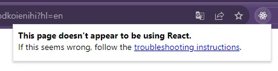
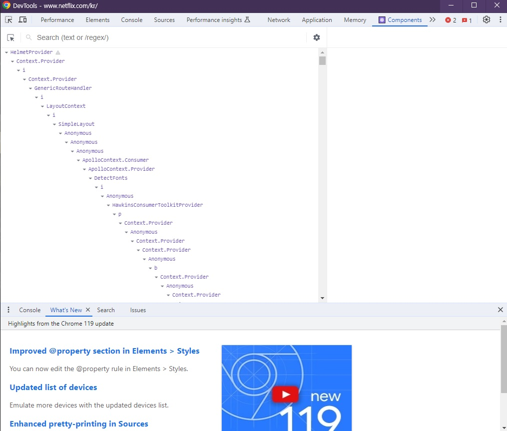

# 🐳 06. 리액트 개발 도구로 디버깅하기

리액트로 개발된 애플리케이션의 디버깅을 돕기 위한 리액트 개발 도구인 `react-dev-tools`에 대해 알아보자.


## 🌏 6.1 리액트 개발 도구란?

리액트 팀은 `react-dev-tools`를 제공하고 있다. <br/>리액트 웹 뿐만 아니라 리액트 네이티브 등 다양한 플랫폼에서 사용할 수 있다. 가장 편리하게 사용할 수 있는 방법은 확장프로그램을 사용하는 것이다.

<br/><br/>

## 🌏 6.2 리액트 개발도구 설치

Chrome 설치 : [설치 경로](https://chromewebstore.google.com/detail/react-developer-tools/fmkadmapgofadopljbjfkapdkoienihi?hl=en)

설치 후 로고가 회색이면 리액트 개발 도구가 정상적으로 접근할 수 없는 페이지거나 리액트로 개발되지 않은 페이지라는 뜻이다.



<br/><br/>

## 🌏 6.3 리액트 개발 도구 활용하기

개발자 도구에 `Components, Profiler`가 추가된 것을 확인할 수 있다. 

두 메뉴를 사용하는 방법을 알아보자. 실습은 넷플릭스 페이지로.

[넷플릭스 홈페이지](https://www.netflix.com/kr)

### 👉 6.3.1 컴포넌트

`Component`탭에서는 현재 리액트 애플리케이션의 컴포넌트 트리를 확인할 수 있다. <br/>단순히 구조 뿐만 아니라 props와 내부 hooks등 다양한 정보를 확인할 수 있다.



<br/>

#### 🔸 컴포넌트 트리

`Components`탭의 좌측은 페이지의 컴포넌트 트리, 이름 그대로 트리 구조로 구성돼 있으며, 리액트 애플리케이션 전체의 트리 구조를 한눈에 보여준다.

기명함수로 선언되어 컴포넌트명을 알 수 있따면 해당 컴포넌트명을 보여주고, 익명함수로 선언돼있으면 `Anonymous`라는 이름으로 컴포넌트를 보여준다.

```tsx
// App.tsx
// ...
import AnonymousDefaultComponent from './Component3'

function Component1(){ return <>Comoponent</> }
const Component2 = () => { return <>Component2</> }
const MemoizedComponent = memo(()=> <>MemoizedComponent</>)

const withSampleHOC = (Compoennt: ComponentType) => {
  return function () {
    return <Component />
  }
}

const HOCComponent = withSampleHOC(() => <>HOCComponent</>)
                                   
export default function App() {
  return (
  	<div className="App">
      <Component1 />
      <Component2 />
      <AnonymousDefaultComponent />
      <MemoizedComponent />
      <HOCComponent />
    </div>
  )
}

// Component3.tsx
export default () => {
  return <>Component3</>
}
```

개발자 도구에서 확인하면 아래와 같다.

```text
App
	Component1
	Component2
	_default
	Anonymous Memo
	Anonymous
		Anonymous
```

<br/>

함수 선언식 또는 표현식으로 선언되지 않은 컴포넌트는 다음과 같은 문제를 확인할 수 있다.

* 익명 함수를 default를 export한 AnonymousDefaultComponent의 경우 AnonymousDefaultComponent는 코드 내부에서 사용되는 이름일 뿐, 실제로 default export로 내보낸 함수의 명칭은 추론할 수 없다.<br/>따라서 `_default`로 표시됨.
* memo를 사용해 익명 함수로 만든 컴포넌트를 감싼 경우, 함수명을 명확히 추론하지 못해서 Anonymous로 표시됐다. 추가로 `memo`라벨을 통해 memo로 감싸진 컴포넌트임을 알 수 있다.
* 고차 컴포넌트인 withSampleHOC로 감싼 HOCComponent의 경우 두 가지 모두 Anonymous로 선언돼 있다. 이또한 고차 컴포넌트의 명칭을 제대로 추론하지 못했기 때문이다.

(16.8이하면, 이처럼 일부 익명 함수에 대해 컴포넌트 명칭을 제대로 추론하지못한다. 16.9버전 이후부터는 이러한 문제가 일부 해결됐다.)

이전 보다는 Anonymous가 `_c3`, `_c5`등으로 개선된 것을 확인할 수 있지만, 그럼에도 임의로 선언된 명칭으로는 개발 도구에서 컴포넌트를 특정하기는 어렵기때문에, **기명 함수**로 변경하는 것이 좋다.

기명함수로 바꾸기 어렵다면, 함수에 **displayName속성을 추가하는 방법**도 있다.

```tsx
const MemoizedCompoennt = memo(function() {
  return <>MemoizedComponent</>
})
MemoizedCompoennt.displayName = '메모 컴포넌트입니다.';
```

❗ **고차 컴포넌트에서 이런 기법을 유용하게 사용**할 수 있다.

<br/>

넷플릭스 홈페이지의 컴포넌트 트리의 경우처럼 개발모드에서 확인하는 리액트 컴포넌트 트리가 아닌 리액트를 빌드한 트리를 확인하는 경우 기명 함수로 선언한다 하더라도 terser 등의 압축 도구 등이 컴포넌트명을 단순하게 난수화하기 때문에 확인하기가 어려워진다.<br/>`Component.displayName`의 경우에도 빌드 도구가 사용하지 않는 코드로 인식해 삭제할 가능성도 있기 대문에 개발모드에서만 제한적으로 참고하는 것이 좋다.

<br/>

#### 🔸 컴포넌트명과 props

**좌측에서 컴포넌트**를 선택하면 **우측**에는 해당 **컴포넌트에 대한 자세한 정보(props, hooks등)**를 보여준다.

##### 컴포넌트명과 key

`Anonymous`명칭의 컴포넌트에 key가있는 컴포넌트를 클릭해보면, 이름옆에 경고 이모티콘이 있다. 이는 해당 애플리케이션이 `strict mode`로 렌더링되지 않았다는 것을 의미한다.

<br/>

##### 컴포넌트 도구

컴포넌트 명칭 우측에 존재. 컴포넌트 도구에는 3개의 아이콘이 있다.

* 첫 번째 `눈 아이콘`을 누르면 해당 컴포넌트가 HTML의 어디에서 렌더링됐는지 확인할 수 있다.
* 두 번째 `벌레 아이콘`을 클리갛면 아무것도 일어나지 않은거 같지만, 클릭하는 순간 console탭에 해당 컴포넌트의 정보가 console.log를 실행해 기록된것을 볼 수 있다.
* 세 번째 `소스코드 아이콘`을 클릭하면 해당 컴포넌트의 소스코드를 확인할 수 있다. `{}`로 난독화된 코드를 읽기 쉬운 형태로 변경할 수 있다.

<br/>

##### 컴포넌트 props

해당 컴포넌트가 받은 props를 확인할 수 있다.

여기엔 원시값뿐만 아니라 함수도 포함돼있다. 함수인 props를 누르면 `Go to Definition`이 나타나는데 클릭하면 해당 함수가 선언된 곳으로 이동한다.

<br/>

##### 컴포넌트 hooks

컴포넌트에서 사용중인 훅 정보를 확인할 수 있다. `useState`는 State와 같이 use가 생략된 이름으로 나타난다.

**훅 목록**

* State: useState
* Reducer: useReducer
* Context
* Memo
* Callback
* Ref
* id
* LayoutEffect
* Effect
* 리액트에서 제공하는 훅이 아닌 경우 : useXXX로 선언돼 있는 사용자 정의 훅이다.

❗ 훅도 익명함수로 넘기면 `f(){}`정도로만 확인이 가능하니 기명함수로 넘기면 더욱 정확하게 호가인할 수 있다.

대부분 useEffect의 경우 익명함수로 넘겨주기 때문에 여러개 선언돼있다면 어떤 훅인지 구별하기 어렵다. 이 경우 기명함수로 선언한다면 개발 도구를 더욱 유용하게 이용할 수 있따.

<br>

##### 컴포넌트를 렌더링한 주체, rendered by

`rendered by`는 해당 컴포넌트를 렌더링한 주체가 누구인지 확인할 수 있다.

production 모드에서는 `react-dom`의 버전만 확인할 수 있지만, 개발모드에서는 부모컴포넌트까지만 확인 가능.

<br/>

### 👉 6.3.2 프로파일러

`프로파일러`는 리액트가 렌더링하는 과정에서 발생하는 상황을 확인하기 위한 도구.<br/>즉, 애플리케이션이 렌더링되는 과정에서 어떤 컴포넌트가 렌더링됐는지, 또 몇차례나 렌더링이 일어났으며 어떤 작업에서 오래 걸렸는지 등 컴포넌트 렌더링 과정에서 발생하는 일을 확인할 수 있다.

❗ 렌더링 과정에 개입해 디버깅에 필요한 내용을 기록해야하기 때문에 프로덕션 빌드로 실행되는 리액트 애플리케이션에서는 사용 X

<br/>

#### 🔸 설정 변경하기

톱니바퀴모양을 눌러 몇가지 설정가능.

* `Genereal탭`의 `Highlight updates when components render` <br/>렌더링 될 때 마다 컴포넌트에 하이라이트를 표시.
* `Debugging`탭의 `Hide logs during second render in Strict Mode`<br/>엄격모드에서 실행되는 경우 원활한 디버깅을 위해 `useEffect`등이 두 번씩 작동하는 의도적인 작동이 숨겨짐.
* `Profiler`탭의 `Record why each component rendered while profiling`<br/>프로파일링 도중 무엇 때문에 컴포넌트가 렌더링 됐는지 기록함.

<br/>

#### 🔸 프로파일링

##### 프로파일링 메뉴

이 메뉴는 리액트가 렌더링할 때 어떤 일이 벌어지는지 확인할 수 있느 ㄴ도구다.

* 첫 번째 버튼 : `Start Profiling`버튼
  * 프로파일링 시작시 적색 동그라미로 바뀌며, 메세지가 나타남.
* 두 번째 버튼 : `Reload and Start profiling`버튼
  * 새로고침 후 프로파일링 시작
* 세 번째 버튼 : `Stop Profiling`버튼
  * 프로파일링된 현재 내용을 모두 지우는 버튼.
  * 프로파일링된 기록을 모두 삭제할수 있다.
* 네 번째, 다섯 번째 버튼 : `Load Profile`, `Save Profile`버튼
  * 다운로드 시 정보가 JSON으로 다운로드됨.

<br/>

##### Flamegraph

불꽃모양 아이콘으로 이 탭에서는 렌더 커밋별로 어떤 작업이 일어났는지 나타낸다.<br/>너비가 넓을 수록 해당 컴포넌트르 ㄹ렌더링하는데 오래 걸렸다는 뜻이다.

렌더링이 얼마나 걸렸는지와 렌더링 되지 않은 컴포넌트에 대한 정보도 확인 가능하다.

렌더링 되지 않은 컴포넌트는 회색으로 `Did not render`라는 메시지가 표시된다.

<br/>

##### Ranked

해당 커밋에서 렌더링하는 데 오랜 시간이 걸린 컴포넌트를 순서대로 나열한 그래프

`Flamegrpah`와 차이는 모든 컴포넌트를 보여주는게 아니라 단수닣 렌더링이 발생한 컴포넌트만 보여준다는데 있다.

렌더링이 발생한 컴포넌트에 대한 정보만 파악하고 싶은 경우 사용.

<br/>

#### 🔸 타임라인

Timeline은 시간이 지남에 따라 컴포넌트에서 어떤 일이 일어났는지를 확인할 수 있고, 리액트 18이상의 환경에서만 확인할 수 있다.

시간의 흐름에 따라 리액트가 동작하는 내용을 추적하는데 유용하다.

