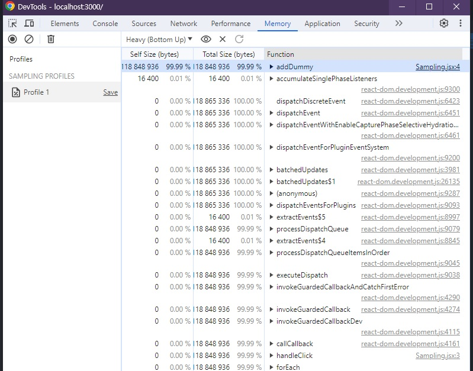

# 🐳 07.  크롬 개발자 도구를 활용한 애플리케이션 분석


## 🌏 7.1 크롬 개발자 도구란?

웹 페이지에서 일어나는 거의 모든 일을 확인할 수 있는 강력한 개발 도구. `F12` 로 이동가능.

❗ 개발자 도구에서 웹사이트를 제대로 디버깅하고 싶다면, `시크릿 모드`로 페이지와 개발자 도구를 여는 것을 권장한다.<br/>각종 확장 프로그램이 웹 페이지 방문 시 확장 프로그램의 실행을 위해 전역 변수나 HTML요소에 실제 우베 애플리케이션이 제공하지 않는 다른 정보를 추가할 수 있어서 방해될 수도 있다.

<br/><br/>

## 🌏 7.2 요소(Element) 탭

Element(요소 탭)에서는 웹 페이지를 구성하는 HTML, CSS정보를 확인할 수 있다.

### 👉 7.2.1 요소 화면

좌측엔 HTML이 나타나고, 원하는 태그를 클릭하면, 브라우저에서는 해당 요소가 강조된다.


우측에서 스타일을 수정해 웹페이지에 어떻게 보이는지 빠르게 확인할수도 있다.<br/>리액트 코드를 수정해 핫 리로딩을 거치지 않아도 호가인할 수 있어 빠른 작업이 가능하다.

만약 배너처럼 동적으로 제어되고 있는 DOM의 경우엔 요소의 중단점을 사용해 디버깅할 수 있다. 우클릭후에 `중단 위치`를 선택하고 중단을 원하는 옵션을 클릭. ( `하위 트리 수정`, `속성 수정`, `노드 삭제`, ... ) 

<br/>

### 👉 7.2.2 요소 정보

요소 탭 우측에서는 해당 요소와 관련된 정보를 얻을 수 있다.

* **Style** : class, tag명 등으로 매핑되어 설정된 스타일인지 확인 가능.
* **Computed** : 요소의 패딩, 마진등 각종 css적용 결과값을 알 수 있다.
* **Layout** : css grid나 레이아웃과 관련된 정보 확인
* **Event Listener** : 현재 요소에 부착된 각종 이벤트 리스너를 확인<br/>이벤트 버블링 등으로 이벤트를 발생시키는 경우에는 확인 불가
* **DOM Breakpoints**
* **Properties** : 해당 요소가 가진 모든 속성값을 보여준다.
* **Accessibility** : 웹 이용에 어려움을 겪는 장애인, 노약자등을 위한 스크린리더기 등이 활용하는 값.

<br/><br/>

## 🌏 7.3 소스 탭

웹 애플리케이션을 불러오기 위해 실행하거나 참조된 모든 파일을 확인할 수 있다. (JS, CSS, HTML, Font, ...)

소스탭은 파일을 선택하기전까지 특별히 살펴볼 것이 존재하지 않음.

❗ 소스탭의 장점은 **소스 중단점을 생성해 자바스크립트 실행을 중단시키고 디버깅을 수행**할 수 있다.<br/>코드에 debugger를 선언하는 것과 동일한 역할을 하지만, 소스코드를 오염시키지 않으므로 더 유용하다.

**확인 가능 요소**

* **Watch** : 감시하고 싶은 변수를 선언해 변수의 정보를 확인할 수 있는 메뉴. 확인할 수 없는 값은 `<not available>`로 표시됨.
* **Breakpoints**: 현재 웹 페이지에서 추가한 중단점을 확인할 수 있다. 현재 열린 파일 뿐만아니라 웹페이지 전체의 모든 중단점을 확인할 수 있다.
* **Scope** : 현재 중단점에서의 스코프를 의미. 로컬 스코프, 클로저, 전역 스코프등 확인 가능.
* **CallStack** : 호출 스택에서는 현재 중단점의 콜스택을 확인할 수 있다. 실행되는 콘텍스트가 어떻게 저장되어 현재 어떤 모습을 하고있는지 볼 수 있다.
* **Global Listener** : 현재 전역 스코프에 추가된 리스너 목록확인
* **XHR/fetch Breakpoints**, **Event Listener Breakpoints**, **CSP Violation Breakpoints** : 소스 이외의 중단점들

소스탭을 이용해 변수마다 console.log를 쓰지 않아도 빠르게 필요한 정보를 확인할 수 있다.

<br/><br/>

## 🌏 7.4 네트워크 탭

웹페이지를 접속하는 순간부터 발생하는 모든 네트워크 관련 작동이 기록된다. (HTTP 요청, 웹소켓, ...)

`Fetch/XHR`, `JS`등의 탭으로 필터링 가능.

react에서 useEffect의 사용으로 동일한 요청을 두 번 보내는 경우의 문제를 확인할 수도 있다.

### 👉 스크린숏 캡처기능

스크린숏 캡처기능을 통해 네트워크 요청 흐름에 따라 웹페이지가 어떻게 로딩되고 있는지 확인할 수 있다.


코드 내부의 fetch요청 이외에도 외부 CDN에서 가져오는 이미지 리소스 요청 등도 확인할 수 있다.

네트워크 탭에서 집중적으로 볼 부분은 아래와 같다.

* 불필요한 요청 또는 중복 요청이 없는지.
* 웹페이지 구성에 필요한 리소스 크기가 너무 크지 않은지
* 리소스를 불러오는 속도는 적절한지, 너무 속도가 오래걸리는 리소스가 없는지
* 리소스가 올바른 우선순위로 다운로드되어 페이지를 자연스럽게 만들어 가는지.

<br/><br/>

## 🌏 7.5 메모리 탭

웹 페이지가 차지하고 있는 메모리관련 정보를 확인할 수 있다.


가장 어렵지만, `메모리 누수`, `속도 저하`, `웹페이지 프리징 현상`을 확인할 수 있는 유용한 도구다.<br/>프로파일과 비슷하게 **프로파일링 작업**을 거쳐야 원하는 정보를 확인할 수 있다.

**프로파일링 유형**

* **Heap Snapshot (힙 스냅샷)** <br/>현재 메모리 상황을 사진 찍듯이 촬영할 수 있다.
* **Allocation instrumetation on timeline (타임라인의 할당 계측)** <br/>현재 시점의 메모리 상황이 아닌 시간의 흐름에 따라 메모리 변화를 살펴보고 싶을 때 사용.<br/>주로 로딩되는 과정의 메모리 변화 또는 페이지에서 어떤 상호작용을 했을 때 메모리의 변화 과정을 알고 싶을 때 사용
* **Allocation sampling (할당 샘플링)**<br/>메모리 공간을 차지하고 있는 자바스크립트 함수를 볼 수 있다.

<br/>

### 👉 7.5.1 자바스크립트 인스턴스 VM 선택

`Select JavaScript VM instance`항목을 살펴보면 **현재 실행중인 자바스크립트 VM인스턴스를 확인**할 수 있다.<br/>(위 사진의 경우 `www.netflix.com: Main` 등)

디버깅하고 싶은 자바스크립트 VM환경을 선택하고, 환경별 힙 크기를 볼 수 있다. 여기서 해당 페이지가 **자바스크립트 힙을 얼마나 점유하고 있는지** 나타난다. (실시간으로 바뀜.) <br/>=> 실제 브라우저에 부담을 주므로 불필요하게 크기가 늘어나지 않는지 눈여겨볼 필요가 있다.

<br/>

### 👉 7.5.2 힙 스냅샷

현재 페이지의 메모리 상태를 확인해 볼 수 있는 메모리 프로파일 도구이다.

**촬영하는 시점을 기준으로** 마치 사진으로 촬영하듯 메모리 현황을 보여준다.

```jsx
const DUMMY_LIST = []

export default function App() {
  function handleClick(){
    Array.from({length: 10_000_000}).forEach((_, idx)=>
			DUMMY_LIST.push(Math.random()*idx)
		)
    alert('complete!')
  }
  
  return <button onClick={handleClick}> BUG </button>
}
```

위 예제는 버튼을 클릭하면, 1000만개의 랜덤 값을 push한다. 이를 힙 스냅샷촬영으로 수행해보자.

먼저 실행해보면, 컴포넌트 하나 밖에 없지만, 메모리에 많은 정보들이 존재하는 것을 볼 수 있다.<br/>리액트 기반 애플리케이션이 `기본적으로 차지하는 내용`과, window객체 등 `브라우저가 차지하는 내용`이 존재하기 때문.

이후 버튼을 클릭하게 되면 기존 3.9MB에서 122MB로 크기가 엄청나게 증가하는 것을 볼 수 있다.


<br/>

원인 파악을 위해 **모든 객체 메뉴**를 클릭하고 **스냅샷1에서 스냅샷2사이에 할당된 객체**를 클릭해 **얕은 크기 항목을 기준으로 내림차순 정렬** 해보자.


두 스냅샷 간의 비교와 정렬로 어떤 변수가 메모리를 크게 잡고있는지 알 수 있고, 두 스냅샷 간 사이에 일어났던 유저 인터랙션, 즉 클릭으로 인해 이런 차이가 발생했다는 것을 명확히 확인할 수 있다.

> 얕은 크기와 유지된 크기의 차이
>
> `얕은 크기`란 객체 자체가 보유하는 메모리 바이트의 크기를 나타낸다. <br/>반면 `유지된 크기`란 해당 객체 자체뿐만 아니라 다른 부모가 존재하지 않은 모든 자식들의 크기까지 더한 값이다.
>
> ```jsx
> var counter = 0;
> var instances = []
> 
> function Y() { this.j = 5; }
> function X() { this.i = counter++; this.y = new Y(); }
> 
> export default function App(){
>   function handleClick(){
>     instances.push(new X())
>   }
>   return <button onClick={handleClick}>+</button>
> }
> ```
>
> 위 코드는 버튼 클릭 시 X라는 이름의 새로운 객체를 생성하는데 이 생성자 내부에서 Y라는 새로운 생성자를 할당한다.
>
> 
>
> X는 유지된 크기가 304, 얕은 크기가 52라고 되있다.<br/>X내부의 Y의 유지된 크기와 얕은크기가 48 / 124 인걸 볼 수 있다.
>
> ❗ **메모리 누수를 찾을 때는 얕은크기는 작으나 유지된 크기가 큰 객체를 찾아야 한다.**
>
> 두 크기 차이가 큰 객체는 다수의 다른 객체를 참조하고 있다는 뜻이며, 해당 객체가 복잡한 참조관계를 가지고 있다는 것이다.

스냅샷 촬영을 제대로 활용하려면 하나의 스냅샷 보다는 2개이상을 촬영하고 비교하는 것이 수월하다.

또한 스냅샷을 활용해 useMemo나 useCallback같은 의존성이 있는 값들이 정말로 렌더링 사이에 그대로 유지되는지 확인할 수 있다. (이 과정에서 기명함수를 사용하는 것이 디버깅에 유리한 것을 다시 확인할 수 있다.)

<br/>

### 👉 타임라인 할당 게측

할당 계측은 시간의 흐름에 따라 메모리 변화를 확인할 수 있는 기능이다. 메모리 변화를 모두 기록하기 때문에 상대적으로 부담이 크다.

```jsx
import { useState } from "react";

const Timeline = () => {
  const [number, setNumber] = useState(0);
  const [list, setlist] = useState([]);
  const handleClick = () => {
    const newNumber = number + 1;
    setNumber(newNumber);
    setlist((prev) => [
      ...prev,
      ...Array.from({ length: newNumber * 3000 }).map(
        (_, idx) => `${idx + number * 3000}`
      ),
    ]);
  };

  return (
    <>
      <button onClick={handleClick}>+</button>
      <ul>
        {list.map((item, idx) => (
          <li key={`${item}_${idx}`}>{item}</li>
        ))}
      </ul>
    </>
  );
};

export default Timeline
```

페이질 로딩 후 `타임라인 할당계측`을 선택하고 시작을 누른다. 그리고 버튼을 눌러보며 변화를 살펴보자.


버튼을 누를때 마다 배열에 새로운 아이템이 생기고, 리액트는 이 배열을 모두 DOM에 그리기 위해 1:1구조로 생성하는 FiberNode와 해당 배열을 담아야 하는 array의 크기가 엄청나게 커진 것을 볼 수 있다.

또 타임라인 할당게측의 또다른 장점은 **기간을 좁혀서 확인**할 수 있다는 것이다.

❗ 타임라인 할당 계측을 활용하면, 시간의 흐름에 따른 메모리 변화를 비롯해 메모리 변화를 일으킨 변수가 무엇인지, 해당 변수가 어느 정도 크기를 차지하고 있는지 등을 확인할 수 있다.

<br/>

### 👉 7.5.4 할당 샘플링

할당 샘플링은 시간의 흐름에 따라 발생하는 메모리 점유를 확인할 수 있다는게 할당 계측과 비슷하지만, 자바스크립트 실행 스택별로 분석할 수 있고, 이 분석을 함수 단위로 한다는 차이가 있다.

이전 Snapshot의 코드를 가지고 다시 확인해보자.

```jsx
const Sampling = () =>{
  const DUMMY_LIST = [];
  function handleClick(){
    Array.from({length: 10_000_000}).forEach(function addDummy(_, idx){
			DUMMY_LIST.push(Math.random()*idx)
    })
    alert('complete!')
  }
  return (
    <button onClick={handleClick}>BUG</button>
  )
}
export default Sampling;
```



할당 샘플링을 무거운 순으로 정렬하면 가장 많은 바이트를 차지한 함수의 작업이 맨 위로 올라오는데 위 코드에서는 addDummy인 것을 확인할 수 있다.

문제되는 함수뿐만 아니라 파일명을 눌러 우클릭 후 **소스 패널에 표시**를 선택해 어느 파일에서 어떻게 정의 됐는지 확인도 가능하다.

❗ `할당 샘플링`은 `타임라인 할당 계측`과 유사하지만, 프로파일링할 때 브라우저에 주는 부담을 최소화 할 수 있어 장시간에 걸쳐 디버깅을 수행해야 할 때 유리하다.<br/>**메모리 누수가 짐작되지만 정확히 어디서 발생하는지 확신하기 어려워 힙 스냅샷을촬영해 비교하기 어려운 경우**,<br/>**오랜 기간 메모리 누수가 의심되어 프로파일링을 장기간 수행해야 하는 경우** 활용하기 좋다.

<br/><br/>

## 🌏 7.6 Next.js 환경 디버깅하기

이전까지는 클라이언트 자바스크립트 환경을 디버깅한 예제이다.그렇기 때문에 사용자 기기의 스펙에 따라 같은 메모리누수도 다른 결과가 나타날 수도 있다.

서버 사이드 렌더링을 수행하는 환경에서 메모리 누수가 발생한다면? 

메모리 누수가 발생하면 서버 자체에 부담이 발생할 것이고, 서버 부담은 곧 모든 사용자가 서비스를 사용할 수 없는 심각한 상황을 초래하게 될 것이다.

<br/>

### 👉 7.6.1 Next.js 프로젝트를 디버그 모드로 실행하기

script에 아래 내용을 추가하자.<br/>아래 옵션으로 실행하게 되면 디버거가 활성화되면서 디버그 모드가 켜지게 된다.

실행 후 `chrome://inspect`로 이동

```json
"dev": NODE_OPTIONS='--inspect' next dev
```

`Open dedicated DevTools for Node`를 클리갛면 새로운 창에서 개발자 도구가 나타난다.

<br/>

### 👉 7.6.2 Next.js서버에서 트래픽 유입시키기

SSR처럼 서버에서 제공되는 서비스의 경우 서버를 실행한 뒤 사용자가 서서히 유입되면서 메모리 누수가 발생하는 경우가 많다. 따라서 서버에서 직접 트래픽을 발생시켜서 확인하는 편이 제일 확실한 방법이다.

오픈 소스 도구인 `ab`를 사용해 사용자의 트래픽이 서버로 몰리는 상황을 시뮬레이션 해볼 수 있다.

`ab`는 아파치 재단에서 제공하는 웹 서버 성능 검사 도구로, HTTP 서버의 성능을 벤치마킹 할 수 있는 도구이다.

```shell
ab -k -c 50 -n 10000 "http://127.0.0.1:3000"
```

해당 명령어를 터미널에 실행시켜 로컬 주소에다가 한 번에 50개의 요청을 10000번 시도한다.<br/>(로컬에서 테스트시 localhost로 하면 정상동작하지 않으니 반드시 ip주소로 기재)

ab는 단순히 요청을 수행하는 것만 아니라 요청의 응답을 받는데 걸리는 시간, 바이트 크기 등 다양한 정보를 확인할 수 있다.

<br/>

### 👉 7.6.3 Next.js의 메모리 누수 지점 확인하기

아래 예제는 getServerSideProps가 있는 Next.js페이지로 getServerSideProps가 실행될 때 마다 전역변수로 선언된 access_users에 끊임 없이 push를 수행한다.

```tsx
import type {GetServerSidePropsContext, Nextpage} from 'next'

const access_users = [];

function Home({currentDateTime}: {currentDateTiem: number}){
  return <>{currentDateTime}</>
}

export const getServerSideProps = (ctx: GetServerSidePropsContext) => {
  const currentDateTime = new Date().getTime();
  
  access_users.push({
    user: `user-${Math.round(Math.random()*100000)}`,
    currentDateTime,
  })
  
  return {
    props: {
      currentDateTime
    }
  }
  
}

export default Home;
```

브라우저에서 next애플리케이션을 방문한 뒤 다시 메모리 탭에서 메모리 변화를 살펴보자.

getServerSideProps의 다수 실행과 메모리 누수를 확인할 수 있다.<br/>getServerSideProps는 페이지 접근 요청이 있을 때마다 실행되는 함수기 때문에 최대한 부수효과가 없는 순수 함수로 만들어야 한다.<br/>만약 이 함수 내에서 이부 스코프의 변수에 의존하는 작업을 한다면 지금 처럼 메모리 누수 상항을 마주할 수 도 있다.


#### 🔸 정리

예제는 모두 극단적인 상황을 가정했기 때문에 찾기 쉬웠지만, 실제로는 매우 어렵고 귀찮은 작업이다.

대부분의 경우에 원인이 불명확하고, 아무리 봐도 바로 이해되는 경우가 없기 때문에 의심되는 지점을 찾고, 코드를 수정하고 다시 프로파일링하고 해결되는지 확인하고를 계속 반복해야한다.

원인은 나의 코드일수도 라이브러리일 수도 있기 때문에 많은 가능성을 열어두고, 반복해서 수행하며 숙달한다면 안정적인 서비스를 제공할 수 있을 것이다.

<br/>

### 📘 참고

* [ab](https://httpd.apache.org/docs/current/programs/ab.html)

<br/><br/>

## 🌏 정리

* `Element Tab`은 웹 페이지를 구성하는 HTML, CSS정보를 확인할 수 있다.

* `Source Tab`은 웹 애플리케이션을 불러오기 위해 실행하거나 참조된 모든 파일을 확인할 수 있으며, 중단점을 생성해 디버깅을 수행할 수 있다.

* `Network Tab`은 접속하는 순간 부터 발생하는 모든 네트워크 관련 동작이 기록된다.

* `Memory Tab`은 웹 페이지가 차지하고 있는 메모리 관련 정보를 확인할 수 있다.

  * `Heap Snapshot`은 현재 메모리 상황을 사진 찍듯이 촬영한다.
  * `Heap Snapshot`을 이용해 얕은크기는 작으나 유지된 크기가 큰 객체를 찾아 메모리 누수를 찾을 수 있다.
  * `Allocation instrumetation on timeline`은 시간의 흐름에 따라 메모리 변화를 살펴보고 싶을 때 사용한다.
  * `Allocation Sampling`은 메모리 공간을 차지하고 있는 자바스크립트 함수를 볼 수 있다.
  * 메모리 누수가 짐작되지만 정확히 어디서 발생하는지 확신하기 어려워 힙 스냅샷을촬영해 비교하기 어려운 경우,<br/>오랜 기간 메모리 누수가 의심되어 프로파일링을 장기간 수행해야 하는 경우 활용하기 좋다.

* 

  

