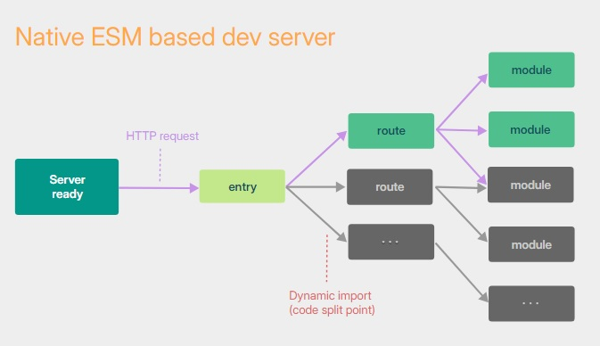

# 🐳 Vite

Vite를 설정하면서 사용했던 CLI와 Option들 등 Vite에 대해 알아가보자. (공식문서 참고)

## 🌏 Vite란?

차세대 프론트엔드 개발 툴. 빠르고 간결한 모던 웹 프로젝트 개발 경험에 초점을 맞춰 탄생한 빌드 도구.

**특징**

* 즉각적인 서버 시작
* 번개처럼 빠른 HMR(Hot Module Replacement)
* 풍부한 기능
* 최적화된 빌드
* 범용 플러그인 (Rollup 플러그인 인터페이스 제공)
* 완전한 유형의 API

<br/><br/>

## 🌏 왜 Vite를 써야하는가?

### 👉 문제점

브라우저에서 ESM(ES Module)을 지원하기 전까지, JavaScript 모듈화를 네이티브 레벨에서 진행할 수 없었고, **번들링**을 했어야 했습니다.( Webpack, Rollup, Parcel등 )

JavaScript 모듈의 개수도 극적으로 증가하며, **성능 병목 현상**이 발생하고, 종종 개발 서버를 가동하는데 비합리적으로 오랜 시간을 기다리거나 **HMR을 사용해도 변경된 파일이 적용될 때 까지 오랜 시간이 소요**되곤함.

<br/>

### 👉 지루할 정도로 길었던 서버 구동

`콜드 스타트` 방식으로 개발 서버를 구동할 때, 번들러 기반의 도구의 경우 모든 소스코드에 대해 크롤링 및 빌드 작업을 마쳐야지만 실제 페이지를 제공함.

vite는 애플리케이션 모듈을 `dependencies`와 `source code` 두가지 카테고리로 나누어 개발 서버의 시작시간을 개선함.




vite는 [Native ESM](https://developer.mozilla.org/en-US/docs/Web/JavaScript/Guide/Modules)을 이용해 소스코드를 제공함. 본질적으로 브라우저가 번들러의 작업의 일부를 차지할 수 있도록하고, **vite는 브라우저가 요청하는대로 소스코드를 변환하고 제공**하기만 하면됨.<br/>조건부 동적 import이후 코드는 현재 화면에서 실제로 사용되는 경우에만 처리.

> 콜드 스타트
>
> 최초로 실행되어 이전에 캐싱한 데이터가 없는 경우를 의미.

<br/>

### 👉  느렸던 소스 코드 갱신

기존 번들러 기반으로 개발을 진행 시 소스 코드를 업데이트 하게 되면 번들링 과정을 다시 거쳐야 했습니다.<br/>-> 서비스가 커질 수록 소스 코드 갱신 시간 또한 선형적으로 증가.

일부 번들러는 메모리에서 작업을 수행하여 실제 갱신에 영향을 받는 파일들만 새롭게 번들링하도록 했찌만, 결구 겇음에는 모든 파일에 대한 번들링을 수행해야 했습니다.<br/>-> 이런 이슈를 우회하고자 HMR이 나왔지만, 명확한 해답은 아님.

vite도 HMR을 지원하지만, 번들러가 아니라 ESM을 이용하는 것. **어떤 모듈이 수정되면 vite는 그저 수정된 모듈과 관련된 부분만 교체**할 뿐이고, **브라우저에서 해당 모듈을 요청하면 교체된 모듈을 전달**할 뿐입니다.<br/>-> 전 과정에서 완벽히 ESM을 사용하기 때문에 앱사이즈가 커져도 HMR을 포함한 갱신 시간에는 영향을 끼치지 않음.

<br/>

### 👉 번들링에 대해서

#### 🔸 번들링이 배포시에 왜 필요한가?

기본적으로 ESM이 대부분 환경에서 지원되지만, 프로덕션에서 **번들되지 않은 ESM을 가져오는 것은 중첩된 import로 인한 추가 네트워크 통신으로 인해 여전히 비효율적**이다. (HTTP/2도 마찬가지)

프로덕션에서 최적의 로딩 성능을 위해 `트리 셰이킹`, `지연로딩 및 청크 파일 분할`을 이용하여 번들링 하는 것이 좋다.

#### 🔸 번들링 시에는 왜 Esbuild를 사용하지 않는가?

Vite의 현재 플러그인 API는 `esbuild`를 번들러로 사용하는 것과 호환되지 않습니다. `esbuild`가 더 빠르지만 **Rollup의 유연한 플러그인 API 및 인프라**를 적극적으로 채택한 것은 생태계에서 성공에 큰 기여를 함. (현재로서는 Rollup이 성능 대 유연성 트레이드오프에서 더 나은 선택이라 믿음)

<br/><br/>

## 🌏 Vite 설정 방법 (vite.config.js)

📘 [Vite Config](https://ko.vitejs.dev/config/)

설정 시 `jsdoc`형식으로 인텔리센스를 활용할 수도 있고, `defineConfig`도우미 함수를 이용할 수도 있다. (나는 `defineConfig`도우미 함수를 이용)

```js
/** @type {import('vite').UserConfig} */
export default {
  // ...
}
```

```js
import { defineConfig } from 'vite'

export default defineConfig({
  // ...
})
```

<br/>

### 👉 조건부 설정

```js
export default defineConfig(({ command, mode, isSsrBuild, isPreview }) => {
  if (command === 'serve') {
    return {
      // 개발 서버 설정
    }
  } else {
    // command === 'build'
    return {
      // 빌드 설정
    }
  }
})
```

* command : 명령. 개발 서버에서는 `serve`, 빌드시에는 `build`
* mode : 사용중인 모드. 기본적으로 `dev`로 실행되는 개발 서버는 `development`, `build`명령은 `production`
* isSsrBuild : SSR 빌드 여부
* isPreview : 빌드 프리뷰 여부.

<br/><br/>

## 🌏 Options

사용했던 option들 위주로 정리. 추가 내용은 공식문서 확인

📘 [Vite Option](https://ko.vitejs.dev/config/shared-options.html)

**사용했던 Options**

```js
// vite.config.js
import react from "@vitejs/plugin-react";
import compression from "vite-plugin-compression2";
import { defineConfig } from "vite";
// import { visualizer } from 'rollup-plugin-visualizer';

export default defineConfig({
  plugins: [
    react(),
    compression({
      algorithm: 'gzip'
    }),
    // visualizer({
    //   filename: './visualize.html',
    //   open: true
    // })
  ],
  optimizeDeps: {
    include: ['esm-dep > cjs-dep'],
  },
  server: {
    port: 3000, // 기본 포트 번호 설정
    strictPort: false, // 포트 충돌 시 다음 포트로 이동
    open: false, // 서버 시작 시 브라우저 자동으로 열기
  },
  resolve: {
    alias: {
      "@": "/src",
    },
  },
  build: {
    minify: 'esbuild', // 'esbuild' 사용
    rollupOptions: { //
      output: {
        manualChunks: (id) => {
          if (id.includes('node_modules')) {
            return id.toString().split('node_modules/')[1].split('/')[0].toString();
          }
        }
      }
    }
  },
  esbuild: {
    minify: true, // esbuild로 minify 수행
    treeShaking: true,
    drop: ['console', 'debugger'], // 콘솔 로그와 디버거 제거
  }
});
```

<br/>

### 👉 [공용 옵션] plugin

사용할 플러그인의 배열. 잘못된 플러그인은 무시되고, 플러그인의 배열은 평탄화됨.

Promise객체가 반환되면, 실행되기 전 해당 데이터를 모두 가져옴.

### 👉[공용 옵션]  resolve.alias

파일 시스템템 경로에 별칭을 만들 때에, 반드시 절대 경로 사용. 상대 경로 별칭은 있는 그대로 사용되며, 파일 시스템 ㄱ여로로 적절하게 해석되지 않음.

### 👉[공용 옵션]  resolve.extensions

- **기본값:** `['.mjs', '.js', '.mts', '.ts', '.jsx', '.tsx', '.json']`

확장자를 생략한 가져오기를 위해 시도할 파일 확장자 목록. IDE와 타입 지원을 방해할 수 있으니 `.vue`와 같은 사용자가 지정한 방식의 가져오기 형식에 대해서는 확장자를 생략하지 않는 것을 추천.

### 👉[공용 옵션]  esbuild

`ESBuildOptions`는  [esbuild 변환 옵션](https://esbuild.github.io/api/#transform)을 확장함. 가장 일반적인 사례는 JSX를 커스터마이즈 하는 것.

```js
export default defineConfig({
  esbuild: {
    jsxFactory: 'h',
    jsxFragment: 'Fragment'
  }
})
```

기본적으로 `ts`, `js`, `tsx`파일들에 적용됨.

`build.minify`가 true인 경우 기본적으로 모든 축소(Minify)가 적용되므로 코드 일부분만 이를 적용하지 않기 위해서는  `esbuild.minifyIdentifiers`, `esbuild.minifySyntax`, 또는 `esbuild.minifyWhitespace` 옵션을 `false`로 설정

❗ `esbuild.minify`옵션은 `build.minify`를 재정의 하는데 사용할 수 없다.

> **ESBuild & Build**
>
> ```js
>  esbuild:{
>     minify: true,
>     treeShaking: true,
>     drop: ['console', 'debugger']
>   },
>   build: {
>     minify: 'terser', // or 'esbuild'
>     terserOptions: {
>       compress: {
>         drop_console: true, // 콘솔 로그 제거
>       },
>       output: {
>         comments: false, // 주석 제거
>       },
>     },
>     rollupOptions: {
>       ...
>     }
>   },
> ```
>
> 이 경우에 build에서 minify가 `terser`로 설정되어 esbuild.minify는 무시된다.
>
> build옵션은 Vite의 빌드 프로세스 전반을 설정하는 것이고, esbuild옵션은 빌드 과정에서 esbuild를 사용하는 경우에 대한 설정을 포함함.

> **Terser vs ESBuild**
>
> terser는 주로 JavaScript코드를 압축(minify)하고, 난독화(obfuscate)하는데 사용되며, 여러가지 다양한 압축 옵션을 제공하지만 esbuild에 비해 상대적으로 느릴 수 있다.
>
> esbuild는 JavaScript와 TypeSccript코드를 매우 빠르게 번들링하고, 압축하는 데 사용되며, Terser보다는 압축 옵션이 덜 세밀하지만, 일반적인 용도로는 충분한 기능을 제공함.
>
> ❗ esbuild는 빠른 빌드 속도를 제공하지만, Tesrser는 더 세밀한 압축 옵션을 제공함.

<br/>

### 👉 [서버 옵션] server.host

- **기본값:** `'localhost'`

서버가 수신할 IP주소를 지정. LAN와 공용 주소를 포함한 모든 주소를 수신하려면 이 값을 0.0.0.0 또는 true로 지정

### 👉 [서버 옵션] server.port

- **기본값:** `5173`

서버의 포트를 지정. 포트가 이미 사용중이라면 Vite는 자동으로 사용 가능한 다음 포트를 시도. 결과적으로 이 포트 번호가 서버의 수신 포트가 되지 않을 수 있음.

### 👉 [서버 옵션] server.strictPort

포트가 이미 사용중일 경우 사용 가능한 다음 포트를 자동으로 시도하지 않도록 하려면 `true`로 설정.

### 👉 [서버 옵션] server.open

서버가 시작될 때 자동으로 브라우저에서 앱을 open함. 특정 브라우저에서 열기를 원하면 설정가능.

### 👉 [서버 옵션] server.cors

개발 서버를 위한 CORS설정. 기본적으로 활성화되있으며, 모든 오리진을 허용함.

### 👉 [서버 옵션] server.headers

서버 응답 헤더를 지정.

<br/>

### 👉 [빌드 옵션] build.minify

- **기본값:** 클라이언트 빌드에는 `'esbuild'`를, SSR 빌드에는 `false`를 사용

`terser`사용 시 Terser를 설치해야함. `build.terserOptions`로 옴션 지정 가능.

```shell
npm add -D terser
```

### 👉 [빌드 옵션] build.rollupOptions

📘 [공식문서 - Rollup 옵션](https://rollupjs.org/configuration-options/)

기존 Rollup 번들을 커스텀. Rollup설정 파일에서 내보낼 수 있는 옵션과 같으며, Vite내부 Rollup옵션과 병합됨.

```js
build: {
    minify: 'esbuild', // 'esbuild' 사용
    rollupOptions: { //
      output: {
        manualChunks: (id) => {
          if (id.includes('node_modules')) {
            return id.toString().split('node_modules/')[1].split('/')[0].toString();
          }
        }
      }
    }
  },
```

 `manualChunks`는 코드 스플리팅을 제어하기 위해 사용되는 옵션으로 특정 모듈을 별도의 청크로 분리하여, 브라우저가 필요할 때 해당 청크만 로드하도록 할 수 있습니다.

위 코드는 `node_modules/react/index.js`와 같은 경로를 가진 모듈의 경우 `react`라는 이름의 청크로 분리함.

<br/>

### 👉 [디펜던시 최적화 옵션] optimizeDeps.include

기본적으로 `node_modules` 내부에 없는 연결된 패키지들은 미리 번들로 제공되지 않습니다. 이 옵션을 사용하여 **Vite가 사전 번들링할 모듈을 명시적으로 지정할 때 사용.**

```js
optimizeDeps: {
    include: ['esm-dep > cjs-dep'],
  },
```

`esm-dep`모듈이 `cjs-dep`모듈을 의존성으로 가질 때 `cjs-dep`를 사전 번들링하라는 의미. <br/>=> ESM 형식의 모듈이 CommonJS 형식의 모듈을 의존성으로 가질 때, Vite는 이를 사전 번들링

<br/>

많은 수의 라이브러리를 디렉터리 깊은 곳에서까지 가져와야 하는 경우, 끝에 Glob 패턴을 지정해 모든 라이브러리를 한 번에 사전 번들로 묶을 수 있습니다. 이렇게 하면 유사한 라이브러리를 가져올 때마다 반복적으로 사전 번들링을 수행하는 것을 피할 수 있습니다

```js
export default defineConfig({
  optimizeDeps: {
    include: ['my-lib/components/**/*.vue'],
  },
})
```

<br/><br/>

## 🌏 CLI (Command Line Interface)

📘 [Vite CLI](https://ko.vitejs.dev/guide/cli.html)

사용했던 json에 등록한 명령어들

```json
"scripts": {
    "dev": "vite",
    "build": "vite build",
    "preview": "vite preview",
    "test": "echo \"Error: no test specified\" && exit 1"
  },
....
```

### 👉 vite

현재 디렉토리에서 Vite 개발 서버를 시작합니다. (`vite dev`와 `vite serve`는 vite의 별칭)

```shell
vite [root]
```

<br/>

### 👉 build

프로덕션 빌드를 위한 명령어

```shell
vite build [root]
```

<br/>

### 👉 vite optimize

디펜던시를 미리 번들링합니다.

```shell
vite optimize [root]
```

<br/>

### 👉 vite preview

프로덕션 빌드를 로컬에서 미리 봅니다. 프로덕션 서버용으로 설계되지 않았기 때문에 프로덕션 서버로 사용하면 안됨.

```shell
vite preview [root]
```

<br/><br/>

## 