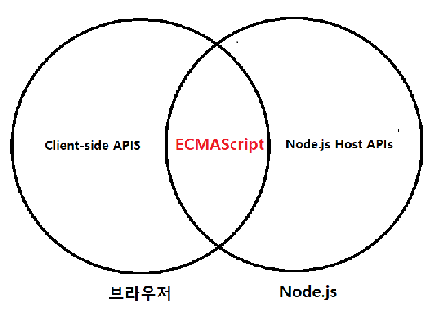
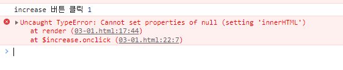
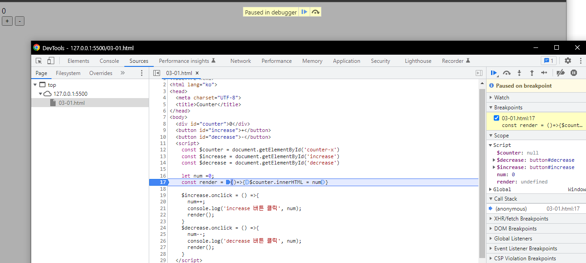
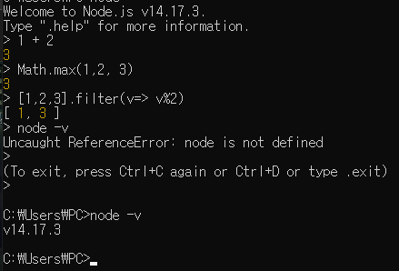
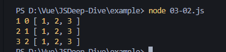

# 🐳 03. 자바스크립트 개발 환경과 실행 방법

## 🌏 3.1 자바스크립트 실행환경

모든 브라우저와 Node.js는 자바스크립트를 해석하고 실행할 수 있는 자바스크립트 엔진을 내장하고 있다.

한가지 주의할 점은 브라우저와 Node.js는 용도가 다르다는 것.

브라우저는 화면의 렌더링이 주 목적이지만, Node.js는 브라우저 외부에서 자바스크립트 실행 환경을 제공하는 것이 주된 목적.

❗ 브라우저와 Node.js모두 ECMAScript를 실행할 수 있지만 브라우저와 Node.js에서 ECMAScript 이외에 추가로 제공하는 기능은 호환되지 않는다.

ex) 브라우저는 DOM API를 기본적으로 제공하지만, Node.js는 DOM API를 제공하지 않음.<br/>브라우저 외부 환경에서는 html 요소를 파싱해서 객체화한 DOM을 직접 다룰 필요가 없기 때문.
반대로 Node.js는 파일시스템을 제공하지만 브라우저는 이를 지원하지 않음.

자바스크립트는 브라우저에서 동작하기 때문에 만약 JS가 로컬파일을 CRUD할 수 있다면, 그냥 약성코드에 노출된것과 똑같다. 그래서 보안상의 이유로 제공하지않는다.




## 🌏 3.2 웹 브라우저

이 책에서는 크롬을 사용한다.  크롬이 현재 ECMAScript 사양을 준수하는 것은 물론이고, 시장 점유율도 가장 높다.

### 👉 3.2.1 개발자도구

개발자도구는 웹 애플리케이션 개발에 필수적인 강력한 도구이다.

**Element, Console, Sources, Network, Application**을 주로이용.


### 👉 3.2.2 콘솔

자바스크립트 코드에서 에러가 발생해 애플리케이션이 정상적으로 동작하지않을 때 가장 우선적으로 살펴 봐야할 곳.

콘솔은 자바스크립트 코드를 직접 입력해 그 결과를 확인할 수 있는 **REFL(Read Eval Print Loop: 입력 수행 출력 반복)**환경으로 사용할 수 있다.

여러 줄로 이뤄진 자바스크립트 코드를 실행할 때 줄바꿈이 필요한 경우 Shift + Enter이용.


### 👉 3.2.3 브라우저에서 자바스크립트 실행

브라우저는 HTML을 로드하면 script 태그에 포함된 자바스크립트 코드를 실행한다.

```html
// 03-1.html
<!DOCTYPE html>
<html lang="ko">
<head>
  <meta charset="UTF-8">
  <title>Counter</title>
</head>
<body>
  <div id="counter">0</div>
  <button id="increase">+</button>
  <button id="decrease">-</button>
  <script>
    const $counter = document.getElementById('counter-x')
    const $increase = document.getElementById('increase')
    const $decrease = document.getElementById('decrease')

    let num =0;
    const render = ()=>{$counter.innerHTML = num}

    $increase.onclick = () =>{
      num++;
      console.log('increase 버튼 클릭', num);
      render();
    }
    $decrease.onclick = () =>{
      num--;
      console.log('decrease 버튼 클릭', num);
      render();
    }
  </script>
</body>
</html>
```

'+', '-'클릭하면 에러가 발생함.



### 👉 3.2.4 디버깅

에러를 클릭하면 해당 Soure 패널로 이동한다.

$counter변수의 ㄱ밧이 null인지 확인해보고 원인을 제거해보자.

좌측라인번호를 클릭해 브레이크포인트를 걸고 버튼을 클릭하면 디버깅모드로 들어간다.



마우스를 올려보거나 우측을 보면 $counter값을 볼 수 있다.

counter-x를 counter로 바꾸면 에러가 제거될 것이다.

**구글의 'Tools for Web Developers:콘솔사용',  'Tools for Web Developers: Chrome DevTools에서 자바스크립트 디버깅 시작하기를 참고'**


## 🌏 3.3 Node.js

프로젝트 규모가 커짐에 따라 프레임워크 또는 라이브러리를 도입하거나 Babel, Webpack, EsLint등 여러 도구를 사용할 필요가 있다. 이때 Node.js와 npm이 필요하다


### 👉 3.3.1 Node.js와 npm 소개

Node.js는 크롬 V8 자바스크립트 엔진으로 빌드된 자바스크립트 런타임 환경이다.

npm은 자바스크립트 패키지 매니저다.

Node.js에서 사용할 수 있는 모듈들을 패키지화 해서 모아둔 저장소 역할과 패키지 설치 및 관리를 위한 CLI를 제공한다.

www.npm.com


### 👉 3.3.2 Node.js

Node.js 설치 : http://nodejs.org

LTS(Long Term Support) 와 Current버전이 있다.

LTS는 안정된 지원이 보장되고, Current는 최신 기능을 제공하지만, 업데이트가 발생하여 안정적이지 않을 수 있다.

아래 명령어들로 버전확인이 가능.

```shell
node -v
npm -v
```


### 👉 3.3.3 Node.js REPL

Node.js가 제공하는 REPL(Read Eval Print Loop)을 사용하면 간단하게 자바스크립트 코드 실행결과를 볼 수 있다.

```shell
node
```

프롬프트가 >로 변경되면 실행해볼 수 있다.

```shell
> 1 + 2
3

```




js파일을 실행하려면 node 뒤에 파일명을 붙이면 된다.

```shell
node index.js
```


## 🌏 3.4 비주얼 스튜디오 코드

### 👉 3.4.1 설치

아래 사이트에서 설치

https://code.visualstudio.com/


### 👉 3.4.2 내장 터미널

myapp/index.js로 생성해보자

```javascript
// 03-02.js
const arr = [1,2,3];
arr.forEach(console.log)
```

Ctrl + `로 내장터미널을 열수 있다.




### 👉 3.4.3 확장 플러그인

Code Runner와 Live Server를 설치해서 각각 터미널과 브라우저에서 바로 결과를 확인해볼 수 있다.