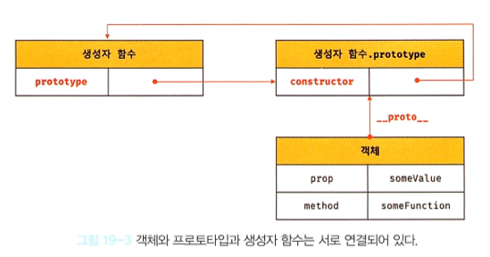
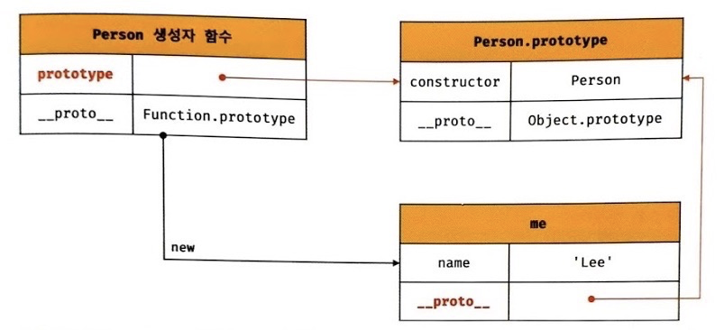
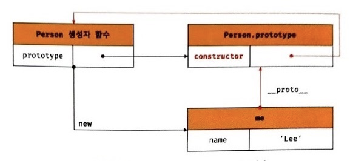

# 19장 프로토 타입

자바스크립트는 명령형, 함수형, 프로토타입 기반 객체지향 프로그래밍을 지원하는 멀티 패러다임 프로그래밍 언어다.

> 클래스 (Class)
>
> ES6에 도입되었는데, 기존의 프로토타입 기반 객체 지향 모델을 폐지하고, 새로운 객체지향 모델을 제공하는 것이 아니다.
>
> 클래스도 함수이며, 기존 프로토타입 기반 패턴의 문법적 설탕(syntactic sugar)라 볼 수 있다.
> (syntactic sugar는 문법에 설탕을 뿌려 더 달콤하게 사용한다는 의미.
> 즉, 문법적 기능은 그대로인데 읽는 사람이 직관적으로 이해할 수 있게 만든다는 것.)
>
> 클래스와 생성자 함수는 모두 프로토타입 기반의 인스턴스를 생성하지만 정확히 동일하게 동작하지는 않는다.
>
> **클래스는 생성자 함수보다 엄격하며 클래스는 생성자 함수에서 제공하지 않는 기능도 제공한다.**
>
> 따라서, 클래스를 프로토타입 기반 객체 생성 패턴의 단순한 문법적 설탕으로 보기보단 새로운 객체 생성 메커니즘으로 보는것이 좀더 합당하다.


## 19.1 객체지향 프로그래밍

**객체지향 프로그래밍**은 명령어 또는 함수의 목록으로 보는 **명령형 프로그래밍의 관점에서 벗어나 객체의 집합으로 프로그램을 표현하려는 프로그래밍 패러다임**을 말한다.

객체지향 프로그래밍은 실세계의 실체(사물, 개념등)를 인식하는 철학적 사고를 프로그래밍에 접목하려는 시도에서 시작함.

실체에는 특징이나 성질을 나타내는 **속성(attribute/property)**를 가지고 있고, 이를 통해 실체를 인식하거나 구별해 인식할 수 있다.

프로그래밍에서 다양한 속성 중에서 프로그램에 **필요한 속성만 간추려 내어 표현하는 것을 추상화(abstraction)**이라한다.

이때 프로그래머는 속성을 통해 다른 객체와 구별하여 인식한다.

**속성을 통해 여러 개의 값을 하나의 단위로 구성한 복합적인 자료구조를 객체라한다.**

=> 객체지향 프로그래밍은 독립적인 객체의 집합으로 프로그램을 표현하려는 프로그래밍 패러다임.

**Example**

원이란 개념의 객체가 있고, 속성으로 반지름을 가진다.

이 반지름으로 지름, 둘레, 넓이를 구할 수 있다.

여기서 반지름은 **상태를 나타내는 데이터**, 원의 지름, 둘레, 넓이를 구하는것이 **동작**이다.

```
const circle = {
  radius: 5, // 반지름

  // 원의 지름: 2r
  getDiameter() {
    return 2 * this.radius;
  },

  // 원의 둘레: 2πr
  getPerimeter() {
    return 2 * Math.PI * this.radius;
  },

  // 원의 넓이: πrr
  getArea() {
    return Math.PI * this.radius ** 2;
  }
};

console.log(circle);
// {radius: 5, getDiameter: ƒ, getPerimeter: ƒ, getArea: ƒ}

console.log(circle.getDiameter());  // 10
console.log(circle.getPerimeter()); // 31.41592653589793
console.log(circle.getArea());      // 78.53981633974483
```

객체지향 프로그래밍은 객체의 상태(state)를 나타내는 데이터와 상태 데이터를 조작할 수 있는 동작(behavior)

을 하나의 논리적인 단위로 묶어 생각한다.

객체는 **상태 데이터(property)와 동작(method)을 하나의 논리적인 단위로 묶은 복합적인 자료구조**라 볼 수 있다.


## 19.2 상속과 프로토타입

상속(inheritance)는 어떤 객체의 프로퍼티 또는 메서드를 다른 객체가 상속받아 그대로 사용할 수 있는 것.

자바스크립트는 프로토타입 기반으로 상속을 구현해 불필요한 중복을 제거함.

코드 재사용을 통해 개발 비용을 줄일 수 있다.

```javascript
// 생성자 함수
function Circle(radius) {
  this.radius = radius;
  this.getArea = function () {
    // Math.PI는 원주율을 나타내는 상수다.
    return Math.PI * this.radius ** 2;
  };
}

// 반지름이 1인 인스턴스 생성
const circle1 = new Circle(1);
// 반지름이 2인 인스턴스 생성
const circle2 = new Circle(2);

// Circle 생성자 함수는 인스턴스를 생성할 때마다 동일한 동작을 하는
// getArea 메서드를 중복 생성하고 모든 인스턴스가 중복 소유한다.
// getArea 메서드는 하나만 생성하여 모든 인스턴스가 공유해서 사용하는 것이 바람직하다.
console.log(circle1.getArea === circle2.getArea); // false

console.log(circle1.getArea()); // 3.141592653589793
console.log(circle2.getArea()); // 12.566370614359172
```

Circle생성자 함수가 생성하는 모든 객체는 radius와 getArea를 갖는다.

radius는 객체마다 다를 수 있지만, getArea의 경우 동일한 내용을 가진다.

이처럼 동일한 메서드를 중복 소유하기 때문에 메모리를 불필요하게 낭비한다.

상속을 통해 **불필요한 중복을 제거**하자.

```javascript
// 생성자 함수
function Circle(radius) {
  this.radius = radius;
}

// Circle 생성자 함수가 생성한 모든 인스턴스가 getArea 메서드를
// 공유해서 사용할 수 있도록 프로토타입에 추가한다.
// 프로토타입은 Circle 생성자 함수의 prototype 프로퍼티에 바인딩되어 있다.
Circle.prototype.getArea = function () {
  return Math.PI * this.radius ** 2;
};

// 인스턴스 생성
const circle1 = new Circle(1);
const circle2 = new Circle(2);

// Circle 생성자 함수가 생성한 모든 인스턴스는 부모 객체의 역할을 하는
// 프로토타입 Circle.prototype으로부터 getArea 메서드를 상속받는다.
// 즉, Circle 생성자 함수가 생성하는 모든 인스턴스는 하나의 getArea 메서드를 공유한다.
console.log(circle1.getArea === circle2.getArea); // true

console.log(circle1.getArea()); // 3.141592653589793
console.log(circle2.getArea()); // 12.566370614359172
```

getArea는 Circle의 프로토타입의 메서드로 할당되있따.

Circle생성자 함수가 생성하는 모든 인스턴스는 getArea메서드를 상속받아 사용할 수 있다.

**이처럼 동일한 내용의 메서드는 상속을 통해 공유하여 사용!**


## 19.3 프로토타입 객체

프로토타입 객체(줄여서 프로토타입)은 객체간 상속을 구현하기 위해 사용된다.

**프로토타입은 어떤 객체의 상위(부모) 객체의 역할을 하는 객체로서 다른 객체에 공유 프로퍼티를 제공**함.


모든 객체는 [[Prototype]]이란 내부 슬롯을 가지며, 슬롯의 값은 프로토타입의 참조다.

객체가 생성될 때 객체 생성 방식에 따라 프로토타입이 결정되고 [[Prototype]]에 저장된다.

>  ❗ [[prototype]]으로 표현되는 프로토타입 객체에 대한 "링크"는 내부 속성으로 정의되어지만, 많은 브라우저들이 **`__proto__`속성을 통해 특정 객체의 프로토타입에 접근**할 수 있도록 구현하였다.<br/>
>
>  ECMAScript 2015부터는 `Object.getPrototypeOf(obj)` 함수를 통해 객체의 프로토타입 객체에 **바로 접근할 수 있게** 되었습니다.<br/>(obj의 프로토타입([[Prototype]] 속성값)을 반환.)
>
>  참고 : [MDN 프로토타입](https://developer.mozilla.org/ko/docs/Learn/JavaScript/Objects/Object_prototypes)


모든 객체는 하나의 프로토타입을 갖는다. (**내부 슬롯 값이 null인 객체는 프로토타입이 없다.**)

모든 프로토타입은 생성자 함수와 연결되있다.

즉, 객체와 프로토타입과 생성자함수는 서로 연결되있다.




[[Prototype]]내부 슬롯에 직접 접근할 수 없지만, `__prototype__`접근자 프로퍼티를 통해 자신의 프로토타입에 간접 접근할 수 있고, 자신의 constructor프로퍼티를 통해 생성자 함수에 접근할수 있다.

생성자 함수는 자신의 prototype프로퍼티를 통해 프로토타입에 접근할 수 있다.


### 19.3.1 `__proto__`접근자 프로퍼티

모든 객체는 `__proto__`접근자 프로퍼티로 자신의 프로토타입에 간접적으로 접근할 수 있다.

```javascript
const person = {name: 'Joe'};
// result
[[Prototype]]
{
    constructor: ƒ Object()
    hasOwnProperty: ƒ hasOwnProperty()
    isPrototypeOf: ƒ isPrototypeOf()
    propertyIsEnumerable: ƒ propertyIsEnumerable()
    toLocaleString: ƒ toLocaleString()
    toString: ƒ toString()
    valueOf: ƒ valueOf()
    __defineGetter__: ƒ __defineGetter__()
    __defineSetter__: ƒ __defineSetter__()
    __lookupGetter__: ƒ __lookupGetter__()
    __lookupSetter__: ƒ __lookupSetter__()
    __proto__: (...)
    get __proto__: ƒ __proto__()
    set __proto__: ƒ __proto__()
}
```


**`__proto__`는 접근자 프로퍼티다.**

내부슬롯은 프로퍼티가 아니기 때문에, 원칙적으로는 직접적으로 접근하거나 호출할 방법을 제공하지 않지만, 일부 내부슬롯과 내부 메서드에 한햇 간접적으로 접근할 수단을 제공한다.

접근자 프로퍼티는 자체적으로 값을 갖지 않고, 접근자함수인 [[Get]], [[Set]]프로퍼티 어트리뷰트로 구성된 프로퍼티이다.

`__proto__`역시 [[Get]], [[Set]]에 할당된 함수, getter/setter을 통해 프로토타입을 취득하거나 할당한다.

```javascript
const obj = {};
const parent = { x: 1 };

// getter 함수인 get __proto__가 호출되어 obj 객체의 프로토타입을 취득
obj.__proto__;
// setter함수인 set __proto__가 호출되어 obj 객체의 프로토타입을 교체
obj.__proto__ = parent;

console.log(obj.x); // 1
```


`__proto__`접근자 프로퍼티는 상속을 통해 사용된다.

`__proto__`접근자 프로퍼티는 객체가 직접 소유하는 프로퍼티가 아니라, Object.prototype의 프로퍼티다.

```javascript
const person = { name: 'Lee' };

// person 객체는 __proto__ 프로퍼티를 소유하지 않는다.
console.log(person.hasOwnProperty('__proto__')); // false

// __proto__ 프로퍼티는 모든 객체의 프로토타입 객체인 Object.prototype의 접근자 프로퍼티다.
console.log(Object.getOwnPropertyDescriptor(Object.prototype, '__proto__'));
// {get: ƒ, set: ƒ, enumerable: false, configurable: true}

// 모든 객체는 Object.prototype의 접근자 프로퍼티 __proto__를 상속받아 사용할 수 있다.
console.log({}.__proto__ === Object.prototype); // true
```

> **Object.prototype**
>
> 모든객체는 프로토타입의 계층구조인 프로토타입 체인에 묶여있다.
>
> 자바스크립트 엔진은 객체의 프로퍼티에 접근하려 할 때 해당 객체에 접근하려는 프로퍼티가 없다면 `__proto__`접근자 프로퍼티가 가리키는 참조를 따라 자신의 부모역할을 하는 프로토타입의 프로퍼티를 순차적으로 검색한다.
>
> 프로토타입 체인의 종점, 즉 최상위 객체는 Object.prototype이며 이 객체의 프로퍼티와 메서드는 모든 객체에 상속된다.
>
> Object.prototype.valueOf()등등 Object.prototype을 상속받기 때문에 어떤 객체에서든지 접근할 수 있다.
>
> Object.keys()등은 prototype에 정의 되지 않아 사용불가. => Object()생성자에서만 사용할 수 있다.


**`__proto__`접근자 프로퍼티를 통해 프로토타입에 접근하는 이유**

❗ **상호참조에 의해 프로토타입이 생성되는 것을 방지하기 위해서** 이다.

```javascript
const parent = {};
const child = {};

// child의 프로토타입을 parent로 설정
child.__proto__ = parent;
// parent의 프로토타입을 child로 설정
parent.__proto__ = child; // TypeError: Cyclic __proto__ value
```

위 예제 경우 parent를 child로 설정 후 child를 parent로 설정했다.

정상 처리되면서 서로가 자신의 프로토타입이 되는 비정상적인 프로토타입체인이 만들어지기 때문에 `__proto__`접근자 프로퍼티는 에러를 발생시킴.

**프로토타입 체인은 단방향 링크드 리스트로 구현되야한다.**

서로가 자신의 프로토타입이 되는 비정상적인 프로토타입 체인, 즉 **순환참조(circular refrerence)**하는 프로토타입 체인이 만들어지면 체인 종점이 존재하지않아 프로퍼티 검색 시 무한루프에 빠진다.

그렇기 때문에 무조건적으로 프로토타입을 교체할 수 없게 `__proto__`를 통해 접근하고 교체하도록 구현되어있다.


**`__proto__`접근자 프로퍼티를 코드 내에서 직접 사용하는 것은 권장하지 않는다.**

일부 브라우저가 `__proto__`를 지원하기 때무에 ES6부터 표준으로 채택되었다.

하지만 코드 내에서 직접 사용하는건 권장하지 않는다.

=> **❗ 모든  객체가 `__proto__`접근자 프로퍼티를 사용할 수 있는 것은 아니기 때문**이다.

**직접상속을 통해 Object.prototype을 상속받지 않는 객체를 생성할 수도 있기 때문.**

```javascript
// obj는 프로토타입 체인의 종점이다. 따라서 Object.__proto__를 상속받을 수 없다.
const obj = Object.create(null);

// obj는 Object.__proto__를 상속받을 수 없다.
console.log(obj.__proto__); // undefined

// 따라서 Object.getPrototypeOf 메서드를 사용하는 편이 좋다.
console.log(Object.getPrototypeOf(obj)); // null
```


따라서 `__proto__`접근자 프로퍼티 대신 프로토타입의 **참조를 취득하고 싶은 경우엔** **Object.getPrototypeOf메서드를 사용**하고, **교체하고 싶은 경우 Object.setPrototypeOf**이용.

```javascript
const obj = {};
const parent = { x: 1 };

// obj 객체의 프로토타입을 취득
Object.getPrototypeOf(obj); // obj.__proto__;
// obj 객체의 프로토타입을 교체
Object.setPrototypeOf(obj, parent); // obj.__proto__ = parent;

console.log(obj.x); // 1
```


### 19.3.2 함수 객체의 prototype 프로퍼티

**함수 객체만이 소유하는 prototype프로퍼티는 생성자 함수가 생성할 인스턴스의 프로토타입을 가리킨다.**

```javascript
// 함수 객체는 prototype 프로퍼티를 소유한다.
(function () {}).hasOwnProperty('prototype'); // -> true

// 일반 객체는 prototype 프로퍼티를 소유하지 않는다.
({}).hasOwnProperty('prototype'); // -> false
```

prototype프로퍼티는 **생성자 함수가 생성할 객체의 프로토타입**을 가리킨다.

=> non-constructor인 화살표함수, ES6 메서드 축약표현인 메서드는 프로토타입도 생성 X

```javascript
// 화살표 함수는 non-constructor다.
const Person = name => {
  this.name = name;
};

// non-constructor는 prototype 프로퍼티를 소유하지 않는다.
console.log(Person.hasOwnProperty('prototype')); // false

// non-constructor는 프로토타입을 생성하지 않는다.
console.log(Person.prototype); // undefined

// ES6의 메서드 축약 표현으로 정의한 메서드는 non-constructor다.
const obj = {
  foo() {}
};

// non-constructor는 prototype 프로퍼티를 소유하지 않는다.
console.log(obj.foo.hasOwnProperty('prototype')); // false

// non-constructor는 프로토타입을 생성하지 않는다.
console.log(obj.foo.prototype); // undefined
```

**모든 객체가 가지고 있는(엄밀히 말하면 Object.prototype으로부터 상속받은) `__prototype__`접근자 프로퍼티와 함수 객체만 가지고 있는 prototype 프로퍼티는 결국 동일한 프로토타입을 가리킨다.**

하지만 프로퍼티를 사용하는 주체가 다르다.

| 구분               | 소유        | 값              | 사용주체    | 사용목적                                                     |
| ------------------ | ----------- | --------------- | ----------- | ------------------------------------------------------------ |
| `__proto__`        | 모든 객체   | 프로토타입 참조 | 모든 객체   | 객체가 자신의 프로토타입에 접근 또는 교체하기 위해 사용      |
| prototype 프로퍼티 | constructor | 프로토타입 참조 | 생성자 함수 | 생성자 함수가 자신이 생성할 객체의 프로토타입을 할당하기 위해 사용 |

```javascript
// 생성자 함수
function Person(name) {
  this.name = name;
}

const me = new Person('Lee');

// 결국 Person.prototype과 me.__proto__는 결국 동일한 프로토타입을 가리킨다.
console.log(Person.prototype === me.__proto__);  // true
```



### 19.3.3 프로토타입의 constructor 프로퍼티와 생성자 함수

모든 프로토타입은 constructor를 갖는다.

이 constructor 프로퍼티는 prototpye프로퍼티로 자신을 참조하고 있는 생성자 함수를 가리킨다.<br/>(함수객체가 생성될떄 이루어진다.)

```javascript
// 생성자 함수
function Person(name) {
  this.name = name;
}

const me = new Person('Lee');

// me 객체의 생성자 함수는 Person이다.
console.log(me.constructor === Person);  // true
```


