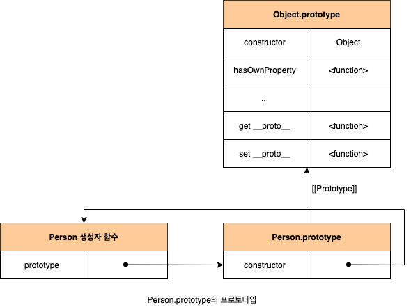
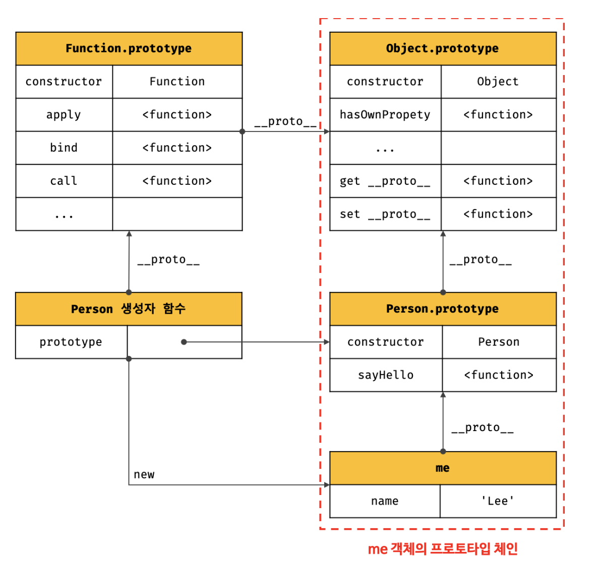

# 19장 프로토 타입 

자바스크립트는 명령형, 함수형, 프로토타입 기반 객체지향 프로그래밍을 지원하는 멀티 패러다임 프로그래밍 언어다.

> 클래스 (Class)
>
> ES6에 도입되었는데, 기존의 프로토타입 기반 객체 지향 모델을 폐지하고, 새로운 객체지향 모델을 제공하는 것이 아니다.
>
> 클래스도 함수이며, 기존 프로토타입 기반 패턴의 문법적 설탕(syntactic sugar)라 볼 수 있다. (syntactic sugar는 문법에 설탕을 뿌려 더 달콤하게 사용한다는 의미. 즉, 문법적 기능은 그대로인데 읽는 사람이 직관적으로 이해할 수 있게 만든다는 것.)
>
> 클래스와 생성자 함수는 모두 프로토타입 기반의 인스턴스를 생성하지만 정확히 동일하게 동작하지는 않는다.
>
> **클래스는 생성자 함수보다 엄격하며 클래스는 생성자 함수에서 제공하지 않는 기능도 제공한다.**
>
> 따라서, 클래스를 프로토타입 기반 객체 생성 패턴의 단순한 문법적 설탕으로 보기보단 새로운 객체 생성 메커니즘으로 보는것이 좀더 합당하다.

## 19.1 객체지향 프로그래밍

**객체지향 프로그래밍**은 명령어 또는 함수의 목록으로 보는 **명령형 프로그래밍의 관점에서 벗어나 객체의 집합으로 프로그램을 표현하려는 프로그래밍 패러다임**을 말한다.

객체지향 프로그래밍은 실세계의 실체(사물, 개념등)를 인식하는 철학적 사고를 프로그래밍에 접목하려는 시도에서 시작함.

실체에는 특징이나 성질을 나타내는 **속성(attribute/property)**를 가지고 있고, 이를 통해 실체를 인식하거나 구별해 인식할 수 있다.

프로그래밍에서 다양한 속성 중에서 프로그램에 **필요한 속성만 간추려 내어 표현하는 것을 추상화(abstraction)**이라한다.

이때 프로그래머는 속성을 통해 다른 객체와 구별하여 인식한다.

**속성을 통해 여러 개의 값을 하나의 단위로 구성한 복합적인 자료구조를 객체라한다.**

=> 객체지향 프로그래밍은 독립적인 객체의 집합으로 프로그램을 표현하려는 프로그래밍 패러다임.

**Example**

원이란 개념의 객체가 있고, 속성으로 반지름을 가진다.

이 반지름으로 지름, 둘레, 넓이를 구할 수 있다.

여기서 반지름은 **상태를 나타내는 데이터**, 원의 지름, 둘레, 넓이를 구하는것이 **동작**이다.

```
const circle = {
  radius: 5, // 반지름

  // 원의 지름: 2r
  getDiameter() {
    return 2 * this.radius;
  },

  // 원의 둘레: 2πr
  getPerimeter() {
    return 2 * Math.PI * this.radius;
  },

  // 원의 넓이: πrr
  getArea() {
    return Math.PI * this.radius ** 2;
  }
};

console.log(circle);
// {radius: 5, getDiameter: ƒ, getPerimeter: ƒ, getArea: ƒ}

console.log(circle.getDiameter());  // 10
console.log(circle.getPerimeter()); // 31.41592653589793
console.log(circle.getArea());      // 78.53981633974483
```

객체지향 프로그래밍은 객체의 상태(state)를 나타내는 데이터와 상태 데이터를 조작할 수 있는 동작(behavior)

을 하나의 논리적인 단위로 묶어 생각한다.

객체는 **상태 데이터(property)와 동작(method)을 하나의 논리적인 단위로 묶은 복합적인 자료구조**라 볼 수 있다.

## 19.2 상속과 프로토타입

상속(inheritance)는 어떤 객체의 프로퍼티 또는 메서드를 다른 객체가 상속받아 그대로 사용할 수 있는 것.

자바스크립트는 프로토타입 기반으로 상속을 구현해 불필요한 중복을 제거함.

코드 재사용을 통해 개발 비용을 줄일 수 있다.

```
// 생성자 함수
function Circle(radius) {
  this.radius = radius;
  this.getArea = function () {
    // Math.PI는 원주율을 나타내는 상수다.
    return Math.PI * this.radius ** 2;
  };
}

// 반지름이 1인 인스턴스 생성
const circle1 = new Circle(1);
// 반지름이 2인 인스턴스 생성
const circle2 = new Circle(2);

// Circle 생성자 함수는 인스턴스를 생성할 때마다 동일한 동작을 하는
// getArea 메서드를 중복 생성하고 모든 인스턴스가 중복 소유한다.
// getArea 메서드는 하나만 생성하여 모든 인스턴스가 공유해서 사용하는 것이 바람직하다.
console.log(circle1.getArea === circle2.getArea); // false

console.log(circle1.getArea()); // 3.141592653589793
console.log(circle2.getArea()); // 12.566370614359172
```

Circle생성자 함수가 생성하는 모든 객체는 radius와 getArea를 갖는다.

radius는 객체마다 다를 수 있지만, getArea의 경우 동일한 내용을 가진다.

이처럼 동일한 메서드를 중복 소유하기 때문에 메모리를 불필요하게 낭비한다.

상속을 통해 **불필요한 중복을 제거**하자.

```
// 생성자 함수
function Circle(radius) {
  this.radius = radius;
}

// Circle 생성자 함수가 생성한 모든 인스턴스가 getArea 메서드를
// 공유해서 사용할 수 있도록 프로토타입에 추가한다.
// 프로토타입은 Circle 생성자 함수의 prototype 프로퍼티에 바인딩되어 있다.
Circle.prototype.getArea = function () {
  return Math.PI * this.radius ** 2;
};

// 인스턴스 생성
const circle1 = new Circle(1);
const circle2 = new Circle(2);

// Circle 생성자 함수가 생성한 모든 인스턴스는 부모 객체의 역할을 하는
// 프로토타입 Circle.prototype으로부터 getArea 메서드를 상속받는다.
// 즉, Circle 생성자 함수가 생성하는 모든 인스턴스는 하나의 getArea 메서드를 공유한다.
console.log(circle1.getArea === circle2.getArea); // true

console.log(circle1.getArea()); // 3.141592653589793
console.log(circle2.getArea()); // 12.566370614359172
```

getArea는 Circle의 프로토타입의 메서드로 할당되있따.

Circle생성자 함수가 생성하는 모든 인스턴스는 getArea메서드를 상속받아 사용할 수 있다.

**이처럼 동일한 내용의 메서드는 상속을 통해 공유하여 사용!**

## 19.3 프로토타입 객체

프로토타입 객체(줄여서 프로토타입)은 객체간 상속을 구현하기 위해 사용된다.

**프로토타입은 어떤 객체의 상위(부모) 객체의 역할을 하는 객체로서 다른 객체에 공유 프로퍼티를 제공**함.

모든 객체는 [[Prototype]]이란 내부 슬롯을 가지며, 슬롯의 값은 프로토타입의 참조다.

객체가 생성될 때 객체 생성 방식에 따라 프로토타입이 결정되고 [[Prototype]]에 저장된다.

> ❗ [[prototype]]으로 표현되는 프로토타입 객체에 대한 "링크"는 내부 속성으로 정의되어지만, 많은 브라우저들이 **`__proto__`속성을 통해 특정 객체의 프로토타입에 접근**할 수 있도록 구현하였다.
>
> ECMAScript 2015부터는 `Object.getPrototypeOf(obj)` 함수를 통해 객체의 프로토타입 객체에 **바로 접근할 수 있게** 되었습니다.
> (obj의 프로토타입([[Prototype]] 속성값)을 반환.)
>
> 참고 : [MDN 프로토타입](https://developer.mozilla.org/ko/docs/Learn/JavaScript/Objects/Object_prototypes)

모든 객체는 하나의 프로토타입을 갖는다. (**내부 슬롯 값이 null인 객체는 프로토타입이 없다.**)

모든 프로토타입은 생성자 함수와 연결되있다.

즉, 객체와 프로토타입과 생성자함수는 서로 연결되있다.

[](https://github.com/JuneHyung/JSDeepDive/blob/main/정리/readme_images/19-03.객체_프로토타입_생성자함수.png)

[[Prototype]]내부 슬롯에 직접 접근할 수 없지만, `__prototype__`접근자 프로퍼티를 통해 자신의 프로토타입에 간접 접근할 수 있고, 자신의 constructor프로퍼티를 통해 생성자 함수에 접근할수 있다.

생성자 함수는 자신의 prototype프로퍼티를 통해 프로토타입에 접근할 수 있다.

### 19.3.1 `__proto__`접근자 프로퍼티

모든 객체는 `__proto__`접근자 프로퍼티로 자신의 프로토타입에 간접적으로 접근할 수 있다.

```
const person = {name: 'Joe'};
// result
[[Prototype]]
{
    constructor: ƒ Object()
    hasOwnProperty: ƒ hasOwnProperty()
    isPrototypeOf: ƒ isPrototypeOf()
    propertyIsEnumerable: ƒ propertyIsEnumerable()
    toLocaleString: ƒ toLocaleString()
    toString: ƒ toString()
    valueOf: ƒ valueOf()
    __defineGetter__: ƒ __defineGetter__()
    __defineSetter__: ƒ __defineSetter__()
    __lookupGetter__: ƒ __lookupGetter__()
    __lookupSetter__: ƒ __lookupSetter__()
    __proto__: (...)
    get __proto__: ƒ __proto__()
    set __proto__: ƒ __proto__()
}
```

**`__proto__`는 접근자 프로퍼티다.**

내부슬롯은 프로퍼티가 아니기 때문에, 원칙적으로는 직접적으로 접근하거나 호출할 방법을 제공하지 않지만, 일부 내부슬롯과 내부 메서드에 한햇 간접적으로 접근할 수단을 제공한다.

접근자 프로퍼티는 자체적으로 값을 갖지 않고, 접근자함수인 [[Get]], [[Set]]프로퍼티 어트리뷰트로 구성된 프로퍼티이다.

`__proto__`역시 [[Get]], [[Set]]에 할당된 함수, getter/setter을 통해 프로토타입을 취득하거나 할당한다.

```
const obj = {};
const parent = { x: 1 };

// getter 함수인 get __proto__가 호출되어 obj 객체의 프로토타입을 취득
obj.__proto__;
// setter함수인 set __proto__가 호출되어 obj 객체의 프로토타입을 교체
obj.__proto__ = parent;

console.log(obj.x); // 1
```

`__proto__`접근자 프로퍼티는 상속을 통해 사용된다.

`__proto__`접근자 프로퍼티는 객체가 직접 소유하는 프로퍼티가 아니라, Object.prototype의 프로퍼티다.

```
const person = { name: 'Lee' };

// person 객체는 __proto__ 프로퍼티를 소유하지 않는다.
console.log(person.hasOwnProperty('__proto__')); // false

// __proto__ 프로퍼티는 모든 객체의 프로토타입 객체인 Object.prototype의 접근자 프로퍼티다.
console.log(Object.getOwnPropertyDescriptor(Object.prototype, '__proto__'));
// {get: ƒ, set: ƒ, enumerable: false, configurable: true}

// 모든 객체는 Object.prototype의 접근자 프로퍼티 __proto__를 상속받아 사용할 수 있다.
console.log({}.__proto__ === Object.prototype); // true
```

> **Object.prototype**
>
> 모든객체는 프로토타입의 계층구조인 프로토타입 체인에 묶여있다.
>
> 자바스크립트 엔진은 객체의 프로퍼티에 접근하려 할 때 해당 객체에 접근하려는 프로퍼티가 없다면 `__proto__`접근자 프로퍼티가 가리키는 참조를 따라 자신의 부모역할을 하는 프로토타입의 프로퍼티를 순차적으로 검색한다.
>
> 프로토타입 체인의 종점, 즉 최상위 객체는 Object.prototype이며 이 객체의 프로퍼티와 메서드는 모든 객체에 상속된다.
>
> Object.prototype.valueOf()등등 Object.prototype을 상속받기 때문에 어떤 객체에서든지 접근할 수 있다.
>
> Object.keys()등은 prototype에 정의 되지 않아 사용불가. => Object()생성자에서만 사용할 수 있다.

**`__proto__`접근자 프로퍼티를 통해 프로토타입에 접근하는 이유**

❗ **상호참조에 의해 프로토타입이 생성되는 것을 방지하기 위해서** 이다.

```
const parent = {};
const child = {};

// child의 프로토타입을 parent로 설정
child.__proto__ = parent;
// parent의 프로토타입을 child로 설정
parent.__proto__ = child; // TypeError: Cyclic __proto__ value
```

위 예제 경우 parent를 child로 설정 후 child를 parent로 설정했다.

정상 처리되면서 서로가 자신의 프로토타입이 되는 비정상적인 프로토타입체인이 만들어지기 때문에 `__proto__`접근자 프로퍼티는 에러를 발생시킴.

**프로토타입 체인은 단방향 링크드 리스트로 구현되야한다.**

서로가 자신의 프로토타입이 되는 비정상적인 프로토타입 체인, 즉 **순환참조(circular refrerence)**하는 프로토타입 체인이 만들어지면 체인 종점이 존재하지않아 프로퍼티 검색 시 무한루프에 빠진다.

그렇기 때문에 무조건적으로 프로토타입을 교체할 수 없게 `__proto__`를 통해 접근하고 교체하도록 구현되어있다.

**`__proto__`접근자 프로퍼티를 코드 내에서 직접 사용하는 것은 권장하지 않는다.**

일부 브라우저가 `__proto__`를 지원하기 때무에 ES6부터 표준으로 채택되었다.

하지만 코드 내에서 직접 사용하는건 권장하지 않는다.

=> **❗ 모든 객체가 `__proto__`접근자 프로퍼티를 사용할 수 있는 것은 아니기 때문**이다.

**직접상속을 통해 Object.prototype을 상속받지 않는 객체를 생성할 수도 있기 때문.**

```
// obj는 프로토타입 체인의 종점이다. 따라서 Object.__proto__를 상속받을 수 없다.
const obj = Object.create(null);

// obj는 Object.__proto__를 상속받을 수 없다.
console.log(obj.__proto__); // undefined

// 따라서 Object.getPrototypeOf 메서드를 사용하는 편이 좋다.
console.log(Object.getPrototypeOf(obj)); // null
```

따라서 `__proto__`접근자 프로퍼티 대신 프로토타입의 **참조를 취득하고 싶은 경우엔** **Object.getPrototypeOf메서드를 사용**하고, **교체하고 싶은 경우 Object.setPrototypeOf**이용.

```
const obj = {};
const parent = { x: 1 };

// obj 객체의 프로토타입을 취득
Object.getPrototypeOf(obj); // obj.__proto__;
// obj 객체의 프로토타입을 교체
Object.setPrototypeOf(obj, parent); // obj.__proto__ = parent;

console.log(obj.x); // 1
```

### 19.3.2 함수 객체의 prototype 프로퍼티

**함수 객체만이 소유하는 prototype프로퍼티는 생성자 함수가 생성할 인스턴스의 프로토타입을 가리킨다.**

```
// 함수 객체는 prototype 프로퍼티를 소유한다.
(function () {}).hasOwnProperty('prototype'); // -> true

// 일반 객체는 prototype 프로퍼티를 소유하지 않는다.
({}).hasOwnProperty('prototype'); // -> false
```

prototype프로퍼티는 **생성자 함수가 생성할 객체의 프로토타입**을 가리킨다.

=> non-constructor인 화살표함수, ES6 메서드 축약표현인 메서드는 프로토타입도 생성 X

```
// 화살표 함수는 non-constructor다.
const Person = name => {
  this.name = name;
};

// non-constructor는 prototype 프로퍼티를 소유하지 않는다.
console.log(Person.hasOwnProperty('prototype')); // false

// non-constructor는 프로토타입을 생성하지 않는다.
console.log(Person.prototype); // undefined

// ES6의 메서드 축약 표현으로 정의한 메서드는 non-constructor다.
const obj = {
  foo() {}
};

// non-constructor는 prototype 프로퍼티를 소유하지 않는다.
console.log(obj.foo.hasOwnProperty('prototype')); // false

// non-constructor는 프로토타입을 생성하지 않는다.
console.log(obj.foo.prototype); // undefined
```

**모든 객체가 가지고 있는(엄밀히 말하면 Object.prototype으로부터 상속받은) `__prototype__`접근자 프로퍼티와 함수 객체만 가지고 있는 prototype 프로퍼티는 결국 동일한 프로토타입을 가리킨다.**

하지만 프로퍼티를 사용하는 주체가 다르다.

| 구분               | 소유        | 값              | 사용주체    | 사용목적                                                     |
| ------------------ | ----------- | --------------- | ----------- | ------------------------------------------------------------ |
| `__proto__`        | 모든 객체   | 프로토타입 참조 | 모든 객체   | 객체가 자신의 프로토타입에 접근 또는 교체하기 위해 사용      |
| prototype 프로퍼티 | constructor | 프로토타입 참조 | 생성자 함수 | 생성자 함수가 자신이 생성할 객체의 프로토타입을 할당하기 위해 사용 |

```
// 생성자 함수
function Person(name) {
  this.name = name;
}

const me = new Person('Lee');

// 결국 Person.prototype과 me.__proto__는 결국 동일한 프로토타입을 가리킨다.
console.log(Person.prototype === me.__proto__);  // true
```


### 19.3.3 프로토타입의 constructor 프로퍼티와 생성자 함수

모든 프로토타입은 constructor를 갖는다.

이 constructor 프로퍼티는 prototpye프로퍼티로 자신을 참조하고 있는 생성자 함수를 가리킨다.
(함수객체가 생성될떄 이루어진다.)

```
// 생성자 함수
function Person(name) {
  this.name = name;
}

const me = new Person('Lee');

// me 객체의 생성자 함수는 Person이다.
console.log(me.constructor === Person);  // true
```


## 19.4 리터럴 표기법에 의해 생성된 객체의 생성자 함수와 프로토 타입

생성자 함수에 의해 생성된 인스턴스는 프로토타입의 constructor프로퍼티에 의해 생성자 함수와 연결됨.<br/>(constructor프로퍼티가 가리키는 생성자함수는 객체를 생성한 생성자 함수.)

```javascript
// obj 객체를 생성한 생성자 함수는 Object다.
const obj = new Object();
console.log(obj.constructor === Object); // true

// add 함수 객체를 생성한 생성자 함수는 Function이다.
const add = new Function('a', 'b', 'return a + b');
console.log(add.constructor === Function); // true

// 생성자 함수
function Person(name) {
  this.name = name;
}

// me 객체를 생성한 생성자 함수는 Person이다.
const me = new Person('Lee');
console.log(me.constructor === Person); // true
```


리터럴 표기법에 의한 객체 생성 방식과 명시적으로 new 연산자와 함께 생성자 함수를 호출해 인스턴스를 생성하지 않는 객체 생성 방식도있다.

**리터럴 표기법에 의해 생성된 객체**도 물론 프로토타입이 존재하지만, 이 경우 **프로토타입의 constructor프로퍼티가 가리키는 생성자 함수가 반드시 객체를 생성한 생성자 함수라 단정할 수 없다.**

```javascript
// 객체 리터럴
const obj = {};

// 함수 리터럴
const add = function (a, b) { return a + b; };

// 배열 리터럴
const arr = [1, 2, 3];

// 정규표현식 리터럴
const regexp = /is/ig;

//---------------------------------------------------------------------------
// obj 객체는 Object 생성자 함수로 생성한 객체가 아니라 객체 리터럴로 생성했다.
const obj = {};

// 하지만 obj 객체의 생성자 함수는 Object 생성자 함수다.
console.log(obj.constructor === Object); // true
```

❗ obj는 객체 리터럴로 생성했지만, Object생성자 함수와 constructor 프로퍼티로 연결되있다.


**[ECMAScript Object([value])](https://262.ecma-international.org/11.0/#sec-fundamental-objects)**

> # 19.1.1.1 Object ( [ value ] )
>
> When the `Object` function is called with optional argument value, the following steps are taken:<br/>(Object함수가 호출되면 다음 단계로 수행된다.)
>
> 1. If NewTarget is neither undefined nor the active function, then
>
>    a. Return ? [OrdinaryCreateFromConstructor](https://262.ecma-international.org/11.0/#sec-ordinarycreatefromconstructor)(NewTarget, "%Object.prototype%").
>
> 2. If value is undefined or null, return [OrdinaryObjectCreate](https://262.ecma-international.org/11.0/#sec-ordinaryobjectcreate)(%Object.prototype%).
> 3. Return ! [ToObject](https://262.ecma-international.org/11.0/#sec-toobject)(value).
>
> The "length" property of the `Object` [constructor](https://262.ecma-international.org/11.0/#constructor) function is 1.

2에서 Object 생성자 함수에 인수를 전달하지 않거나 undefined 또는 null을 인수로 전달하면서 호출하면 **내부적으로는 추상연산 OrdinaryObjectCreate를 호출해 Object.prototype을 프로토타입으로 갖는 빈 객체를 생성**한다.

> **추상 연산(abstract operation)**
>
> ECMAScript 사양에서 내부 동작의 구현 알고리즘을 표현한 것.
>
> ECMAScript 사양에서 설명을 위해 사용되는 함수와 유사한 의사 코드라고 이해.

```javascript
// 2. Object 생성자 함수에 의한 객체 생성
// Object 생성자 함수는 new 연산자와 함께 호출하지 않아도 new 연산자와 함께 호출한 것과 동일하게 동작한다.
// 인수가 전달되지 않았을 때 추상 연산 OrdinaryObjectCreate를 호출하여 빈 객체를 생성한다.
let obj = new Object();
console.log(obj); // {}

// 1. new.target이 undefined나 Object가 아닌 경우
// 인스턴스 -> Foo.prototype -> Object.prototype 순으로 프로토타입 체인이 생성된다.
class Foo extends Object {}
new Foo(); // Foo {}

// 3. 인수가 전달된 경우에는 인수를 객체로 변환한다.
// Number 객체 생성
obj = new Object(123);
console.log(obj); // Number {123}

// String  객체 생성
obj = new Object('123');
console.log(obj); // String {"123"}
```

객체 리터럴이 평가될 때 추상연산 **OrdinaryObjectCreate를 호출해 빈 객체를 생성하고 프로퍼티를 추가**하도록 되어있다.

**[ECMAScript Runtime Semantics: Evaluation](https://262.ecma-international.org/11.0/#sec-fundamental-objects)**

> # 12.2.6.7 Runtime Semantics: Evaluation
>
> [ObjectLiteral](https://262.ecma-international.org/11.0/#prod-ObjectLiteral):{}
>
> Return [OrdinaryObjectCreate](https://262.ecma-international.org/11.0/#sec-ordinaryobjectcreate)(%Object.prototype%).
>
> [ObjectLiteral](https://262.ecma-international.org/11.0/#prod-ObjectLiteral):{[PropertyDefinitionList](https://262.ecma-international.org/11.0/#prod-PropertyDefinitionList)}{[PropertyDefinitionList](https://262.ecma-international.org/11.0/#prod-PropertyDefinitionList),}
>
> Let obj be [OrdinaryObjectCreate](https://262.ecma-international.org/11.0/#sec-ordinaryobjectcreate)(%Object.prototype%).
>
> Perform ? PropertyDefinitionEvaluation of [PropertyDefinitionList](https://262.ecma-international.org/11.0/#prod-PropertyDefinitionList) with arguments obj and true.
>
> Return obj.

**Object생성자 함수 호출과 객체 리터럴의 평가**는 추상 연산 OrdinaryObjectCreate를 호출하여 빈 객체를 생성하는 점에서 동일하나 **new.target의 확인이나 프로퍼티를 추가하는 처리 등 세부 내용은 다르다.**

**❗ 객체 리터럴에 의해 생성된 객체는 Object생성자 함수가 생성한 객체가 아니다.**

함수객체의 경우 차이가 더 명확함.

```javascript
// foo 함수는 Function 생성자 함수로 생성한 함수 객체가 아니라 함수 선언문으로 생성했다.
function foo() {}

// 하지만 constructor 프로퍼티를 통해 확인해보면 함수 foo의 생성자 함수는 Function 생성자 함수다.
console.log(foo.constructor === Function); // true
```


리터럴표기법에 의해 생성된 객체도 가상적인 생성자 함수를 갖는다.

프로토타입은 생성자 함수와 더불어 생성되며, prototype, constructor 프로퍼티에 의해 연결되있기 때문.

=> **프로토타입과 생성자 함수는 단독으로 존재할 수 없고 언제나 쌍으로 존재한다.**


**리터럴 표기법에 의해 생성된 객체와 생성자 함수로 생성된 객체 둘다 본질적인 면에서 차이는 없다.**

객체 리터럴에 의해 생성한 객체와 Object 생성자 함수에 의해 생성한 객체는 생성 과정에 미묘한 차이가 있지만 결국 객체로서 동일한 특성을 가진다.

함수도 함수리터럴에 의해 생성한 함수와 Function생성자 함수로 생성한 함수가 생성과정, 스코프, 클로저등 차이가 있지만, 결국 함수로서 동일한 특성을 가진다.

**리터럴 표기법에 의해 생성된 객체의 생성자 함수와 프로토 타입.**

| 리터럴 표기법      | 생성자 함수 | 프로토 타입        |
| ------------------ | ----------- | ------------------ |
| 객체 리터럴        | Object      | Object.prototype   |
| 함수 리터럴        | Function    | Function.prototype |
| 배열 리터럴        | Array       | Array.prototype    |
| 정규 표현식 리터럴 | RegExp      | RegExp.prototype   |


## 19.5 프로토타입의 생성 시점 ❓

> Object.create메서드와 클래스에 의한 객체 생성
>
> Object.create와 클래스로 생성한 객체도 생성자 함수와 연결되 있다.
>
> (19.11장, 25장에서 자세히)

**프로토타입은 생성자 함수가 생성되는 시점에 같이 생성된다.** <br/>(위에서 말했듯이 쌍으로 존재하기 때문.)

생성자 함수는 **사용자 정의 생성자 함수(사용자가 직접 정의)와 빌트인 생성자 함수(자바스크립트 제공)**로 구분할 수 있는데 2가지의 프로토타입 생성시점에 대해 알아보자.


### 19.5.1 사용자 정의 생성자 함수와 프로토타입 생성 시점

**constructor(생성자 함수로서 호출할 수 있는 함수)는 함수 정의가 평가되어 함수 객체를 생성하는 시점에 프로토타입도 더불어 생성한다.**

```javascript
// 함수 정의(constructor)가 평가되어 함수 객체를 생성하는 시점에 프로토타입도 더불어 생성된다.
console.log(Person.prototype); // {constructor: ƒ}

// 생성자 함수
function Person(name) {
  this.name = name;
}
```

non-constructor는 프로토타입이 생성되지 않음.

```javascript
// 화살표 함수는 non-constructor다.
const Person = name => {
  this.name = name;
};

// non-constructor는 프로토타입이 생성되지 않는다.
console.log(Person.prototype); // undefined
```

함수 선언문은 런타임 이전에 자바스크립트 엔진에 의해 실행되고, 평가되어 함수 객체가 된다. 이때 프로토타입도 같이 생성된다.

생성된 프로토 타입은 prototype프로퍼티에 바인딩 된다.

```javascript
console.log(Person.prototype);

function Person(name){
    this.name = name
}
//------------------------------------------------------------------------
{constructor: ƒ}
    ▶constructor: ƒ Person(name)
    ▶[[Prototype]]: Object
```

생성된 프로토타입은 constructor프로퍼티만 가진다.

프로토타입도 객체고 모든 객체는 프로토타입을 가지므로, 프로토타입도 자신의 프로토타입을 가진다.

생성된 프로토타입의 프로토타입은 Object.prototype이다.



❗ 사용자 정의 생성자 함수는 자신이 평가되어 함수 객체로 생성되는 시점에 프로토타입도 더불어 생성되며 이때 생성된 프로토타입의 프로토타입은 언제나 Object.prototype이다.


### 19.5.2 빌트인 생성자 함수와 프로토타입 생성 시점

빌트인 생성자 함수(Object, String, Number, Function, ...)도 생성되는 시점에 프로토타입이 생성된다.

**모든 빌트인 생성자 함수는 전역객체가 생성되는 시점에 생성되고, 생성된 프로토타입은 빌트인 생성자 함수의 prototype프로퍼티에 바인딩된다.**

> **전역 객체(global object)**
>
> 전역 객체는 코드가 실행되기 이전 단계인 자바스크립트 엔진에 의해 생성되는 특수한 객체다.
>
> 클라이언트 사이드 환경(브라우저)에서는 widnow, 서버사이드(Node.js)에서는 global객체를 의미.
>
> 
>
> 표준 빌트인 객체들(Object, String, Number, Function, ...)<br/>환경에 따른 호스트 객체(Web API, host API)<br/>var로 선언한 전역 변수와 전역 함수를 프로퍼티로 갖는다.
>
> ```javascript
> // 전역 객체 window는 브라우저에 종속적이므로 아래 코드는 브라우저 환경에서 실행해야 한다.
> // 빌트인 객체인 Object는 전역 객체 window의 프로퍼티다.
> window.Object === Object // true
> ```

**❗ 객체가 생성되기 전에 생성자 함수와 프로토타입은 이미 객체화되어 존재한다.**

**생성자 함수 또는 리터럴 표기법으로 객체 생성하면 프로토타입은 생성된 객체의 [[Prototype]] 내부 슬롯에 할당되고, 생성된 객체는 프로토타입을 상속받는다.**


## 19.6 객체 생성 방식과 프로토타입의 결정

프로토타입은 추상 연산OrdinaryObjectCreate에 전달되는 인수에 의해 결정된다. 이 인수는 객체가 생성되는 시점에 객체 생성 방식에 의해 결정된다.

**객체 생성 방식**

* 객체 리터럴
* Object 생성자 함수
* 생성자 함수
* Object.create 메서드
* 클래스(ES6)


### 19.6.1 객체 리터럴에 의해 생성된 객체 프로토타입

자바스크립트 엔진은 객체 리터럴을 평가해 객체를 생성할 때 추상연산 OrdinaryObjectCreate를 호출하고,<br/> 이때 **전달되는 프로토타입은 Object.prototype**이다.<br/>(객체 리터럴로 생성된 객체의 프로토타입 = Object.prototype)

```javascript
const obj = { x: 1 };

// 객체 리터럴에 의해 생성된 obj 객체는 Object.prototype을 상속받는다.
// obj객체는 constructor프로퍼티와 hasOwnProperty메서드 등을 소유하지 않지만, Object.prototype을 상속받기 때문에 자신의 프로토타입에서 자신의 자산인 것 처럼 사용가능.
console.log(obj.constructor === Object); // true
console.log(obj.hasOwnProperty('x'));    // true
```


### 19.6.2 Object.생성자 함수에 의해 생성된 객체의 프로토타입

Object생성자 함수 역시 추상연산 OrdinaryObjectCreate를 호출하고,<br/> 이때 **전달되는 프로토타입은 Object.prototype**이다.

```javascript
const obj = new Object();
obj.x = 1;

// Object 생성자 함수에 의해 생성된 obj 객체는 Object.prototype을 상속받는다.
console.log(obj.constructor === Object); // true
console.log(obj.hasOwnProperty('x'));    // true
```

>  **객체 리터럴과 Object생성자 함수에 의한 객체 생성 방식의 차이**
>
> 프로퍼티를 추가하는 방식에 차이가 있다.
>
> **객체 리터럴 방식은 객체 리터럴 내부에** 프로퍼티를 추가하지만, **Object생성자 함수방식은 일단 빈 객체를 생성한 후 프로퍼티를 추가**해야한다.


### 19.6.3 생성자 함수에 의해 생성된 객체의 프로토타입

new연산자를 이용한 객체 생성 방식도 추상연산 OrdinaryObjectCreate를 호출하고,<br/>이때 **전달되는 프로토타입은 생성자 함수의 prototype프로퍼티에 바인딩 되어있는 객체**다.

표준 빌트인 객체인 Object생성자 함수와 더불어 생성된 프로토타입 Object.prototype은 다양한 빌트인 메서드를 갖고 있다.

사용자 정의 생성자 함수 Person과 더불어 생성된 프로토타입 Person.prototype의 프로퍼티는 constructor뿐.

프로토 타입은 객체이기 때문에 일반 객체처럼 프로퍼티를 추가/삭제 할 수 있고, 프로토타입 체인에 즉각 반영된다.

**Example**

Person.prototype에 프로퍼티를 추가해 자식 객체가 상속받을 수 있도록 구현.

Person을 통해 생성된 모든 객체는 sayHello를 상속받아 자신의 메서드처럼 사용 가능하다.

```javascript
function Person(name) {
  this.name = name;
}

// 프로토타입 메서드
Person.prototype.sayHello = function () {
  console.log(`Hi! My name is ${this.name}`);
};

const me = new Person('Lee');
const you = new Person('Kim');

me.sayHello();  // Hi! My name is Lee
you.sayHello(); // Hi! My name is Kim
```


## 19.7 프로토타입 체인

```javascript
function Person(name) {
  this.name = name;
}

// 프로토타입 메서드
Person.prototype.sayHello = function () {
  console.log(`Hi! My name is ${this.name}`);
};

const me = new Person('Lee');

// hasOwnProperty는 Object.prototype의 메서드다.
console.log(me.hasOwnProperty('name')); // true

Object.getPrototypeOf(me) === Person.prototype; // -> true
Object.getPrototypeOf(Person.prototype) === Object.prototype; // -> true
```

Person생성자 함수에 의해 생성된 me 객체는 hasOwnProperty를 쓸 수 있다.

이는 Person.prototype + Object.prototype도 상속 받았다는 것을 의미.

프로토타입의 프로토타입은 언제나 Object.prototype이다.



> **프로토타입 체인** 
>
> 자바스크립트는 객체 프로퍼티에 접근하려 할 때 접근하려는 프로퍼티가 없다면 [[Prototype]] 내부 슬롯의 참조를 따라 자신의 부모 역할을 하는 프로토타입의 프로퍼티를 순차적으로 검색한다.
>
> 이를 프로토타입 체인이라 부르며, 객체지향 프로그래밍의 상속을 구현하는 메커니즘이다.
>
> ```javascript
> // hasOwnProperty는 Object.prototype의 메서드다.
> // me 객체는 프로토타입 체인을 따라 hasOwnProperty 메서드를 검색하여 사용한다.
> me.hasOwnProperty('name'); // -> true
> ```

**과정**

1. me객체에 hasOwnProperty를 검색.<br/>해당 메서드가 없기 때문에 프로토타입 체인을 따라 [[Prototype]]에 바인딩 되있는 프로토타입(Person.prototype)으로 이동해 메서드 검색.

2. Person.prototype에도 없기때문에 Person.prototype의 [[Prototype]]에 바인딩된 프로토타입(Object.prototype)에서 검색.
3. 자바스크립트 엔진은Object.prototype의 hasOwnProperty를 호출.<br/>이때 Object.prototype.hasOwnProperty메서드의 this에는 me가 바인딩됨.

```javascript
// call 메서드
// this로 사용할 객체를 전달하면서 함수를 호출한다. (22장에서 자세히)
// 지금은 this로 사용할 me를 전달하며 Object.prototype.hasOwnProperty메서드를 호출한다고 이해.
Object.prototype.hasOwnProperty.call(me, 'name');
```


프로토타입 체인의 최상위(**프로토타입 체인의 종점**)는 언제나 **Object.prototype**이다.

모든 객체는 Object.prototype을 상속받으며, Object.prototype의 프로토타입은 null이다.

**Object.prototype에서도 프로퍼티를 검색할 수 없다면 undefined가 리턴되며 에러가 발생하지 않는 것에 주의!**


자바스크립트 엔진은 프로토타입 체인을 따라 프로퍼티/메서드를 검색한다.<br/>객체간의 상속 관계로 이루어진 프로토타입의 계층적인 구조에서 객체의 프로퍼티를 검색.<br/>**=> 프로토타입 체인은 상속과 프로퍼티 검색을 위한 메커니즘.**

프로퍼티가 아닌 식별자는 스코프체인에서 검색한다.<br/>자바스크립트 엔진은 함수 중첩관계로 이루어진 스코프의 계층적 구조에서 식별자를 검색한다.<br/>**=> 스코프 체인은 식별자 검색을 위한 메커니즘.**

**Example**

```javascript
me.hasOwnProperty('name');
```

먼저 스코프 체인에서 me를 검색하고, me가 전역에 선언되었으므로 전역 스코프에서 검색된다.

me검색 후 me객체의 프로토타입 체인에서 메서드를 검색한다.

**❗ 스코프체인과 프로토타입 체인은 서로 연관없이 별도로 동작하는게 아니라 서로 협력하여 식별자와 프로퍼티를 검색하는데 사용된다.**


## 19.8 오버라이딩과 프로퍼티 섀도잉

생성자 함수로 객체를 생성한 후, 인스턴스에 메서드를 추가했다.

```javascript
const Person = (function () {
  // 생성자 함수
  function Person(name) {
    this.name = name;
  }

  // 프로토타입 메서드
  Person.prototype.sayHello = function () {
    console.log(`Hi! My name is ${this.name}`);
  };

  // 생성자 함수를 반환
  return Person;
}());

const me = new Person('Lee');

// ---------------------------------------------------------------------------

// 인스턴스 메서드
me.sayHello = function () {
  console.log(`Hey! My name is ${this.name}`);
};

// 인스턴스 메서드가 호출된다. 프로토타입 메서드는 인스턴스 메서드에 의해 가려진다.
me.sayHello(); // Hey! My name is Lee
```

프로토타입 프로퍼티와 같은 이름의 프로퍼티를 인스턴스에 추가하면 프로토타입 체인을 따라 프로토타입 프로퍼티를 검색해 덮어씌우지 ㅇ낳고, 인스턴스 프로퍼티로 추가한다.

sayHello는 프로토타입 메서드 sayHello를 오버라이딩 했고, 프로토타입 sayHello는 가려진다.

**상속관계에 의해 프로퍼티가 가려지는 현상을 프로퍼티 섀도잉(property shadowing)**이라한다.

> 오버라이딩
>
> 상위 클래스가 가진 메서드를 하위 클래스가 재정의 하여 사용하는 방식.
>
> 
>
> 오버로딩
>
> 함수 이름은 동일하지만, 매개변수의 타입이나 개수가 다른 메서드를 구현해 매개변수에 의해 메서드를 구별해 호출하는 방식.<br/>(JS는 오버로딩을 지원하지않지만 argument로 구현할 수는 있다.)


삭제의 경우도 동일하게 프로토타입의 메서드가아닌 인스턴스 메서드 sayHello가 삭제된다.

```javascript
// 인스턴스 메서드를 삭제한다.
delete me.sayHello;
// 인스턴스에는 sayHello 메서드가 없으므로 프로토타입 메서드가 호출된다.
me.sayHello(); // Hi! My name is Lee

// 프로토타입 체인을 통해 프로토타입 메서드가 삭제되지 않는다.
delete me.sayHello;
// 프로토타입 메서드가 호출된다.
me.sayHello(); // Hi! My name is Lee
```

하위 객체를 통해 프로토타입의 프로퍼티를 변경 또는 삭제하는 것은 불가능.<br/>(**하위 객체를 통해** 프로토타입에 get액세스는 허용되나 set은 X, 직접 접근해야 변경 또는 삭제가 가능하다)


## 19.9 프로토타입 교체

프로토타입은 임의의 다른 객체로 변경이 가능.<br/>부모 객체인 프로토타입을 동적으로변경할 수 있다는 것을 의미.

이런 특징을 통해 객체간의 상속관계를 동적으로 변경할 수 있다.<br/>(프로토타입은 생성자 함수 또는 인스턴스에 의해 겨체 가능)


### 19.9.1 생성자 함수에 의한 프로토타입 교체

```javascript
const Person = (function () {
  function Person(name) {
    this.name = name;
  }

  // ① 생성자 함수의 prototype 프로퍼티를 통해 프로토타입을 교체
  Person.prototype = {
    sayHello() {
      console.log(`Hi! My name is ${this.name}`);
    }
  };

  return Person;
}());

const me = new Person('Lee');

// 프로토타입을 교체하면 constructor 프로퍼티와 생성자 함수 간의 연결이 파괴된다.
console.log(me.constructor === Person); // false
// 프로토타입 체인을 따라 Object.prototype의 constructor 프로퍼티가 검색된다.
console.log(me.constructor === Object); // true
```

①에서 Person 생성자 함수가 생성할 객체의 프로토 타입을 객체 리터럴로 교체했다.

교체한 객체 리터럴에는 constructor가 없고, constuctor프로퍼티는 자바스크립트 엔진이 프로토타입을 생성할 때 암묵적으로 추가한 프로퍼티다.

me의 생성자 함수를 검색하면 Person이 아닌 Object가 나오게된다.

프로토 타입을 교체하게 되면 constructor프로퍼티와 생성자 함수 간의 연결이 파괴된다.

```javascript
const Person = (function () {
  function Person(name) {
    this.name = name;
  }
  
  Person.prototype = {
    // constructor 프로퍼티와 생성자 함수 간의 연결 설정
    constructor: Person,
    sayHello() {
      console.log(`Hi! My name is ${this.name}`);
    }
  };
  
  return Person;
}());

const me = new Person('Lee');

console.log(me.constructor === Person); // true
console.log(me.constructor === Obejct); // false
```

교체한 객체 리터럴에 constructor를 추가하여 프로토타입의 constructor를 살릴 수 있다. 


### 19.9.2 인스턴스에 의한 프로토타입의 교체

`__proto__`접근자 프로퍼티를 통해 접근 하여 프로토타입을 교체할 수 있다.

```javascript
function Person(name) {
  this.name = name;
}

const me = new Person('Lee');

// 프로토타입으로 교체할 객체
const parent = {
  sayHello() {
    console.log(`Hi! My name is ${this.name}`);
  }
};

// ① me 객체의 프로토타입을 parent 객체로 교체한다.
Object.setPrototypeOf(me, parent);
// 위 코드는 아래의 코드와 동일하게 동작한다.
// me.__proto__ = parent;

me.sayHello(); // Hi! My name is Lee
```

여기서 parent에 constructor가 없어 생성자 함수와 constructor간의 연결이 파괴된다.

생성자 함수에 의한 프로토타입 교체와 인스턴스에 의한 프로토타입 교체는 차이가 없어 보이지만, 미묘하게 다르다.

> ❗ **프로토타입 교체 방식에 의해 발생하는 차이** 
> 생성자 함수에 의한 프로토타입 교체
> 생성자 함수의 `prototype` 프로퍼티가 교체된 프로토타입을 가르킨다.
>
> 인스턴스에 의한 프로토타입 교체
> 생성자 함수의 `prototype` 프로퍼티가 교체된 프로토타입을 가르키지 않는다.

프로토타입 교체를 통해 객체간 상속 관계를 동적으로 변경하는 것은 번거롭기 때문에 프로토타입을 직접교체하는 것은 좋지 않다.

인위적으로 상속관계를 설정하려면 직접 상속이 더 편리하고 안전하며, 아니면 Class를 사용하면 간편하고 직관적으로 상속 관계를 구현할 수 있다.


## 19.10 instanceof 연산자

이항 연산자로서 좌변에 객체를 가리키는 식별자, 우변에 생성자 함수를 가리키는 식별자를 피연산자로 받는다.

우변이 피연산자가 함수가 아닌경우 TypeError발생

```javascript
객체 instanceof 생성자함수
```

**우변의 prototype에 바인딩된 객체가 좌변의 객체의 프로토타입 체인 상에 존재하면 true, 아니면 false**

```javascript
// 생성자 함수
function Person(name) {
  this.name = name;
}

const me = new Person('Lee');

// 프로토타입으로 교체할 객체
const parent = {};

// 프로토타입의 교체
Object.setPrototypeOf(me, parent);

// Person 생성자 함수와 parent 객체는 연결되어 있지 않다.
console.log(Person.prototype === parent); // false
console.log(parent.constructor === Person); // false

// parent 객체를 Person 생성자 함수의 prototype 프로퍼티에 바인딩한다.
Person.prototype = parent;

// Person.prototype이 me 객체의 프로토타입 체인 상에 존재하지 않기 때문에 false로 평가된다.
console.log(me instanceof Person); // false

// Object.prototype이 me 객체의 프로토타입 체인 상에 존재하므로 true로 평가된다.
console.log(me instanceof Object); // true
```

me는 프로토타입이 교체되어 프로토타입과 생성자 함수간 연결이 파괴되었지만, Person생성자 함수에 의해 생성된 인스턴스임에 틀림이 없다. 그러나 `me instanceof Person`이 false로 평가된다.<br/>(프로토타입 체인 상에 존재하지 않기 때문)

parent객체를 Person 생성자 함수의 prototype프로퍼티에 바인딩하면 `me instanceof Person`은 true가 된다.

instacneof연산자는 프로토타입의 constructor프로퍼티가 가리키는 생성자 함수를 찾는게 아니라 **생성자 함수의 prototpye에 바인딩된 객체가 프로토타입 체인 상에 존재하는지 확인한다.**


생성자 함수에 의해 프로토타입이 교체되어 `constructor` 프로퍼티와 생성자 함수 간의 연결이 파괴되어도 생성자 함수의 `prototype` 프로퍼티와 프로토타입 간의 연결은 파괴되지 않으므로 `instanceof` 연산자는 아무런 영향을 받지 않는다.


## 19.11 직접 상속

### 19.11.1 Object.create에 의한 직접 상속

**Object.create는 명시적으로 프로토 타입을 지정하여 새로운 객체를 생성**하며, 추상연산 `OrdinaryObjectCreate`를 호출한다.

첫번째 매개변수에 프로토타입으로 지정할 객체, 두번째에 생성할 객체의 프로퍼티 키와 디스크립터 객체로 이뤄진 객체를 전달함.

첫 번째 매개변수에 전달한 객체의 프로토타입 체인에 속하는 객체를 생성한다. 즉, 객체를 생성 하면서 직접적으로 상속을 구현한다.

장점

* new연산자 없이도 객체 생성가능
* 프로토타입을 지정하면서 객체를 생성할 수 있다.
* 객체 리터럴에 의해 생성된 객체도 상속받을 수 있다.

```javascript
/**
* @param {Object} prototype - 생성할 객체의 프로토타입으로 지정할 객체
* @param {Object} [propertiesObject] - 생성할 객체의 프로퍼티를 갖는 객체
* @returns {Object} 지정된 프로토타입 및 프로퍼티를 갖는 새로운 객체
*/
Object.create(prototype[, propertiesObject])
```

```javascript
// 프로토타입이 null인 객체를 생성한다. 생성된 객체는 프로토타입 체인의 종점에 위치한다.
// obj → null
let obj = Object.create(null);
console.log(Object.getPrototypeOf(obj) === null); // true
// Object.prototype을 상속받지 못한다.
console.log(obj.toString()); // TypeError: obj.toString is not a function

//----------------------------------------------------------------------------

// obj → Object.prototype → null
// obj = {};와 동일하다.
obj = Object.create(Object.prototype);
console.log(Object.getPrototypeOf(obj) === Object.prototype); // true

//----------------------------------------------------------------------------

// obj → Object.prototype → null
// obj = { x: 1 };와 동일하다.
obj = Object.create(Object.prototype, {
  x: { value: 1, writable: true, enumerable: true, configurable: true }
});
// 위 코드는 다음과 동일하다.
// obj = Object.create(Object.prototype);
// obj.x = 1;
console.log(obj.x); // 1
console.log(Object.getPrototypeOf(obj) === Object.prototype); // true

//----------------------------------------------------------------------------

const myProto = { x: 10 };
// 임의의 객체를 직접 상속받는다.
// obj → myProto → Object.prototype → null
obj = Object.create(myProto);
console.log(obj.x); // 10
console.log(Object.getPrototypeOf(obj) === myProto); // true

// 생성자 함수
function Person(name) {
  this.name = name;
}

// obj → Person.prototype → Object.prototype → null
// obj = new Person('Lee')와 동일하다.
obj = Object.create(Person.prototype);
obj.name = 'Lee';
console.log(obj.name); // Lee
console.log(Object.getPrototypeOf(obj) === Person.prototype); // true
```

ESLint앞에는 Object.create메서드를 통해 프로토타입 체인의 종점에 위치하는 객체를 생성할 수 있기 때문에 **Object.prototype의 빌트인 메서드를 객체가 직접 호출하는 것을 권장하지 않는다.**

프로토타입 체인의 종점에 위치하는 객체는 Object.prototype의 빌트인 메서드를 사용할 수 없다.

아래처럼 간접적으로 호출하는 것이 좋다.

```javascript
// 프로토타입이 null인 객체를 생성한다.
const obj = Object.create(null);
obj.a = 1;

// console.log(obj.hasOwnProperty('a')); // TypeError: obj.hasOwnProperty is not a function

// Object.prototype의 빌트인 메서드는 객체로 직접 호출하지 않는다.
console.log(Object.prototype.hasOwnProperty.call(obj, 'a')); // true
```


### 19.11.2 객체 리터럴 내부에서 `__proto__`에 의한 직접 상속

ES6에서는 객체 리터럴 내부에서 `__proto__`접근자 프로퍼티를 사용해 직접 상속을 구현할 수 있다.

```javascript
const myProto = { x: 10 };

// 객체 리터럴에 의해 객체를 생성하면서 프로토타입을 지정하여 직접 상속받을 수 있다.
const obj = {
  y: 20,
  // 객체를 직접 상속받는다.
  // obj → myProto → Object.prototype → null
  __proto__: myProto
};
/* 위 코드는 아래와 동일하다.
const obj = Object.create(myProto, {
  y: { value: 20, writable: true, enumerable: true, configurable: true }
});
*/

console.log(obj.x, obj.y); // 10 20
console.log(Object.getPrototypeOf(obj) === myProto); // true
```


## 19.12 정적 프로퍼티/메서드

정적 프로퍼티/메서드는 생성자 함수로 인스턴스를 생성하지 않아도 참조/호출할 수 있는 프로퍼티/메서드를 말한다.

```javascript
// 생성자 함수 - Person생성자 함수 객체가 소유한 프로퍼티/메서드를 정적 프로퍼티/메서드라 함.
function Person(name) {
  this.name = name;
}

// 프로토타입 메서드
Person.prototype.sayHello = function () {
  console.log(`Hi! My name is ${this.name}`);
};

// 정적 프로퍼티
Person.staticProp = 'static prop';

// 정적 메서드
Person.staticMethod = function () {
  console.log('staticMethod');
};

const me = new Person('Lee');

// 생성자 함수에 추가한 정적 프로퍼티/메서드는 생성자 함수로 참조/호출한다.
Person.staticMethod(); // staticMethod

// 정적 프로퍼티/메서드는 생성자 함수가 생성한 인스턴스로 참조/호출할 수 없다.
// 인스턴스로 참조/호출할 수 있는 프로퍼티/메서드는 프로토타입 체인 상에 존재해야 한다.
me.staticMethod(); // TypeError: me.staticMethod is not a function
```

❗ MDN에서도 정적 프로퍼티/메서드와 프로토탕비 프로퍼티/메서드를 구분하여 소개하고 있으니 참고.


## 19.3 프로퍼티 존재 확인

### 19.3.1 in 연산자

객체 내 특정 프로퍼티가 존재하는지 여부를 확인한다.

```javascript
/**
* key: 프로퍼티 키를 나타내는 문자열
* object: 객체로 평가되는 표현식
*/
key in object
```

```javascript
const person = {
  name: 'Lee',
  address: 'Seoul'
};

// person 객체에 name 프로퍼티가 존재한다.
console.log('name' in person);    // true
// person 객체에 address 프로퍼티가 존재한다.
console.log('address' in person); // true
// person 객체에 age 프로퍼티가 존재하지 않는다.
console.log('age' in person);     // false

// Object.prototype을 상속받기 때문
console.log('toString' in person)
```

프로퍼티 뿐만 아니라 객체가 상속받은 모든 프로토타입의 프로퍼티를 확인하니 주의 필요.


ES6에서 도입된 Reflact.has메서드를 사용가능.

```javascript
const person = { name: 'Lee' };

console.log(Reflect.has(person, 'name'));     // true
console.log(Reflect.has(person, 'toString')); // true
```


### 19.3.2 Object.prototype.hasOwnProperty메서드

Object.prototype.hasOwnProperty로 객체에 특정 프로퍼티가 존재하는지 확인 가능.

```javascript
console.log(person.hasOwnProperty('name')); // true
console.log(person.hasOwnProperty('age'));  // false

console.log(person.hasOwnProperty('toString')); // false
```


## 19.14 프로퍼티 열거

### 19.14.1 for...in문

객체의 모든 프로퍼티를 순회하며 열거할때 사용.

> for (변수선언문 in 객체){...}

상속받은 프로토타입의 프로퍼티까지 열거하는데 toString과 같은 Object.prototype의 프로퍼티가 열거 X

```javascript
const person = {
  name: 'Lee',
  address: 'Seoul'
};

// in 연산자는 객체가 상속받은 모든 프로토타입의 프로퍼티를 확인한다.
console.log('toString' in person); // true

// for...in 문도 객체가 상속받은 모든 프로토타입의 프로퍼티를 열거한다.
// 하지만 toString과 같은 Object.prototype의 프로퍼티가 열거되지 않는다.
for (const key in person) {
  console.log(key + ': ' + person[key]);
}

// name: Lee
// address: Seoul
```

toString은 열거할 수 없도록 정의된 프로퍼티이기 때문<br/>[[Enumerable]]이 false인 것들은 X

> for...in문은 객체의 프로토타입 체인 상에 존재하는 모든 프로토타입의 프로퍼티 중에서 프로퍼티 어트리뷰트 [[Enumerable]]의 값이 true인 프로퍼티를 순회하며 열거한다.
>
> for...in문은 프로퍼티 키가 심벌인 프로퍼티는 열거X
>
> 배열에는 for...ini문말고, **일반 for문 또는 for...of, forEach를 권장**


### 19.14.2 Object.keys/values/entries 메서드

객체의 고유 프로퍼티만 열거하기 위해서는 for...in보단 Object.keys/values/entries를 권장.

```javascript
const person = {
  name: 'Lee',
  address: 'Seoul',
  __proto__: { age: 20 }
};

console.log(Object.keys(person)); // ["name", "address"]
console.log(Object.values(person)); // ["Lee", "Seoul"]
console.log(Object.entries(person)); // [["name", "Lee"], ["address", "Seoul"]]
Object.entries(person).forEach(([key, value]) => console.log(key, value));
/*
name Lee
address Seoul
*/
```

