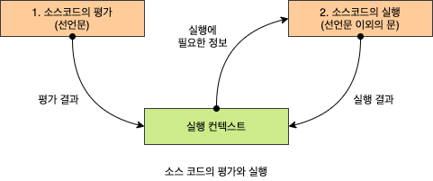

# 23장 실행 컨텍스트

실행컨텍스트는 자바스크립트의 동작 원리를 담고 있는 핵심 개념이다.

자바스크립트가 스코프를 기반으로 `식별자와 식별자에 바인딩된 값을 관리하는 방식`과 `호이스팅이 발생하는 이유`,  `클로저의 동작 방식`, `태스크 큐와 함께 동작하는 이벤트 핸들러와 비동기 처리의 동작 방식`을 이해할 수 있다.

## 23.1 소스코드의 타입

소스코드는 4가지 타입으로 구분되고, 소스코드는 실행 컨텍스트를 생성한다.

소스코드의 **타입을 나누는 이유는 타입에 따라 실행 컨텍스트를 생성하는 과정과 관리 내용이 다르기 때문!**

* **전역 코드 (global code)**<br/>전역에 존재하는 소스코드.<br/>전역에 정의된 함수, 클래스 드으이 내부코드는 포함 X
* **함수 코드 (function code)**<br/>함수 내부에 존재하는 소스코드<br/>함수 내부의 중첩된 함수, 클래스등의 내부코드는 X
* **eval 코드(eval code)**<br/>빌트인 전역 함수인 eval함수에 인수로 전달되어 실행되는 소스코드
* **모듈 코드(module code)**<br/>모듈 내부에 존재하는 소스코드<br/>모듈 내부의 함수, 클래스 등의 내부코드는 X


## 23.2 소스코드의 평가와 실행

모든 소스코드는 실행전에 평가 과정을 거치며 코드를 실행하기 위한 준비를 한다.

`소스코드의 평가`와 `소스코드의 실행`과정으로 나누어 처리한다.


1. 평가과정에서는 실행 컨텍스트를 생성하고 변수, 함수 드으이 선언문만 먼저 실행하여 생성된 변수나 함수 식별자를 키로 실행 컨텍스트가 관리하는 스코프(**렉시컬 환경의 환경 레코드**)에 등록한다.

2. 평가 과정이 끝나고 소스코드가 순차적으로 실행되기 시작한다. (**런타임 시작**)

3. 이때 소스코드에 필요한 정보(변수나 함수의 참조)를 실행 컨텍스트가 관리하는 스코프에서 검색해 취득함.

4. 변수 값의 변경 등 소스코드의 실행 결과는 다시 실행 컨텍스트가 관리하는 스코프에 등록됨.



```javascript
var x;
x = 1;
```

변수 선언문 var x;를 먼저 실행

-> x는 실행 컨텍스트가 관리하는 스코프에 등록되고 undefined로 초기화됨.

-> 변수 선언문은 소스코드 평가 과정에서 이미 실행이 완료됨.

-> 실행과정에서는 변수할당문 x=1;만 실행됨.

-> x변수에 값을 할당하려면 x변수가 선언된 변수인지 확인해야함.


이를 위해 실행 컨텍스트가 관리하는 스코프에 x변수가 등록되어 있는지 확인함.

x변수가 실행컨텍스트가 관리하는 스코프에 등록되있따면 x는 평가과정에서 선언문이 실행되어 등록된 변수다.

선언된 변수이기 때문에 값을 할당하고, 할당 결과를 실행 컨텍스트에 등록해 관리한다.


## 23.3 실행 컨텍스트의 역할

예제를 통해 알아보자.

```javascript
// 전역 변수 선언
const x = 1;
const y = 2;

// 함수 정의
function foo(a) {
  // 지역 변수 선언
  const x = 10;
  const y = 20;

  // 메서드 호출
  console.log(a + x + y); // 130
}

// 함수 호출
foo(100);

// 메서드 호출
console.log(x + y); // 3
```

**1. 전역 코드 평가**

전역 코드를 실행하기 앞서 코드 평가과정을 거치며 전역 코드 실행 준비를 한다.

`평가 과정`에서는 선언문만 먼저 실행하고, 생성된 전역 변수와 함수를 실행 컨텍스트가 관리하는 `전역 스코프에 등록`.<br/>(var로 선언된 전역 변수와 함수 선언문으로 정의된 전역함수는 전역 객체의 프로퍼티와 메서드가됨)

**2. 전역 코드 실행**

평가과정이 끝나고 `런타임이 시작`되어 전역 코드가 `순차적으로 실행`

전역 변수에 `값이 할당`되고, `함수가 호출`된다.

함수가 호출되면 순차적으로 실행되던 전역 코드의 실행을 일시 중단하고, 함수 내부로 진입.

**3. 함수 코드 평가**

함수 내부 문들을 실행하기 전에 `함수 코드 평가 과정`을 통해 마찬가지로 선언문이 먼저 실행되고, 매개변수와 지역 변수가 실행 컨텍스트가 관리하는 `지역 스코프에 등록`된다.

arguments객체가 생성되 지역 스코프에 등록되고, this바인딩도 결정.

**4. 함수 코드 실행**

함수 코드 평가가 끝나고, 런타임이 시작되어 함수 코드가 순차적으로 실행되기 시작.

console.log를 호출되면, console을 스코프 체인을 통해 검색.

console은 전역 객체에 프로퍼티로 존재한다. <br/>(전역 객체 프로퍼티가 마치 전역 변수 처럼 전역 스코프를 통해 검색 가능해야 한다는 것을 의미)

그 다음 log프로퍼티를 console 객체 프로토타입 체인을 통해 검색. 

그 후 a+x+y가 평가되고, a,x,y식별자는 스코프 체인을 통해 검색함.

console.log 메서드 실행이 종료되면 함수 코드 실행과정이 종료되고, 함수 호출 이전으로 돌아가 전역 코드 실행을 계속한다.


**❗ 코드가 실행되려면 스코프, 식별자, 코드 실행 순서 등의 관리가 필요하다.**

> 1. 선언에 의해 생성된 모든 식별자(변수, 함수, ...)를 스코프를 구분하여 등록하고 상태 변화(식별자에 바인딩된 값의 변화)를 지속적으로 관리할 수 있어야 한다.
> 2. 스코프 중첩 관계에 의해 스코프 체인을 형성해야한다.<br/>스코프 체인을 통해 사우이 스코프로 이동하여 식별자를 검색할 수 있어야 한다.
> 3. 현재 실행중인 코드의 실행 순서를 변경할 수 있어야하며 되돌아 갈수도 있어야한다.

이 모든 것을 관리하는 것이 **실행 컨텍스트**이다.

**소스코드를 실행하는데 필요한 환경을 제공하고, 코드 실행 결과를 관리하는 영역**이다.

실행 컨텍스트는 식별자(변수, 함수,...)를 등록하고 관리하는 스코프와 코드 실행 순서 관리를 구현한 내부 메커니즘으로, 모든 코드는 실행 컨텍스트를 통해 실행되고 관리된다.

`식별자와 스코프`는 실행컨텍스트의 `렉시컬 환경`으로 관리하고 `코드 실행 순서`는 `실행 컨텍스트 스택으로 관리`한다.


## 23.4 실행 컨텍스트 스택

```javascript
const x = 1;

function foo () {
  const y = 2;

  function bar () {
    const z = 3;
    console.log(x + y + z);
  }
  bar();
}

foo(); // 6
```

자바스크립트 엔진은 전역코드를 평가하여 전역 실행 컨텍스트를 생성한다.

그리고 함수가 호출되면 함수 코드를 평가 하여 함수 실행 컨텍스트를 생성한다.

이때 실행컨텍스트는 스택으로 관리되는데 이를 실행 컨텍스트 스택 이라 부른다.

위 코드는 그림처럼 코드를 평가하고, 실행 컨텍스트를 생성해 스택으로 관리한다.


**1. 전역 코드의 평가와 실행**

**2. foo()의 평가와 실행**

**3. bar()의 평가와 실행**

**4. foo()로 복귀**

**5. 전역코드로 복귀**


**실행 컨텍스트 스택은 코드의 실행 순서를 관리한다.**

소스코드가 평가되면, 실행 컨텍스트가 생성되고 스택에 push되어 최상위에 쌓인다.

**❗ 최상위 실행 컨텍스트는 항상 현재 실행중인 코드의 실행컨텍스트이다.**


## 23.5 렉시컬 환경 🔴

**렉시컬 환경(Lexical Environment)**은 `식별자와 식별자에 바인딩된 값`, `상위 스코프에 대한 참조를 기록하는 자료구조로 실행 컨텍스트를 구성`하는 컴포넌트.

* 실행 컨텍스트 스택 = 코드의 실행 순서를 관리
* 렉시컬 환경 = 스코프와 식별자를 관리

렉시컬 환경은 키와 값을 갖는 객체 형태의 스코프(전역, 함수, 블록 스코프)를 생성하여 **식별자를 키로 등록**하고, **식별자에 바인딩된 값을 관리**함.


실행 컨텍스트는 `Lexical Environment`와 `Variable Environment`로 구성되는데 하나의 동일한 렉시컬 환경을 참조한다.

몇 가지 상황을 만나면 `Variable Environment`와 `Lexical Environment`내용이 달라지는 경우도 있다.<br/>(현 책에서는 strict mode, eval 코드, try/catch문 같은 특수상황을 제외하고,  `Lexical Environment`와 `Variable Environment`도 구분하지않고 **렉시컬 환경으로 통일해 간략히 설명.**)


렉시컬 환경은 `환경레코드(Environment Record)`와 `외부 렉시컬 환경에 대한 참조(Outer Lexical Environment Reference)`로 구성된다.

* **환경 레코드 (Environment Record)**<br/>스코프에 포함된 **식별자 등록**하고, 등록된 식별자에 **바인딩된 값을 관리하는 저장소.**
* **외부 렉시컬 환경에 대한 참조 (Outer Lexical Environment Reference)**<br/>외부 렉시컬 환경에 대한 참조는 상위 스코프를 가리킨다.<br/>(상위 스코프는 해당 실행 컨텍스트를 생성한 소스코드를 포함하는 상위 코드의 렉시컬 환경을 말한다.)<br/>외부 렉시컬 환경에 대한 참조를 통해 단방향 링크드 리스트인 스코프 체인을 구현.


## 23.6 실행 컨텍스트의 생성과 식별자 검색 과정

```javascript
var x = 1;
const y = 2;

function foo(a) {
  var x = 3;
  const y = 4;

  function bar(b) {
    const z = 5;
    console.log(a + b + x + y + z);
  }

  bar(10);
}

foo(20); // 42
```

### 23.6.1 전역 객체 생성

전역 코드가 평가되기 전에 생성됨.

전역 객체에는 `빌트인 전역 프로퍼티`, `빌트인 전역 함수`, `표준 빌트인 객체`, Web API 또는 `특정 환경을 위한 호스트 객체`를 포함.

전역 객체도 Object.prototype을 상속 받으며, 프로토타입 체인의 일원이다.

```javascript
// Object.prototype.toString
window.toString(); // -> "[object Window]"

window.__proto__.__proto__.__proto__.__proto__ === Object.prototype; // -> true
```


### 23.6.2 전역 코드 평가

소스 코드가 로드 되고, 자바스크립트 엔진은 전역 코드를 평가함.

> 평가 순서
>
> 1. 전역 실행 컨텍스트 생성
>
> 2. 전역 렉시컬 환경 생성
>
>    2.1. 전역 환경 레코드 생성
>
>    ​	2.1.1. 객체 환경 레코드 생성
>
>    ​	2.1.2. 선언적 환경 레코드 생성
>
>    2.2 this 바인딩
>
>    2.3 외부 렉시컬 환경에 대한 참조 결정

**1. 전역 실행 컨텍스트 생성**

전역 실행 컨텍스트를 생성해 실행 컨텍스트 스택에 푸시.

**2. 전역 렉시컬 환경 생성**

전역 렉시컬 환경을 생성하고, 실행 컨텍스트에 바인딩<br/>(전역 렉시컬환경은 `환경레코드`와 `외부 렉시컬 환경에 대한 참조`로 구성)

**2.1 전역 `환경 레코드` 구성**

전역 변수를 관리하는 `전역 스코프`, `전역 객체의 빌트인 전역 프로퍼티와 빌트인 전역 함수`, `표준 빌트인 객체`를 제공.

ES6전에는 모든 전역변수가 전역 객체의 프로퍼티가 되지만(var), let, const로 선언한 전역 변수는 `전역 객체의 프로퍼티가 되지 않고 개념적인 블록 내에 존재`.

❗ var과 let, const로 선언한 `전역 변수를 구분하여 관리`하기 위해 **전역 환경 레코드**는 `객체 환경 레코드`와 `선언적 환경 레코드`로 구성되어 있다.

> 객체 환경 레코드 (Object Environment Record)
>
> * var로 선언한 전역 변수
> * 함수 선언문으로 정의한 전역 함수
> * 빌트인 전역 프로퍼티와 빌트인 전역 함수
> * 표준 빌트인 객체
>
> 선언적 환경 레코드 (Declarative Environment Record)
>
> * let, const로 선언한 전역 변수

**2.1.1 객체 환경 레코드 생성**

객체 환경 레코드는 BindingObject라고 부르는 전역 객체 생성에서 생성된 전역 객체와 연결된다.

전역 코드 평가 과정에서 `var로 선언한 전역 변수`와 `함수 선언문으로 정의된 전역 함수`는 전역 환경 레코드의 객체 환경 레코드에 연결된 `BindingObject`를 통해 전역 객체의 프로퍼티와 메서드가 된다.

이때 등록된 식별자를 전역 환경 레코드의 객체 환경 레코드에서 검색하면 전역 객체의 프로퍼티를 검색하여 반환한다.

var 키워드로 선언된 전역 변수와 함수 선언문으로 정의된 전역 함수가 전역 객체의 프로퍼티와 메서드가 되고 전역 객체를 가리키는 식별자(window)없이 전역 객체의 프로퍼티를 참조 할 수 있는 메커니즘이다.

```javascript
var x = 1;
const y = 2;
function foo(a){
    ...
}
```

x는 `선언 단계`와 `초기화 단계`가 동시에 진행된다.

=> 전역 코드 평가 시점에 객체 환경 레코드에 바인딩된 BindingObject를 통해 전역 객체에 변수식별자를 키로 등록한 다음 암묵적으로 undefined를 바인딩한다.

var키워드로 선언한 변수는 코드 실행 단계에서 변수 선언문 이전에도 참조할 수 있다.<br/>(**❗ 이때 변수 선언문 이전에 참조한 변수 값은 undefined다.**)

**이것이 호이스팅이 발생하는 원인이다.**


함수 선언문으로 정의한 함수가 평가되면 `함수 이름과 동일한 이름의 식별자`를 객체 환경 레코드에 바인딩된 BindingObject를 통해 `전역 객체에 키로 등록`하고 생성된 **함수 객체를 즉시 할당**한다.

이것이 변수 호이스팅과 함수 호이스팅의 차이.<br/>(함수 선언문으로 정의한 함수는 함수 선언문 이전에 호출 가능.)

**2.1.2 선언적 환경 레코드 생성**

let, const로 선언한 전역 변수는 선언적 환경 레코드에 등록되고 관리된다.

이전에 `let, const로 선언한 전역 변수`는 전역 객체 프로퍼티가 되지않고 `개념적인 블록 내에 존재`한다고 했는데 이게 바로 전역 환경 레코드의 `선언적 환경 레코드`다.<br/>=> window.y같은 참조가 불가능.

const키워드로 선언한 변수는 `선언 단계`와 `초기화 단계`가 분리되어 진행됨.

초기화 단계, 즉 런타임에 실행 흐름이 변수 선언문에 도달하기 전까지 **`일시적 사각지대(Temporal Dead Zone, TDZ)`**에 빠지게 된다.


let, const로 선언한 변수도 변수 호이스팅은 발생하지만, **런타임에 컨트롤이 변수 선언문에 도달하기 전까지 TDZ에 빠지기 때문에 참조할 수 없다.**

```javascript
let foo = 1; // 전역 변수

{
  // let, const 키워드로 선언한 변수가 호이스팅되지 않는다면 전역 변수를 참조해야 한다.
  // 하지만 let 키워드로 선언한 변수도 여전히 호이스팅이 발생하기 때문에 참조 에러(ReferenceError)가 발생한다.
  console.log(foo); // ReferenceError: Cannot access 'foo' before initialization
  let foo = 2; // 지역 변수
}
```

**2.2 this 바인딩**

전역 환경 레코드의 [[GlobalThisValue]] 내부 슬롯에 this가 바인딩 된다.

this는 전역 객체를 가리키므로 [[GlobalThisValue]] 내부 슬롯에는 전역 객체가 바인딩 된다.

전역 코드에서 this를 참조하면, 전역 환경 레코드의 [[GlobalThisVlaue]]내부 슬롯에 바인딩된 객체가 반환된다.

this바인딩은 전역 환경 레코드와 함수 환경 레코드에만 존재한다.

**2.3 외부 렉시컬 환경에 대한 참조 결정**

현재 평가중인 소스코드를 포함하는 외부 소스코드의 렉시컬환경, 즉 사우이 스코프를 가리킨다.

이를 통해 **스코프 체인을 구현**한다.

전역 코드를 포함하는 소스코드는 없으므로 null이 할당된다.

❗ 전역 렉시컬 환경이 스코프 체인의 종점에 존재함을 의미.


### 22.6.3 전역 코드 실행

변수 할당문 또는 함수 호출문을 실행하려면, 변수나 함수 이름이 선언된 식별자인지 확인해야하고, 어느 스코프의 식별자를 참조해야 하는지 결정할 필요가 있다.

이를 **`식별자 결정(identifier resolution)`**이라 한다.

**식별자 결정을 위해 식별자를 검색할 때는 실행 중인 실행 컨텍스트에서 식별자를 검색하기 시작한다.**

선언된 식별자는 실행 컨텍스트의 렉시컬 환경의 환경 레코드에 등록되어 있다.

실행 중인 실행 컨텍스트의 렉시컬환경에서 식별자를 검색할 수없으면, 외부 렉시컬 환경에 대한 참조가 가리키는 렉시컬 환경, 즉 상위 스코프로 이동해 식별자를 검색한다.<br/>**이것이 스코프 체인의 동작 원리다.**


전역 렉시컬 환경은 스코프 체인 종점이기 때문에 전역 렉시컬 환경에서 검색할 수 없는 식별자는 참조에러를 발생함.

❗ 실행 컨텍스트는 `소스코드를 실행하기 위해 필요한 환경을 제공`하고 `코드의 실행 결과를 실제로 관리하는 영역`이다.


### 23.6.4 foo 함수 코드 평가

```javascript
var x = 1;
const y = 2;

function foo (a) {
  var x = 3;
  const y = 4;

  function bar (b) {
    const z = 5;
    console.log(a + b + x + y + z);
}
  bar(10);
}

foo(20); // ← 호출 직전
```

foo함수가 호출되면 전역 코드의 실행을 일시 중단하고 foo 함수 내부로 코드 제어권이 이동하다.

1.  함수 실행컨텍스트 생성

2. 함수 렉시컬 환경 생성

   2.1. 함수 환경 레코드 생성

   2.2. this 바인딩

   2.3. 외부 렉시컬 환경에 대한 참조 결정

**1. 함수 실행 컨텍스트 생성**

foo함수 실행 컨텍스트를 생성하고, 함수 렉시컬 환경이 완성된다음 스택에 푸시된다.

**2. 함수 렉시컬 환경 생성**

foo함수 렉시컬 환경을 생성하고 foo 함수 실행 컨텍스트에 바인딩한다.

**2.1. 함수 환경 레코드 생성**

함수 렉시컬 환경을 구성하는 함수 환경 레코드는 `매개변수`, `arguments객체`, 함수 내부에서 선언한 `지역 변수와 중첩 함수`를 등록하고 관리한다.

**2.2. this 바인딩**

함수 환경 레코드의 [[ ThisValue]] 내부 슬롯에 this가 바인딩된다.<br/>( 바인딩될 객체는 함수 호출 방식에 따라 결정된다.)

foo는 일반 함수로 호출되었으므로 this는 전역 객체이다.

**2.3. 외부 렉시컬 환경에 대한 참조 결정**

foo 함수 정의가 평가된 시점에 실행중인 실행 컨텍스트의 렉시컬 환경의 참조가 할당된다.

foo함수는 전역 코드에 정의된 전역 함수이기 때문에 전역 코드 평가 시점에 평가된다.

외부 렉시컬 환경에 대한 참조에는 전역 렉시컬 환경의 참조가 할당된다.


자바스크립트는 함수를 어디서 호출했는지가 아니라 어디에 정의 했는지에 따라 상위 스코프를 결정한다.

자바스크립트 엔진은 실행 컨텍스트의 렉시컬 환경, 즉 함수의 상위 스코프를 함수 객체의 내부 슬롯 [[Environment]]에 저장한다.

함수 렉시컬 환경의 외부 렉시컬 환경에 대한 참조에 할당되는 것은 함수 상위 스코프를 가리키는 함수 객체의 [[Environment]]에 저장된 렉시컬 환경의 참조다.

함수 객체의 [[Environment]]가 바로 렉시컬 스코프를 구현하는 메커니즘이다.


### 23.6.5 foo 함수 코드 실행

이제 런타임이 시작되어 foo 함수가 순차적으로 실행된다.

각 변수가 할당되고, bar가 호출된다.

이 때 식별자 결정을 위해 실행 중인 실행 컨텍스트의 렉시컬 환경에서 식별자를 검색하기 시작한다.

foo함수 실행 컨텍스트가 현재 실행중인 실행 컨텍스트이므로 foo 함수 렉시컬 환경에서 식별자를 검색하고 없으면 외부 렉시컬 환경에 대한 참조가 가리키는 렉시컬 환경으로 이동해 검색한다.


### 23.6.6 bar 함수 코드 평가

 foo함수와 동일하게 평가를 시작한다.


### 23.6.7 bar 함수 코드 실행

1. console 식별자 검색
2. log 메서드 검색
3. 표현식 a+b+x+y+z의 평가
4. console.log 메서드 호출

순서로 실행된다.


### 23.6.8 bar 함수 코드 실행 종료

실행이 종료되고 실행 컨텍스트 스택에서 팝되어 제거되고 foo 실행 컨텍스트가 실행 중인 실행 컨텍스트가 됨.

렉시컬 환경은 실행 컨텍스트에 의해 참조되기는 하지만 독립적인 객체라 렉시컬 환경까지 즉시 소멸하는 것은 아니다.

**객체를 포함해 모든 값은 참조되지 않을 때 가비지 컬렉터에 의해 메모리 공간의 확보가 해제되어 소멸한다.**


### 23.6.9 foo 함수 코드 실행 종료

foo가 종료되고, 실행 컨텍스트 스택에서 팝되어 제거되고 전역 실행 컨텍스트가 실행 중인 실행 컨텍스트가 됨.


### 23.6.10 전역 코드 실행 종료

더 실행할 코드가 없으면 전역 실행 컨텍스트도 팝되어 실행 컨텍스트 스택에 아무것도 남지 않게 된다.


## 23.7 실행 컨텍스트와 블록 레벨 스코프

`var 변수`는 오로지 함수의 코드 블록만 지역 스코프로 인정하는 `함수 레벨 스코프`를 따른다.

`let, const 변수`는 모든 코드 블록을 지역 스코프로 인정하는 `블록 레벨 스코프`를 따른다.

```javascript
let x = 1;

if (true) {
  let x = 10;
  console.log(x); // 10
}

console.log(x); // 1
```

if문의 코드 블록이 실행되면 if문의 코드 블록을 위한 블록 레벨 스코프를 생성해야한다.

이를 위해  선언적 환경 레코드를 갖는 렉시컬 환경을 새롭게 생성하여 기존의 전역 렉시컬 환경을 교체한다.

새롭게 생성된 if문의 코드 블록을 위한 렉시컬 환경의 외부 렉시컬 환경에 대한 참조는 if문이 실행되기 이전의 전역 렉시컬 환경을 가리킨다.<br/>**(❗ 이는 if문 뿐만 아니라 블록 레벨 스코프를 가리키는 모든 블록문에 적용된다.)**


for문의 경우 for문 코드블록이 반복해서 실행될 때 마다 새로운 렉시컬 환경을 생성한다.

for문 코드 블록 내에 정의된 함수가 있으면 이 함수의 상위 스코프 for문 코드블록이 생성한 렉시컬 환경이다.

이때 함수 상위 스코프는 for문의 코드블록이 반복해서 실행될 때마다 식별자의 값을 유지해야한다.
