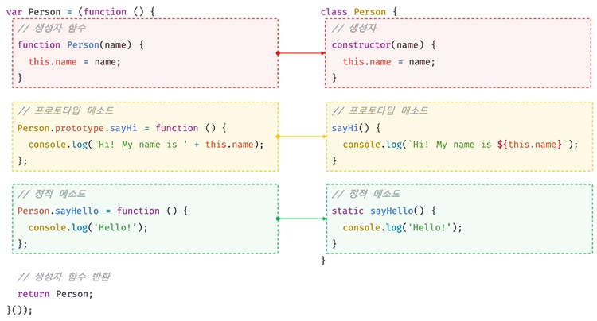

# 25장 클래스

## 25.1 클래스는 프로토타입의 문법적 설탕인가?

> 문법적 설탕
>
> 문법적 기능은 그대로인데 읽는 사람이 직관적으로 이해할 수 있게 만든다는 것

클래스 기반 언어에 익숙한 프로그래머들이 프로토타입 기반 프로그래밍 방식에 혼란을 느낄 수 있어 클래스가 도입됨.

하지만 기존의 프로토타입 기반 객체지향 모델을 폐지하고 새롭게 클래스 기반 객체지향 모델을 제공하는 것은 아니다.

클래스는 `함수`이며 기존 프로토타입 기반 패턴을 `클래스 기반 패턴처럼 사용할 수 있도록` 하는 `문법적 설탕`이라 볼 수 있다.


클래스와 생성자함수 둘다 프로토타입 기반의 인스턴스를 생성하지만 정확히동일하게 동작하지는 않는다.

클래스는 `생성자 함수보다 엄격`하며 생성자 함수에서는 제공하징 낳는 기능도 제공.

**차이점**

| 클래스                                                       | 생성자 함수                                                  |
| ------------------------------------------------------------ | ------------------------------------------------------------ |
| new 연산자 없이 호출하면 에러 발생                           | new 연산자 없으면 일반 함수로서 호출됨                       |
| 상속을 지원하는 extends와 super 제공                         | extends와 super X                                            |
| 호이스팅이 발생하지 않는 것처럼 동작                         | 함수 선언문으로 정의된 생성자 함수는 함수 호이스팅<br/>함수 표현식으로 정의된 생성자 함수는 변수 호이스팅 |
| 클래스 내 모든 코드에는 암묵적으로 strict mode가 지정되어 실행되며 해제 불가 | 생성자 함수는 암묵적으로 strict mode가 지정되지 않음         |
| constructor, 프로토타입 메서드, 정적 메서드는 모두 프로퍼티 어트리뷰트 [[Enumerable]]의 값이 false<br/>즉, 열거되지 않는다. |                                                              |

클래스와 생성자 함수는 프로토타입 기반의 객체지향을 구현했다는 점에서 유사하지만, 클래스가 생성자 함수 기반의 객체 생성 방식보다 견고하고 명료하다.

또 extends와 super키워드는 상속 관계 구현을 더 간결하고 명료하게 한다.

**❗ `클래스`를 프로토타입 기반 객체 생성 패턴의 단순한 문법적 설탕이라기 보다는 `새로운 객체 생성 메커니즘`으로 보는게 좀 더 합당하다.**


## 25.2 클래스 정의

class 키워드를 사용하여 정의한다.

`파스칼 케이스`가 일반적이다.

```javascript
class Person {}
```

일반적이진 않지만 함수처럼 표현식으로 정의 할 수도 있다. 

클래스는 이름을 가질수도 않을 수도 있다.

```javascript
// 익명 클래스 표현식
const Person = class {};

// 기명 클래스 표현식
const Person = class MyClass {};
```


❗ 클래스를 표현식으로 정의할 수 있다 = **`값으로 사용할 수 있는 일급 객체`**라는 의미

* 무명의 리터럴로 생성할 수 있다.<br/>런타임에 생성이 가능
* 변수나 자료구조에 저장할 수 있다.
* 함수의 매개변수에게 전달할 수 있다.
* 함수의 반환값으로 사용할 수 있다.


클래스의 몸체에는 `constructor(생성자)`, `프로토타입 메서드`, `정적 메서드` 3가지가 있다.

```javascript
// 클래스 선언문
class Person {
  // 생성자
  constructor(name) {
    // 인스턴스 생성 및 초기화
    this.name = name; // name 프로퍼티는 public하다.
  }

  // 프로토타입 메서드
  sayHi() {
    console.log(`Hi! My name is ${this.name}`);
  }

  // 정적 메서드
  static sayHello() {
    console.log('Hello!');
  }
}

// 인스턴스 생성
const me = new Person('Lee');

// 인스턴스의 프로퍼티 참조
console.log(me.name); // Lee
// 프로토타입 메서드 호출
me.sayHi(); // Hi! My name is Lee
// 정적 메서드 호출
Person.sayHello(); // Hello!
```


클래스와 생성자 함수의 정의 방식을 비교해보자.




## 25.3 클래스 호이스팅

클래스는 함수로 평가된다.

```javascript
class Person {}
console.log(typeof person); // fucntion
```

런타임 이전에 먼저 평가되어 함수 객체를 생성한다.

클래스가 평가되어 생성된 함수 객체는 생ㅅ어자 함수로서 호출할 수 있는 함수 즉 constructor다.

생성자 함수로서 호출할 수 있는 함수는 함수 정의가 평가되어 함수 객체를 생성하는 시점에 프로토타입도 더불어 생성된다.

프로토타입과 생성자함수는 단독으로 존재할 수 없고, 항상 pair로 존제하기 때문.

❗ 클래스는 정의 이전에 참조할 수 없다.

```javascript
console.log(Person);
// ReferenceError: Cannot access 'Person' before initialization

// 클래스 선언문
class Person {}
```


호이스팅이 발생하지 않는거 같지만, 그건 또 아니다.

**클래스는 let, const 처럼 호이스팅 된다.**

클래스 선언문 이전에 `일시적 사각지대(TDZ)`에 빠지기 때문에 호이스팅이 발생하지 않는 것처럼 동작한다.

```javascript
const Person = '';

{
  // 호이스팅이 발생하지 않는다면 ''이 출력되어야 한다.
  console.log(Person);
  // ReferenceError: Cannot access 'Person' before initialization

  // 클래스 선언문
  class Person {}
}
```

모든 선언문은 런타임 이전에 먼저 실행되기 때문에

var, let, const, function, function*, class키워드를 사용하여 선언된 모든 식별자는 호이스팅된다.


## 25.4 인스턴스 생성

클래스는 생성자 함수이며 `new연산자`와 함꼐 호출되어 인스턴스를 생성함.

```javascript
class Person {}

// 인스턴스 생성
const me = new Person();
console.log(me); // Person {}
```

함수는 new 유무에 따라 일반함수 또는 생성자 함수로 호출되미나

클래스는 인스턴스를 생성하는 것이 유일한 존재 이유이므로 반드시  new와 함께 호출해야한다.

클래스 표현식으로 정의된 클래스의 경우 클래스를 가리키는 식별자(Person)을 사용해 인스턴스를 생성않고 기명 클래스 표현식의 클래스 이름(MyClass)를 사용해 인스턴스를 생성하면 에러가 발생함.

```javascript
const Person = class MyClass {};

// 함수 표현식과 마찬가지로 클래스를 가리키는 식별자로 인스턴스를 생성해야 한다.
const me = new Person();

// 클래스 이름 MyClass는 함수와 동일하게 클래스 몸체 내부에서만 유효한 식별자다.
console.log(MyClass); // ReferenceError: MyClass is not defined

const you = new MyClass(); // ReferenceError: MyClass is not defined
```


## 25.5 메서드

클래스 몸체에는 0개 이상의 메서드만 선언할 수 있다.

클래스 몸체에 정의할 수 있는 메서드는 생성자, 프로토타입 메서드, 정적 메서드의 3가지가 있다.

> 클래스 정의에 대한 새로운 제안 사양
>
> ES11(ECMA2020)에 따르면 인스턴스 프로퍼티는 반드시 constructor 내부에서 정의해야한다.
>
> 클래스 몸체에 메서드 뿐만 아니라 프로퍼티를 직접 정의할 수 있는 새로운 표준 사양이 제안되어 있다.
>
> (25.7.3에서 자세히)


### 25.5.1 constructor

인스턴스를 생성하고 초기화 하기 위한 특수한 메서드 (이름변경 X)

```javascript
class Person {
  // 생성자
  constructor(name) {
    // 인스턴스 생성 및 초기화
    this.name = name;
  }
}
```

클래스는 인스턴스를 생성하기 위한 생성자 함수다.

```javascript
console.log(typeof Person); // function
console.dir(Person);
```

```text
// result
class Person
	▶length: 1
	▶name: "Person"
	▶prototype: {constructor: ƒ}
	▶arguments: (...)
	▶caller: (...)
	▶[[FunctionLocation]]: VM42:3
	▶[[Prototype]]: ƒ ()
	▶[[Scopes]]: Scopes[2]
```

위 처럼 클래스는 평가되어 함수 객체가 된다.

함수와 동일하게 프로토타입과 연결되어 있으며 자신의 스코프체인을 구성한다.

모든 함수 객체가 가지고 있는 prototype프로퍼티가 가리키는 **프로토타입 객체의 constructor프로퍼티는 클래스 자신을 가리키고 있다.**

**클래스가 인스턴스를 생성하는 생성자 함수라는 것을 의미**

**`new`와 함께 클래스를 호출하면 클래스는 인스턴스를 생성한다.**

```javascript
// 인스턴스 생성
const me = new Person('Lee');
console.log(me);

//result
Person {name: 'JOE'}
name: "JOE"
[[Prototype]]: Object
    constructor: class Person
    [[Prototype]]: Object
	    constructor: ƒ Object()
        hasOwnProperty: ƒ hasOwnProperty()
        isPrototypeOf: ƒ isPrototypeOf()
        propertyIsEnumerable: ƒ propertyIsEnumerable()
        toLocaleString: ƒ toLocaleString()
        toString: ƒ toString()
        valueOf: ƒ valueOf()
        __defineGetter__: ƒ __defineGetter__()
        __defineSetter__: ƒ __defineSetter__()
        __lookupGetter__: ƒ __lookupGetter__()
        __lookupSetter__: ƒ __lookupSetter__()
        __proto__: (...)
        get __proto__: ƒ __proto__()
        set __proto__: ƒ __proto__()
```

생성자함수처럼 constructor내부에서 this에 추가한 프로퍼티는 인스턴스 프로퍼티가 된다.

constructor내부 this는 생성자 함수와 마찬가지로 클래스가 생성한 인스턴스를 가리킨다.


`constructor`는 메서드로 해석되는 것이 아니라 **클래스가 평가되어 생성한 함수 객체 코드의 일부가 된다.**

클래스 정의가 평가되면 **constructor의 기술된 동작을 하는 함수 객체가 생성**된다.

> 클래스의 constructor메서드와 프로토타입의 constructor프로퍼티
>
> 클래스의 constructor메서드와 프로토타입의 constructor프로퍼티는 이름이 같아 혼동하기 쉽지만 직접적이 ㄴ관련이 없다.
>
> 프로토타입의 constructor프로퍼티는 모든 프로토타입이 가지고있는 프로퍼티며 생성자함수를 가리킨다.


**constructor와 생성자 함수의 차이와 constructor의 특징**

유사하지만 몇가지 차이가 있다.

* constructor는 클래스 내에 최대 한개만 존재할 수 있다.<br/>2개이상의 경우 SyntaxError발생<br/>
  ``` javascript
  class Person {
    constructor() { }
    constructor() { }
  }
  // SyntaxError: A class may only have one constructor
  ```

* constructor는 생략할 수 있다.

* constructor를 생략하면 클래스에 빈 constructor가 암묵적으로 정의된다.<br/>constructor를 생략한 클래스는 빈 constructor에 의해 빈 객체를 생성한다.<br/>
  ```javascript
  class Person{
      // constructor(){}
  }
  const me = new Person();
  console.log(me) // Person{}
  ```

* 프로퍼티가 추가되어 초기화된 인스턴스를 생성하려면 constructor내부에서 `this`에 프로퍼티를 추가한다.<br/>
  ```javascript
  class Person {
    constructor(name, address) {
      // 인수로 인스턴스 초기화
      this.name = name;
      this.address = address;
    }
  }
  
  // 인수로 초기값을 전달한다. 초기값은 constructor에 전달된다.
  const me = new Person('Lee', 'Seoul');
  console.log(me); // Person {name: "Lee", address: "Seoul"}
  ```

  이처럼 `constructor`내에서는 인스턴스의 생성과 동시에 인스턴스 프로퍼티 추가를 통해 인스턴스의 초기화를 실행한다.<br/>(인스턴스를 초기화하려면 constructor를 생략해서는 안된다.)

* constructor는 별도의 반환문이 없어야 한다.<br/>new연산자와 함께 클래스가 호출되면 생성자 함수와 동일하게 암묵적으로 this, 즉 인스턴스를 반환하기 때문이다.<br/>만약 this가 아닌 다른 객체를 명시적으로 반환하면 this, 즉 인스턴스가 반환되지 못하고 **return문에 명시한 객체가 반환**된다.<br/>**this가 아닌 다른 값을 반환하는 것은 클래스의 기본동작을 훼손**하기때문에 `return문은 생략`해야한다.


### 25.5.2 프로토타입 메서드

생성자 함수를 사용해 인스턴스를 사용하는 경우 프로토타입 메서드를 생성하기 위해서는 명시적으로 추가해야한다.

클래스 몸체에서 정의한 메서드는 생성자 함수에 의한 객체 생성 방식과는 다르게 클래스의 prototype프로퍼티에 메서드를 **추가하지 않아도 기본적으로 프로토타입 메서드가 된다.**

**생성자 함수와 마찬가지로 클래스가 생성한 인스턴스는 프로토타입 체인의 일원이 된다.**

```javascript
class Person {
  // 생성자
  constructor(name) {
    // 인스턴스 생성 및 초기화
    this.name = name;
  }

  // 프로토타입 메서드
  sayHi() {
    console.log(`Hi! My name is ${this.name}`);
  }
}

const me = new Person('Lee');
me.sayHi(); // Hi! My name is Lee

// me 객체의 프로토타입은 Person.prototype이다.
Object.getPrototypeOf(me) === Person.prototype; // -> true
me instanceof Person; // -> true

// Person.prototype의 프로토타입은 Object.prototype이다.
Object.getPrototypeOf(Person.prototype) === Object.prototype; // -> true
me instanceof Object; // -> true

// me 객체의 constructor는 Person 클래스다.
me.constructor === Person; // -> true
```

프로토타입 체인은 기존의 모든 객체 생성 방식 뿐만아니라 클래스에 의해 생성된 인스턴스에도 동일하게 적용된다.

**생성자함수의 역할을 클래스가 할 뿐.**

클래스는 생성자 함수와 마찬가지로 프로토타입 기반의 객체 생성 메커니즘이다.


### 25.5.3 정적 메서드

`정적 메서드`는 **인스턴스를 생성하지 않아도 호출할 수 있는 메서드**를 말한다.

**생성자 함수** 

생성자 함수의 경우 정적메서드를 생성하기 위해서는 명시적으로 생성자 함수에 메서드를 추가해야한다.

```javascript
// 생성자 함수
function Person(name) {
  this.name = name;
}

// 정적 메서드
Person.sayHi = function () {
  console.log('Hi!');
};

// 정적 메서드 호출
Person.sayHi(); // Hi!
```


**클래스**

클래스에서는 메서드에 static을 붙이면 정적 메서드가 된다.

```javascript
class Person {
  // 생성자
  constructor(name) {
    // 인스턴스 생성 및 초기화
    this.name = name;
  }

  // 정적 메서드
  static sayHi() {
    console.log('Hi!');
  }
}
```


정적 메서드는 클래스에 바인딩된 메서드가 된다.

클래스는 함수 객체로 평가되므로 자신의 프로퍼티/메서드를 소유할 수 있다.

클래스는 클래스 정의가 평가되는 시점에 함수 객체가 되므로 인스턴스와 달리 별다른 생성 과정이 필요 없다.

프로토타입 메서드처럼 인스턴스로 호출하지 않고 클래스로 호출한다.

```javascript
// 정적 메서드는 클래스로 호출한다.
// 정적 메서드는 인스턴스 없이도 호출할 수 있다.
Person.sayHi(); // Hi!
```


**정적 메서드는 인스턴스로 호출할 수 없다.**

정적 메서드가 바인딩된 클래스는 인스턴스의 프로토타입 체인상에 존재하지 않기 때문.

=> 인스턴스의 프로토타입 체인 상에는 클래스가 존재하지 않기 때문에 인스턴스로 클래스의 메서드를 상속받을 수 없다.

```javascript
// 인스턴스 생성
const me = new Person('Lee');
me.sayHi(); // TypeError: me.sayHi is not a function
```


### 25.5.4 정적 메서드와 프로토타입 메서드의 차이

* 정적메서드와 프로토타입 메서드는 자신이 속해 있는 **`프로토타입 체인이 다르다.`**
* **정적 메서드는 클래스로** 호출하고 **프로토타입 메서드는 인스턴스로** 호출한다.
* 정적 메서드는 인스턴스 프로퍼티를 참조할 수 없지만, 프로토타입 메서드는 참조할 수 있다.

```javascript
class Square {
  // 정적 메서드
  static area(width, height) {
    return width * height;
  }
}

console.log(Square.area(10, 10)); // 100
```

```javascript
class Square {
  constructor(width, height) {
    this.width = width;
    this.height = height;
  }

  // 프로토타입 메서드
  area() {
    return this.width * this.height;
  }
}

const square = new Square(10, 10);
console.log(square.area()); // 100
```

**❗ 인스턴스 프로퍼티를 참조해야 한다면 프로토타입 메서드 / 그렇지 않다면 정적 메서드**


`프로토타입 메서드`는 인스턴스로 호출해야 하므로 프로토타입 메서드 내부의 this는 프로토타입 메서드를 호출한 인스턴스를 가리킨다.

suqare객체로 프로토타입 메서드 area를 호출했으므로 area내부의 this는 square를 가리킨다.

`정적 메서드`는 클래스로 호출해야 하므로 this는 클래스를 가리킨다.


따라서 메서드 내부에서 인스턴스 프로퍼티를 참조할 필요가 있다면 this를 사용해야 하며, 이런 경우 프로토타입 메서드로 정의해야한다.

반드시 인스턴스를 생성한 다음 인스턴스로 호출해야 하므로 this를 사용하지 않는 메서드는 정적 메서드로 정의하는 것이 좋다.


표준 빌트인 객체(Math, Number, JSON, Object, Reflect)들은 다양한 정적 메서드를 가지고 있다.

정적 메서드는 애플리케이션 전역에서 사용할 유틸리티 함수다.

```javascript
// 표준 빌트인 객체의 정적 메서드
Math.max(1, 2, 3);          // -> 3
Number.isNaN(NaN);          // -> true
JSON.stringify({ a: 1 });   // -> "{"a":1}"
Object.is({}, {});          // -> false
Reflect.has({ a: 1 }, 'a'); // -> true
```

이처럼 **클래스 또는 생성자 함수를 하나의 네임스페이스로 사용**하여 정적 메서드를 모아 놓으면 **이름 충돌 가능성을 줄여**주고, **관련 함수들을 구조화** 할수 있는 효과가 있다.

이처럼 정적 메서드는 애플리케이션 전역에서 사용할 유틸리티 함수를 전역 함수로 정의않고 메서드로 구조화할 때 유용.

> ES6에 추가된 표준 빌트인 객체 Number의 정적 메서드
>
> Number의 정적 메서드 isFinite, isNaN, parseFloat, parseInt는 빌트인 전역 함수 isFinite, isNaN, parseFloat, parseInt보다 엄격하다.
>
> (28장에서 자세히)


### 25.5.5 클래스에서 정의한 메서드 특징

* function 키워드를 생략한 메서드 축약 표현을 사용
* 객체 리터럴과 다르게 클래스에 메서드를 정의할 때는 콤마가 필요없다.
* 암묵적으로 strict mode로 실행된다.
* for...in이나 Object.keys메서드 등으로 열거 X. => `[[Enumerable]]`이 `false`다.
* 내부 메서드 `[[Construct]]`를 갖지 않는 non-constructor다.<br/>new와 함께 호출할 수 없다.


## 25.6 클래스의 인스턴스 생성 과정

`new`와 함께 클래스를 호출하면 클래스의 내부 메서드 `[[Construct]]`가 호출된다.

**1. 인스턴스 생성과 this바인딩**

`new`와 함께 클래스를 호출하면 `constructor`의 내부 코드가 실행되기에 앞서 `암묵적을 빈객체가 생성`된다.

이 빈 객체가 바로 (완성 되지는 않았지만) `클래스가 생성하는 인스턴스`다.

클래스가 생성한 **인스턴스의 프로토타입으로 클래스의 prototype프로퍼티가 가리키는 객체가 설정**된다.

그리고 암묵적으로 생성된 **빈 객체(인스턴스)는 this에 바인딩**된다.

즉, `constructor`내부의 this는 클래스가 생성한 인스턴스를 가리킨다.


**2. 인스턴스 초기화**

`constructor`내부 코드가 실행되어 this에 바인딩 되있는 인스턴스를 초기화 한다.

this에 바인딩 되있는 인스턴스에 프로퍼티를 추가하고 `constructor`가 **인수로 전달받은 초기값으로 인스턴스의 프로퍼티값을 초기화** 한다.

**(❗ constructor가 생략되었으면 이 과정도 생략됨.)**


**3. 인스턴스 반환**

클래스의 모든 처리가 끝나면 인스턴스가 바인딩된 this암묵적으로 반환됨.

```javascript
class Person {
  // 생성자
  constructor(name) {
    // 1. 암묵적으로 인스턴스가 생성되고 this에 바인딩된다.
    console.log(this); // Person {}
    console.log(Object.getPrototypeOf(this) === Person.prototype); // true

    // 2. this에 바인딩되어 있는 인스턴스를 초기화한다.
    this.name = name;

    // 3. 완성된 인스턴스가 바인딩된 this가 암묵적으로 반환된다.
  }
}
```


## 25.7 프로퍼티

### 25.7.1 인스턴스 프로퍼티

인스턴스 프로퍼티는 `constructor` 내부에서 정의해야 한다.

```javascript
class Person {
  constructor(name) {
    // 인스턴스 프로퍼티
    this.name = name;
  }
}

const me = new Person('Lee');
console.log(me); // Person {name: "Lee"}
```

`constructor` 내부의 this에는 이미 클래스가 암묵적으로생성한 인스턴스인 빈 객체가 바인딩 되있다.

생성자 함수에서 생성자 함수가 생성할 인스턴스의 프로퍼티를 정의하는 것과 마찬가지로 `constructor`내부에서 this에 인스턴스 프로퍼티를 추가한다.

```javascript
class Person {
  constructor(name) {
    // 인스턴스 프로퍼티
    this.name = name; // name 프로퍼티는 public하다.
  }
}

const me = new Person('Lee');

// name은 public하다.
console.log(me.name); // Lee
```

`constructor`내부의 this에 추가한 프로퍼티는 언제나 클래스가 생성한 인스턴스의 프로퍼티가 된다.

ES6의 클래스는 접근제한자(private, public, protected)가 지원하지 않는다.

**❗ 인스턴스 프로퍼티는 언제나 public하다.**


### 25.7.2 접근자 프로퍼티

**접근자 프로퍼티**는 자체적으로는 값(`[[Value]]`)을 갖지 않고, 다른 데이터 프로퍼티의 값을 읽거나 저장할 때 사용하는 `접근자 함수로 구성된 프로퍼티`다.

```javascript
const person = {
  // 데이터 프로퍼티
  firstName: 'Ungmo',
  lastName: 'Lee',

  // fullName은 접근자 함수로 구성된 접근자 프로퍼티다.
  // getter 함수
  get fullName() {
    return `${this.firstName} ${this.lastName}`;
  },
  // setter 함수
  set fullName(name) {
    // 배열 디스트럭처링 할당: "36.1. 배열 디스트럭처링 할당" 참고
    [this.firstName, this.lastName] = name.split(' ');
  }
};

// 데이터 프로퍼티를 통한 프로퍼티 값의 참조.
console.log(`${person.firstName} ${person.lastName}`); // Ungmo Lee

// ----------------------------------------------------------------------------------------------------

// 접근자 프로퍼티를 통한 프로퍼티 값의 저장
// 접근자 프로퍼티 fullName에 값을 저장하면 setter 함수가 호출된다.
person.fullName = 'Heegun Lee';
console.log(person); // {firstName: "Heegun", lastName: "Lee"}

// 접근자 프로퍼티를 통한 프로퍼티 값의 참조
// 접근자 프로퍼티 fullName에 접근하면 getter 함수가 호출된다.
console.log(person.fullName); // Heegun Lee

// fullName은 접근자 프로퍼티다.
// 접근자 프로퍼티는 get, set, enumerable, configurable 프로퍼티 어트리뷰트를 갖는다.
console.log(Object.getOwnPropertyDescriptor(person, 'fullName'));
// {get: ƒ, set: ƒ, enumerable: true, configurable: true}
```


접근자 프로퍼티는 클래스에서도 사용이 가능하다.

```javascript
class Person {
  constructor(firstName, lastName) {
    this.firstName = firstName;
    this.lastName = lastName;
  }

  // fullName은 접근자 함수로 구성된 접근자 프로퍼티다.
  // getter 함수
  get fullName() {
    return `${this.firstName} ${this.lastName}`;
  }

  // setter 함수
  set fullName(name) {
    [this.firstName, this.lastName] = name.split(' ');
  }
}

const me = new Person('Ungmo', 'Lee');

// 데이터 프로퍼티를 통한 프로퍼티 값의 참조.
console.log(`${me.firstName} ${me.lastName}`); // Ungmo Lee

// ------------------------------------------------------------------------------------------

// 접근자 프로퍼티를 통한 프로퍼티 값의 저장
// 접근자 프로퍼티 fullName에 값을 저장하면 setter 함수가 호출된다.
me.fullName = 'Heegun Lee';
console.log(me); // {firstName: "Heegun", lastName: "Lee"}

// 접근자 프로퍼티를 통한 프로퍼티 값의 참조
// 접근자 프로퍼티 fullName에 접근하면 getter 함수가 호출된다.
console.log(me.fullName); // Heegun Lee

// fullName은 접근자 프로퍼티다.
// 접근자 프로퍼티는 get, set, enumerable, configurable 프로퍼티 어트리뷰트를 갖는다.
console.log(Object.getOwnPropertyDescriptor(Person.prototype, 'fullName'));
// {get: ƒ, set: ƒ, enumerable: false, configurable: true}
```

`접근자 프로퍼티`는 자체적으로는 값을 갖지 않고 다른 데이터 프로퍼티의 값을 읽거나 저장할 때 사용하는 접근자 함수, **getter와 setter**로 구성되있다.

`getter`는 앞에 `get` / `setter`는 앞에 `set`을 붙여 사용.

getter와 setter의 이름은 인스턴스 프로퍼티처럼 사용된다.

getter는 호출하는게 아닌 프로퍼티처럼 참조하는 형식으로 사용하며, 참조 시 내부적으로 getter가 호출된다. (setter도 동일)

클래스의 메서드는 기본적으로 프로토타입 메서드가 된다. 

따라서 `접근자 프로퍼티` 또한 인스턴스 프로퍼티가 아니라 `프로토타입의 프로퍼티`가 된다.

```javascript
// Object.getOwnPropertyNames는 비열거형(non-enumerable)을 포함한 모든 프로퍼티의 이름을 반환한다.(상속 제외)
Object.getOwnPropertyNames(me); // -> ["firstName", "lastName"]
Object.getOwnPropertyNames(Object.getPrototypeOf(me)); // -> ["constructor", "fullName"]
```


### 25.7.3 클래스 필드 정의 제안

클래스 필드(필드 또는 멤버)는 클래스 기반 객체지향 언어에서 클래스가 생성할 인스턴스의 프로퍼티를 가리키는 용어.

자바에서 클래스 필드는 클래스 내부의 변수처럼 사용된다

```java
// 자바의 클래스 정의
public class Person {
  // ① 클래스 필드 정의
  // 클래스 필드는 클래스 몸체에 this 없이 선언해야 한다.
  private String firstName = "";
  private String lastName = "";

  // 생성자
  Person(String firstName, String lastName) {
    // ③ this는 언제나 클래스가 생성할 인스턴스를 가리킨다.
    this.firstName = firstName;
    this.lastName = lastName;
  }

  public String getFullName() {
    // ② 클래스 필드 참조
    // this 없이도 클래스 필드를 참조할 수 있다.
    return firstName + " " + lastName;
  }
}
```

자바스크립트는 반드시 constructor내부에서 this에 프로퍼티를 추가해야하지만, 자바는 클래스 필드를 ①처럼 this없이 변수처럼 선언한다.

자바스크립트의 클래스에서 인스턴스 프로퍼티를 참조하려면 반드시 this를 사용해 참조해야하지만, 자바는 ②처럼 this를 생략하고 클래스 필드를 참조할 수 있다.

자바스크립트의 클래스 몸체(body)에는 메서드만 선언할 수 있다.

자바처럼 클래스필드를 선언하면 Syntax Error가 발생한다.

```javascript
class Person {
  // 클래스 필드 정의
  name = 'Lee';
}

const me = new Person('Lee');
```

하지만 최신 브라우저(Chrome 72 이상) 또는 최신 Node.js(버전 12 이상)에서는 정상 동작한다.

그 이유는 **`Class Field Declarations`**가 TC39프로세스의 stage3(candidate)에 제안되어있다.

```javascript
class Person {
  // 클래스 필드 정의
  name = 'Lee';
}

const me = new Person();
console.log(me); // Person {name: "Lee"}
```

클래스 body에서 클래스 필드를 정의하는 경우 this에 클래스 필드를 바인딩해서는 안된다.

this는 클래스의 constructor와 메서드 내에서만 유효하다.

```javascript
class Person {
  // this에 클래스 필드를 바인딩해서는 안된다.
  this.name = ''; // SyntaxError: Unexpected token '.'
}
```


클래스 필드를 참조하는 경우 자바스크립트에서는 this를 반드시 사용해야한다.

클래스 필드에 초기값을 할당하지 않으면 undefined를 갖는다.

```javascript
class Person {
  // 클래스 필드
  name = 'Lee';
  age; // undefined
  constructor() {
    console.log(name); // ReferenceError: name is not defined
  }
}

new Person();
```

외부 값으로 클래스 필드를 초기화해야 할 필요가 있다면 constructor에서 클래스 필드를 초기화 해야한다.

```javascript
class Person {
  // 클래스 필드를 초기화하지 않으면 undefined를 갖는다.
  name;
}

const me = new Person();
console.log(me); // Person {name: undefined}
```

인스턴스를 생성할 때 클래스 필드를 초기화할 필요가 있다면 constructor 밖에서 클래스 필드를 정의할 필요가 없다.

만약 필요하다면 constructor 내부에서 클래스 필드를 참조하여 초기값을 할당해야 한다.

this, 즉 클래스가 생성한 인스턴스에 클래스 필드에 해당하는 프로퍼티가 없으면 자동 추가되기 때문.

```javascript
class Person {
  constructor(name) {
    this.name = name;
  }
}

const me = new Person('Lee');
console.log(me); // Person {name: "Lee"}
```


함수는 `일급 객체`이므로 함수를 클래스 필드에 할당할 수 있다.

클래스 필드를 통해 메서드를 정의할 수도 있다.

이 경우엔 프로토타입 메서드가아닌 `인스턴스 메서드`가 된다.

**❗ why? 모든 클래스 필드는 인스턴스 프로퍼티가 되기 때문이다.**

따라서 권장하지 않는다.

```javascript
class Person {
  // 클래스 필드에 문자열을 할당
  name = 'Lee';

  // 클래스 필드에 함수를 할당
  getName = function () {
    return this.name;
  }
  // 화살표 함수로 정의할 수도 있다.
  // getName = () => this.name;
}

const me = new Person();
console.log(me); // Person {name: "Lee", getName: ƒ}
console.log(me.getName()); // Lee
```


> 클래스 필드와 화살표 함수
>
> 클래스 필드에 화살표 함수를 할당해 함수 내부의 this가 인스턴스를 가리키게 하는 경우도 있다.
>
> ```html
> <!DOCTYPE html>
> <html>
> <body>
>   <button class="btn">0</button>
>   <script>
>     class App {
>       constructor() {
>         this.$button = document.querySelector('.btn');
>         this.count = 0;
> 
>         // increase 메서드를 이벤트 핸들러로 등록
>         // 이벤트 핸들러 increase 내부의 this는 DOM 요소(this.$button)를 가리킨다.
>         // 하지만 increase는 화살표 함수로 정의되어 있으므로
>         // increase 내부의 this는 인스턴스를 가리킨다.
>         this.$button.onclick = this.increase;
> 
>         // 만약 increase가 화살표 함수가 아니라면 bind 메서드를 사용해야 한다.
>         // $button.onclick = this.increase.bind(this);
>       }
> 
>       // 인스턴스 메서드
>       // 화살표 함수 내부의 this는 언제나 상위 컨텍스트의 this를 가리킨다.
>       increase = () => this.$button.textContent = ++this.count;
>     }
>     new App();
>   </script>
> </body>
> </html>
> ```
>
> 인스턴스가 여러 개 생성된다면, 이 방법도 메모리의 손해를 감수할 수 밖에 없다.
>
> (26.3, 40.9에서 자세히)

클래스 필드 정의 제안으로 인해 인스턴스 프로퍼티를 정의하는 방식은 2가지가 되었다.

인스턴스를 생성할때 외부 초기값으로

| 클래스 필드 초기화 필요 O                              | 클래스 필드 초기화 필요X                                     |
| ------------------------------------------------------ | ------------------------------------------------------------ |
| constructor에서 인스턴스 프로퍼티를 정의하는 기존 방식 | constructor에서 인스턴스 프로퍼티를 정의하는 기존 방식<br />클래스 필드 정의 제안 |


### 25.7.4 private 필드 정의 제안

자바스크립트는 접근 제한자를 지원하지 않기 때문에 인스턴스 프로퍼티는 인스턴스를 통해 클래스 외부에서 언제나 참조할 수 있다. 즉, 항상 `public`이다.

```javascript
class Person {
  name = 'Lee'; // 클래스 필드도 기본적으로 public하다.
}

// 인스턴스 생성
const me = new Person();
console.log(me.name); // Lee
```

(다행히 2021년 1월 TC39 stage3에 private필드를 정의할 수 있는 새로운 표준 사양이 제안되어있다.)


private필드의 선두에는 **`#`**을 붙여준다.

private필드를 **참조할 때도 `#`**을 붙어주어야한다.

```javascript
class Person {
  // private 필드 정의
  #name = '';

  constructor(name) {
    // private 필드 참조
    this.#name = name;
  }
}

const me = new Person('Lee');

// private 필드 #name은 클래스 외부에서 참조할 수 없다.
console.log(me.#name);
// SyntaxError: Private field '#name' must be declared in an enclosing class
```


> 타입스크립트
>
> C#창시자 아네르스 하일스베르가 개발을 주도한 자바스크립트의 상위 확장인 타입스크립트는
>
> 클래스 기반 객체지향 언어가 지원하는 접근 제한자인 public, private, protected를 모두 지원하며, 의미 또한 기본적으로 동일하다.

public은 `클래스내부`, `자식클래스 내부`, `클래스 인스턴스를 통한 접근` 모두 접근이 가능하다.

private는 `클래스 내부`에만 접근 가능하다.

private를 직접 접근할 수 있는 방법은 없지만, 접근자 프로퍼티를 통해 간접적으로 접근하는 방법은 유효하다.

```javascript
class Person {
  // private 필드 정의
  #name = '';

  constructor(name) {
    this.#name = name;
  }

  // name은 접근자 프로퍼티다.
  get name() {
    // private 필드를 참조하여 trim한 다음 반환한다.
    return this.#name.trim();
  }
}

const me = new Person(' Lee ');
console.log(me.name); // Lee
```

priavte는 반드시 클래스 몸체에 정의해야한다.

private필드를 직접 constructor에 정의하면 에러가 발생한다.

```javascript
class Person {
  constructor(name) {
    // private 필드는 클래스 몸체에서 정의해야 한다.
    this.#name = name;
    // SyntaxError: Private field '#name' must be declared in an enclosing class
  }
}
```


### 25.7.5 static 필드 정의 제안

클래스에는 static키워드를 통해 정적 메서드를 정의할 수 있다.

static키워드로 정적 필드를 정의할수는 없었지만, 2021년 1월 TC39프로세스의 stage3에 제안되어있다.

```javascript
class MyMath {
  // static public 필드 정의
  static PI = 22 / 7;

  // static private 필드 정의
  static #num = 10;

  // static 메서드
  static increment() {
    return ++MyMath.#num;
  }
}

console.log(MyMath.PI); // 3.142857142857143
console.log(MyMath.increment()); // 11
```


## 25.8 상속에 의한 클래스 확장

### 25.8.1 클래스 상속과 생성자 함수 상속

상속에 의한 클래스확장과 프로토타입 기반 상속은 다른 개념이다.

`프로토타입 기반 상속`은 프로토타입 체인을 통해 다른 객체의 자산을 상속받는 개념.

`상속에 의한 클래스 확장`은 기존 클래스를 상속받아 새로운 클래스를 확장하여 정의하는 것

클래스와 생성자 함수는 `인스턴스를 생성할 수 있는 함수라는 점`에서 매우 유사.

클래스는 상속을 통해 기존 클래스를 확장할 수 있는 문법이 기본적으로 제공되나 생성자 함수는 아니다.

**Animal클래스를 확장한 Bird 클래스**

```javascript
class Animal {
  constructor(age, weight) {
    this.age = age;
    this.weight = weight;
  }

  eat() { return 'eat'; }

  move() { return 'move'; }
}

// 상속을 통해 Animal 클래스를 확장한 Bird 클래스
class Bird extends Animal {
  fly() { return 'fly'; }
}

const bird = new Bird(1, 5);

console.log(bird); // Bird {age: 1, weight: 5}
console.log(bird instanceof Bird); // true
console.log(bird instanceof Animal); // true

console.log(bird.eat());  // eat
console.log(bird.move()); // move
console.log(bird.fly());  // fly
```

클래스는 `extends`키워드가 제공되나 생성자함수는 이런 확장 할 수 있는 문법이 없다.


> 의사 클래스 상속 패턴(pseudo classical inheritance)
>
> 자바스크립트는 클래스 기반 언어가 아니라 생성자 함수를 사용해 의사 클래스 상속 패턴을 사용해 상속에 의한 클래스 확장을 흉내내기도 했다.
>
> 클래스가 등장하고 나서는 더 이상 필요하지 않게 되었다.
>
> **참고 Example**
>
> ```javascript
> / 의사 클래스 상속(pseudo classical inheritance) 패턴
> var Animal = (function () {
>   function Animal(age, weight) {
>     this.age = age;
>     this.weight = weight;
>   }
> 
>   Animal.prototype.eat = function () {
>     return 'eat';
>   };
> 
>   Animal.prototype.move = function () {
>     return 'move';
>   };
> 
>   return Animal;
> }());
> 
> // Animal 생성자 함수를 상속하여 확장한 Bird 생성자 함수
> var Bird = (function () {
>   function Bird() {
>     // Animal 생성자 함수에게 this와 인수를 전달하면서 호출
>     Animal.apply(this, arguments);
>   }
> 
>   // Bird.prototype을 Animal.prototype을 프로토타입으로 갖는 객체로 교체
>   Bird.prototype = Object.create(Animal.prototype);
>   // Bird.prototype.constructor을 Animal에서 Bird로 교체
>   Bird.prototype.constructor = Bird;
> 
>   Bird.prototype.fly = function () {
>     return 'fly';
>   };
> 
>   return Bird;
> }());
> 
> var bird = new Bird(1, 5);
> 
> console.log(bird); // Bird {age: 1, weight: 5}
> console.log(bird.eat());  // eat
> console.log(bird.move()); // move
> console.log(bird.fly());  // fly
> ```


### 25.8.2 extends 키워드

```javascript
// 수퍼(베이스/부모)클래스
class Base {}

// 서브(파생/자식)클래스
class Derived extends Base {}
```

상속을 통해 확장된 클래스를 `서브클래스(sub class)` 라 부르고, 서브클래스에게 상속된 클래스를 `수퍼클래스(super class)`라 부른다.<br/>(서브클래스 - 파생 클래스, 자식 클래스 | 수퍼클래스 - 베이스 클래스, 부모 클래스 라 부르기도 한다.)

클래스도 **프로토타입을 통해 상속관계를 구현**한다.

인스턴스의 프로토타입 체인뿐 아니라 클래스 간 프로토타입 체인도 생성함.<br/>이를 통해 프로토타입 메서드, 정적 메서드 모두 상속이 가능.


### 25.8.3 동적 상속

`extends`키워드는 클래스뿐 아니라 생성자 함수를 상속받아 클래스를 확장할 수도 있다.

단, extends앞에 반드시 클래스가 와야한다.

extends다음에는 클래스 뿐만 아니라 `[[Constructor]]`내부 메서드를 갖는 함수 객체로 평가될 수 있는 모든 표현식을 사용할 수 있다.<br/>이를 통해 동적으로 상속받을 대상을 결정.

```javascript
// 생성자 함수
function Base(a) {
  this.a = a;
}

// 생성자 함수를 상속받는 서브클래스
class Derived extends Base {}

const derived = new Derived(1);
console.log(derived); // Derived {a: 1}
//------------------------------------------------
function Base1() {}

class Base2 {}

let condition = true;

// 조건에 따라 동적으로 상속 대상을 결정하는 서브클래스
class Derived extends (condition ? Base1 : Base2) {}

const derived = new Derived();
console.log(derived); // Derived {}

console.log(derived instanceof Base1); // true
console.log(derived instanceof Base2); // false
```

