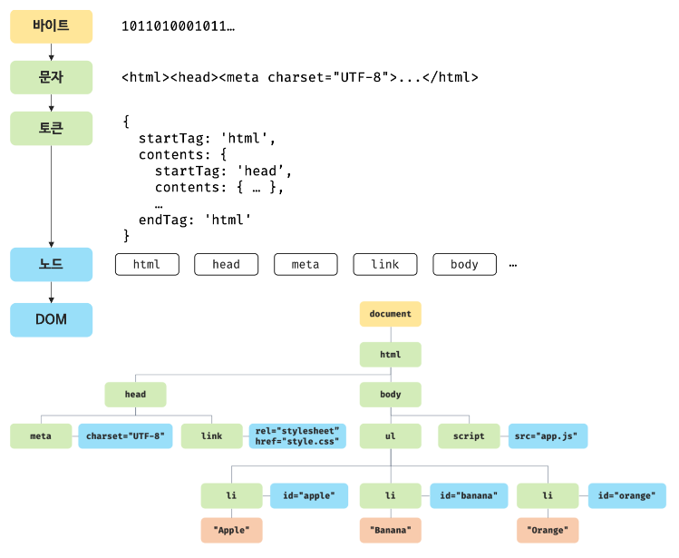

# 38장 브라우저의 렌더링 과정

구글의 V8 자바스크립트 엔진으로 빌드된 자바스크립트 런타임 환경인 Node.js의 등자으로 자바스크립트는 서버사이드 애플리케이션 개발에도 사용할 수 있는 범용 개발 언어가 되었지만, 가장 많이 사용되는 분야는 **웹페이지/애플리케이션의 클라이언트 사이드**이다.

대부분 언어는 운영체제(Operating System)나 가상머신(virtual Machine)위에서 실해되지만 웹 애플리케이션의 클라이언트 사이드 자바스크립트는 **브라우저에서 HTML, CSS와 함께 실행**된다.

브라우저가 어떻게 HTML, CSS, JS를 파싱(해석)하여 브라우저에서 렌더링하는지 알아보자

> 파싱(parsing)
>
> 프로그래밍 언어의 문법에 맞게 작성된 텍스트 문서를 읽어 들여 실행하기 위해 텍스트 문서의 문자열을 토근으로 분해(어휘 분석, lexical analysis)하고, 토큰에 문법적 의미와 구조를 반영하여 트리 구조의 자료구조인 파스트리를 생성하는 일련의 과정을 말함.
>
> 파싱완료 후 파스 트리를 기반으로 중간언어인 바이트 코드를 생성하고 실행한다.

> 렌더링(Rendering)
>
> HTML, CSS, JAVASCRIPT로 작성된  문서를 파싱하여 브라우저에 시각적으로 출력하는 것을 말함.


렌더링 과정.

1. 브라우저는 HTML, CSS, 자바스크립트, 이미지, 폰트파일 등 렌더링에 필요한 리소스를 요청하고 서버로부터 응답을 받음.
2. 브라우저의 렌더링 엔진은 서버로부터 응답된 **HTML과 CSS를 파싱**하여 **DOM과 CSSOM(CSS Object Model)을 생성**하고, 이들을 결합하여 **렌더 트리를 생성**
3. 브라우저의 자바스크립트 엔진은 서버로부터 응답된 자바스크립트를 파싱하여 `AST(Abstract Syntax Tree)`를 생성하고 바이트코드로 변환하여 실행함.<br/>자바스크립트는 DOM API를 통해 DOM이나 CSSOM을 변경할 수 있고, 변경된 DOM과 CSSOM은 다시 렌더 트리로 결합된다.
4. 렌더 트리를 기반으로 HTML 요소의 레이아웃(위치와 크기)을 계산하고 브라우저 화면에 HTML 요소를 페인팅한다.

> CSSOM (CSS Object Model)
>
> CSSOM은 CSS Object Model로 DOM에 CSS내용을 파싱하여 자료를 구조화 한 것.
>
> DOM처럼 CSS 내용을 해석하고 노드를 만들어 트리 구조로 만든 것.


## 38.1 요청과 응답

브라우저의 핵심 기능은 `필요한 리소스`(HTML, CSS, Javascript, 이미지, 폰드 등의 정적파일 또는 서버가 동적으로 생성한 데이터)를 서버에 요청하고 서버로부터 응답받아 `브라우저에 시각적으로 렌더링`하는 것.

서버에 요청을 전송하기 위해 브라우저는 주소창을 제공한다.

1. 브라우저 주소창에 URL 입력
2. URL의 호스트이름이 DNS를 통해 IP주소로 변환
3. IP주소갖는 서버에게 요청을 전송.


서버는 루트 요청에 대해 서버의 루트 폴더에 존재하는 정적 파일 index.html을 클라이언트(브라우저)로 응답함.

index.html이 아닌 다른 정적 파일을 서버에 요청하려면 브라우저 주소창에 같이 요청할 정적 파일의 경로와 파일이름을 URI호스트 뒤에 패스에 기술하여 서버에 요청한다.

반드시 브라우저의 주소창을 통해 서버에게 정적 파일만을 요청할 수 있는 것은 아니다.

자바스크립트를 통해 동적으로 서버에 정적/동적 데이터를 요청할 수도 있다. (43장 44장에서 자세히)


요청과 응답은 개발자도구 Network 패널에서 확인이 가능하다.

`https://poiemaweb.com`으로 접속해보자.

index.html뿐만아니라 CSS, Javascript, 이미지, 폰트등도 응답된 것을 볼 수 있다.

브라우저의 렌더링 엔진이 HTML(index.html)을 **파싱하는 도중에 외부 리소스를 로드하는 태그**, 즉 CSS파일을 로드하는 link태그, 이미지 파일을 로드하는 img태그, 자바스크립트를 로드하는 script 태그등을 **만나면 HTML파싱을 일시 중단하고 해당 리소스 파일을 서버로 요청하기 때문**이다.


## 38.2 HTTP 1.1과 HTTP 2.0

`HTTP (HyperText Transfer Protocol)`는 웹에서 브라우저와 서버가 통신하기 위한 프로토콜(규약)이다.

* 1991년 최초 문서화
* 1996년 HTTP/1.0
* 1999년 HTTP/1.1
* 2015년 HTTP/2

**HTTP/1.1과 HTTP/2의 차이**

`HTTP/1.1`과 `HTTP/2`의 차이를 보자.

`HTTP/1.1`은 기본적으로 커넥션당 하나의 요청과 하나의 응답만 처리한다.

여러 요청을 한 번에 전송할 수 없고 응답 또한 마찬가지다.

html문서 내에 포함된 여러 리소스 요청 ( 즉, CSS파일을 로드하는 link태그, 이미지파일을 로드하는 img태그, 자바스크립트를 로드하는 script 태그등에 의한 리소스 요청) 이 **개별적으로 전송되고 응답 또한 개별적으로 전송**된다.

`HTTP/1.1`은 리소스의 **동시 전송이 불가능**한 구조이므로 요청할 **리소스의 개수에 비례하여 응답 시간도 증가**하는 단점이 있다.

`HTTP/2`는 커넥션당 여러 개의 요청과 응답. 즉 다중 요청/응답이 가능하다.


## 38.3 HTML파싱과 DOM 생성

브라우저의 요청에 의해 서버가 응답한 HTML문서는 문자열로 이루어진 순수한 텍스트다.

HTML문서를 픽셀로 렌더링하려면 HTML문서를 브라우저가 이해할 수 있는 자료구조(객체)로 변환하여 메모리에 저장해야한다.

```html
<!DOCTYPE html>
<html>
  <head>
    <meta charset="UTF-8">
    <link rel="stylesheet" href="style.css">
  </head>
  <body>
    <ul>
      <li id="apple">Apple</li>
      <li id="banana">Banana</li>
      <li id="orange">Orange</li>
    </ul>
    <script src="app.js"></script>
  </body>
</html>
```

index.html이 서버로브터 응답되었다고 했을 때, 브라우저 렌더링 엔진은 다음 그림과 같은 과정을 통해 HTML문서를 파싱해 브라우저가 이해할 수 있는 **DOM(Documnet Object Model)**을 생성한다.



1. 서버에 존재하던 HTML파일이 브라우저 요청에 의해 응답된다.<br/>서버는 브라우저가 요청한 HTML파일을 읽어 들여 메모리에 저장한 다음 메모리에 저장된 바이트(2진수)를 인터넷에 경유하여 응답함.
2. 브라우저는 서버가 응답한 HTML문서를 바이트(2진수)형태로 응답받는다.<br/>문서는 meta태그의 charset 어트리뷰트에 의해 지정된 인코딩 방식(UTF-8)을 기준으로 문자열로 변환한다.<br/>(참고로 meta태그의 charset어트리뷰트에 선언된 인코딩방식은 응답헤더에 담겨 응답된다.)<br/>브라우저는 이를 확인한 후 문자열로 변환함.
3. 문자열로 변환된 HTML문서를 읽어 들여 문법적 의미를 갖는 코드 최소 단위인 **토큰**들로 분해한다.
4. 각 토큰들을 객체로 변환하여 **노드**들을 생성한다.<br/>토큰의 내용에 따라 `문서 노드`, `요소 노드`, `어트리뷰트 노드`, `텍스트 노드`가 생성됨.<br/>노드는 이후 DOM을 구성하는 기본요소가 된다.
5. HTML문서는 HTML요소들의 집합으로 이루어지며 **HTML요소는 중첩관계**를 갖는다.<br/>즉, HTML요소의 콘텐츠 영역에는 text뿐만 아니라 다른 HTML요소도 올 수 있다.<br/>HTML요소간의 부자 관계를 반영하여 모든 노드들을 **트리 자료구조**로 구성한다.
6. 이 노드들로 구성된 트리 자료구조를 **DOM(Documnet Object Model)**이라 한다.<br/>즉, **DOM은 HTML문서를 파싱한 결과물**이다.


## 38.4 CSS 파싱과 CSSOM 생성

렌더링 엔진은 HTML을 처음부터 한 줄씩 파싱하여 DOM을 생성해 나간다.

DOM을 생성하다가 CSS를 로드하는 link나 style태그를 만나면 DOM생성을 일시 중단한다.

중단 후 링크에 맞는 파일을 서버에 요청해 로드한 HTML, CSS를 동일한 파싱 과정(`바이트->문자->토큰->노드->CSSOM`)을 거치며 해석해 **CSSOM(CSS Object Model)**을 생성한다.

CSS파싱이 완료되면 HTML파싱이 중단된 지점부터 다시 HTML을 파싱하기 시작해 DOM생성을 재개한다.

```html
<!DOCTYPE html>
<html>
  <head>
    <meta charset="UTF-8">
    <link rel="stylesheet" href="style.css">
...
```

```css
body {
  font-size: 18px;
}

ul {
  list-style-type: none;
}
```

CSSOM은 CSS상속을 반영하여 생성된다.

예제의 body에 적용한 font-size프로퍼티와 ul요소에 적용한 list-style-type프로퍼티는 모두 li요소에 상속된다.

이런 상속 관계가 반영되 아래 처럼 CSSOM이 생성된다.


## 38.5 렌더 트리 생성

렌더링 엔진은 서버로부터 응답된 HTML과 CSS를 파싱하여 각각 DOM과 CSSOM을 생성한다.

DOM과 CSSOM은 렌더링을 위해 `렌더 트리`로 결합된다.


렌더 트리는 렌더링을 위한 트리 구조이다.

브라우저 화면에 렌더링되지 않는 노드와 CSS에 의해 비표시 되는 노드들은 포함되지 않는다.

즉, 화면에 렌더링 되는 노드만으로 구성되있다.


이후 완성된 렌더 트리 는 각 HTML 요소의 레이아웃(위치와 크기)를 계산하는데 사용되며 브라우저 화면에 픽셀을 렌더링하는 페인팅 처리에 입력된다.


브라우저의 렌더링 과정은 반복해서 실행될 수 있다.

다음 같은 경우 반복해서 레이아웃 계산과 페인팅이 재차 실행된다.

* 자바스크립트에 의한 노드 추가 또는 삭제
* 브라우저 창의 리사이징에 의한 뷰포트 크기 변경
* HTML요소의 레이아웃(위치, 크기)에 변경을 발생시키는 width/height, margin, padding, border, display, position, top/right/bottom/left등의 스타일 변경

리렌더링은 비용이 많이 드는, 즉 성능에 악영향을 주는 작업이다.

**❗ 리렌더링이 빈번하게 일어나지 않게 하도록 주의하는게 좋다.**


## 38.6 자바스크리브 파싱과 실행

