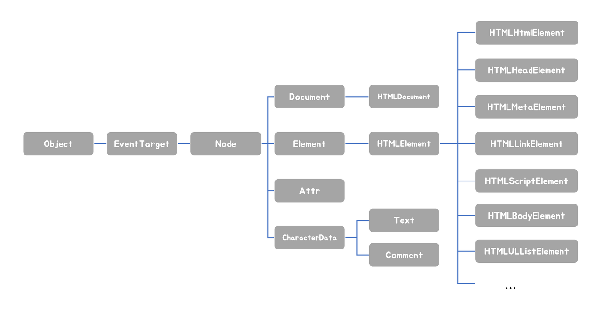
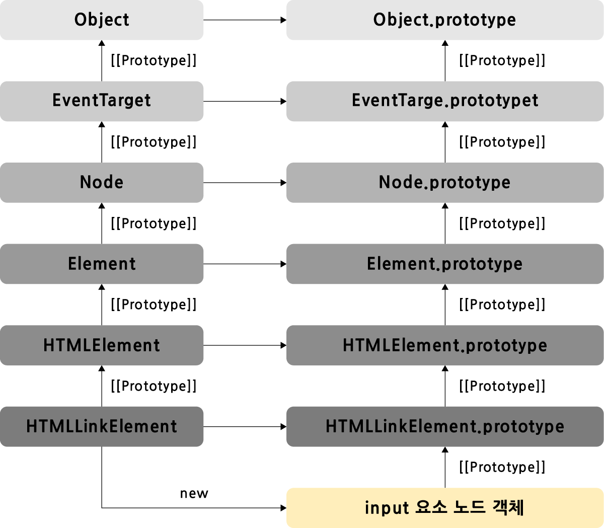
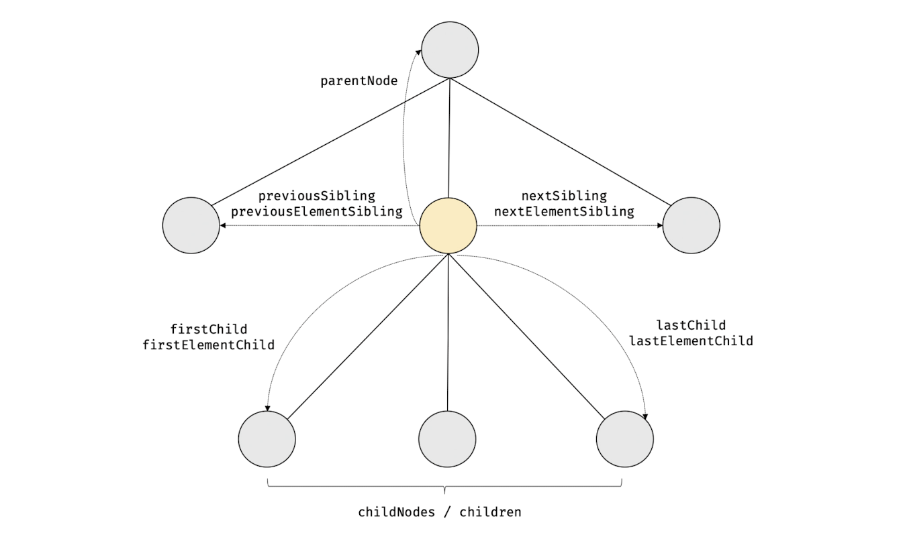
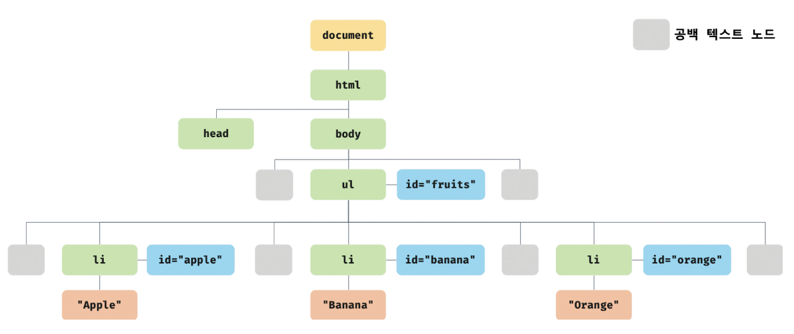
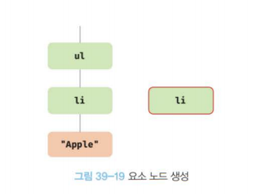
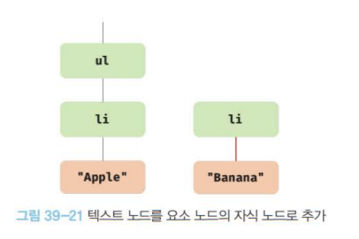

# 39장 DOM

DOM(Documnet Object Model)은 HTML문서의 계층적 구조와 정보를 표현하며 이를 제어할 수 있는 API, 즉 프로퍼티와 메서드를 제공하는 트리 자료구조다.


## 39.1 노드

### 39.1.1 HTML요소와 노드 객체

HTML요소 (HTML Element)는 HTML문서를 구성하는 개별적 요소를 의미한다.

HTML요소는 렌더링 엔진에 의해 파싱되어 DOM을 구성하는 요소 노드 객체로 변환된다.<BR/>(HTML요소의 어트리뷰트는 어트리뷰트 노드로, 텍스트 콘텐츠는 텍스트노드로 변환)

HTML문서는 HTML요소들의 집합으로 이뤄지며 HTML요소는 `중첩 관계`를 갖는다.

HTML요소의 콘텐츠 영역에는 텍스트 뿐만 아니라 다른 HTML요소가 포함될 수 있고, 이런 중첩관계로 `계층적인 부자관계`가 형성된다.


**트리 자료구조**

트리 자료구조는 노드들의 계층 구조로 이뤄진다.

부모 노드와 자식 노드로 구성되어 계층적 구조를 표현하는 비선형 자료구조.

**❗ 노드 객체들로 구성된 트리 자료구조를 DOM이라 한다.**


### 39.1.2 노드 객체의 타입

```html
<!DOCTYPE html>
<html>
  <head>
    <meta charset="UTF-8">
    <link rel="stylesheet" href="style.css">
  </head>
  <body>
    <ul>
      <li id="apple">Apple</li>
      <li id="banana">Banana</li>
      <li id="orange">Orange</li>
    </ul>
    <script src="app.js"></script>
  </body>
</html>
```

> 공백 텍스트 노드
>
> HTML 요소 사이의 개행이나 공백은 텍스트 노드가 된다.

DOM은 노드 객체의 계층적인 구조로 구성된다.

노드 객체는 종류가 있고 상속 구조를 갖는다.

노드는 총 12종류의 노드타입이 있고 주유 노드타입은 4가지가있다.


**문서 노드(document node)**

DOM트리의 최상위에 존재하는 루트 노드로서 `document 객체`를 가리킨다.

`document 객체`는 브라우저가 렌더링한 HTML 문서 전체를 가리키는 객체로서 전역 객체 window의 documenet 프로퍼티에 바인딩되있다.

모든 자바스크립트 코드는 script 태그에 의해 분리되어 있어도 하나의 전역 객체 `window`를 공유함.

모든 자바스크립트 코드는 전역 객체 window의 documnet 프로퍼티에 바인딩 되있는 하나의 documnet객체를 바라본다.

❗ 즉, HTML문서당 document객체는 유일하다.

요소, 어트리뷰트 , 텍스트 노드에 접근하려면 문서 노드를 통해야 한다.


**요소 노드(document node)**

`HTML요소를 가리키는 객체`

요소 노드는 HTML간의 중첩에 의해 부자 관계를 가지며, 부자 관계를 통해 정보를 구조화 함.

즉, **요소 노드는 문서의 구조를 표현**한다고 할 수 있다.


**어트리뷰트 노드(document node)**

HTML요소의 `어트리뷰트를 가리키는 객체`

어트리뷰트가 지정된 HTML요소의 요소 노드와 연결되있다.

어트리뷰트 노드는 부모 노드에 연결되있지 않다. => 형제 노드가 아니다.

어트리뷰트 노드에 접근하여 어트리뷰트를 참조하거나 변경하려면 먼저 요소 노드에 접근해야 한다.


**텍스트 노드(document node)**

`HTML요소의 텍스트를 가리키는 객체`

**문서의 정보를 표현** 한다.

텍스트 노드는 `요소 노드의 자식 노드`이며, 자식 노드를 가질 수 없는 리프 노드.

❗ 즉, DOM트리의 최종단이다.

텍스트 노드에 접근하려면 먼저 부모 노드인 요소 노드에 접근해야 한다.


**그 외**

* 주석을 위한 Commnet  노드
* DOCTYPE을 위한 DocumnetType 노드
* 복수의 노드를 생성해 추가할 때 사용하는 DocumnetFragment 노드
* 등등


### 39.1.3 노드 객체의 상속 구조

DOM은 HTMl문서의 계층적 구조와 정보를 표현하며, 이를 제어할 수 있는 API를 제공하는 트리 자료구조.

DOM API를 통해 노드 객체는 자신의 부모, 형제, 자식을 탐색할 수 있으며 자신으 ㅣ어트리뷰트와 텍스트를 조작할 수도 있다.

DOM을 구성하는 노드 객체는 ECMAScript 사양에 정의된 표준 빌트인 객체가 아니라 브라우저 환경에서 추가적으로 제공하는 호스트 객체다.

❗ 노드 객체도 자바스크립트 객체이므로 프로토타입에 의한 상속 구조를 갖는다.



❗ 모든 노드 객체는 Object, EventTarget, Node인터페이스를 상속받는다.

`문서 노드는 Document, HTMLDocumnent 인터페이스`를, `어트리뷰트 노드는 Attr, 텍스트 노드는 CharacterData인터페이스`를 상속받는다.

`요소 노드는 Element 인터페이스`를 상속받는다.


프로토타입 체인 관점에서 살펴보자.

input요소 노드 객체는 HTMLInputElement, HTMLElement, Element, Node, EventTarget, Object의 prototype에 바인딩 되있는 프로토타입 객체를 상속 받는다.

**즉, input 요소 노드 객체는 프로토 타입 체인에 있는 모든 프로토타입의 프로퍼티나 메서드를 상속받아 사용할 수 있다.**



```html
<!DOCTYPE html>
<html>
<body>
  <input type="text">
  <script>
    // input 요소 노드 객체를 선택
    const $input = document.querySelector('input');

    // input 요소 노드 객체의 프로토타입 체인
    console.log(
      Object.getPrototypeOf($input) === HTMLInputElement.prototype,
      Object.getPrototypeOf(HTMLInputElement.prototype) === HTMLElement.prototype,
      Object.getPrototypeOf(HTMLElement.prototype) === Element.prototype,
      Object.getPrototypeOf(Element.prototype) === Node.prototype,
      Object.getPrototypeOf(Node.prototype) === EventTarget.prototype,
      Object.getPrototypeOf(EventTarget.prototype) === Object.prototype
    ); // 모두 true
  </script>
</body>
</html>
```

배열이 객체인 동시에 배열인 것 처럼 input요소 노드 객체도 다음같이 다양한 특성을 갖는 객체이며,

이런 특성을 나타내느 ㄴ기능들을 상속을 통해 제공 받는다.

| input 요소 노드 객체의 특성                                  | 프로토타입을 제공하는 객체 |
| ------------------------------------------------------------ | -------------------------- |
| 객체                                                         | Object                     |
| 이벤트를 발생시키는 객체                                     | EventTarget                |
| 트리 자료구조의 노드 객체                                    | Node                       |
| 브라우저가 렌더링할 수 있는 웹 문서의 요소(HTML, XML, SVG)를 표현하는 객체 | Element                    |
| 웹 문서의 요소 중에서 HTML 요소를 표현하는 객체              | HTMLElement                |
| HTML 요소 중에서 input 요소를 표현하는 객체                  | HTMLInputElement           |

❗ 노드 객체의 상속 구조는 `개발자도구 - Elements패널 - 우측의 Properties패널`에서 확인 가능.


`노드 객체`에는 노드 객체의 종류(노드의 타입)에 상관없이 모든 노드 객체가 공통으로 갖는 기능도 있고, 노드 타입에 따라 고유한 기능도 있다.

예를 들어 모든 노드 객체는 이벤트를 발생시킬 수 있고, 공통적으로 트리 탐색기능, 노드 정보 제공기능 등이 필요하다.

`요소 노드 객체`는 HTML요소의 종류에 따라 고유한 기능도 있다.

예를 들어 input 요소 노드 객체는 value프로퍼티가 필요하지만, div 요소 노드 객체는 value프로퍼티가 필요하지 않다.


이처럼 `노드 객체`는 공통된 기능일수록 프로토타입 체인의 상위에 개별적인 고유기능일수록 프로토타입 체인의 하위에 프로토타입 체인을 구축하여 노드 객체에 필요한 기능, 즉 프로퍼티와 메서드를 제공하는 상속 구조를 갖는다.


정리해보자.

DOM은 HTML문서의 계층적 구조와 정보를 표현하는 것은 물론 노드 객체의 종류, 즉 노드 타입에 따라 필요한 기능을 프로퍼티와 메서드 집합인 DOM API로 제공한다.

DOM API를 통해 HTML구조나 내용 또는 스타일 등을 동적으로 조작할 수 있다.


## 39.2 요소 노드 취득

HTML의 구조나 내용, style을 조작하려면 요소 노드를 취득해야 한다.

텍스트 노드나 어트리뷰트 노드 또한 `요소 노드와 연결`되있기 때문에 조작할 때 요소 노드를 얻어야 한다.

요소 노드의 취득은 HTML 요소를 조작하는 시작점이다.


### 39.2.1 id를 이용한 요소 노드 취득

`Document.prototype.getElementByid` 메서드는 인수로 전달한 id값을 갖는 하나의 요소 노드를 탐색해 반환한다.

```html
<!DOCTYPE html>
<html>
  <body>
    <ul>
      <li id="apple">Apple</li>
      <li id="banana">Banana</li>
      <li id="orange">Orange</li>
    </ul>
    <script>
      // id 값이 'banana'인 요소 노드를 탐색하여 반환한다.
      // 두 번째 li 요소가 파싱되어 생성된 요소 노드가 반환된다.
      const $elem = document.getElementById('banana');

      // 취득한 요소 노드의 style.color 프로퍼티 값을 변경한다.
      $elem.style.color = 'red';
    </script>
  </body>
</html>
```

id값은 HTMl내에서 유일한 값이어야 하고, 공백 문자로 구분하여 여러 개의 값을 가질 수 없다.

id값이 여러개여도 에러가 발생하진 않고, 여러개인 경우 첫번째 요소를 반환함.

없는 경우 null을 반환.

```html
<!DOCTYPE html>
<html>
  <body>
    <ul>
      <li id="banana">Apple</li>
      <li id="banana">Banana</li>
      <li id="banana">Orange</li>
    </ul>
    <script>
      // getElementById 메서드는 언제나 단 하나의 요소 노드를 반환한다.
      // 첫 번째 li 요소가 파싱되어 생성된 요소 노드가 반환된다.
      const $elem = document.getElementById('banana');

      // 취득한 요소 노드의 style.color 프로퍼티 값을 변경한다.
      $elem.style.color = 'red';
        
      // id 값이 'grape'인 요소 노드를 탐색하여 반환한다. null이 반환된다.
      const $elem2 = document.getElementById('grape');

      // 취득한 요소 노드의 style.color 프로퍼티 값을 변경한다.
      $elem2.style.color = 'red';
    </script>
  </body>
</html>
```


HTML 요소에 id를 부여하면 id값과 동일한 이름의 전역 변수가 암묵적으로 선언되고 해당 노드 객체가 할당되는 부수 효과가 있다.

단, id값과 동일한 이름의 전역 변수가 이미 선언 되있다면, 이 전역 변수에 노드 객체가 재할당되지는 않는다.

```html
<!DOCTYPE html>
<html>
  <body>
    <div id="foo"></div>
    <script>
      // id 값과 동일한 이름의 전역 변수가 암묵적으로 선언되고 해당 노드 객체가 할당된다.
      console.log(foo === document.getElementById('foo')); // true

      // 암묵적 전역으로 생성된 전역 프로퍼티는 삭제되지만 전역 변수는 삭제되지 않는다.
      delete foo;
      console.log(foo); // <div id="foo"></div>
        
        
      // -------------------------------------------------------------------------
      let foo = 1;

      // id 값과 동일한 이름의 전역 변수가 이미 선언되어 있으면 노드 객체가 재할당되지 않는다.
      console.log(foo); // 1
    </script>
  </body>
</html>
```


### 39.2.2 태그 이름을 이용한 요소 노드 취득

`Document.prototype/Element.prototype.getElementsByTagName`메서드는 인수로 전달한 태그 이름을 갖는 모든 요소 노드들을 탐색하여 반환한다.

메서드이름에 포함된 Elements가 복수형인 것에서 알 수 있듯이 getElementsByTagName메서드는 여러 개의 노드 객체를 갖는 DOM 컬렉션 객체인 HTMLCollection객체를 반환한다.

```html
<!DOCTYPE html>
<html>
  <body>
    <ul>
      <li id="apple">Apple</li>
      <li id="banana">Banana</li>
      <li id="orange">Orange</li>
    </ul>
    <script>
      // 태그 이름이 li인 요소 노드를 모두 탐색하여 반환한다.
      // 탐색된 요소 노드들은 HTMLCollection 객체에 담겨 반환된다.
      // HTMLCollection 객체는 유사 배열 객체이면서 이터러블이다.
      const $elems = document.getElementsByTagName('li');

      // 취득한 모든 요소 노드의 style.color 프로퍼티 값을 변경한다.
      // HTMLCollection 객체를 배열로 변환하여 순회하며 color 프로퍼티 값을 변경한다.
      [...$elems].forEach(elem => { elem.style.color = 'red'; });
    </script>
  </body>
</html>
```

여러 개의 값을 반환하려면 배열이나 객체같은 자료구조에 담아 반환해야한다.

`getElementsByTagName`이 반환하는 DOM 컬렉션 객체인 HTMLCollection객체느 ㄴ유사 배열 객체이면서 이터러블이다.

HTML문서의 모든 요소 노드를 취득하려면 getElementsByTagName메서드의 인수로 '*'를 전달한다.

```javascript
// 모든 요소 노드를 탐색하여 반환한다.
const $all = document.getElementsByTagName('*');
// -> HTMLCollection(8) [html, head, body, ul, li#apple, li#banana, li#orange, script, apple: li#apple, banana: li#banana, orange: li#orange]
```


`getEelemtnsByTagName`메서드는 `Document.prototype`에 정의된 메서드와 `Element.prototype`에 정의된 메서드가 있다.

`Document.prototype.getElementsByTagName`메서드는 DOM의 루트 노드인 문서 노드, 즉 documnet를 통해 호출하며 DOM전체에서 요소 노드를 탐색하여 반환한다.

하지만, `Element.prototype.getElementsByTagName`메서드는 특정 요소 노드를 통해 호출하며, 특정 요소 노드의 자손 노드 중에서 요소 노드를 탐색하여 반환한다.

인수로 전달된 태그 이름을 갖는 요소가 존재하지 않는 경우 `getElementsByTagName`메서드는 빈 HTMLCollection객체를 반환함.

```html
<!DOCTYPE html>
<html>
  <body>
    <ul id="fruits">
      <li>Apple</li>
      <li>Banana</li>
      <li>Orange</li>
    </ul>
    <ul>
      <li>HTML</li>
    </ul>
    <script>
      // DOM 전체에서 태그 이름이 li인 요소 노드를 모두 탐색하여 반환한다.
      const $lisFromDocument = document.getElementsByTagName('li');
      console.log($lisFromDocument); // HTMLCollection(4) [li, li, li, li]

      // #fruits 요소의 자손 노드 중에서 태그 이름이 li인 요소 노드를 모두
      // 탐색하여 반환한다.
      const $fruits = document.getElementById('fruits');
      const $lisFromFruits = $fruits.getElementsByTagName('li');
      console.log($lisFromFruits); // HTMLCollection(3) [li, li, li]
    </script>
  </body>
</html>
```


### 39.2.3.class를 이용한 요소 노드 취득

`Document.prototype/Element.prototype.getElementsByClassName`메서드는 인수로 전달한 class 어트리뷰트 값을 갖는 모든 요소 노드들을 탐색하여 반환한다.

class값은 공백으로 구분하여 여러 개의 class를 지정할 수 있다.

여러 개의 요소 노드 객체를 갖는 DOM컬렉션 객체인 `HTMLCollection객체`를 반환한다.

```html
<!DOCTYPE html>
<html>
  <body>
    <ul>
      <li class="fruit apple">Apple</li>
      <li class="fruit banana">Banana</li>
      <li class="fruit orange">Orange</li>
    </ul>
    <script>
      // class 값이 'fruit'인 요소 노드를 모두 탐색하여 HTMLCollection 객체에 담아 반환한다.
      const $elems = document.getElementsByClassName('fruit');

      // 취득한 모든 요소의 CSS color 프로퍼티 값을 변경한다.
      [...$elems].forEach(elem => { elem.style.color = 'red'; });

      // class 값이 'fruit apple'인 요소 노드를 모두 탐색하여 HTMLCollection 객체에 담아 반환한다.
      const $apples = document.getElementsByClassName('fruit apple');

      // 취득한 모든 요소 노드의 style.color 프로퍼티 값을 변경한다.
      [...$apples].forEach(elem => { elem.style.color = 'blue'; });
    </script>
  </body>
</html>
```


`Documnet.prototype.getElementsByClassName`은 DOM의 루트 노드인 문서 노드, 즉, document를 통해 호출하며 DOM 전체에서 요소 노드를 탐색하여 반환함.

`Element.prototype.getElementsByClassName`은 특정 요소 노드를 통해 호출하며 특정 요소 노드의 자손 노드 중에서 요소 노드를 탐색하여 반환함.

요소가 없는 경우 빈 HTMLCollection을 반환.

```html
<!DOCTYPE html>
<html>
  <body>
    <ul id="fruits">
      <li class="apple">Apple</li>
      <li class="banana">Banana</li>
      <li class="orange">Orange</li>
    </ul>
    <div class="banana">Banana</div>
    <script>
      // DOM 전체에서 class 값이 'banana'인 요소 노드를 모두 탐색하여 반환한다.
      const $bananasFromDocument = document.getElementsByClassName('banana');
      console.log($bananasFromDocument); // HTMLCollection(2) [li.banana, div.banana]

      // #fruits 요소의 자손 노드 중에서 class 값이 'banana'인 요소 노드를 모두 탐색하여 반환한다.
      const $fruits = document.getElementById('fruits');
      const $bananasFromFruits = $fruits.getElementsByClassName('banana');

      console.log($bananasFromFruits); // HTMLCollection [li.banana]
    </script>
  </body>
</html>
```


### 39.2.4. CSS선택자를 이용한 요소 노드 취득

`CSS 선택자(selector)`는 스타일을 적용하고자 하는 HTML요소를 특정할 때 사용하는 문법.

```css
/* 전체 선택자: 모든 요소를 선택 */
* { ... }
/* 태그 선택자: 모든 p 태그 요소를 모두 선택 */
p { ... }
/* id 선택자: id 값이 'foo'인 요소를 모두 선택 */
#foo { ... }
/* class: class 값이 'foo'인 요소를 모두 선택 */
.foo { ... }
/* 어트리뷰트 선택자: input 요소 중에 type 어트리뷰트 값이 'text'인 요소를 모두 선택 */
input[type=text] { ... }
/* 후손 선택자: div 요소의 후손 요소 중 p 요소를 모두 선택 */
div p { ... }
/* 자식 선택자: div 요소의 자식 요소 중 p 요소를 모두 선택 */
div > p { ... }
/* 인접 형제 선택자: p 요소의 형제 요소 중에 p 요소 바로 뒤에 위치하는 ul 요소를 선택 */
p + ul { ... }
/* 일반 형제 선택자: p 요소의 형제 요소 중에 p 요소 뒤에 위치하는 ul 요소를 모두 선택 */
p ~ ul { ... }
/* 가상 클래스 선택자: hover 상태인 a 요소를 모두 선택 */
a:hover { ... }
/* 가상 요소 선택자: p 요소의 콘텐츠의 앞에 위치하는 공간을 선택
   일반적으로 content 프로퍼티와 함께 사용된다. */
p::before { ... }
```


`Document.prototype/Element.prototype.querySelector`메서드는 인수로 전달한 CSS 선택자를 만족시키는 하나의 요소 노드를 탐색하여 반환한다.

* 인수로 전달한 CSS 선택자를 만족시키는 요소 노드가 여러개인 경우 첫 요소만 반환함
* 만족하는 요소 노드가 없으면  null 반환
* 문법에 맞지않으면 DOM Exception발생.

```html
<!DOCTYPE html>
<html>
  <body>
    <ul>
      <li class="apple">Apple</li>
      <li class="banana">Banana</li>
      <li class="orange">Orange</li>
    </ul>
    <script>
      // class 어트리뷰트 값이 'banana'인 첫 번째 요소 노드를 탐색하여 반환한다.
      const $elem = document.querySelector('.banana');

      // 취득한 요소 노드의 style.color 프로퍼티 값을 변경한다.
      $elem.style.color = 'red';
    </script>
  </body>
</html>
```


`Document.prototype/Element.prototype.querySelectorAll`은 CSS 선택자를 만족하는 모든 요소 노드를 탐색해 `NodeList객체`를 반환한다.<br/>(NodeList객체는 유사 배열 객체이면서 이터러블.)

* 만족하는 요소가 없으면 빈 NodeList객체를 반환.
* 문법에 맞지 않으면 DOMException에러가 발생함.

모든 요소를 취득 하려면 `전체 선택자(*)`를  전달함.

```html
<!DOCTYPE html>
<html>
  <body>
    <ul>
      <li class="apple">Apple</li>
      <li class="banana">Banana</li>
      <li class="orange">Orange</li>
    </ul>
    <script>
      // ul 요소의 자식 요소인 li 요소를 모두 탐색하여 반환한다.
      const $elems = document.querySelectorAll('ul > li');
      // 취득한 요소 노드들은 NodeList 객체에 담겨 반환된다.
      console.log($elems); // NodeList(3) [li.apple, li.banana, li.orange]

      // 취득한 모든 요소 노드의 style.color 프로퍼티 값을 변경한다.
      // NodeList는 forEach 메서드를 제공한다.
      $elems.forEach(elem => { elem.style.color = 'red'; });
        
        // 모든 요소 노드를 탐색하여 반환한다.
        const $all = document.querySelectorAll('*');
		// -> NodeList(8) [html, head, body, ul, li#apple, li#banana, li#orange, script]
    </script>
  </body>
</html>
```

`Document.prototype`에 정의된 메서드는 DOM의 루트 노드인 문서 노드(document)를 통해 호출하고, DOM전체에서 요소 노드를 탐색해서 반환한다.

`Element.prototype`에 정의된 메서드는 특정 요소 노드를 통해 호출하며, 자손노드 중에서 요소 노드를 탐색하여 반환한다.

> **참고❗** 
>
> `querySelector`, `querySelectorAll`메서드는 `getElementById`, `getElementsBy***`메서드 보다 다소 느린 것으로 알려져 있다.
>
> 그러나 CSS선택자 문법을 사용해 좀 더 구체적인 조건으로 요소 노드를 취득할 수 있고, 일관된 방식으로 요소 노드를 취득할 수 있다는 장점이 있다.
>
> ❗ id 어트리뷰트가 잇는 요소 노드를 취득하는 경우 `getElementById`를 사용하고, 그 외에는 `querySelector`, `querySelectorAll`을 사용하는 것을 권장한다.


### 39.2.5 특정 요소 노드를 취득할 수 있는지 확인

`Element.prototype.matches`는 인수로 전달한 CSS선택자를 통해 특정 요소 노드를 취득할 수 있는지 확인한다.

```html
<!DOCTYPE html>
<html>
  <body>
    <ul id="fruits">
      <li class="apple">Apple</li>
      <li class="banana">Banana</li>
      <li class="orange">Orange</li>
    </ul>
  </body>
  <script>
    const $apple = document.querySelector('.apple');

    // $apple 노드는 '#fruits > li.apple'로 취득할 수 있다.
    console.log($apple.matches('#fruits > li.apple'));  // true

    // $apple 노드는 '#fruits > li.banana'로 취득할 수 없다.
    console.log($apple.matches('#fruits > li.banana')); // false
  </script>
</html>
```


### 39.2.6 HTMLCollection과 NodeList

DOM컬렉션 객체인 HTMLCollection과 NodeList는 DOM API가 여러 개의 결과값을 반환하기 위한 DOM 컬렉션 객체다.

`HTMLCollection`과 `NodeList`는 모두 유사 배열 객체이면서 이터러블임. => 순회가 가능하다.

`HTMLCollection`과 `NodeList`의 중요한 특징은 **노드 객체의 상태 변화를 실시간으로 반영하는 살아있는 객체** 라는 것

NodeList는 대부분의 경우 노드 객체의 상태 변화를 실시간으로 반영하지 않고 과거의 정적 상태를 유지하는 `non-live`객체로 동작하지만 경우에 따라 live객체로 동작할 때가 있다.


**HTMLCollection**

`getElementsByTagName`, `getElementsByClassName`메서드가 반환하는 HTMLCollection객체는 노드 객체의 상태 변화를 실시간으로 반영하는 살아있는 DOM컬렉션 객체.

```html
<!DOCTYPE html>
<head>
  <style>
    .red { color: red; }
    .blue { color: blue; }
  </style>
</head>
<html>
  <body>
    <ul id="fruits">
      <li class="red">Apple</li>
      <li class="red">Banana</li>
      <li class="red">Orange</li>
    </ul>
    <script>
      // class 값이 'red'인 요소 노드를 모두 탐색하여 HTMLCollection 객체에 담아 반환한다.
      const $elems = document.getElementsByClassName('red');
      // 이 시점에 HTMLCollection 객체에는 3개의 요소 노드가 담겨 있다.
      console.log($elems); // HTMLCollection(3) [li.red, li.red, li.red]

      // HTMLCollection 객체의 모든 요소의 class 값을 'blue'로 변경한다.
      for (let i = 0; i < $elems.length; i++) {
        $elems[i].className = 'blue';
      }

      // HTMLCollection 객체의 요소가 3개에서 1개로 변경되었다.
      console.log($elems); // HTMLCollection(1) [li.red]
    </script>
  </body>
</html>
```

위 예제가 에러 없이 실행되면, 모든 li요소의 class값이 'blue'로 변경될 것이다.

그러나 예상대로 동작하지않는다.

>  **why?**
>
>  첫번째 element가 blue로 바뀌고나면 $elems에서 실시간으로 제거되기 때문.
>
>  i=0 | [첫번째 li.red, 두번째 li.red, 세번째 li.red] => 첫번째 li 변경
>
>  i=1 | [두번째 li.red, 세번째 li.red] => 세번째 li 변경
>
>  i=2 | [두번째 li.red] => i < $elems.length 조건문에 의해 종료.

❗ 이처럼 HTMLCollection객체는 실시간으로 노드 객체의 상태 변경을 반영해 요소를 제거할 수 있기 때문에 for문으로 순회 시 주의해야한다.

역순회 하거나 while문으로 객체가 남지않을때까지 반복하는 방법도 있다.

best는 HTMLCollection을 사용하지 않는 것이다.

HTMLCollection을 배열로 변환하여 유용한 배열의 고차함수(forEach, map, filter, reduce, ...)를 사용할 수 있다.

```javascript
// for 문을 역방향으로 순회
for (let i = $elems.length - 1; i >= 0; i--) {
  $elems[i].className = 'blue';
}

// while 문으로 HTMLCollection에 요소가 남아 있지 않을 때까지 무한 반복
let i = 0;
while ($elems.length > i) {
  $elems[i].className = 'blue';
}

// 유사 배열 객체이면서 이터러블인 HTMLCollection을 배열로 변환하여 순회
[...$elems].forEach(elem => elem.className = 'blue');
```


**NodeList**

HTMLCollection의 부작용을 해결하기 위해 `querySelectorAll`을 사용하는 방법도 있다.

`querySelectorAll`은 **NodeList객체를 반환**하며 실시간으로 객체의 상태를 변경하지 않는 non-live객체다.

```javascript
// querySelectorAll은 DOM 컬렉션 객체인 NodeList를 반환한다.
const $elems = document.querySelectorAll('.red');

// NodeList 객체는 NodeList.prototype.forEach 메서드를 상속받아 사용할 수 있다.
$elems.forEach(elem => elem.className = 'blue');
```


`NodeList객체`는 `NodeList.prototype.forEach`메서드를 상속받아 사용할 수 있다.

그 외에도 `NodeList.prototype`은 item, entries, keys, values를 제공한다.

**❗ `non-live`객체로 동작하지만, childNodes프로퍼티가 반환하는 NodeList객체는 HTMLCollection객체와 같이 live객체로 동작하므로 주의가 필요하다.**

```html
<!DOCTYPE html>
<html>
  <body>
    <ul id="fruits">
      <li>Apple</li>
      <li>Banana</li>
    </ul>
  </body>
  <script>
    const $fruits = document.getElementById('fruits');

    // childNodes 프로퍼티는 NodeList 객체(live)를 반환한다.
    const { childNodes } = $fruits;
    console.log(childNodes instanceof NodeList); // true

    // $fruits 요소의 자식 노드는 공백 텍스트 노드(39.3.1절 "공백 텍스트 노드" 참고)를 포함해 모두 5개다.
    console.log(childNodes); // NodeList(5) [text, li, text, li, text]

    for (let i = 0; i < childNodes.length; i++) {
      // removeChild 메서드는 $fruits 요소의 자식 노드를 DOM에서 삭제한다.
      // (39.6.9절 "노드 삭제" 참고)
      // removeChild 메서드가 호출될 때마다 NodeList 객체인 childNodes가 실시간으로 변경된다.
      // 따라서 첫 번째, 세 번째 다섯 번째 요소만 삭제된다.
      $fruits.removeChild(childNodes[i]);
    }

    // 예상과 다르게 $fruits 요소의 모든 자식 노드가 삭제되지 않는다.
    console.log(childNodes); // NodeList(2) [li, li]
  </script>
</html>
```

**❗ 노드 객체의 상태 변경과 상관없이 안전하게 DOM컬렉션을 사용하려면 HTMLCollection이나 NodeList객체를 배열로 변환해 사용하는 것을 권장한다.**

```html
<!DOCTYPE html>
<html>
  <body>
    <ul id="fruits">
      <li>Apple</li>
      <li>Banana</li>
    </ul>
  </body>
  <script>
    const $fruits = document.getElementById('fruits');

    // childNodes 프로퍼티는 NodeList 객체(live)를 반환한다.
    const { childNodes } = $fruits;

    // 스프레드 문법을 사용하여 NodeList 객체를 배열로 변환한다.
    [...childNodes].forEach(childNode => {
      $fruits.removeChild(childNode);
    });

    // $fruits 요소의 모든 자식 노드가 모두 삭제되었다.
    console.log(childNodes); // NodeList []
  </script>
</html>
```


## 39.3 노드 탐색

```html
<ul id="fruits">
  <li class="apple">Apple</li>
  <li class="banana">Banana</li>
  <li class="orange">Orange</li>
</ul>
```

DOM트리상의 노드를 탐색할 수 있도록 Node, Element 인터페이스는 트리 탐색 프로퍼티를 제공한다.



`parentNode`, `previousSibling`, `firstChild`, `childNodes`프로퍼티는 Node.prototype이 제공하고,

프로퍼티 키에 Element가 포함된 `previousElementSibling`, `nextElementSibling`과 children 프로퍼티는 Element.prototype이 제공함.

**노드 탐색 프로퍼티는 모두 접근자 프로퍼티**

단 , 노드 탐색 프로퍼티는 setter없이 getter만 존재하여 참조만 가능한 읽기 전용 접근자 프로퍼티다. => 값 할당시 무시됨.


### 39.3.1 공백 텍스트 노드

HTML요소 사이의 `스페이스, 탭, 줄바꿈(개행)등`의 **공백 문자는 텍스트 노드를 생성**한다.

이를 **공백 텍스트 노드**라 한다.



위 사진처럼 공백 텍스트 노드를 생성하기 때문에 노드 탐색시 주의 해야 한다.

인위적으로 공백 문자를 제거하면 생성하지 않지만 가독성이 좋지 않으니 권장하지 않는다.

```html
<ul id="fruits"><li
  class="apple">Apple</li><li
  class="banana">Banana</li><li
  class="orange">Orange</li></ul>
```


### 39.3.2 자식 노드 탐색 🔴

아래의 노드 탐색 프로퍼티를 사용한다.

| 프로퍼티                            | 설명                                                         |
| ----------------------------------- | ------------------------------------------------------------ |
| Node.prototype.childNodes           | 자식 노드를 모두 탐색하여 DOM 컬렉션 객체인 Nodelist에 담아 반환함.<br/>childNodes프로퍼티가 반환한 NodeList에는 요소노드뿐만 아니라 텍스트 노드도 포함되 있을 수 있다. |
| Element.prototype.children          | 자식 노드를 모두 탐색하여 DOM 컬렉션 객체인 HTMLCollection에 담아 반환함.<br/>children프로퍼티가 반환한 HTMLCollection에는 텍스트 노드가 포함되지 않는다. |
| Node.prototype.firstChild           | 첫 번째 자식 노드를 반환함. <br/>fristChild프로퍼티가 반환한 노드는 텍스트노드거나 요소 노드다. |
| Node.prototype.lastChild            | 마지막 자식 노드를 반환함. <br/>lastChild프로퍼티가 반환한 노드는 텍스트노드거나 요소 노드다. |
| Element.prototype.fristElementChild | 첫 번째 자식 요소 노드를 반환함.<br/>firstElementChild프로퍼티는 요소 노드만 반환함. |
| Element.prototype.lastElementChild  | 마지막 자식 요소 노드를 반환함.<br/>lastElementChild프로퍼티는 요소 노드만 반환함. |

```html
<!DOCTYPE html>
<html>
  <body>
    <ul id="fruits">
      <li class="apple">Apple</li>
      <li class="banana">Banana</li>
      <li class="orange">Orange</li>
    </ul>
  </body>
  <script>
    // 노드 탐색의 기점이 되는 #fruits 요소 노드를 취득한다.
    const $fruits = document.getElementById('fruits');

    // #fruits 요소의 모든 자식 노드를 탐색한다.
    // childNodes 프로퍼티가 반환한 NodeList에는 요소 노드뿐만 아니라 텍스트 노드도 포함되어 있다.
    console.log($fruits.childNodes);
    // NodeList(7) [text, li.apple, text, li.banana, text, li.orange, text]

    // #fruits 요소의 모든 자식 노드를 탐색한다.
    // children 프로퍼티가 반환한 HTMLCollection에는 요소 노드만 포함되어 있다.
    console.log($fruits.children);
    // HTMLCollection(3) [li.apple, li.banana, li.orange]

    // #fruits 요소의 첫 번째 자식 노드를 탐색한다.
    // firstChild 프로퍼티는 텍스트 노드를 반환할 수도 있다.
    console.log($fruits.firstChild); // #text

    // #fruits 요소의 마지막 자식 노드를 탐색한다.
    // lastChild 프로퍼티는 텍스트 노드를 반환할 수도 있다.
    console.log($fruits.lastChild); // #text

    // #fruits 요소의 첫 번째 자식 노드를 탐색한다.
    // firstElementChild 프로퍼티는 요소 노드만 반환한다.
    console.log($fruits.firstElementChild); // li.apple

    // #fruits 요소의 마지막 자식 노드를 탐색한다.
    // lastElementChild 프로퍼티는 요소 노드만 반환한다.
    console.log($fruits.lastElementChild); // li.orange
  </script>
</html>
```


## 39.3.3 자식 노드 존재 확인

`Node.prototype.hasChildNodes`메서드를 사용한다.

`hasChildNodes`메서드는 자식 노드의 존재유무를 true/false로 반환함.

childNodes프로퍼티와 마찬가지로 테긋트 노드를 포함하여 자식 노드의 존재를 확인한다.

텍스트 노드가 아닌 요소 노드가 존재하는지 확인하려면 `children.length`또는 Element인터페이스의 `childElementCount`를 사용.

```javascript
<!DOCTYPE html>
<html>
  <body>
    <ul id="fruits">
    </ul>
  </body>
  <script>
    // 노드 탐색의 기점이 되는 #fruits 요소 노드를 취득한다.
    const $fruits = document.getElementById('fruits');

    // hasChildNodes 메서드는 텍스트 노드를 포함하여 자식 노드의 존재를 확인한다.
    console.log($fruits.hasChildNodes()); // true

    // 자식 노드 중에 텍스트 노드가 아닌 요소 노드가 존재하는지는 확인한다.
    console.log(!!$fruits.children.length); // 0 -> false
    // 자식 노드 중에 텍스트 노드가 아닌 요소 노드가 존재하는지는 확인한다.
    console.log(!!$fruits.childElementCount); // 0 -> false
  </script>
</html>
```


### 39.3.4 요소 노드의 텍스트 노드 탐색

요소 노드의 텍스트 노드는 요소 노드의 자식 노드다.

요소 노드의 텍스트 노드는 firstChild 프로퍼티로 접근할 수 있다.

firstChild프로퍼티는 첫 번째 자식 노드(텍스트 노드거나 요소 노드)를 반환한다. 

```html
<!DOCTYPE html>
<html>
<body>
  <div id="foo">Hello</div>
  <script>
    // 요소 노드의 텍스트 노드는 firstChild 프로퍼티로 접근할 수 있다.
    console.log(document.getElementById('foo').firstChild); // #text
  </script>
</body>
</html>
```


### 39.3.5 부모 노드 탐색

`Node.prototype.parentNode`프로퍼티를 사용함.

DOM트리의 최종단 노드인 리프 노드 이므로 부모 노드가 텍스트 노드인 경우는 없다.

```html
<!DOCTYPE html>
<html>
  <body>
    <ul id="fruits">
      <li class="apple">Apple</li>
      <li class="banana">Banana</li>
      <li class="orange">Orange</li>
    </ul>
  </body>
  <script>
    // 노드 탐색의 기점이 되는 .banana 요소 노드를 취득한다.
    const $banana = document.querySelector('.banana');

    // .banana 요소 노드의 부모 노드를 탐색한다.
    console.log($banana.parentNode); // ul#fruits
  </script>
</html>
```


### 39.3.6 형제 노드 탐색

어트리뷰트 노드는 요소 노드와 연결되있지만, 부모 노드가 같은 형제 노드가 아니기 때문에 반환되지 않음.

| 프로퍼티                          | 설명                                                         |
| --------------------------------- | ------------------------------------------------------------ |
| Node.prototype.previousSibling    | 부모 노드가 같은 형제 노드 중에서 자신의 이전 형제 노드를 반환함.<br/>요소노드거나 텍스트 노드 일 수 있다. |
| Node.prototype.nextSibling        | 부모 노드가 같은 형제 노드 중에서 자신의 다음 형제 노드를 반환함.<br/>요소노드거나 텍스트 노드 일 수 있다. |
| Node.prototype.nextElementSibling | 부모 노드가 같은 형제 노드 중에서 자신의 이전 형제 요소 노드를 반환함.<br/>요소 노드만 반환 |
| Node.prototype.nextElementSibling | 부모 노드가 같은 형제 노드 중에서 자신의 다음 형제 요소 노드를 반환함.<br/>요소 노드만 반환 |


## 39.4 노드 정보 취득

**Node.prototype.nodeType**

* 노드 객체의 종류, 즉 노드 타입을 나타내는 상수를 반환한다.
* Node.ELEMENT_NODE : 요소 노드 타입을 나타내는 상수 1을 반환
* Node.TEXT_NODE: 텍스트 노드 타입을 나타내는 상수 3을 반환
* Node.DOCUMENT_NODE : 문서 노드 타입을 나타내는 상수 9을 반환


**Node.prototype.nodeName**

* 노드의 이름을 문자열로 반환
* 요소 노드 : 대문자 문자열로 태그 이름("UL", "LI"등) 반환.
* 텍스트 노드 : 문자열 "#text"를 반환
* 문서 노드 : 문자열 ":#document"를 반환

```html
<!DOCTYPE html>
<html>
  <body>
    <div id="foo">Hello</div>
  </body>
  <script>
    // 문서 노드의 노드 정보를 취득한다.
    console.log(document.nodeType); // 9
    console.log(document.nodeName); // #document

    // 요소 노드의 노드 정보를 취득한다.
    const $foo = document.getElementById('foo');
    console.log($foo.nodeType); // 1
    console.log($foo.nodeName); // DIV

    // 텍스트 노드의 노드 정보를 취득한다.
    const $textNode = $foo.firstChild;
    console.log($textNode.nodeType); // 3
    console.log($textNode.nodeName); // #text
</script>
</html>
```


### 39.5.1 nodeValue

`Node.prototype.nodeValue`는 setter와 getter모두 존재하는 접근자 프로퍼티.

노드 객체의 nodeValue프로퍼티를 참조하면 노드 객체의 값을 반환함.

노드 객체의 값이란 텍스트 노드의 텍스트다.

텍스트 노드가 아닌 노드를 참조하면 null을 반환함.

```html
<!DOCTYPE html>
<html>
  <body>
    <div id="foo">Hello</div>
  </body>
  <script>
    // 문서 노드의 nodeValue 프로퍼티를 참조한다.
    console.log(document.nodeValue); // null

    // 요소 노드의 nodeValue 프로퍼티를 참조한다.
    const $foo = document.getElementById('foo');
    console.log($foo.nodeValue); // null

    // 텍스트 노드의 nodeValue 프로퍼티를 참조한다.
    const $textNode = $foo.firstChild;
    console.log($textNode.nodeValue); // Hello
  </script>
</html>
```

텍스트 노드의 텍스트를 변경하려면 다음과 같은 순서 처리가 필요하다.

1. 텍스트를 변경할 요소 노드를 췯그한 다음, 취득한 요소 노드의 텍스트 노드를 탐색한다.<br/>텍스트 노드는 요소 노드의 자식 노드이므로 firstChild프로퍼티를 사용해 탐색.
2. 탐색한 텍스트 노드의 nodeValue프로퍼티를 사용해 텍스트 노드 값을 변경

```html
<!DOCTYPE html>
<html>
  <body>
    <div id="foo">Hello</div>
  </body>
  <script>
    // 1. #foo 요소 노드의 자식 노드인 텍스트 노드를 취득한다.
    const $textNode = document.getElementById('foo').firstChild;

    // 2. nodeValue 프로퍼티를 사용하여 텍스트 노드의 값을 변경한다.
    $textNode.nodeValue = 'World';

    console.log($textNode.nodeValue); // World
  </script>
</html>
```


### 39.5.2 textContent

`Node.prototype.textContent`프로퍼티는 setter와 getter모두 존재하는 접근자 프로퍼티로서 요소 노드의 텍스트와 모든 자손 노드의 텍스트를 모두 취득하거나 변경한다.

요소 노드의 textContent프로퍼티를 참조하면 요소 노드의 콘텐츠 영역내의 텍스트를 모두 반환한다.

요소 노드의 childNodes프로퍼티가 반환한 모든 노드들의 텍스트 노드의 값, 즉 텍스트를 모두 반환한다.

```html
<!DOCTYPE html>
<html>
  <body>
    <div id="foo">Hello <span>world!</span></div>
  </body>
  <script>
    // #foo 요소 노드의 텍스트를 모두 취득한다. 이때 HTML 마크업은 무시된다.
    console.log(document.getElementById('foo').textContent); // Hello world!
  </script>
</html>
```

요소 노드의 콘텐츠 영역에 자식 요소 노드가 없고, 텍스트만 존재한다면 firstChild.nodeValue와 textContent프로퍼티는 같은 결과를 반환한다.

이 경우 textContent프로퍼티를 사용하는 편이 코드가 더 간단하다.

```html
<!DOCTYPE html>
<html>
  <body>
    <!-- 요소 노드의 콘텐츠 영역에 다른 요소 노드가 없고 텍스트만 존재 -->
    <div id="foo">Hello</div>
  </body>
  <script>
    const $foo = document.getElementById('foo');

    // 요소 노드의 콘텐츠 영역에 자식 요소 노드가 없고 텍스트만 존재한다면
    // firstChild.nodeValue와 textContent는 같은 결과를 반환한다.
    console.log($foo.textContent === $foo.firstChild.nodeValue); // true
  </script>
</html>
```

>  innerText
>
>  textContent프로퍼티와 유사한 동작을 하지만 다음과 같은 이유로 사용하지 않는 것이 좋다.
>
>  * innerText프로퍼티는 CSS에 순종적이다.<br/>ex) innerText프로퍼티는 CSS에 의해 비표시(visibility: hidden)로 지정된 요소 노드의 텍스트를 반환하지않는다.
>  * innerText프로퍼티는 CSS를 고려해야하므로 textContent보다 느리다.


## 39.6 DOM 조작

DOM 조작(DOM manipulation)은 새로운 노드를 생성하여 DOM에 추가하거나 기존 노드를 삭제 또는 교체하는 것을 말한다.

DOM조작에 의해 DOM에 새로운 **노드가 추가되거나 삭제되면 리플로우와 리페인트가 발생**하는 원인이 되므로 성능에 영향을 준다.


### 39.6.1 innerHTML

`Element.protototype.innerHTML`은 setter와 getter모두 존재하는 접근자 프로퍼티로서 요소 노드의 HTML 마크업을 취득하거나 변경한다.

요소 노드의 innerHTML프로퍼티를 참조하면 요소 노드의 콘텐츠 영역내에 포함된 모든 HTML 마크업을 문자열로 반환함.

textContent프로퍼티를 참조하면 HTML마크업을 무시하고 텍스트만 반환하지만 innerHTML프로퍼티는 HTML마크업이 포함된 문자열을 그대로 반환.

**요소 노드의 모든 자식 노드가 제거되고 할당한 문자열에 포함된 HTML마크업이 파싱되어 요소 노드의 자식노드로 DOM에 반영**된다.

```html
<!DOCTYPE html>
<html>
  <body>
    <div id="foo">Hello <span>world!</span></div>
  </body>
  <script>
    // #foo 요소의 콘텐츠 영역 내의 HTML 마크업을 문자열로 취득한다.
    console.log(document.getElementById('foo').innerHTML);
    // "Hello <span>world!</span>"
  </script>
</html>
```


사용자로 부터 입력받은 데이터를 그대로 innerHTML프로퍼티에 할당하는 것은 `크로스 사이트 스크립팅 공격(XSS : Cross-Site Scripting Attacks)`에 취약하므로 위험하다.

> 크로스 사이트 스크립팅 공격 (XSS : Cross-Site Scripting Attacks)
>
> XSS공격은 악의적인 사용자가 공격하려는 사이트에 스크립트를 넣는 기법을 말한다.
>
> 사이트에 접속한 사용자는 삽입된 코드를 실행하게 되며, 의도치 않은 행동을 수행시키거나 쿠키나 세션 토큰등의 정보를 탈취함.
>
> 방법에 따라 Stored XSS, Reflected XSS로 나뉜다.
>
> Stored XSS는 사이트 게시판이나 댓글, 닉네임 등 스크립트가 서버에 저장되어 실행되는 방식.
>
> Reflected XSS는 URL 파라미터에 스크립트를 넣어 서버에 저장하지 않고 즉시 스크립트를 만드는 방식이다.


HTML마크업 내에 자바스크립트 악성 코드가 포함되 있다면 파싱 과정에서 그대로 실행될 가능성이 있다.

```html
<!DOCTYPE html>
<html>
  <body>
    <div id="foo">Hello</div>
  </body>
  <script>
    // innerHTML 프로퍼티로 스크립트 태그를 삽입하여 자바스크립트가 실행되도록 한다.
    // HTML5는 innerHTML 프로퍼티로 삽입된 script 요소 내의 자바스크립트 코드를 실행하지 않는다.
    document.getElementById('foo').innerHTML
      = '<script>alert(document.cookie)</script>';
  </script>
</html>
```

HTML5는 innerHTML프로퍼티로 삽입된 script요소 내의 자바스크립트 코드를 실행하지 않는다.

위 예제는 브라우저에서 동작하지않는다.

하지만, script요소 없이도 XSS공격은 가능하다.

```javascript
<!DOCTYPE html>
<html>
  <body>
    <div id="foo">Hello</div>
  </body>
  <script>
    // 에러 이벤트를 강제로 발생시켜서 자바스크립트 코드가 실행되도록 한다.
    document.getElementById('foo').innerHTML
      = ``;
  </script>
</html>
```

이처럼 innerHTML프로퍼티를 사용한 DOM조작은 구현이 간단하고 직관적이라는 장점이 있지만 XSS공격에 취약한 단점도 있다.

> HTML 새니티제이션 (HTML sanitization)
>
> 사용자로부터 입력받은 데이터에 의해 발생할 수 있는 크로스 사이트 스크립팅 공격을 예방하기 위해 잠재적 위험을 제거하는 기능.
>
> 직접 구현해도 되지만 `DOMPurify라이브러리`를 사용하는 것을 권장.<br/>(`DOMPurifty`는 2014년 2월에 제공되기 시작했고, 어느정도 안정성이 보장되있는 라이브러리다.)
>
> ```javascript
> DOMPurify.sanitize(``);
> ```


또 다른 단점으로는 요소 노드의 innerHTML 프로퍼티에 HTML마크업 문자열을 할당하는 경우 **요소 노드의 모든 자식 노드를 제거하고 할당한 HTML마크업 문자열을 파싱하여 DOM을 변경**한다는 것.

아래 예제는 #fruits요소에 자식 요소  `li.banana`를 추가한다.

```html
<!DOCTYPE html>
<html>
  <body>
    <ul id="fruits">
      <li class="apple">Apple</li>
    </ul>
  </body>
  <script>
    const $fruits = document.getElementById('fruits');

    // 노드 추가
    $fruits.innerHTML += '<li class="banana">Banana</li>';
  </script>
</html>
```

이때 `#fruits`의 자식 요소 `li.apple`은 아무런 변경이 없으므로 다시 생성할 필요가 없다.

하지만 새롭게 추가할 `li.banana`요소 노드만 생성하여 #fruits요소의 자식 요소로 추가하면된다.

그러나 모든 자식 요소를 지우고, li.apple과 li.banana를 생성하여 #fruits의 자식요소로 추가한다.

이처럼 innerHTML에 할당하면, 유지되어도 좋은 기존의 자식 노드까지 모두 제거하고 다시 처음부터 새롭게 자식 노드를 생서앟여 DOM에 반영하기에 효율적이지 않다.


또 innerHTML프로퍼티는 새로운 요소를 삽입할 떄 삽입될 위치를 지정할 수 없다는 단점도 있다.

```html
<ul id="fruits">
  <li class="apple">Apple</li>
  <li class="orange">Orange</li>
</ul>
```

apple과 orange사이에 새로운 요소를 삽입하고 싶어도, innerHTML로 불가능하다.


### 39.6.2 insertAdjacentHTML 메서드

`Element.prototype.insertAdjacentHTML(position, DOMString)` 메서드는 기존 요소를 제거하지 않으면서 위치를 지정해 새로운 요소를 삽입한다.

두 번째 인수로 전달한 HTMl 마크업 문자열(DOMString)을 파싱하고 그 결과로 생성된 노드를 첫 번째 인수로 전달한 위치(position)에 삽입하여 DOM에 반영함.

첫 번째 인수로 전달할 수 있는 문자열은 `beforebegin`, `afterbegin`, `beforeend`, `afterend` 4가지다.

```html
<!DOCTYPE html>
<html>
  <body>
    <!-- beforebegin -->
    <div id="foo">
      <!-- afterbegin -->
      text
      <!-- beforeend -->
    </div>
    <!-- afterend -->
  </body>
  <script>
    const $foo = document.getElementById('foo');

    $foo.insertAdjacentHTML('beforebegin', '<p>beforebegin</p>');
    $foo.insertAdjacentHTML('afterbegin', '<p>afterbegin</p>');
    $foo.insertAdjacentHTML('beforeend', '<p>beforeend</p>');
    $foo.insertAdjacentHTML('afterend', '<p>afterend</p>');
  </script>
</html>
```

innerHTML보다 효율적이고 빠르다.

**단, HTML마크업 문자열을 파싱하므로 크로스 사이트 스크립팅 공격에 취약하다는 점은 동일하다.**


### 39.6.3 노드 생성과 추가

앞의 innerHTML과 insertAdjacentHTML은 HTML 마크업 문자열을 파싱하여 노드를 생성하고 DOM에 반영한다.

DOM은 노드를 직접 생성/삽입/삭제/치환 하는 메서드도 제공한다.

```html
<!DOCTYPE html>
<html>
  <body>
    <ul id="fruits">
      <li>Apple</li>
    </ul>
  </body>
  <script>
    const $fruits = document.getElementById('fruits');

    // 1. 요소 노드 생성
    const $li = document.createElement('li');

    // 2. 텍스트 노드 생성
    const textNode = document.createTextNode('Banana');

    // 3. 텍스트 노드를 $li 요소 노드의 자식 노드로 추가
    $li.appendChild(textNode);

    // 4. $li 요소 노드를 #fruits 요소 노드의 마지막 자식 노드로 추가
    $fruits.appendChild($li);
  </script>
</html>
```


**요소 노드 생성**

`Document.prototype.createElement(tagName)`메서드는 요소 노드를 생성하여 반환한다.

```javascript
// 1. 요소 노드 생성
const $li = document.createElement('li');
// 생성된 요소 노드는 아무런 자식 노드가 없다.
console.log($li.childNodes); // NodeList []
```



그림처럼 기존 DOM에 추가되지않고, 홀로 존재하는 상태다.

그렇기 때문에 이후 처리가 별도로 필요하다.


**텍스트 노드 생성**

`Documnet.prototype.createTextNode(text)`메서드는 텍스트 노드를 생성해 반환한다.

텍스트 노드는 요소 노드의 자식 노드다.

그러나 createTextNode로 생성한 텍스트 노드는 홀로 존재하는 상태이기 때문에 처리가 별도로 필요하다.


**텍스트 노드를 요소 노드의 자식 노드로 추가**

`Node.prototype.appendChild(childNode)`는 매개변수 childNode에게 인수로 전달한 노드를 appendChild메서드를 호출한 노드의 마지막 자식 노드로 추가함.

appendChild메서드의 인수로 createTextNode로 생성한 텍스트 노드를 전달하면 appendChild메서드를 호출한 노드의 마지막 자식 노드로 텍스트 노드가 추가됨.



부자관계로 연결되있지만 아직 기존 DOM에는 추가되있지 않다.

요소 노드에 자식 노드가 하나도 없는 경우에는 텍스트 노드를 생성해 요소 노드의 자식 노드로 텍스트 노드를 추가하는 것보다 textContent프로퍼티를 사용하는 편이 더욱 간편함.

```javascript
// 텍스트 노드를 생성하여 요소 노드의 자식 노드로 추가
$li.appendChild(document.createTextNode('Banana'));

// $li 요소 노드에 자식 노드가 하나도 없는 위 코드와 동일하게 동작한다.
$li.textContent = 'Banana';
```

단, 요소 노드에 자식 노드가 있는 경우 요소 노드의 textContent프로퍼티에 문자열을 할당하면 요소 노드의 모든 자식 노드가 제거되고 할당한 문자열이 텍스트로 추가되므로 주의.


**요소 노드를 DOM에 추가**

`Node.prototype.appendChild`를 사용해 텍스트 노드와 부자 관계로 연결한 요소 노드를 #fruits 요소 노드의 마지막 자식 요소로 추가함.

```javascript
// 4. $li 요소 노드를 #fruits 요소 노드의 마지막 자식 노드로 추가
$fruits.appendChild($li);
```

이 과정을 통해 DOM에 추가되게 된다.

기존 DOM요소 노드를 추가하는 처리는 이 과정 한번 뿐이기 때문에, **리플로우와 리페인트가 한번만 실행**된다.


### 39.6.4 복수의 노드 생성과 추가

```html
<!DOCTYPE html>
<html>
  <body>
    <ul id="fruits"></ul>
  </body>
  <script>
    const $fruits = document.getElementById('fruits');

    ['Apple', 'Banana', 'Orange'].forEach(text => {
      // 1. 요소 노드 생성
      const $li = document.createElement('li');

      // 2. 텍스트 노드 생성
      const textNode = document.createTextNode(text);

      // 3. 텍스트 노드를 $li 요소 노드의 자식 노드로 추가
      $li.appendChild(textNode);

      // 4. $li 요소 노드를 #fruits 요소 노드의 마지막 자식 노드로 추가
      $fruits.appendChild($li);
    });
  </script>
</html>
```

위 경우 3번의 리플로우와 리페인트가 일어난다.

줄일 필요가 있다.

DOM을 여러번 변경하는 것을 피하기 위해 컨테이너 요소를 사용해 보자.

컨테이너 요소를 미리 생성한 다음 DOM에 추가할 3개 요소 노드를 컨테이너 요소에 자식 노드로 추가하고, 컨테이너 요소를 #fruits요소에 자식으로 추가한다면 DOM은 한번만 변경하면 된다.

```html
<!DOCTYPE html>
<html>
  <body>
    <ul id="fruits"></ul>
  </body>
  <script>
    const $fruits = document.getElementById('fruits');

    // 컨테이너 요소 노드 생성
    const $container = document.createElement('div');

    ['Apple', 'Banana', 'Orange'].forEach(text => {
      // 1. 요소 노드 생성
      const $li = document.createElement('li');

      // 2. 텍스트 노드 생성
      const textNode = document.createTextNode(text);

      // 3. 텍스트 노드를 $li 요소 노드의 자식 노드로 추가
      $li.appendChild(textNode);

      // 4. $li 요소 노드를 컨테이너 요소의 마지막 자식 노드로 추가
      $container.appendChild($li);
    });

    // 5. 컨테이너 요소 노드를 #fruits 요소 노드의 마지막 자식 노드로 추가
    $fruits.appendChild($container);
  </script>
</html>
```

한번만 변경하므로 성능에 유리하지만, 불필요한 컨테이너 요소(div)가 생성된다는 단점이 있다.


어떻게 해야할까?

`DocumentFragment 노드`를 통해 해결할 수 있다.

`DocumentFragment 노드`는 문서, 요소, 어트리뷰트, 텍스트 노드같은 노드 객체의 일종으로 부모 노드가 없어서 기존 DOM과는 별도로 존재한다는 특징이 있다.

`DocumnetFragment 노드`는 별도로 존재하므로 기존 DOM에 영향을 주지 않는다.

**❗ DOM에 추가하면 자신은 제거되고 자신의 자식 노드만 DOM에 추가된다.**

`Documnet.prototype.createDocumnetFragment`는 빈 DocumnetFragment노드를 생성해 반환함.

```html
<!DOCTYPE html>
<html>
  <body>
    <ul id="fruits"></ul>
  </body>
  <script>
    const $fruits = document.getElementById('fruits');

    // DocumentFragment 노드 생성
    const $fragment = document.createDocumentFragment();

    ['Apple', 'Banana', 'Orange'].forEach(text => {
      // 1. 요소 노드 생성
      const $li = document.createElement('li');

      // 2. 텍스트 노드 생성
      const textNode = document.createTextNode(text);

      // 3. 텍스트 노드를 $li 요소 노드의 자식 노드로 추가
      $li.appendChild(textNode);

      // 4. $li 요소 노드를 DocumentFragment 노드의 마지막 자식 노드로 추가
      $fragment.appendChild($li);
    });

    // 5. DocumentFragment 노드를 #fruits 요소 노드의 마지막 자식 노드로 추가
    $fruits.appendChild($fragment);
  </script>
</html>
```

DocumnetFragment노드를 생성하고 DOM에 추가할 요소 노드를 생성하여 DocumentFragment노드에 자시 ㄱ노드로 추갛나다음, DocumnetFragment노드를 기존 DOM에 추가함.

이때 DOM 변경이 발생하는 것은 한 번뿐이며 리플로우와 리페인트도 한번 만 실행됨.

즉, 여러 노드를 추가할 경우 DocumentFragment 노드를 사용하는 것이 더 효율적.


### 39.6.5 노드 삽입

**마지막 노드로 추가**

`Node.prototype.appendChild`는 인수로 받은 노드를 자신을 호출한 노드의 마지막 자식 노드로 DOM에 추가한다.

노드를 추가할 위치를 지정할 수 없고 언제나 마지막 자식 노드로 추가한다.

```html
<!DOCTYPE html>
<html>
  <body>
    <ul id="fruits">
      <li>Apple</li>
      <li>Banana</li>
    </ul>
  </body>
  <script>
    // 요소 노드 생성
    const $li = document.createElement('li');

    // 텍스트 노드를 $li 요소 노드의 마지막 자식 노드로 추가
    $li.appendChild(document.createTextNode('Orange'));

    // $li 요소 노드를 #fruits 요소 노드의 마지막 자식 노드로 추가
    document.getElementById('fruits').appendChild($li);
  </script>
</html>
```

결과

* Apple
* Banana
* Orange


**지정한 위치에 노드 삽입**

`Node.prototype.insertBefore(newNode, childNode)`는 첫 인수로 전달받은 노드를 두 번째 인수로 전달받은 노드 앞에 삽입함.

``` html
<!DOCTYPE html>
<html>
  <body>
    <ul id="fruits">
      <li>Apple</li>
      <li>Banana</li>
    </ul>
  </body>
  <script>
    const $fruits = document.getElementById('fruits');

    // 요소 노드 생성
    const $li = document.createElement('li');

    // 텍스트 노드를 $li 요소 노드의 마지막 자식 노드로 추가
    $li.appendChild(document.createTextNode('Orange'));

    // $li 요소 노드를 #fruits 요소 노드의 마지막 자식 요소 앞에 삽입
    $fruits.insertBefore($li, $fruits.lastElementChild);
    // Apple - Orange - Banana
  </script>
</html>
```

결과

* Apple
* Orange
* Banana


두 번째 인수로 전달받은 노드는 반드시 insertBefore메서드를 호출한 노드의 자식노드 이어야 한다.

아니면 DOMException발생함.

두 번째 인수로 전달받은 노드가 null이면 첫 번째 인수로 받은 노드를 insertBefore메서드를 호출한 노드의 마지막 자식 노드로 추가된다.

```html
<!DOCTYPE html>
<html>
  <body>
    <ul id="fruits">
      <li>Apple</li>
      <li>Banana</li>
    </ul>
  </body>
  <script>
    const $fruits = document.getElementById('fruits');

    // 요소 노드 생성
    const $li = document.createElement('li');

    // 텍스트 노드를 $li 요소 노드의 마지막 자식 노드로 추가
    $li.appendChild(document.createTextNode('Orange'));

    // 두 번째 인수로 전달받은 노드가 null이면 $li 요소 노드를 #fruits 요소 노드의 마지막 자식 노드로 추가
    $fruits.insertBefore($li, null);
  </script>
</html>
```

결과

* Apple
* Banana
* Orange


### 39.6.6 노드 이동

이미 DOM에 존재하는 노드를 `appendChild`또는 `insertBefore`를 사용하여 DOM에 추가하면 현 위치의 노드르 ㄹ제거하고 새 위치에 노드를 추가한다.

즉, 노드가 이동한다.

```html
<!DOCTYPE html>
<html>
  <body>
    <ul id="fruits">
      <li>Apple</li>
      <li>Banana</li>
      <li>Orange</li>
    </ul>
  </body>
  <script>
    const $fruits = document.getElementById('fruits');

    // 이미 존재하는 요소 노드를 취득
    const [$apple, $banana, ] = $fruits.children;

    // 이미 존재하는 $apple 요소 노드를 #fruits 요소 노드의 마지막 노드로 이동
    $fruits.appendChild($apple); // Banana - Orange - Apple

    // 이미 존재하는 $banana 요소 노드를 #fruits 요소의 마지막 자식 노드 앞으로 이동
    $fruits.insertBefore($banana, $fruits.lastElementChild);
    // Orange - Banana - Apple
  </script>
</html>
```

결과

* Orange
* Banana
* Apple


### 36.6.7. 노드 복사

`Node.prototype.cloneNode([deep: true | false])`메서드는 노드의 사본을 생성해 반환한다.

deep에 true를 주게 되면, 노드를 깊은 복사하여 사본을 생성하고, false면 얕은 복사하여 사본을 생성한다.

얕은 복사를 하게되면, 자식노드를 복사하지 않으므로 텍스트 노드도 없다.

```html
<!DOCTYPE html>
<html>
  <body>
    <ul id="fruits">
      <li>Apple</li>
    </ul>
  </body>
  <script>
    const $fruits = document.getElementById('fruits');
    const $apple = $fruits.firstElementChild;

    // $apple 요소를 얕은 복사하여 사본을 생성. 텍스트 노드가 없는 사본이 생성된다.
    const $shallowClone = $apple.cloneNode();
    // 사본 요소 노드에 텍스트 추가
    $shallowClone.textContent = 'Banana';
    // 사본 요소 노드를 #fruits 요소 노드의 마지막 노드로 추가
    $fruits.appendChild($shallowClone);

    // #fruits 요소를 깊은 복사하여 모든 자손 노드가 포함된 사본을 생성
    const $deepClone = $fruits.cloneNode(true);
    // 사본 요소 노드를 #fruits 요소 노드의 마지막 노드로 추가
    $fruits.appendChild($deepClone);
  </script>
</html>
```

결과

* Apple
* Banana
  * Apple
  * Banana


### 39.6.8 노드 교체

`Node.prototype.replaceChild(newChild, oldChild)`메서드는 자신을 호출한 노드의 자식 노드를 다른 노드로 교체한다.

newChild에 교체할 노드를, oldChild에 기존에 존재하는 교체될 노드를 전달.

replaceChild메서드는 자신을 호출한 노드의 자식 노드인 oldChild노드를 newChild노드로 교체한다.

oldChild노드는 DOM에서 제거한다.

```html
<!DOCTYPE html>
<html>
  <body>
    <ul id="fruits">
      <li>Apple</li>
    </ul>
  </body>
  <script>
    const $fruits = document.getElementById('fruits');

    // 기존 노드와 교체할 요소 노드를 생성
    const $newChild = document.createElement('li');
    $newChild.textContent = 'Banana';

    // #fruits 요소 노드의 첫 번째 자식 요소 노드를 $newChild 요소 노드로 교체
    $fruits.replaceChild($newChild, $fruits.firstElementChild);
  </script>
</html>
```

결과

* Banana


### 39.6.9 노드 삭제

`Node.prototype.removeChild(child)`메서드는 child매개변수에 인수로 전달한 노드를 DOM에서 삭제한다.

removeChild메서드를 호출한 노드의 자식 노드이어야 한다.

```html
<!DOCTYPE html>
<html>
  <body>
    <ul id="fruits">
      <li>Apple</li>
      <li>Banana</li>
    </ul>
  </body>
  <script>
    const $fruits = document.getElementById('fruits');

    // #fruits 요소 노드의 마지막 요소를 DOM에서 삭제
    $fruits.removeChild($fruits.lastElementChild);
  </script>
</html>
```

결과

* Apple
